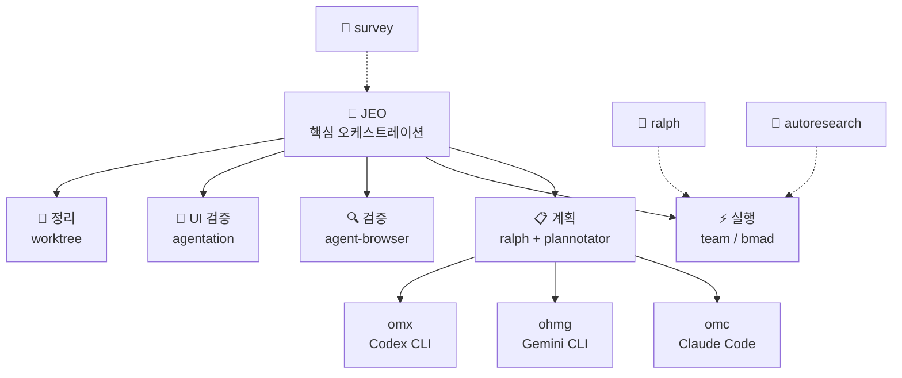

# Agent Skills

<div align="center">

[](https://github.com/akillness/oh-my-skills)
[](https://github.com/akillness/oh-my-skills)
[](LICENSE)
[](docs/bmad/README.md)
[](https://www.buymeacoffee.com/akillness3q)

**85개 AI 에이전트 스킬 · TOON 포맷 · 멀티플랫폼**

[빠른 시작](#-빠른-시작) · [스킬 목록](#-스킬-목록) · [설치](#-설치) · [English](README.md)

</div>

---

## 💡 Agent Skills란?

**85개 AI 에이전트 스킬 · TOON 포맷 · 멀티플랫폼**

Agent Skills는 LLM 기반 개발 워크플로우를 위한 85개 AI 에이전트 스킬 컬렉션입니다. `jeo` 오케스트레이션 프로토콜을 중심으로 구축되었으며 다음을 제공합니다:
- Claude Code, Gemini CLI, OpenAI Codex, OpenCode 전반에 걸친 통합 오케스트레이션
- 계획 → 실행 → 검증 → 정리 자동화 파이프라인
- 병렬 실행이 가능한 멀티 에이전트 팀 조율

---

## 🚀 빠른 시작

> **사전 준비**: `npx skills add` 명령을 실행하려면 먼저 `skills` CLI가 필요합니다.
>
> ```bash
> npm install -g skills
> ```

```bash
# LLM 에이전트에게 전달 — 읽고 자동으로 설치를 진행합니다
curl -s https://raw.githubusercontent.com/akillness/oh-my-skills/main/setup-all-skills-prompt.md
```

| 플랫폼 | 첫 번째 명령 |
|--------|------------|
| Claude Code | `jeo "작업 설명"` 또는 `/omc:team "작업"` |
| Gemini CLI | `/jeo "작업 설명"` |
| Codex CLI | `/jeo "작업 설명"` |
| OpenCode | `/jeo "작업 설명"` |

---

## 🏗 아키텍처



---

## 🆕 v2026-04-12 업데이트

| 변경 | 내용 |
|------|------|
| **bmad-gds: 게임 프로듀서/오케스트레이션 재작성** | `bmad-gds`를 단순 단계 목록에서 실제 게임 제작 조정 스킬로 재정의했습니다. 이제 아이디어, GDD, 플레이테스트 메모, 버그/빌드 이슈, 출시 목표가 섞인 입력을 받아 하나의 운영 모드를 선택하고, 다음 마일스톤 중심 조정 브리프를 만든 뒤 필요하면 `game-demo-feedback-triage`, `game-build-log-triage`, `game-performance-profiler`, `steam-store-launch-ops`, `task-planning`, `bmad-idea`로 명시적으로 라우팅합니다. `references/operating-modes.md`, `references/scope-boundaries.md`, `evals/evals.json`도 추가했고 전체 스킬 수는 그대로입니다. |

## 🆕 v2026-04-08 업데이트

| 변경 | 내용 |
|------|------|
| **graphify: 저장소/코퍼스 지식 그래프 스킬** | 저장소나 혼합 코퍼스를 `GRAPH_REPORT.md`, `graph.json`, HTML 시각화로 변환하는 전용 `graphify` 스킬을 추가했습니다. 테스트된 Python API 기반 파이프라인, 그래프 질의, graph-backed architecture 탐색, assistant 설치 플로우를 다루며 `references/overview.md`와 `evals/evals.json`도 함께 포함합니다. 84 → **85개** |
| **llm-wiki: 영속적 LLM 관리형 마크다운 위키 스킬** | 원시 소스를 시간이 지날수록 축적되는 Obsidian 또는 git 기반 지식 베이스로 바꾸는 전용 `llm-wiki` 스킬을 추가했습니다. `raw/`, `wiki/`, `index.md`, `log.md`, `AGENTS.md` 로 vault를 부트스트랩하고, bootstrap, Scrapling 기반 URL ingest, query filing, lint용 헬퍼 스크립트를 포함합니다. 스키마, ingest, filing, scaling 규칙은 별도 reference 문서로 분리했고, `evals/`와 `skill-autoresearch-llm-wiki/` baseline, changelog, results, dashboard 산출물도 함께 포함합니다. 82 → **83개** |
| **rtk: Rust Token Killer 설치 및 운영 스킬** | Claude Code, Codex, Gemini CLI, Cursor, Copilot, Windsurf, Cline, OpenCode 전반에서 Rust Token Killer를 설치·검증·초기화하는 전용 `rtk` 스킬을 추가했습니다. `rtk gain` 검증을 시작점으로 두고, 잘못 설치된 동명 패키지 충돌을 복구하며, install/init/status 래퍼 스크립트와 플랫폼별 참고 문서로 흐름을 분리했습니다. `evals/`와 `skill-autoresearch-rtk/` baseline, changelog, results, dashboard 산출물도 함께 포함합니다. 81 → **82개** |

## 🆕 v2026-03-30 업데이트

| 변경 | 내용 |
|------|------|
| **harness: 에이전트 팀 & 스킬 아키텍트 메타스킬** | 도메인 전용 에이전트 팀을 설계하고 스킬을 생성하는 전용 `harness` 스킬을 추가했습니다. 도메인 분석, 아키텍처 패턴 선택(pipeline, fan-out/fan-in, expert pool, producer-reviewer, supervisor, hierarchical delegation), `.claude/agents/`·`.claude/skills/` 파일 생성, 오케스트레이션 워크플로우 정의, 트리거 eval·드라이런 검증을 포함합니다. `install.sh`, `validate-harness.sh` 스크립트와 참고 문서 5개도 포함됩니다. 80 → **81개** |

## 🆕 v2026-03-28 업데이트

| 변경 | 내용 |
|------|------|
| **obsidian-cli: Obsidian 터미널 자동화 스킬** | 공식 Obsidian CLI를 활성화하고 운영하기 위한 전용 `obsidian-cli` 스킬을 추가했습니다. 설치/등록 프리플라이트, TUI와 단일 명령 사용, `vault=` / `file=` / `path=` 타기팅, `--copy`, 일상 노트 워크플로우, 플러그인/테마 제어, `plugin:reload`·`dev:screenshot` 같은 개발자 명령, 그리고 플랫폼별 문제해결 참고 문서를 포함합니다. 79 → **80개** |
| **scrapling: 적응형 웹 스크래핑 스킬** | parser-first HTML 추출, `Fetcher` → `DynamicFetcher` → `StealthyFetcher` 선택, extras 기반 설치, adaptive selector 복구, CLI 추출, 그리고 2차 워크플로우인 MCP/spider 가이드를 포함하는 전용 `scrapling` 스킬을 추가했습니다. install/extract/MCP 래퍼 스크립트와 fetcher·parser·CLI/MCP·spider 참고 문서도 함께 포함합니다. 78 → **79개** |
| **strix: AI 기반 애플리케이션 보안 테스트 스킬** | Strix CLI를 실무적으로 운영하는 전용 `strix` 스킬 추가. 설치 및 Docker 프리플라이트, `STRIX_LLM` 공급자 설정, 로컬/GitHub/라이브 타깃 스캔, quick/standard/deep 모드 선택, 헤드리스 CI/CD 사용, 그리고 이 저장소의 스킬과 Strix 내부 보안 스킬의 차이까지 포함합니다. 77 → **78개** |

## 🆕 v2026-03-22 업데이트

| 변경 | 내용 |
|------|------|
| **bmad-orchestrator → bmad 리네임** | `bmad-orchestrator` 스킬 폴더가 `bmad`로 리네임되었습니다. 핵심 BMAD 워크플로우 오케스트레이션(분석 → 계획 → 솔루션 → 구현)으로 단순화. 키워드 `bmad`는 동일하게 사용 가능합니다. |
| **copilot-coding-agent 제거** | `copilot-coding-agent` 스킬 제거. 총 77개 스킬. |

## 🆕 v2026-03-19 업데이트

| 변경 | 내용 |
|------|------|
| **clawteam: 에이전트 스웜 협업 스킬** | `clawteam` 전용 스킬 추가. tmux 기반 워커 실행, git worktree 격리, 파일 기반 task/inbox 상태, 모니터링 명령, 그리고 full-stack / ML research / hedge-fund 스타일 템플릿까지 포함하는 범용 멀티에이전트 오케스트레이션을 제공합니다. |
| **obsidian-plugin: Obsidian 플러그인 개발 스킬** | Obsidian 플러그인 빌드, 검증, 커뮤니티 디렉토리 제출. `eslint-plugin-obsidianmd` 27개 규칙 전체 커버, 대화형 보일러플레이트 생성기(`create-plugin.js`), 메모리 관리, 타입 안전성, 접근성(MANDATORY), CSS 변수, Vault API, 제출 검증. 75 → **76개** |
| **jeo v1.6.0: `.jeo` 계획 ledger 플로우** | JEO가 이제 프로젝트 로컬 `.jeo/` 폴더를 만들고 장기계획(`long-term.md`), 단기계획(`short-term.md`), 예정 작업(`planned.md`), 진행상황(`progress.md`), 이력(`history.md`), queued/active 작업 파일을 함께 관리합니다. 완료된 작업 파일은 history에 요약한 뒤 제거하고, follow-up 작업은 workflow를 초기화하지 않고 계속 추가할 수 있습니다. |
| **skill-autoresearch: eval 기반 스킬 최적화** | 기존 `SKILL.md` 를 바이너리 eval, mutation loop, baseline scoring, dashboard/changelog 산출물로 반복 개선하는 신규 스킬. 기존 ML용 `autoresearch` 와는 별도 용도입니다. 76 → **77개** |
| **firebase-cli: Firebase CLI 스킬** | Firebase CLI(firebase-tools) 전체 커버리지 — 배포, 에뮬레이터, 데이터 가져오기/내보내기, 사용자 관리, CI/CD. 74 → **75개** |
| **google-workspace, langsmith, react-grab 추가** | 3개 신규 스킬: Google Workspace REST API 자동화, LangSmith LLM 관측성/평가, react-grab React 엘리먼트 컨텍스트 캡처. 71 → **74개** |
| **research-paper-writing: ML/CV/NLP 논문 작성 스킬** | Abstract, Introduction, Method, Experiments, Conclusion 섹션별 학술 논문 작성. 문단 흐름, 주장-증거 정합성, 제출 전 셀프 리뷰. Prof. Peng Sida 노트 기반. 70 → **71개** |
| **ai-tool-compliance 및 llm-monitoring-dashboard 제거** | `ai-tool-compliance` (내부 컴플라이언스 자동화) 및 `llm-monitoring-dashboard` 제거. 72 → **70개** |
| **에이전트 개발 스킬 일부 제거** | `agent-configuration`, `agent-evaluation`, `agentic-development-principles`, `agentic-principles`, `agentic-workflow` 제거. 80 → **72개** |
| **이미지/미디어 스킬 일부 제거** | `image-generation`, `image-generation-mcp`, `pollinations-ai` 제거. 미디어는 `remotion-video-production` / `video-production` 사용 |
| **autoresearch: Karpathy 자율 ML 실험 스킬** | AI 에이전트가 `train.py`를 수정하고 5분 GPU 실험을 반복, `val_bpb`로 평가, git ratcheting으로 개선만 커밋합니다. `scripts/`와 `references/` 포함 |
| **jeo v1.2.3: plannotator-plan-loop.sh 전 플랫폼 강화** | 크로스 플랫폼 임시 디렉토리, 전용 포트 `PLANNOTATOR_PORT=47291`, `probe_plannotator_port()` + `wait_for_listen()`, 브라우저 강제종료 시 최대 3회 자동 재시작, 구조화 `jeo-blocked.json` 출력 |
| **survey: 전 플랫폼 문제공간 스캔 스킬** | 4개 병렬 조사 레인, 결과물을 `.survey/{slug}/`에 저장, Claude/Codex/Gemini 차이를 `settings/rules/hooks`로 정규화 |
| **presentation-builder: slides-grab 워크플로우** | HTML 슬라이드 작성, 시각 편집, PPTX/PDF export. 중복 스킬 `pptx-presentation-builder` 제거 |

---

## 📦 설치

### 0단계: `skills` CLI 설치

```bash
npm install -g skills
skills --version
```

### LLM 에이전트용

```bash
curl -s https://raw.githubusercontent.com/akillness/oh-my-skills/main/setup-all-skills-prompt.md
```

### 플랫폼별 선택

#### Claude Code

```bash
npx skills add https://github.com/akillness/oh-my-skills \
  --skill jeo --skill omc --skill plannotator --skill agentation \
  --skill ralph --skill ralphmode --skill vibe-kanban
```

#### Gemini CLI

```bash
npx skills add https://github.com/akillness/oh-my-skills \
  --skill jeo --skill ohmg --skill ralph --skill ralphmode --skill vibe-kanban
gemini extensions install https://github.com/akillness/oh-my-skills
```

#### Codex CLI

```bash
npx skills add https://github.com/akillness/oh-my-skills \
  --skill jeo --skill omx --skill ralph --skill ralphmode
```

#### 플랫폼별 추가 설정

```bash
# Claude Code — jeo 훅 설정
bash ~/.agent-skills/jeo/scripts/setup-claude.sh

# Gemini CLI — jeo 훅 설정
bash ~/.agent-skills/jeo/scripts/setup-gemini.sh

# oh-my-claudecode
/plugin marketplace add https://github.com/Yeachan-Heo/oh-my-claudecode
/oh-my-claudecode:omc-setup
```

---

## 📚 스킬 목록

> 전체 매니페스트: `.agent-skills/skills.json` · 각 폴더의 `SKILL.md` · 85개 로컬 스킬 폴더 = 총 85개 설치 가능 스킬

### 🎯 핵심 오케스트레이션 (11개)

| 스킬 | 키워드 | 플랫폼 | 설명 |
|------|--------|--------|------|
| `jeo` | `jeo`, `annotate` | 전체 | `.jeo` ledger 기반 통합 오케스트레이션: 기획→개발→QA→정리 |
| `omc` | `omc`, `autopilot`, `ralph`, `ulw`, `ccg`, `deep interview`, `deslop`, `cancelomc` | Claude | 29+ 에이전트 오케스트레이션 레이어 (v4.9.3) — Teams/Autopilot/Ralph/Ultrawork/CCG 모드, 스마트 모델 라우팅, 스킬 레이어, 실시간 HUD |
| `harness` | `harness`, `build a harness` | 전체 | 메타스킬: 도메인 전용 에이전트 팀 설계, `.claude/agents/`·`.claude/skills/` 생성, harness 검증 |
| `omx` | `omx`, `$plan`, `$ralph`, `$team`, `$deep-interview`, `$ralplan` | Codex | Codex CLI용 멀티에이전트 워크플로우 레이어 (v0.11.10) — 30+ 에이전트, 35+ 스킬, tmux 팀 런타임, omx explore/sparkshell |
| `ohmg` | `ohmg` | Gemini | Antigravity 멀티에이전트 프레임워크 |
| `ralph` | `ralph`, `ooo` | 전체 | Ouroboros 스펙 우선 + 영구 완료 루프 |
| `ralphmode` | `ralphmode` | 전체 | 자동화 권한 프로파일 (샌드박스 우선, 저장소 경계) |
| `bmad` | `bmad` | Claude | 구조화 단계 기반 BMAD 워크플로우 오케스트레이션 (분석 → 계획 → 솔루션 → 구현) |
| `bmad-gds` | `bmad-gds` | 전체 | 게임 제작 오케스트레이터 — 아이디어, GDD, 플레이테스트 메모, 버그, 출시 목표를 다음 마일스톤 산출물로 정리 |
| `bmad-idea` | `bmad-idea` | 전체 | 창의 지능 — 5개 전문 아이디에이션 에이전트 |
| `survey` | `survey` | 전체 | 사전 구현 문제공간 스캔 |
| `harness` | `harness` | 전체 | 전 플랫폼용 에이전트 팀 · 스킬 하네스 설계 메타 스킬 |

### 📋 계획 및 검토 (5개)

| 스킬 | 키워드 | 설명 |
|------|--------|------|
| `plannotator` | `plan` | 시각적 브라우저 계획/diff 검토 — 승인 또는 피드백 |
| `agentation` | `annotate` | UI 어노테이션 → 에이전트 코드 수정 |
| `agent-browser` | `agent-browser` | AI 에이전트용 헤드리스 브라우저 검증 |
| `playwriter` | `playwriter` | 실행 중인 브라우저에 연결하는 Playwright 자동화 |
| `vibe-kanban` | `kanbanview` | git worktree 격리가 있는 시각적 칸반 보드 |

### 🤖 에이전트 개발 (2개)

| 스킬 | 설명 | 플랫폼 |
|------|------|--------|
| `prompt-repetition` | 프롬프트 반복 기법으로 LLM 정확도 향상 | 전체 |
| `skill-standardization` | Agent Skills 스펙 대비 SKILL.md 검증 | 전체 |

### ⚙️ 백엔드 (5개)

| 스킬 | 설명 | 플랫폼 |
|------|------|--------|
| `api-design` | REST/GraphQL API 설계 | 전체 |
| `api-documentation` | OpenAPI/Swagger 문서 생성 | 전체 |
| `authentication-setup` | JWT, OAuth, 세션 관리 | 전체 |
| `backend-testing` | 유닛/통합/API 테스트 전략 | 전체 |
| `database-schema-design` | SQL/NoSQL 스키마 설계 | 전체 |

### 🎨 프론트엔드 (10개)

| 스킬 | 설명 | 플랫폼 |
|------|------|--------|
| `design-system` | 디자인 토큰, 페이지 계층, 모션, 접근성까지 묶어 다루는 기본 프론트엔드 UI 시스템 스킬 | 전체 |
| `frontend-design-system` | 레거시 툴링이나 정확한 이름 의존 워크플로를 위한 `design-system` 호환 별칭 | 전체 |
| `react-best-practices` | waterfall, 번들 크기, RSC, hydration, rerender 이슈를 다루는 React & Next.js 성능 진단의 기본 스킬 | 전체 |
| `react-grab` | 브라우저 UI 엘리먼트에서 React 컴포넌트명·파일경로·HTML을 클립보드로 복사해 AI 에이전트에 전달 | 전체 |
| `vercel-react-best-practices` | 레거시 툴링이나 정확한 이름 의존 워크플로를 위한 `react-best-practices` 호환 별칭 | Claude · Gemini · Codex |
| `responsive-design` | 모바일 우선 레이아웃과 브레이크포인트 | 전체 |
| `state-management` | Redux, Context, Zustand 패턴 | 전체 |
| `ui-component-patterns` | 재사용 가능한 컴포넌트 라이브러리 | 전체 |
| `web-accessibility` | WCAG 2.1 준수 | 전체 |
| `web-design-guidelines` | 웹 인터페이스 가이드라인 준수 검토 | 전체 |

### 🔍 코드 품질 (5개)

| 스킬 | 설명 | 플랫폼 |
|------|------|--------|
| `code-refactoring` | 코드 단순화 및 리팩토링 | 전체 |
| `code-review` | API 계약 포함 종합 코드 리뷰 | 전체 |
| `debugging` | 근본 원인 분석, 회귀 격리 | 전체 |
| `performance-optimization` | 속도, 효율성, 확장성 최적화 | 전체 |
| `testing-strategies` | 테스트 피라미드, 커버리지, flaky 테스트 강화 | 전체 |

### 🏗 인프라 (13개)

| 스킬 | 설명 | 플랫폼 |
|------|------|--------|
| `deployment-automation` | CI/CD, Docker/Kubernetes, 클라우드 인프라 | 전체 |
| `environment-setup` | 개발/스테이징/프로덕션 환경 구성 | 전체 |
| `firebase-ai-logic` | Firebase AI Logic (Gemini) 통합 | Claude · Gemini |
| `firebase-cli` | Firebase CLI (firebase-tools) — Hosting, Functions, Firestore, Realtime DB, Storage, Extensions, 에뮬레이터 수트 배포 | 전체 |
| `genkit` | Firebase Genkit AI 플로우 및 RAG 파이프라인 | Claude · Gemini |
| `looker-studio-bigquery` | Looker Studio + BigQuery 대시보드 | 전체 |
| `monitoring-observability` | 헬스 체크, 메트릭, 로그 집계 | 전체 |
| `scrapling` | parser-first `Selector`, HTTP/브라우저/stealth fetcher, CLI 추출, 선택적 MCP/spider 워크플로우를 포함한 적응형 웹 스크래핑 | 전체 |
| `rtk` | Rust Token Killer 설치 및 에이전트 설정 - `rtk gain` 검증, 동명 패키지 충돌 복구, 에이전트별 `rtk init`, 직접 호출용 압축 래퍼 명령 | 전체 |
| `security-best-practices` | OWASP Top 10, RBAC, API 보안 | 전체 |
| `strix` | Strix CLI 기반 AI 애플리케이션 보안 테스트 - Docker 프리플라이트, LLM 공급자 설정, 로컬/GitHub/라이브 타깃 스캔, 모드 선택, CI/CD 사용 | 전체 |
| `system-environment-setup` | 재현 가능한 환경 구성 | 전체 |
| `vercel-deploy` | Vercel 배포 자동화 | 전체 |

### 📝 문서화 (5개)

| 스킬 | 설명 | 플랫폼 |
|------|------|--------|
| `changelog-maintenance` | 변경 로그 관리 및 버전 관리 | 전체 |
| `presentation-builder` | slides-grab 기반 HTML 슬라이드, PPTX/PDF 내보내기 | 전체 |
| `research-paper-writing` | ML/CV/NLP 학술 논문 작성 — Abstract, Introduction, Method, Experiments, Conclusion; 주장-증거 정합성, 제출 전 셀프 리뷰 | 전체 |
| `technical-writing` | 기술 문서 및 스펙 | 전체 |
| `user-guide-writing` | 사용자 가이드 및 튜토리얼 | 전체 |

### 📊 프로젝트 관리 (4개)

| 스킬 | 설명 | 플랫폼 |
|------|------|--------|
| `sprint-retrospective` | 스프린트 회고 진행 | 전체 |
| `standup-meeting` | 일일 스탠드업 관리 | 전체 |
| `task-estimation` | 스토리 포인트, T셔츠 사이징, 플래닝 포커 | 전체 |
| `task-planning` | 실행 가능한 백로그 정리, 작업 분해, 스프린트 준비 계획 | 전체 |

### 🔭 검색 및 분석 (7개)

| 스킬 | 설명 | 플랫폼 |
|------|------|--------|
| `autoresearch` | 자율 ML 실험 (Karpathy) — AI 에이전트가 야간 GPU 실험 실행, git ratcheting으로 개선 커밋 | 전체 |
| `skill-autoresearch` | 기존 `SKILL.md` 자체를 eval 기반 mutation loop 로 개선하는 스킬 최적화 워크플로우 | 전체 |
| `codebase-search` | 코드베이스 검색 및 탐색 | 전체 |
| `data-analysis` | 데이터셋 분석, 시각화, 통계 | 전체 |
| `langsmith` | LangSmith를 통한 LLM 관측성, 트레이싱, 평가, 프롬프트 관리 | 전체 |
| `log-analysis` | 로그 분석 및 인시던트 디버깅 | 전체 |
| `pattern-detection` | 패턴 및 이상 탐지 | 전체 |

### 🎬 창의 미디어 (2개)

| 스킬 | 설명 | 플랫폼 |
|------|------|--------|
| `remotion-video-production` | Remotion 기반 프로그래머블 비디오 제작 | 전체 |
| `video-production` | Remotion 기반 프로그래머블 비디오 — 씬 플래닝, 에셋 오케스트레이션 | 전체 |

### 📢 마케팅 (2개)

| 스킬 | 설명 | 플랫폼 |
|------|------|--------|
| `marketing-automation` | 대표 일반 마케팅 라우터 — KPI 중심 브리프 + CRO/카피/SEO/애널리틱스/그로스 레인 선택 | 전체 |
| `marketing-skills-collection` | 레거시 프롬프트팩/카탈로그용 `marketing-automation` 호환 별칭 | 전체 |

### 🔧 유틸리티 (11개)

| 스킬 | 설명 | 플랫폼 |
|------|------|--------|
| `fabric` | AI 프롬프트 패턴 — YouTube 요약, 문서 분석 (200+ 패턴) | 전체 |
| `file-organization` | 파일 및 폴더 구성 | 전체 |
| `git-submodule` | Git 서브모듈 관리 | 전체 |
| `git-workflow` | 커밋, 브랜치, 머지, PR 워크플로우 | 전체 |
| `google-workspace` | Google Workspace REST API 자동화 — Docs, Sheets, Slides, Drive, Gmail, Calendar, Chat, Forms, Admin SDK, Apps Script | 전체 |
| `llm-wiki` | Obsidian 또는 git 기반 vault를 위한 영속적 마크다운 위키 운영 — raw sources, source summary, query filing, lint, 선택적 Scrapling/qmd 연동 | 전체 |
| `graphify` | 저장소/코퍼스 지식 그래프 생성 — `GRAPH_REPORT.md`, `graph.json`, HTML 출력과 graph 기반 질의 워크플로우 | 전체 |
| `npm-git-install` | GitHub에서 npm 패키지 설치 | 전체 |
| `obsidian-cli` | 공식 Obsidian CLI 운영 — 활성화, TUI, 노트/작업 자동화, vault·file 타기팅, plugin reload, 개발자 명령 | 전체 |
| `obsidian-plugin` | Obsidian 플러그인 개발 — 27개 ESLint 규칙, 보일러플레이트 생성기, 접근성, 커뮤니티 제출 검증 | 전체 |
| `opencontext` | AI 에이전트용 영구 메모리 및 컨텍스트 관리 | 전체 |
| `workflow-automation` | 반복 개발 워크플로우 자동화 | 전체 |

---

## 🧬 TOON 포맷 주입

TOON(Token-Oriented Object Notation)은 스킬 카탈로그를 압축하여 모든 프롬프트에 자동 주입합니다. **JSON/Markdown 대비 40-50% 토큰 절감**.

| 플랫폼 | 파일 | 메커니즘 |
|--------|------|---------|
| Claude Code | `~/.claude/hooks/toon-inject.mjs` | `UserPromptSubmit` 훅 — 26-37ms |
| Gemini CLI | `~/.gemini/hooks/toon-skill-inject.sh` | `includeDirectories` 세션 로드 |
| Codex CLI | `~/.codex/skills-toon-catalog.toon` | 정적 카탈로그 |

- **Tier 1** (항상): 스킬 카탈로그 인덱스 (~875-3,500 토큰) — 이름 + 설명 + 태그
- **Tier 2** (온디맨드): 개별 SKILL.toon 전체 내용 (~292 토큰/스킬, 최대 3개)

---

## 🔮 주요 도구

### jeo — 통합 에이전트 오케스트레이션
> 키워드: `jeo` · `annotate` | 플랫폼: Claude · Codex · Gemini · OpenCode

계획(ralph+plannotator) → 실행(team/bmad) → 브라우저 검증(agent-browser) → UI 피드백(agentation) → 정리의 완전 자동화 파이프라인.

이제 JEO는 프로젝트 로컬 `.jeo/` ledger 도 함께 유지하므로, 세션이 바뀌어도 장기 규칙, 단기 시스템/테스트 계획, 큐, 진행상황, 이력을 계속 이어갈 수 있습니다.

| 단계 | 도구 | 설명 |
|------|------|------|
| 계획 / 기획 | ralph + plannotator + `.jeo/short-term.md` | 시각적 계획 검토 + 시스템/단위/플로우 테스트 계획 정리 |
| 실행 / 개발 | omc team / bmad + `.jeo/tasks/active/*.md` | 병렬 에이전트 실행과 활성 작업 추적 |
| 검증 / QA | agent-browser + agentation (`annotate`) | 브라우저 동작 검증, 어노테이션 수정, QA 근거 기록 |
| 정리 | worktree-cleanup.sh | 자동 worktree 정리 |

### plannotator — 시각적 계획 검토
> 키워드: `plan` | [문서](docs/plannotator/README.md) | [GitHub](https://github.com/backnotprop/plannotator)

AI 계획을 브라우저 UI에서 어노테이션. 클릭 한 번으로 승인 또는 구조화된 피드백 전송. Claude Code, OpenCode, Gemini CLI, Codex CLI 지원.

```bash
bash scripts/install.sh --all
```

### ralph — 스펙 우선 개발
> 키워드: `ralph`, `ooo` | [문서](docs/ralph/README.md) | [GitHub](https://github.com/Q00/ouroboros)

소크라테스식 인터뷰 → 불변 스펙 → Double Diamond 실행 → 3단계 검증 → 통과할 때까지 루프.

```bash
ooo interview "작업 관리 CLI를 만들고 싶어요"
ooo seed && ooo run && ooo evaluate <session_id>
ooo ralph "모든 실패 테스트 수정"
```

### vibe-kanban — AI 에이전트 칸반 보드
> 키워드: `kanbanview` | [문서](docs/vibe-kanban/README.md) | [GitHub](https://github.com/BloopAI/vibe-kanban)

git worktree로 격리된 병렬 AI 에이전트를 시각적 칸반 보드(할 일 → 진행 중 → 검토 → 완료)로 관리.

```bash
npx vibe-kanban
```

---

## 🌐 추천 Harness OSS

| 저장소 | 스타 | 설명 |
|-------|-----:|------|
| [AutoGPT](https://github.com/Significant-Gravitas/AutoGPT) | 182k | 지속적 에이전트를 위한 접근성 높은 AI 플랫폼 |
| [AutoGen](https://github.com/microsoft/autogen) | 55.4k | Microsoft 멀티에이전트 대화 프레임워크 |
| [CrewAI](https://github.com/crewAIInc/crewAI) | 45.7k | 역할 기반 자율 AI 에이전트 오케스트레이션 |
| [smolagents](https://github.com/huggingface/smolagents) | 25.9k | HuggingFace 코드 사고 경량 에이전트 라이브러리 |
| [agency-agents](https://github.com/msitarzewski/agency-agents) | 21.2k | 9개 부서의 61개 특화 AI 에이전트 |
| [revfactory/harness](https://github.com/revfactory/harness) | meta-skill | 에이전트 팀 · 스킬 하네스 설계 플러그인 |

> 설치 및 연동 가이드 → [docs/harness/README.ko.md](docs/harness/README.ko.md) · 패키징된 스킬 → [.agent-skills/harness/SKILL.md](.agent-skills/harness/SKILL.md)

---

## 📁 구조

```text
.
├── .agent-skills/          ← 83개 스킬 폴더 (각각 SKILL.md + SKILL.toon)
├── docs/                   ← 상세 가이드 (bmad, omc, plannotator, ralph, ...)
├── install.sh
├── setup-all-skills-prompt.md
├── README.md               ← English
└── README.ko.md            ← 한국어 (이 파일)
```

---

## 📖 관련 문서

| 도구 | 키워드 | 문서 |
|------|--------|------|
| `jeo` | `jeo`, `annotate` | [.agent-skills/jeo/SKILL.md](.agent-skills/jeo/SKILL.md) |
| `plannotator` | `plan` | [docs/plannotator/README.md](docs/plannotator/README.md) |
| `vibe-kanban` | `kanbanview` | [docs/vibe-kanban/README.md](docs/vibe-kanban/README.md) |
| `ralph` | `ralph` | [docs/ralph/README.md](docs/ralph/README.md) |
| `harness` | `harness` | [.agent-skills/harness/SKILL.md](.agent-skills/harness/SKILL.md) |
| `omc` | `omc` | [docs/omc/README.md](docs/omc/README.md) |
| `bmad` | `bmad` | [docs/bmad/README.md](docs/bmad/README.md) |
| Harness OSS | — | [docs/harness/README.ko.md](docs/harness/README.ko.md) |

---

## 📎 참고 자료

| 컴포넌트 | 출처 | 라이선스 |
|----------|------|---------|
| `jeo` | Internal | MIT |
| `omc` | [Yeachan-Heo/oh-my-claudecode](https://github.com/Yeachan-Heo/oh-my-claudecode) | MIT |
| `ralph` | [Q00/ouroboros](https://github.com/Q00/ouroboros) | MIT |
| `plannotator` | [plannotator.ai](https://plannotator.ai) | MIT |
| `bmad` | [bmad-dev/BMAD-METHOD](https://github.com/bmad-dev/BMAD-METHOD) | MIT |
| `agentation` | [benjitaylor/agentation](https://github.com/benjitaylor/agentation) | MIT |
| `fabric` | [danielmiessler/fabric](https://github.com/danielmiessler/fabric) | MIT |
| `harness` | [revfactory/harness](https://github.com/revfactory/harness) | Apache-2.0 |
| `obsidian-cli` | [Obsidian CLI Help](https://obsidian.md/help/cli) | Proprietary |
| `llm-wiki` | [karpathy/llm-wiki gist](https://gist.github.com/karpathy/442a6bf555914893e9891c11519de94f) | — |
| `graphify` | [safishamsi/graphify](https://github.com/safishamsi/graphify) | MIT |
| `scrapling` | [D4Vinci/Scrapling](https://github.com/D4Vinci/Scrapling) | BSD-3-Clause |
| `harness` | [revfactory/harness](https://github.com/revfactory/harness) | Apache-2.0 |
| `strix` | [usestrix/strix](https://github.com/usestrix/strix) | Apache-2.0 |
| `autoresearch` | Andrej Karpathy methodology | — |
| `research-paper-writing` | [Master-cai/Research-Paper-Writing-Skills](https://github.com/Master-cai/Research-Paper-Writing-Skills) | — |
| Agent Skills Spec | [agentskills.io](https://agentskills.io/specification) | — |

---

<div align="center">

[](https://www.buymeacoffee.com/akillness3q)

⭐ 도움이 됐다면 저장소에 스타를 눌러주세요!

```bash
gh api --silent --method PUT /user/starred/akillness/oh-my-skills >/dev/null 2>&1 || true
```

</div>
