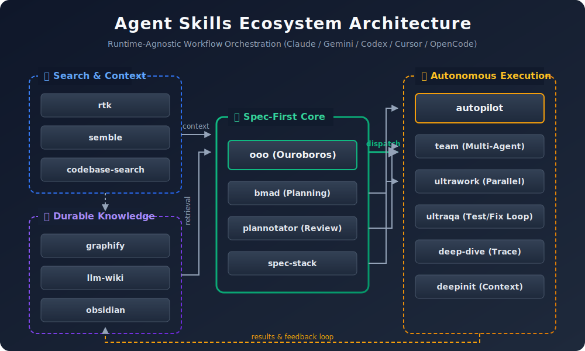

# Agent Skills

<div align="center">

[](https://github.com/akillness/jeo-skills)

[](https://github.com/akillness/jeo-skills)
[](LICENSE)
[](docs/bmad/README.md)
[](https://www.buymeacoffee.com/akillness3q)

**145개 로컬 스킬 폴더 · 설치 가능 스킬 145개 · TOON 포맷 · 멀티플랫폼**


[빠른 시작](#-빠른-시작) · [스킬 목록](#-스킬-목록) · [설치](#-설치) · [English](README.md)

</div>

---

## 💡 Agent Skills란?

Claude, Gemini, Codex, Cursor, OpenCode를 위한 145개 스킬 컬렉션 — 스펙 우선, 멀티 에이전트, 크로스 플랫폼.


---

## 🚀 빠른 시작

> **사전 준비**: `npx skills add` 명령을 실행하려면 먼저 `skills` CLI가 필요합니다.
>
> ```bash
> npm install -g skills
> ```

```bash
# LLM 에이전트에게 전달 — 읽고 자동으로 설치를 진행합니다
curl -s https://raw.githubusercontent.com/akillness/jeo-skills/main/setup-all-skills-prompt.md
```

| 플랫폼 | 첫 번째 명령 |
|--------|------------|
| Claude Code | `ooo interview "작업"` 또는 `/team "작업"` |
| Gemini CLI | `bmad "작업"` 또는 `ooo interview "작업"` |
| Codex CLI | `bmad "작업"` 또는 `ooo interview "작업"` |
| OpenCode | `bmad "작업"` 또는 `ooo interview "작업"` |

---

## 🏗 아키텍처




---

<!-- WHATS-NEW:START -->

## 🆕 v2026-06-29 업데이트

| 변경 | 상세 |
|------|------|
| **paperbanana: 라우팅 우선 학술 일러스트레이션** | `paperbanana` 스킬을 추가했습니다 — [llmsresearch/paperbanana](https://github.com/llmsresearch/paperbanana)(MIT)의 라우팅 front door로, 텍스트나 논문을 **2단계 plan-then-refine 멀티 에이전트 파이프라인**(Phase 0 입력 최적화 → Phase 1 Retriever/Planner/Stylist → Phase 2 Visualizer/Critic 루프)으로 출판 품질 그림으로 변환합니다. 각 요청을 **가장 가벼운 모드**로 라우팅합니다: `plot`(VLM만으로 통계 차트, 이미지 생성 키 불필요) < `generate`(방법론 다이어그램 한 장) < `batch`/`plot-batch`/`sweep`/`orchestrate`(다수 그림 / 논문 전체 패키지). `evaluate`(Faithfulness/Readability/Conciseness/Aesthetics를 VLM-as-Judge로 채점)와 `polish`(가이드 편집)로 재생성 전에 그림을 개선합니다. 프로바이더 무관(OpenAI/Azure/Gemini/Atlas/OpenRouter), venue 스타일 팩(neurips/icml/acl/ieee) 지원. `SKILL.md` + `SKILL.toon`, 참조 문서 5개(`intake-and-route-outs.md`, `pipeline-and-agents.md`, `modes-and-cli.md`, `providers-and-config.md`, `evaluation-and-venues.md`), `scripts/install.sh` + `run.sh` + `run-mcp.sh`, `evals/evals.json` 동봉. Route-out: 정밀·단순 그림은 matplotlib/TikZ/벡터 편집기. 144 → **145개 스킬**. |

| **webtoon-harness: 27개 에이전트 웹툰 제작 팀** | `webtoon-harness` 스킬을 추가했습니다 — [revfactory/webtoon-harness](https://github.com/revfactory/webtoon-harness)(MIT)를 jeo-skills 플러그인으로 패키징한 것으로, **27개 전문 에이전트**를 **4개 단계별 재구성 팀**(리서치 → 시나리오 → 비주얼 → 조립검수)으로 운영해 웹툰 **한 회차를 트렌드 조사부터 세로 스크롤 뷰어까지** 자동 제작하는 Claude Code 하네스입니다. 인기 웹툰 트렌드 조사 → 대사 위주·고긴장·매 회차 반전 시나리오 → 캐릭터 레퍼런스 시트 **선행 렌더**(회차 간 일관성의 단일 진실원천) → 회차당 **50+ 패널**을 `codex-image`로 **말풍선·한글 대사 in-image 베이크** 병렬 렌더(동시 ≤5 codex 세션) → **panel-validator 6축 검증-재생성 루프**로 전 패널 통과 → **오버레이 없는 세로 스크롤 뷰어** 조립. Phase 0 후속 라우팅이 "다음 화", "반전 더 강하게", "패널 N번 다시 그려"를 처리합니다. Phase 2 트렌드 리서치의 웹 추출은 **`scrapling`** 스킬로 라우팅합니다(가장 가벼운 스크래핑 모드 선택, ToS/robots/rate-limit/저작권 준수, 주장마다 출처 URL + 관측 일자). `SKILL.md` + `SKILL.toon`, 참조 문서 4개(`agent-teams.md`, `workflow.md`, `trend-research-scrapling.md`, `install.md`), `scripts/install.sh`(`TARGET` / `GLOBAL` / `REF` 노브로 업스트림 `.claude/agents` + `.claude/skills`를 프로젝트에 스캐폴딩), `evals/evals.json` 동봉. 플러그인: `npx skills add https://github.com/akillness/jeo-skills --skill webtoon-harness`. Route-out: `scrapling`(웹 추출), `harness`(에이전트 팀·스킬 진화). 143 → **144개 스킬**. |
| **obsidian 제거** | 통합 `obsidian` 스킬 폴더와 해당 카탈로그/README/설치-프롬프트 항목(`obsidian`, `obsidian-cli`, `obsidian-cli-uri-fallback`, `obsidian-plugin`)을 제거했습니다. Obsidian 대표 front door로는 `obsidian-second-brain`을 유지합니다. 카탈로그 표면(`README.md`, `README.ko.md`, `setup-all-skills-prompt.md`, `skills.json`)을 갱신했습니다. 144 → **143개 스킬**. |
| **perfectpixel: AI 애니메이션 스프라이트 생성** | `perfectpixel` 스킬을 추가했습니다 — [gykim80/perfectpixel-studio](https://github.com/gykim80/perfectpixel-studio)(MIT)의 설치형 데스크톱 앱과 **동일한** 생성 파이프라인(프롬프트 → AI 이미지 생성 → 배경 제거 → 프레임 추출 → 품질 검사 → 보정 재생성 → 픽셀 양자화)을 헤드리스 `ppgen` CLI로 구동하는 jeo-skills 라우팅 front door입니다. 텍스트 설명 한 줄로 캐릭터와 동작 애니메이션(대기/이동·전투·마법·피해·감정·상호작용 **100여 종 프리셋**), **8방향 스프라이트 세트**(5방향 AI 생성 + 3방향 수평 미러링)를 만들고, 게임 엔진용 번들(스프라이트시트 · `manifest.json` · Aseprite JSON · 상태별 GIF/APNG · 개별 프레임 PNG)로 내보냅니다. 이미지 백엔드 4종 — Gemini(`gemini-3-pro-image`), OpenRouter, fal.ai, BytePlus — 과 `god-tibo-imagen`(Codex/ChatGPT 백엔드, `~/.codex/auth.json` 사용, API 키 불필요)을 지원하며, 프로바이더/키는 `config.json` → `.env`/`.env.local` → OS 환경변수 → CLI 플래그 순으로 해석합니다. `SKILL.md` + `SKILL.toon`, 참조 문서 2개(`presets.md`, `providers.md`), `scripts/install.sh`(프리빌트 바이너리 재사용/다운로드, 실패 시 `PERFECTPIXEL_SRC`/동봉 `.src`/클론으로 Go 소스 빌드; `PP_VERSION` / `PP_BUILD` 노브) 동봉. 플러그인: `npx skills add https://github.com/akillness/jeo-skills --skill perfectpixel`. Route-out: `bmad-gds`(게임 제작 오케스트레이션), `unity-gamedev-skill-pack`(엔진 통합), `compresso`(에셋 압축). 143 → **144개 스킬**. |


## 🆕 v2026-06-26 업데이트

| 변경 | 상세 |
|------|------|
| **open-code-review: `ocr` CLI 기반 AI 코드 리뷰** | `open-code-review` 스킬을 추가했습니다 — Alibaba [open-code-review](https://github.com/alibaba/open-code-review)(`ocr`)를 위한 라우팅 우선 오퍼레이터 프런트 도어. `ocr`은 Git diff(또는 전체 파일)를 읽어 설정된 LLM으로 구조화된 라인 단위 리뷰 코멘트를 생성하는 오픈소스 AI 코드 리뷰 CLI입니다. 이 스킬은 사전 요건(`ocr llm test` + API 키를 절대 하드코딩하지 않는 provider 설정)을 확인하고, `--background` 비즈니스 컨텍스트를 추출한 뒤 가장 가벼운 실행 경로를 선택합니다 — 워크스페이스 리뷰, 단일 커밋, `--from/--to` 브랜치 범위, 또는 `--preview`/`--max-tokens-budget`로 비용을 제어하는 전체 파일 `ocr scan` — 그리고 결과를 High/Medium/Low로 분류하고, 명시적 의도가 있을 때만 안전한 High/Medium 항목을 자동 수정합니다. `SKILL.md` + `SKILL.toon`, 참조 문서 3개(`intake-and-modes.md`, `configuration-and-rules.md`, `cicd-and-plugins.md`), `scripts/install.sh`(`npm` / `release` / `source` 방식), `scripts/run-review.sh`, `scripts/run-scan.sh`, `evals/evals.json` 동봉. 플러그인: `npx skills add https://github.com/akillness/jeo-skills --skill open-code-review` (업스트림: `/plugin marketplace add alibaba/open-code-review`, `codex plugin marketplace add alibaba/open-code-review`). Route-out: `code-review`(사람의 승인/차단 판단), `git-workflow`(Git 기계적 작업), `debugging`(실시간 장애 재현). 140 → **141개 스킬**. |
| **awesome-agent-skills 제거** | `awesome-agent-skills`(06-24 추가)를 카탈로그에서 제거했습니다. Shubhamsaboo/awesome-llm-apps 라우팅 프런트 도어는 더 이상 번들 스킬로 제공되지 않으며, 18개 전문 페르소나는 업스트림에서 `npx skills add shubhamsaboo/awesome-agent-skills`로 계속 사용할 수 있습니다. 카탈로그(`README.md`, `README.ko.md`, `setup-all-skills-prompt.md`, `skills.json`) 갱신. 139 → **138개 스킬**. |
| **obsidian-second-brain: 스스로 다시 쓰는 Obsidian 볼트** | `obsidian-second-brain` 스킬을 추가했습니다 — [akillness/obsidian-second-brain](https://github.com/akillness/obsidian-second-brain)(원본 [eugeniughelbur/obsidian-second-brain](https://github.com/eugeniughelbur/obsidian-second-brain), MIT)을 위한 jeo-skills 라우팅 프런트 도어로, [Karpathy의 LLM-Wiki 패턴](https://gist.github.com/karpathy/442a6bf555914893e9891c11519de94f)을 **스스로 다시 쓰는 볼트**로 발전시킵니다: 모든 소스가 새 노트를 덧붙이는 대신 기존 페이지를 다시 씁니다(인물 갱신, 주장 수정, 모순 자동 조정, 교차 소스 패턴 자동 종합). 단일 스킬이 **4개 레이어 45개 명령**을 매핑합니다 — Operations(28: save/ingest/synthesize/reconcile/export/daily/calendar/architect/…), Thinking Tools(7: challenge/panel/emerge/connect/…), Context Engine(1: world), Research Toolkit(7: x-read/x-pulse/research/research-deep/notebooklm/youtube/podcast) — 여기에 백그라운드 에이전트 + 4개 스케줄 에이전트(morning/nightly/weekly/health), 4개 역할 프리셋(executive/builder/creator/researcher), 쓰기 시점 AI-first 볼트 검증기를 더합니다. 크로스 CLI: Claude Code, Codex CLI, Gemini CLI, OpenCode(Hermes 같은 오픈 모델 포함). `/research` + `/research-deep`는 키 없이도 동작합니다. `SKILL.md` + `SKILL.toon`, 참조 문서 3개(`commands.md`, `install.md`, `vault-architecture.md`), `scripts/install.sh`(`GLOBAL` / `WITH_UPSTREAM` / `VAULT` / `AGENTS` 노브) 동봉. 플러그인: `npx skills add https://github.com/akillness/jeo-skills --skill obsidian-second-brain`. Route-out: `obsidian`(플러그인/CLI/URI 자동화), `llm-wiki`(raw 마크다운 위키 레이어), `okf`(이식 가능한 지식 번들), `notebooklm`(소스 기반 질의), `scrapling`(웹 추출). 138 → **139개 스킬**. |
| **devup-ui: 제로 런타임 CSS-in-JS 도입** | `devup-ui`를 추가했습니다 — [dev-five-git/devup-ui](https://github.com/dev-five-git/devup-ui)(Apache-2.0, [문서](https://devup-ui.com))를 위한 jeo-skills 라우팅 프런트 도어로, Rust + WebAssembly 전처리기가 모든 스타일을 빌드 타임에 추출하는 **제로 런타임 CSS-in-JS** 라이브러리입니다(Zero Config · Zero FOUC · Zero Runtime · 모든 CSS-in-JS 문법 지원). 스킬은 도입을 라우팅합니다: 먼저 빌드 타임 번들러 플러그인을 선택하고(`@devup-ui/next-plugin` / `vite-plugin` / `rsbuild-plugin` / `webpack-plugin` / `bun-plugin`), `Box`/`css` props 또는 styled-components 호환 `styled()` API로 스타일링하며(4px 스페이싱 스케일, 반응형 배열, `_hover` 가상 선택자, 동적 값 → CSS 변수), 타입 세이프 `devup.json` 테마와 제로 코스트 테마 전환을 설정하고, 클라이언트 Provider 없이 RSC를 사용하며, styled-components/Emotion/Tailwind/Panda/vanilla-extract에서 마이그레이션합니다. `SKILL.md` + `SKILL.toon`, 참조 문서 3개(`installation-and-plugins.md`, `styling-api.md`, `theming-and-migration.md`), `scripts/install.sh`(`GLOBAL` / `BUNDLER` / `PROJECT` / `PKG_MANAGER` / `AGENTS` 노브) 동봉. 플러그인: `npx skills add https://github.com/akillness/jeo-skills --skill devup-ui`. Route-out: `design-system`(토큰 거버넌스), `ui-component-patterns`(컴포넌트 API/구조), `responsive-design`(레이아웃 전략), `web-accessibility`(접근성), `react-best-practices`(번들/RSC/리렌더 성능). 139 → **140개 스킬**. |
| **graphify: 영속적인 wikilink 정규화 패치** | graphify의 위키 생성기를 근본 원인 지점에서 고쳤습니다. graphify(PyPI `graphifyy`)는 커뮤니티 / god-node 페이지를 *슬러그* 파일명으로 저장하지만(`Community 36` → `Community_36.md`), 위키링크는 *원본 라벨*(`[[Community 36]]`)로 출력해 실제 파일에 미해결됩니다 — 한 볼트에서 691건의 broken link가 발생했고, 생성된 파일을 정규식으로 고쳐도 재생성하면 재발합니다. `.agent-skills/graphify/scripts/patch_wikilink.py`를 추가했습니다: `site-packages/graphify/wiki.py`의 모든 원본 라벨 링크 지점을 `_wikilink` 헬퍼로 `[[슬러그|라벨]]`로 재작성하는 멱등·자체 테스트 패처입니다. `pip install --upgrade graphifyy`가 in-place 편집을 덮어쓰기 때문에, 패처를 설정에 연결해 스스로 복구되도록 하는 방법을 스킬에 문서화했습니다(jeo: `graphify update .` 앞단의 `post-implementation` 훅). `references/build-and-fallback-recipes.md`에 `wikilink-normalization-patch` 레시피 신설, `SKILL.md`에 베스트 프랙티스 + 참조, `SKILL.toon`에 규칙 추가; `graphify` `2.0.0` → `2.1.0`. 영구 수정은 업스트림(`safishamsi/graphify`)에서 추적합니다. |

## 🆕 v2026-06-24 업데이트

| 변경 | 내용 |
|------|------|
| **deep-research: 구조화된 병렬 딥리서치 워크플로** | `deep-research` 스킬을 추가했습니다 — [Weizhena/Deep-Research-skills](https://github.com/Weizhena/Deep-Research-skills)(RhinoInsight, arXiv:2511.18743에서 영감)를 위한 jeo-skills 라우팅 프런트 도어입니다. 단일 스킬, **4개의 참조 파이프라인**: **outline**(`/research` · `/research-add-items` · `/research-add-fields` → 확장 가능한 `outline.yaml` + `fields.yaml`), **deep**(`/research-deep` → 항목별 병렬 web-search 에이전트가 검증된 JSON 작성, `validate_json.py` 필드 커버리지 게이트), **report**(`/research-report` → 앵커 링크 목차 + 필드 카테고리별 `report.md`), **web-search**(리서치 에이전트 + 5개 라우팅 소스 모듈: github-debug, general-web, academic-papers, chinese-tech, stackoverflow). 모든 단계에서 인간-루프(항목·필드·기간·배치 크기·목차 필드 확인), 프롬프트 템플릿은 변수만 치환하는 엄격한 계약, 근거 우선이며 불확실한 값은 `[uncertain]`으로 표시 — 값을 날조하지 않습니다. 4개의 참조 문서, `SKILL.toon`, `scripts/validate_json.py`, `scripts/install.sh`(`GLOBAL` / `WITH_DEPS` / `WITH_UPSTREAM` / `AGENTS` 노브) 동봉. 플러그인: `npx skills add https://github.com/akillness/jeo-skills --skill deep-research`. Route-out: `academic-research`(인용 게이트 출판 파이프라인), `autoresearch`(ML 실험 탐색), `semble`(저장소 코드 검색). 138 → **139개 스킬**. |
| **awesome-agent-skills: 하나의 라우터에 담은 18개 전문가 페르소나** | `awesome-agent-skills` 스킬을 추가했습니다 — [Shubhamsaboo/awesome-llm-apps](https://github.com/Shubhamsaboo/awesome-llm-apps/tree/main/awesome_agent_skills)의 Awesome Agent Skills 컬렉션을 위한 jeo-skills 라우팅 프런트 도어입니다. 단일 스킬, **6개의 참조 파이프라인**, 18개 전문가 페르소나 + 자기개선(self-improving) 옵티마이저: **coding**(python-expert, debugger, fullstack-developer), **research**(deep-research, fact-checker, academic-researcher), **writing**(technical-writer, content-creator, editor, email-drafter, meeting-notes), **planning**(project-planner, sprint-planner, strategy-advisor, decision-helper, ux-designer), **data**(data-analyst, visualization-expert), **self-improving**(Google ADK Executor+Analyst+Mutator 스킬 최적화 루프). 요청을 알맞은 파이프라인 + 페르소나로 분류하고, 해당 페르소나의 프레임워크와 출력 형식으로 실행하며, 무결성 가드레일(인용 날조 금지, 모든 지적은 근거 제시, 페르소나 충실성, 고위험 결정은 인간-루프 유지)을 적용합니다. 6개의 참조 문서, `SKILL.toon`, `scripts/install.sh`(`GLOBAL` / `WITH_UPSTREAM` / `AGENTS` 노브) 동봉. 플러그인: `npx skills add https://github.com/akillness/jeo-skills --skill awesome-agent-skills` (업스트림 전체 컬렉션: `npx skills add shubhamsaboo/awesome-agent-skills`). Route-out: `academic-research`(인용 게이트 출판 파이프라인), `omc`/`omx`/`ohmg`(멀티 에이전트 오케스트레이션), `semble`(저장소 코드 검색), `code-refactoring`, `marketing-automation`, `drawio`/`slides-grab`. 137 → **138개 스킬**. |

## 🆕 v2026-06-23 업데이트

| 변경 | 내용 |
|------|------|
| **academic-research: 연구 발견부터 논문 출판까지 전체 파이프라인** | `academic-research` 스킬을 추가했습니다 — [Imbad0202/academic-research-skills](https://github.com/Imbad0202/academic-research-skills) ARS 스위트(v3.13.0)를 위한 jeo-skills 라우팅 wrapper입니다. 단일 스킬, 4개의 참조 파이프라인, 27가지 모드, 39-에이전트 앙상블: `deep-research`(8가지 모드: full/quick/review/lit-review/three-way-scan/fact-check/socratic/systematic-review), `academic-paper`(11가지 모드: full/plan/outline/revision/revision-coach/abstract/format-convert/citation-check/disclosure/rebuttal-audit), `academic-paper-reviewer`(6가지 모드: EIC+R1/R2/R3+Devil's Advocate 포함 full/quick/guided/methodology-focus/re-review/calibration), `academic-pipeline`(Material Passport·L3 주장-충실성 게이트·3중 인용 검증·크로스 모델 검증이 포함된 10단계 엔드투엔드 오케스트레이터). 전 과정에서 인간-루프(human-in-the-loop) 유지, 필수 `[USER CHECKPOINT]` 게이트 적용. 4개의 참조 문서 포함. 플러그인(업스트림 전체 스위트): `claude plugin marketplace add Imbad0202/academic-research-skills`. 136 → **137개 스킬**. |

> 📜 이전 기록: [`changelog/ko/`](changelog/ko/) (월별 파일, 최신순).

<!-- WHATS-NEW:END -->

---

## 📦 설치

> **크로스 플랫폼**: macOS, Linux, Windows(Git Bash / WSL2) 모두 지원합니다. LLM 설치 프롬프트가 OS를 자동 감지하여 적합한 패키지 매니저(`brew` / `snap` / `winget`)와 경로(`$HOME` / `$USERPROFILE` / `$XDG_DATA_HOME`)를 선택합니다.

### ✨ 권장: LLM 위임 설치 (프롬프트 하나로 전 플랫폼 자동 처리)

설치 프롬프트를 사용 중인 코딩 에이전트(Claude Code, Codex, Gemini CLI, …)에 그대로 건네세요. 에이전트가 가이드를 읽고 OS를 감지해 `skills` CLI를 설치하고, 모든 스킬을 에이전트별 올바른 경로에 추가하며, MCP/셸 도구까지 등록합니다 — 수동 단계가 없습니다.

```bash
# 위임 가이드를 가져와 에이전트에게 전달
curl -s https://raw.githubusercontent.com/akillness/jeo-skills/main/setup-all-skills-prompt.md
```

또는 에이전트 채팅창에 URL을 그대로 붙여넣으세요:

> `https://raw.githubusercontent.com/akillness/jeo-skills/main/setup-all-skills-prompt.md` 를 전부 읽고 그대로 따라 jeo-skills를 설치해줘.

에이전트는 기본적으로 **전체 설치(full install)** 를 수행하며("core only" 또는 "minimal"이라고 하면 범위를 좁힙니다) 다음을 처리합니다:

- macOS / Linux / Windows를 감지해 `brew` / `snap` / `winget`과 알맞은 설치 경로 선택,
- `skills` CLI 설치 및 올바른 `-a` 에이전트 타게팅으로 스킬 추가(플랫폼 스킬 중복 노출 방지),
- MCP 도구(`ooo`, `semble`), 셸 도구(`rtk`), `oh-my-claudecode` 플러그인 등록,
- **기존 스킬 보존** — 추가/갱신만 하고 절대 삭제하지 않음.

---

### 수동 설치 (고급 / CI / 에이전트 없는 환경)

루프에 에이전트가 없는 스크립트·CI 환경에서는 단계를 직접 실행하세요.

#### 0단계: `skills` CLI 설치

```bash
npm install -g skills
skills --version
```

#### 범위와 경로

Vercel `skills` CLI는 GitHub 축약명, 전체 Git URL, 저장소 내부 특정 스킬 경로, 로컬 폴더를 모두 설치 소스로 받을 수 있습니다.

```bash
# 프로젝트 설치: 현재 저장소의 에이전트 스킬 폴더에 설치
npx skills add https://github.com/akillness/jeo-skills --skill deepinit --skill deep-dive

# 글로벌 설치: 해당 에이전트에서 모든 프로젝트에 사용
npx skills add -g https://github.com/akillness/jeo-skills --skill deepinit --skill deep-dive

# 특정 에이전트 대상으로 설치
npx skills add -g https://github.com/akillness/jeo-skills --skill deepinit --skill deep-dive -a claude-code -a codex -y
```

| OS / 셸 | 글로벌 예시 | 프로젝트 예시 |
|---------|-------------|---------------|
| macOS / Linux | `$HOME/.claude/skills/`, `$HOME/.codex/skills/`, `$HOME/.gemini/skills/`, `$HOME/.config/opencode/skills/`, `$HOME/.agents/skills/` | `.claude/skills/`, `.agents/skills/` |
| Windows PowerShell | `$env:USERPROFILE\.claude\skills\`, `$env:USERPROFILE\.codex\skills\`, `$env:USERPROFILE\.gemini\skills\`, `$env:APPDATA\opencode\skills\`, `$env:USERPROFILE\.agents\skills\` | `.claude\skills\`, `.agents\skills\` |
| Windows Git Bash / WSL2 | `$HOME/.claude/skills/`, `$HOME/.codex/skills/`, `$HOME/.gemini/skills/`, `$HOME/.config/opencode/skills/`, `$HOME/.agents/skills/` | `.claude/skills/`, `.agents/skills/` |

프로젝트 범위가 기본값이며 팀과 공유해야 하는 스킬은 커밋합니다. 글로벌 범위는 `-g`를 붙이며 개인 기본값에 적합합니다. `-a`로 에이전트별 경로를 고르고, 이식 가능한 공통 계층은 `.agents/skills/`입니다.

#### 플랫폼별 선택

```bash
# Claude Code
npx skills add https://github.com/akillness/jeo-skills \
  --skill omc --skill plannotator --skill agentation \
  --skill ooo --skill vibe-kanban

# Gemini CLI
npx skills add https://github.com/akillness/jeo-skills \
  --skill ohmg --skill ooo --skill vibe-kanban
antigravity extensions install https://github.com/akillness/jeo-skills

# Codex CLI
npx skills add https://github.com/akillness/jeo-skills \
  --skill omx --skill ooo
```

#### 핵심 도구 설정 (전 플랫폼 공통)

```bash
# ooo MCP — 스펙 우선 제어 루프
pip install "ouroboros-ai[all]"
claude mcp add ooo -s user -- ouroboros mcp      # Claude Code
# Codex: setup-all-skills-prompt.md 실행 시 ~/.codex/config.toml 에 [mcp_servers.ooo] 추가
# (Codex CLI는 TOML 만 읽음 — 이전 mcp.json 방식은 무음 무효 처리되던 버그였음)

# semble MCP — 토큰 효율 코드 검색
claude mcp add semble -s user -- uvx --from "semble[mcp]" semble

# rtk — 토큰 최적화 셸 출력
# macOS: brew install rtk  |  Linux: cargo install rtk  |  Windows: winget install rtk
rtk init -g

# oh-my-claudecode 플러그인
/plugin marketplace add https://github.com/Yeachan-Heo/oh-my-claudecode
/plugin install oh-my-claudecode && setup omc
```

---

## 📚 스킬 목록

> 전체 매니페스트: `.agent-skills/skills.json` · 각 폴더의 `SKILL.md` · 145개 로컬 스킬 폴더 = 총 145개 설치 가능 스킬

### 🎯 핵심 오케스트레이션 (15개)

| 스킬 | 키워드 | 플랫폼 | 설명 |
|------|--------|--------|------|
| `ooo` | `ooo`, `ouroboros`, `ooo interview` | 전체 | 스펙 우선 제어 루프 — 명확화, 계약 동결, 실행, 검증. 모호하거나 다단계 작업의 진입점 |
| `bmad` | `bmad`, `workflow-init`, `workflow-status` | 전체 | Packet-first BMAD/BMM 계획 프런트도어 — 패킷 분류, 다음 아티팩트/게이트 선택, 런타임/검토 작업 외부 라우팅 |
| `omc` | `omc`, `autopilot`, `ralph`, `ulw`, `ultraqa`, `ccg`, `/team`, `omc team`, `omc ask`, `cancelomc` | Claude | oh-my-claudecode용 Claude-first 라우터 — plugin slash skill과 `omc` 셸 CLI를 구분하고, `/team`, `/autopilot`, `/ultrawork`, `/ultraqa` 의도를 필요 시 OMX/OMA로 매핑하며, recovery/state 문제와 route-out을 처리 |
| `harness` | `harness`, `build a harness` | 전체 | 메타스킬: 도메인 전용 에이전트 팀 설계, `.claude/agents/`·`.claude/skills/` 생성, harness 검증 |
| `omx` | `omx`, `$plan`, `$ralph`, `$team`, `$autopilot`, `$ulw`, `$ultraqa`, `$deep-interview`, `$ralplan` | Codex | Claude 대응표가 포함된 Codex 워크플로우 레이어 — `$team`은 조율형 워커, `$autopilot`은 전체 자동 구현, `$ulw`/`$ultrawork`는 burst parallelism, `$ultraqa`는 QA fan-out에 사용 |
| `autopilot` | `$autopilot`, `autopilot`, `auto pilot`, `full-auto` | Codex | idea-to-verified-code 자율 구현을 위한 exact-name Codex/OMX 프런트도어 |
| `team` | `$team`, `team mode`, `omx team`, `coordinated workers` | Codex | 조율형 멀티 에이전트 워크플로 exact-name 스킬; 런타임이 있으면 `omx team` 우선 |
| `ultrawork` | `$ultrawork`, `$ulw`, `ultrawork`, `parallel work` | Codex | 독립 구현/정리 레인을 빠르게 병렬화하는 exact-name burst workflow |
| `ultraqa` | `$ultraqa`, `$ultaqa`, `ultraqa`, `QA cycling` | Codex | tests/build/lint/typecheck/review 루프를 위한 exact-name QA cycling 워크플로 |
| `ohmg` | `ohmg`, `oh-my-agent`, `oma`, `.agents`, `/plan`, `/work`, `/orchestrate`, `/review` | Gemini / Antigravity | 휴대형 OMA 하네스 진입 스킬 — `.agents`를 canonical로 유지하고 `oma link`로 vendor view를 갱신하며 team/autopilot/ultrawork/ultraqa 의도를 `/orchestrate`, `/plan` → `/work`, `/ultrawork`, `/review`, `oma agent:parallel`로 매핑 |
| `ooo` | `ooo`, `ouroboros`, `ooo ralph` | 전체 | Ouroboros 스펙 우선 개발 루프 — 소크라테스식 인터뷰, 불변 seed/spec, 드리프트 인식 실행, 검증 통과까지 이어가는 완료 루프. 플러그인: `claude plugin marketplace add Q00/ouroboros` |
| `bmad` | `bmad`, `workflow-init`, `workflow-status` | 전체 | 패킷 우선 BMAD/BMM 프런트도어 — 현재 packet을 분류하고 다음 산출물 또는 gate를 고른 뒤 review / runtime / 실행 세부 작업을 바깥으로 라우팅 |
| `spec-kit` | `spec-kit`, `speckit`, `specify`, `/speckit.constitution`, `/speckit.specify`, `/speckit.plan`, `/speckit.tasks`, `/speckit.implement` | 전체 | GitHub Spec-Driven Development 래퍼 — `specify-cli` 설치, 30+ 에이전트(Claude/Copilot/Gemini/Codex/Cursor/opencode/Qwen/Kiro/…) 프로젝트 부트스트랩, 그리고 constitution → specify → clarify → plan → analyze → tasks → checklist → implement 파이프라인을 라우팅. 플러그인: `npx skills add https://github.com/akillness/jeo-skills --skill spec-kit` |
| `spec-stack` | `spec-stack`, `spec stack`, `write freeze run`, `spec to verified`, `speckit + ooo` | 전체 | `spec-kit` × `ooo` × `cli-anything` 조합 래퍼 — spec-kit이 스펙을 쓰고, ooo가 불변 seed로 동결해 검증 통과까지 루프를 돌리고, cli-anything이 `--json` 출력으로 evaluate 단계의 증거가 되는 agent-native CLI harness를 공급; 세 패턴(full-stack / loop-only / docs-only)과 단방향 spec → seed 흐름, 명시적 안티패턴 포함. 플러그인: `npx skills add https://github.com/akillness/jeo-skills --skill spec-stack` |
| `bmad-gds` | `bmad-gds` | 전체 | 게임 제작 오케스트레이터 — 아이디어, GDD, 플레이테스트 메모, 버그, 출시 목표를 다음 마일스톤 산출물로 정리 |
| `bmad-idea` | `bmad-idea` | 전체 | 사전 기획 아이디어 라우터 — 거친 제품/GTM/컨설팅/게임 아이디어를 하나의 컨셉 산출물과 다음 핸드오프로 정리 |
| `deep-dive` | `deep-dive`, `deep dive`, `trace and interview` | 전체 | OMC, OMX, OMA를 가로지르는 조사 파이프라인 — 원인 가설을 trace하고 증거를 요구사항에 주입한 뒤 런타임별 실행 브리지로 넘김 |
| `deepinit` | `deepinit`, `deep init`, `AGENTS.md` | 전체 | 수동 메모 보존, 런타임 상태 제외, parent-link 검증을 포함해 계층형 AGENTS.md 문서를 생성/갱신 |
| `survey` | `survey` | 전체 | 재사용 가능한 `.survey/{slug}/` 결과물과 검증기 기반 아티팩트 계약 체크를 남기는 bounded 사전 구현 문제공간 스캔 |

### 📋 계획 및 검토 (12개)

| 스킬 | 키워드 | 설명 |
|------|--------|------|
| `plannotator` | `plan` | 에이전트 계획/diff용 시각적 승인 게이트 — 주석, 승인, 수정 요청, 검토 결과 저장 |
| `agentation` | `annotate` | 정확한 렌더드 UI 피드백 라우터 — copy-paste review, watch-loop sync, self-driving critique, platform setup 선택 |
| `browser-harness` | `browser-harness` | Claude Code, Codex, Antigravity, Gemini CLI, OpenCode용 CDP 기반 자가 치유 브라우저 자동화 — `agent-browser`를 대체하고 Claude-safe 스크린샷 처리와 helper/domain-skill 복구 루프를 문서화 |
| `playwriter` | `playwriter` | 인증된 Chrome 세션과 MCP 재사용을 위한 실행 중 브라우저 자동화 |
| `vibe-kanban` | `kanbanview` | 바운드된 코딩 카드, 트래커 연동 워크스페이스, 검토 큐, worktree 격리, PR 핸드오프를 다루는 코딩 보드 제어면 |
| `triage` | `triage` | 이슈 상태 머신: needs-triage → needs-info → ready-for-agent / ready-for-human / wontfix | All |
| `to-issues` | `to-issues` | 계획/스펙을 독립적으로 실행 가능한 수직 슬라이스 이슈로 변환 (HITL/AFK 분류) | All |
| `to-prd` | `to-prd` | 대화 컨텍스트로 구조화된 PRD 생성 — 문제 설명, 사용자 스토리, 모듈, 테스트 결정 | All |
| `grill-me` | `grill-me` | 체계적인 1문1답 질문으로 계획의 모든 결정 트리를 탐색하는 스트레스 테스트 | All |
| `grill-with-docs` | `grill-with-docs` | 도메인 모델 대비 계획 검증, 용어 정제, CONTEXT.md/ADR 인라인 업데이트 | All |
| `improve-codebase-architecture` | `improve-codebase-architecture` | 삭제 테스트·심(Seam)·지역성 어휘를 사용해 얕은 모듈을 깊은 모듈로 개선하는 기회 발굴 | All |
| `zoom-out` | `zoom-out` | 도메인 어휘로 관련 모듈, 호출자 관계, 의존성을 매핑하는 상위 아키텍처 관점 제공 | All |

### 🤖 에이전트 개발 (4개)

| 스킬 | 설명 | 플랫폼 |
|------|------|--------|
| `prompt-repetition` | 비추론/경량 LLM에서 프롬프트 반복을 언제 써야 하는지 판단하는 스킬 — 긴 컨텍스트 검색, 선택지 우선 MCQ, 위치/인덱스 조회, 그리고 retrieval·강한 모델로의 route-out 포함 | 전체 |
| `skill-standardization` | SKILL.md 검증/재작성, 중복 canonical화, 그리고 repo-root 검증 흐름 + 파생 발견면(`skills.json`, README/setup, `SKILL.toon`) 동기화 | 전체 |
| `cli-anything` | HKUDS CLI-Anything으로 모든 소프트웨어를 agent-native CLI로 — CLI-Hub 패키지 매니저(`cli-hub list/search/install/launch`), 에이전트 자율 탐색 meta-skill, 임의 코드베이스 대상 7-phase harness 생성(`/cli-anything`), refine/test/validate 반복; 40+ harness, 2,461 테스트, REPL + `--json` CLI. 플러그인: `npx skills add https://github.com/akillness/jeo-skills --skill cli-anything` | 전체 |

### ⚙️ 백엔드 (5개)

| 스킬 | 설명 | 플랫폼 |
|------|------|--------|
| `api-design` | 계약 중심 REST/GraphQL API 설계, 호환성 검토, 후속 핸드오프 | 전체 |
| `api-documentation` | 레퍼런스 포털·퀵스타트·SDK/웹훅 가이드·검증된 예시·인증/에러 안내를 다루는 개발자용 API 문서 앵커 | 전체 |
| `authentication-setup` | hosted/framework-native/platform-native 인증 선택, 세션/JWT 경계, 조직 데이터, 엔터프라이즈 SSO 핸드오프를 다루는 제품 인증 설정 라우터 | 전체 |
| `backend-testing` | 커버리지 계획, fixture/reset 전략, 계약/API 보호, flaky-suite 안정화, 로컬-vs-CI lane 분리를 다루는 패킷 우선 백엔드 테스트 스킬 | 전체 |
| `database-schema-design` | 관계형·문서형·하이브리드 스키마, queryable-vs-flexible 필드 판단, 단계적 스키마 변경, 그리고 API/인증/테스트/리포팅 인접 스킬 route-out을 다루는 패킷형 스토리지 모델 설계 | 전체 |

### 🎨 프론트엔드 (13개)

| 스킬 | 설명 | 플랫폼 |
|------|------|--------|
| `design-system` | 디자인 토큰 거버넌스, 비주얼 언어 규칙, 프리미티브 네이밍, 교차 화면 시스템 방향을 맡는 기본 프론트엔드 UI 시스템 앵커이며, 컴포넌트 API·반응형 레이아웃·접근성 수정·광범위한 UI 평가는 인접 스킬로 route-out합니다 | 전체 |
| `devup-ui` | 제로 런타임 CSS-in-JS 도입 — 빌드 타임 Rust/WASM 플러그인을 Next.js/Vite/Rsbuild/Webpack/Bun에 연결하고, `Box`/`css` props 또는 styled-components 호환 `styled()` API로 스타일링하며, 타입 세이프 `devup.json` 테마와 styled-components/Emotion/Tailwind에서의 마이그레이션을 지원합니다. 플러그인: `npx skills add https://github.com/akillness/jeo-skills --skill devup-ui` | 전체 |
| `frontend-design-system` | 레거시 툴링이나 정확한 이름 의존 워크플로를 위한 `design-system` 호환 별칭 | 전체 |
| `stitch-skills` | Stitch MCP 에이전트 스킬 — 고품질 UI 화면 생성, 멀티페이지 웹사이트, DESIGN.md 문서화, 프롬프트 향상, React/shadcn-ui 변환, Remotion 동영상 생성. 플러그인: `claude plugin marketplace add google-labs-code/stitch-skills` | 전체 |
| `compresso` | 무료 오프라인 데스크톱 동영상/이미지 압축 (Tauri+React) — 배치 압축, 동영상 트리밍/분할, 포맷 변환, 자막 삽입, 메타데이터 관리. FFmpeg/pngquant/jpegoptim/gifski 사용. 플러그인: `claude plugin marketplace add codeforreal1/compressO` | 전체 |
| `open-design` | 로컬 우선 오픈소스 디자인 도구 — 설치된 코딩 에이전트를 사용해 프로토타입·덱·미디어 아티팩트를 생성합니다. 72개 내장 디자인 시스템, 5가지 비주얼 방향, 멀티 포맷 내보내기(HTML/PDF/PPTX/ZIP). 플러그인: `claude plugin marketplace add nexu-io/open-design` | 전체 |
| `pretext` | DOM 리플로우 없는 빠르고 정확한 멀티라인 텍스트 측정/레이아웃 — `prepare`/`layout`(높이), `prepareWithSegments`/`layoutWithLines`(라인별), 이모지/CJK/RTL 지원, DOM·Canvas·SVG 출력. npm: `@chenglou/pretext` | 전체 |
| `react-best-practices` | waterfall, 번들 크기, RSC/클라이언트 경계, hydration, rerender churn, 느린 라우트를 측정 기반으로 진단하는 React & Next.js 성능 스킬 | 전체 |
| `react-grab` | 브라우저 UI 엘리먼트에서 React 컴포넌트명·파일경로·HTML을 클립보드로 복사해 AI 에이전트에 전달 | 전체 |
| `vercel-react-best-practices` | 레거시 툴링이나 정확한 이름 의존 워크플로를 위한 `react-best-practices` 호환 별칭 | Claude · Gemini · Codex |
| `responsive-design` | page-shell, component-slot, dense-data, media, reflow 검증 패킷을 위한 routing-first 반응형 레이아웃 전략 | 전체 |
| `state-management` | local·Context·URL/폼·클라이언트 스토어·서버 상태/라우터 데이터 계층을 가르는 React/fullstack 소유권 패킷 결정 | 전체 |
| `ui-component-patterns` | `primitive-boundary`, `slot-anatomy`, `controlled-ownership`, `alternate-root`, `docs-verification` 패킷을 고르는 routing-first 재사용 컴포넌트 아키텍처 | 전체 |
| `web-accessibility` | semantics, keyboard/focus, labels/announcements, reflow, media alternatives, routed-app feedback를 다루는 routing-first 접근성 수정·검증 스킬 | 전체 |
| `web-design-guidelines` | hierarchy, clarity, consistency, state, responsiveness/accessibility basics를 보는 broad 웹 UI 감사 | 전체 |

### 🔍 코드 품질 (10개)

| 스킬 | 설명 | 플랫폼 |
|------|------|--------|
| `agentic-skills` | Google 엔지니어링 실천법 기반 프로덕션 엔지니어링 프레임워크 — spec 주도 개발, 점진적 구현, TDD, 보안 강화, 성능 최적화, 체계적인 git/CI/CD 워크플로우를 `/spec` `/plan` `/build` `/test` `/review` `/code-simplify` `/ship` 단계로 제공. 플러그인: `/plugin marketplace add addyosmani/agent-skills` | 전체 |
| `code-refactoring` | 동작 보존 중심 구조 정리, 분해, 중복 제거, codemod 계획 | 전체 |
| `code-review` | 심각도·증거 공백 점검·route-out을 포함한 evidence-first diff / PR 리뷰 | 전체 |
| `open-code-review` | Alibaba `ocr` CLI 기반 라우팅 우선 AI 리뷰 — 사전 요건/LLM 설정 확인, `--background` 컨텍스트 전달, 워크스페이스 / 커밋 / 브랜치 범위 / 전체 파일 `scan` 선택, 결과를 High/Medium/Low로 분류, 의도가 있을 때만 안전 항목 자동 수정; 사람의 승인/차단 판단은 `code-review`로 라우팅. 플러그인: `npx skills add https://github.com/akillness/jeo-skills --skill open-code-review` | 전체 |
| `debugging` | 구체적인 버그·회귀·flaky 실패·환경별 이상 동작을 위한 routing-first 진단 스킬; raw log는 `log-analysis`, 순수 성능 작업은 `performance-optimization`으로 라우팅 | 전체 |
| `performance-optimization` | trace·보고서·query plan 같은 현재 아티팩트에서 출발해 지연시간·처리량·메모리·번들·CWV·프레임 예산 병목을 측정 중심으로 분석하고 튜닝 | 전체 |
| `testing-strategies` | merge-gate truth, release-only proof, scheduled breadth, cross-domain handoff를 다루는 패킷 우선 검증 정책 | 전체 |
| `diagnose` | 체계적 6단계 디버깅: 피드백 루프 구축 → 재현 → 가설 → 계측 → 수정+테스트 → 정리. Phase 1(빠른 피드백 루프) 투자 우선 | All |
| `tdd` | 레드-그린-리팩터 TDD (수직 슬라이스) — 공개 인터페이스를 통한 행동 검증, 구현 세부사항 테스트 금지 | All |
| `migrate-to-shoehorn` | TypeScript 테스트의 `as` 어서션을 `fromPartial()`, `fromAny()`, `fromExact()`로 타입 안전하게 교체. 테스트 코드 전용. | All |

### 🏗 인프라 (16개)

| 스킬 | 설명 | 플랫폼 |
|------|------|--------|
| `agenticskills` | `akillness/oh-my-gods` 번들(80+ god-skills) 원클릭 설치 스킬 — 상위 `install.sh`를 감싸 `PLATFORM`, `WITH_LANGCHAIN`, `INSTALL_MODE`, `SKIP_BACKUP` 환경 변수를 그대로 노출하며 `~/.claude/skills`, `~/.codex/skills`, `~/.gemini/skills`, `~/.opencode/skills`에 동시 미러링 | 전체 |
| `deployment-automation` | 프리뷰 릴리즈, 스테이징/프로덕션 승격, 롤아웃 전략, 배포 후 검증, 롤백 대응, 릴리즈 하드닝을 다루는 릴리즈 실행 앵커이며, CI 작성은 `workflow-automation`, 머신 설정은 `system-environment-setup`, Vercel 전용 운영은 `vercel-deploy`로 라우팅 | 전체 |
| `environment-setup` | `.env` 구조, env 우선순위, 검증, 시크릿 전달을 다루는 앱 구성 호환 스킬이며, 더 넓은 실행 환경 설정은 `system-environment-setup`으로 라우팅 | 전체 |
| `firebase-ai-logic` | Firebase 앱/클라이언트 SDK에서 Gemini 기능, 스트리밍, 구조화 출력, App Check 연동을 다루는 직접 통합 레인이며, 백엔드 오케스트레이션은 `genkit`으로 라우팅 | Claude · Gemini |
| `firebase-cli` | install/auth, bootstrap/config, Emulator Suite, scoped deploy/release, App Hosting, admin/data 작업을 담당하는 Firebase 플랫폼 운영 앵커. 백엔드 AI 워크플로 오케스트레이션은 `genkit`, 앱 SDK 통합은 `firebase-ai-logic`으로 라우팅 | 전체 |
| `genkit` | 기능이 재사용 가능한 서버 소유 flow, Genkit eval/trace, 혹은 plain SDK route / `survey` fallback 중 무엇이 필요한지 결정하는 packet-first 백엔드 AI 워크플로 앵커이며, 직접 앱 SDK 작업은 `firebase-ai-logic`, Firebase 운영 작업은 `firebase-cli`로 라우팅 | Claude · Gemini |
| `looker-studio-bigquery` | `dashboard-spec`, `slow-dashboard`, `refresh-shape`, `audience-split`, `exec-handoff` 패킷으로 라우팅하는 BigQuery 기반 리포팅 레인이며, KPI 해석은 `data-analysis`로 라우팅 | 전체 |
| `monitoring-observability` | 서비스 헬스, 텔레메트리 롤아웃, alert/dashboard 감사, 파이프라인 신뢰, live-ops 가시성을 위한 packet-first 텔레메트리 설계/리뷰 | 전체 |
| `scrapling` | 한 개의 intake packet으로 parser-only, HTTP fetch, JS 브라우저, stealth escalation, MCP, spiders 중 가장 가벼운 경로를 고르는 라우팅 우선 적응형 웹 스크래핑 | 전체 |
| `rtk` | Rust Token Killer 설치 및 에이전트 설정 - `rtk gain` 검증, 동명 패키지 충돌 복구, 에이전트별 `rtk init`, 직접 호출용 압축 래퍼 명령 | 전체 |
| `security-best-practices` | 브라우저 정책·쿠키/CSRF·abuse control·검증·시크릿 중 빠진 보안 계층을 먼저 분류한 뒤 하나의 강화 brief로 정리하는 라우팅 중심 웹/앱/API 보안 강화 | 전체 |
| `strix` | Strix CLI 기반 AI 애플리케이션 보안 테스트 - Docker 프리플라이트, LLM 공급자 설정, 로컬/GitHub/라이브 타깃 스캔, 모드 선택, CI/CD 사용 | 전체 |
| `system-environment-setup` | 실행 가능한 저장소, 툴체인, Docker/devcontainer, 로컬 서비스, 온보딩, 설정 드리프트 진단을 다루는 정식 환경 설정 스킬 | 전체 |
| `vercel-deploy` | linked-project 기준 프리뷰/프로덕션 배포, staged promote 흐름, alias/domain, 환경변수 범위 수정, 롤백 대응을 다루는 Vercel 전용 운영 스킬 | 전체 |
| `zeude` | Claude Code 엔터프라이즈 AI 도입 플랫폼 — OpenTelemetry 측정, Zeude Shim을 통한 스킬/MCP/훅 중앙 동기화, 컨텍스트 인식 스킬 제안으로 3배 도입률 향상. Supabase + ClickHouse 필요 | Claude |
| `typesense` | 자가 호스팅 가능한 오타 허용 검색 환경 구축 (오픈소스 Algolia/ElasticSearch 대안, 단일 C++ 바이너리) — Docker / 바이너리 / Typesense Cloud 중 서버 모드 선택, 클라이언트 설치, 타입드 컬렉션 스키마 설계, 색인 후 오타 허용·패싯/필터·지오·정렬·동의어·scoped API 키·federated multi-search·벡터/하이브리드 검색, 그리고 InstantSearch.js UI와 Raft HA 클러스터까지. 플러그인: `npx skills add https://github.com/akillness/jeo-skills --skill typesense` | 전체 |

### 📝 문서화 (6개)

| 스킬 | 설명 | 플랫폼 |
|------|------|--------|
| `changelog-maintenance` | changelog·release notes·migration update·lightweight patch-note 패킷을 다루는 routing-first 릴리스 히스토리 앵커 | 전체 |
| `presentation-builder` | 투자/로드맵/런치/아키텍처 데모/워크숍/게임 피치 덱을 위한 패킷 우선 덱 아티팩트 앵커로, HTML 리뷰와 PPTX/PDF/Google Slides/Figma Slides 마지막 전달을 정직하게 다룸 | 전체 |
| `research-paper-writing` | ML/CV/NLP 학술 논문 + 리버틀 워크플로우 — abstract/introduction/method/experiments, figure-table 지원, 주장-증거 정합성, reviewer response, camera-ready revision | 전체 |
| `slides-grab` | 에이전트로 아름다운 HTML/CSS 프레젠테이션 덱을 생성·시각 편집·내보내기 — slides-grab(NomaDamas, MIT), 오픈소스 Claude Design 대안이자 "Claude Code / Codex 슬라이드 생성을 위한 최고의 harness + 에디터 + 린터". Plan(구조화된 아웃라인) → Design(독립적인 `slide-XX.html`) → Edit(순수 JS 브라우저 에디터에서 bbox 드래그로 영역 단위 재작성, 또는 텍스트/크기/볼드 수정) → Export(캡처-또는-프린트 PDF, Instagram 1:1 카드뉴스 포함 슬라이드별 PNG, 실험적/불안정 PPTX·Figma 임포트용 PPTX). 플러그인: `npx skills add https://github.com/akillness/jeo-skills --skill slides-grab` | 전체 |

| `technical-writing` | 스펙, 아키텍처 문서, ADR, 런북, 마이그레이션 가이드, 개발자용 구현 문서를 다루는 내부 기술 문서 앵커 | 전체 |
| `user-guide-writing` | 온보딩 가이드, 튜토리얼, 작업형 how-to, FAQ, 헬프센터 업데이트, 출시 후 도움말 refresh packet까지 고르는 mode-selecting 사용자 문서 앵커 | 전체 |

### 📊 프로젝트 관리 (4개)

| 스킬 | 설명 | 플랫폼 |
|------|------|--------|
| `sprint-retrospective` | 스프린트 회고, 마일스톤 포스트모템, 원격/하이브리드 진행, 죽은 액션아이템 복구를 담당하는 라우팅 우선 회고 앵커 | 전체 |
| `standup-meeting` | 일일/비동기/하이브리드/더 가벼운 주기/반복 스탠드업 없음 중 무엇이 맞는지 먼저 판단한 뒤 스탠드업 모드를 고르는 라우팅 우선 조정-주기 앵커 | 전체 |
| `task-estimation` | software, GTM, game work 전반에서 스토리 포인트, T셔츠 사이징, split/spike 판단, 예측 안전형 불확실성 프레이밍을 담은 estimate packet anchor | 전체 |
| `task-planning` | software, GTM, game work 전반에서 backlog cleanup, feature slicing, sprint/milestone prep, release packet을 다루고 estimation/board/review/사전 프레이밍으로의 route-out을 명시하는 packet-first planning anchor | 전체 |

### 🔭 검색 및 분석 (12개)


| 스킬 | 설명 | 플랫폼 |
|------|------|--------|
| `autoresearch` | Karpathy 자율 ML 탐색 front door — setup / `program.md` / bounded loop / 결과 해석 / constrained-hardware mode 중 하나를 고르고, 불변 `prepare.py` + 300초 + `val_bpb` 계약을 지키며, 프롬프트/스킬 eval은 별도 라우팅 | 전체 |
| `skill-autoresearch` | 하나의 packet(ratchet-eligibility/ready/charter/baseline/mutation/support-sync/final report)을 먼저 고르고, `no ratchet justified`도 허용한 뒤 eval을 고정하고 점수로 keep/revert를 결정하며, hosted eval / ML autoresearch 작업은 바깥으로 라우팅하는 repo-local 스킬 ratcheting 루프 | 전체 |
| `codebase-search` | 디버깅/리팩터링으로 넘어가기 전에 정의/참조, config·콘텐츠 소유면, 엔트리포인트, 영향 범위를 찾도록 한 가지 검색 packet을 고르는 라우팅형 리포 탐색 | 전체 |
| `data-analysis` | 내보내기 데이터, 실험, 텔레메트리, KPI 설명을 위한 의사결정 중심 데이터 분석 | 전체 |
| `deep-research` | 구조화된 인간-루프 딥리서치 워크플로([Weizhena/Deep-Research-skills](https://github.com/Weizhena/Deep-Research-skills))를 위한 라우팅 프런트 도어 — 주제를 확장 가능한 아웃라인으로 만들고, 항목별 병렬 web-search 에이전트로 검증된 JSON을 수집한 뒤 완전한 마크다운 리포트를 생성. 단일 스킬, 4개 참조 파이프라인(outline · deep · report · web-search) + 5개 라우팅 소스 모듈. 플러그인: `npx skills add https://github.com/akillness/jeo-skills --skill deep-research` | 전체 |
| `langsmith` | SDK 코드로 곧장 가지 않고 trace-debug, 평가, 리뷰 큐, 프롬프트 레지스트리, 멀티서비스 전파 중 한 packet을 먼저 고르는 라우팅형 LangSmith 스킬 | 전체 |
| `opik` | Comet Opik 기반 오픈소스 LLM 옵저버빌리티·평가·최적화 — 서버 모드 라우팅(클라우드 / `./opik.sh` Docker / Kubernetes), `@opik.track` 트레이싱 + 50+ 프레임워크 통합, LLM-as-a-judge 메트릭, Datasets/Experiments + PyTest CI 게이트, 프로덕션 모니터링, Agent Optimizer, Guardrails. 플러그인: `npx skills add https://github.com/akillness/jeo-skills --skill opik` | 전체 |
| `log-analysis` | 앱·컨테이너/파드·브라우저+API·CI cascade·JSON/event·security-signal 로그 중 한 가지 evidence packet을 먼저 고른 뒤 디버깅/옵저버빌리티 작업으로 넘기는 routing-first 로그 트리아지 | 전체 |
| `pattern-detection` | text-prefilter·structural-code-rule·log-event-pattern·metric-anomaly 중 한 packet을 먼저 고르는 라우팅형 패턴/이상 탐지 | 전체 |
| `semble` | grep+read 대비 토큰 ~98% 절감하는 에이전트용 토큰 효율 코드 검색 — 자연어·심볼 쿼리, 의미 기반 `find-related`, Claude Code·Codex·Cursor·OpenCode용 MCP, Python 라이브러리, CPU만 사용(GPU·API 키 불필요) | 전체 |
| `codeflow` | 코드베이스 아키텍처를 몇 초 만에 시각화 — 빌드가 필요 없는 단일 `index.html` 브라우저 앱(React 18 + D3.js, 클라이언트 사이드, 백엔드 없음)으로, 모든 GitHub 저장소·로컬 폴더·PR·마크다운/Obsidian 볼트를 인터랙티브 의존성 그래프로 바꾸며 블래스트 반경, 코드 오너십, 휴리스틱 보안 스캔, 패턴/안티패턴 탐지, A–F 헬스 스코어, 활동 히트맵, PR 임팩트를 제공하고, JSON/Markdown/SVG/PDF 또는 자동 갱신 CodeFlow Card로 내보냅니다. 플러그인: `npx skills add https://github.com/akillness/jeo-skills --skill codeflow` | 전체 |
| `academic-research` | 연구 발견부터 논문 출판까지 전체 학술 연구 파이프라인 — 4개의 참조 파이프라인, 27가지 모드, 39-에이전트 앙상블: deep-research(8가지 모드: full/quick/review/lit-review/three-way-scan/fact-check/socratic/PRISMA systematic-review), academic-paper(11가지 모드: full/plan/outline/revision/revision-coach/abstract/format-convert/citation-check/disclosure/rebuttal-audit), academic-paper-reviewer(6가지 모드: EIC+R1/R2/R3+Devil's Advocate, calibration), academic-pipeline(Material Passport·L3 주장-충실성 게이트·3중 인용 검증을 포함한 10단계 오케스트레이터). 전 과정 human-in-the-loop. 플러그인(업스트림): `claude plugin marketplace add Imbad0202/academic-research-skills` | 전체 |


### 🎬 창의 미디어 (7개)

| 스킬 | 설명 | 플랫폼 |
|------|------|--------|
| `drawio` | Agents365-ai/drawio-skill 기반 텍스트→다이어그램·코드베이스→다이어그램 — 편집 가능한 `.drawio`를 네이티브 draw.io CLI로 PNG/SVG/PDF/JPG 내보내기, 6가지 프리셋(ERD/UML/시퀀스/아키텍처/ML-DL/플로우차트), 10,000개 이상 공식 AWS/Azure/GCP/Cisco/K8s/UML/BPMN 셰이프, 321개 AI/LLM 로고, 비전 셀프체크 + 5라운드 개선. 플러그인: `npx skills add https://github.com/akillness/jeo-skills --skill drawio` | 전체 |
| `remotion-video-production` | 레거시 툴링이나 명시적 Remotion 이름이 남아 있을 때 `video-production`으로 연결하는 호환 별칭 | 전체 |
| `video-production` | Remotion, 템플릿 API, 콘텐츠 리퍼포징, QA 핸드오프를 묶는 기본 프로그래머블/자동화 비디오 스킬 | 전체 |
| `god-tibo-imagen` | Codex ChatGPT 백엔드를 통한 AI 이미지 생성 — 의존성 없음, `~/.codex/auth.json` 재사용, CLI(`gti`), Node.js, Python SDK 지원 | 전체 |
| `notebooklm` | Claude Code에서 Google NotebookLM 노트북을 직접 조회 — Patchright 브라우저 자동화로 출처 기반 인용 답변, 영구 Google 인증, 노트북 라이브러리 관리 지원 | Claude Code |
| `webtoon-harness` | [revfactory/webtoon-harness](https://github.com/revfactory/webtoon-harness)(MIT)를 패키징한 엔드투엔드 웹툰 제작 하네스 — 27개 에이전트·4단계 팀이 트렌드 조사부터 세로 스크롤 뷰어까지 한 회차를 제작: 대사 위주·매 회차 반전 시나리오, 레퍼런스 시트 선행, codex-image로 말풍선 in-image 베이크한 50+ 패널 렌더, 6축 검증-재생성 루프, 오버레이 없는 조립. Phase 2 트렌드 리서치의 웹 추출은 `scrapling` 스킬로 라우팅. 플러그인: `npx skills add https://github.com/akillness/jeo-skills --skill webtoon-harness` | Claude Code |
| `paperbanana` | [llmsresearch/paperbanana](https://github.com/llmsresearch/paperbanana)(MIT)를 패키징한 라우팅 우선 학술 일러스트레이션 — 텍스트나 논문을 2단계 plan-then-refine 멀티 에이전트 파이프라인(Retriever/Planner/Stylist → Visualizer/Critic)으로 출판 품질 그림으로 변환. 가장 가벼운 모드로 라우팅: `plot`(VLM만 사용하는 차트) < `generate`(다이어그램 한 장) < `batch`/`sweep`/`orchestrate`, 재생성 전 `evaluate`(VLM-as-Judge)와 `polish`로 개선. 프로바이더 무관, venue 스타일 팩(neurips/icml/acl/ieee). 플러그인: `npx skills add https://github.com/akillness/jeo-skills --skill paperbanana` | 전체 |

### 📢 마케팅 (2개)

| 스킬 | 설명 | 플랫폼 |
|------|------|--------|
| `marketing-automation` | 대표 broad marketing front door — launch/conversion/lifecycle/acquisition-content/measurement 중 하나의 operating mode와 하나의 primary lane, owner·dependency/approval·proof를 담은 reusable operator packet 하나를 고르는 마케팅 라우터 | 전체 |
| `marketing-skills-collection` | 레거시 프롬프트팩/카탈로그용 `marketing-automation` 호환 별칭 | 전체 |

### 🎮 게임 개발 (6개)

| 스킬 | 설명 | 플랫폼 |
|------|------|--------|
| `game-build-log-triage` | Unity/Unreal 빌드, cook, package, editor, signing, CI 로그에서 첫 번째 실행 가능한 실패를 분리하는 전문 triage | 전체 |
| `game-ci-cd-pipeline` | 게임 파이프라인 packet 라우터 — 먼저 branch-gate / nightly-package-candidate / release-certification lane을 구분한 뒤 setup, stage split, cache 정책, preflight 점검, artifact/release hygiene, CI 신뢰도 강화를 고름 | 전체 |
| `game-demo-feedback-triage` | 플레이테스트/데모/커뮤니티 피드백을 가중치 테마와 fix-first 우선순위로 정리 | 전체 |
| `game-performance-profiler` | Unity/Unreal frame-time 트리아지 — bottleneck-first profiling brief, quick packet, benchmark route, target-device 검토, profiler escalation | 전체 |
| `perfectpixel` | AI 애니메이션 스프라이트 생성 스튜디오 — god-tibo-imagen 및 gemini 모델을 사용하여 텍스트 설명으로부터 캐릭터 애니메이션, 스프라이트시트, 8방향 스프라이트 세트 생성 | 전체 |
| `steam-store-launch-ops` | Packet-first Steam launch router — page-promise audit, wishlist signal check, demo readiness, event timing workback, launch-ops runbook 중 하나를 고름 | 전체 |

### 🔧 유틸리티 (19개)

| 스킬 | 설명 | 플랫폼 |
|------|------|--------|
| `fabric` | AI 프롬프트 패턴 — YouTube 요약, 문서 분석 (200+ 패턴) | 전체 |
| `file-organization` | feature/shared/route/package 경계를 고르고 네이밍 규칙과 마이그레이션 단계를 정하는 결정-우선 저장소 구조 스킬 | 전체 |
| `git-submodule` | Git 서브모듈 관리 | 전체 |
| `git-workflow` | 로컬 Git 브랜치, 커밋, 리베이스, 충돌 해결, 안전한 푸시, 복구 워크플로우 | 전체 |
| `google-workspace` | Google Workspace REST API 자동화 — Docs, Sheets, Slides, Drive, Gmail, Calendar, Chat, Forms, Admin SDK, Apps Script | 전체 |
| `llm-wiki` | Obsidian 또는 git 기반 vault를 위한 영속적 마크다운 위키 운영 — raw sources, source summary, query filing, lint, 선택적 Scrapling/qmd 연동 | 전체 |
| `okf` | Google의 Open Knowledge Format(OKF) 번들 생성·검증·소비 — `type`/`title`/`description`/`resource`/`tags`/`timestamp` YAML 프론트매터 마크다운 파일로 이식 가능한 AI 에이전트 지식 공유. LLM-Wiki 패턴을 공식화. Python 린터·consume 헬퍼·배포 가이드 포함. 플러그인: `npx skills add https://github.com/akillness/jeo-skills --skill okf` | 전체 |

| `npm-git-install` | npm / pnpm / Yarn / Bun용 라우팅-우선 Node 패키지 전달 스킬 — temporary Git bridge, SHA pin, tarball, workspace, publish-first handoff를 안전하게 선택 | 전체 |
| `obsidian-second-brain` | **스스로 다시 쓰는 Obsidian 볼트**를 위한 라우팅 프런트 도어 (Karpathy의 LLM-Wiki를 발전) — 모든 소스가 기존 페이지를 다시 쓰고, 모순을 자동 조정하며, 패턴을 자동 종합. 4개 레이어 45개 명령(Operations / Thinking / Context / Research) + 백그라운드·스케줄 에이전트 + 4개 역할 프리셋 + AI-first 쓰기 검증기. 크로스 CLI. 플러그인: `npx skills add https://github.com/akillness/jeo-skills --skill obsidian-second-brain` | 전체 |
| `opencontext` | 라우팅-우선 프로젝트/저장소 메모리 스킬 — memory-layer choice, load-context, search-context, store-conclusions, setup-integration, repo-packer route-out 중 하나를 골라 manifest / stable link / 에이전트 핸드오프 패킷을 다루고, 메모가 겹칠 때는 최고 신뢰 소스와 freshness 경고를 고릅니다 | 전체 |
| `workflow-automation` | 라우팅-우선 저장소 워크플로우 자동화 — task-entrypoints, bootstrap/onboarding, 로컬 CI 패리티, hook 가드레일, 유지보수 봇, 워크플로우 정리 중 하나를 고르고 환경/배포 문제로 번지지 않게 유지 | 전체 |
| `ponytail` | 과제를 완전히 해결하는 최소한의 코드만 작성 — YAGNI 사다리(스킵 → 표준 라이브러리 → 네이티브 → 설치된 의존성 → 한 줄), `ponytail:` 업그레이드 경로 마커, `lite/full/ultra/off` 강도, delete-list와 debt ledger를 더 명확히 하는 `/ponytail-review` / `-audit` / `-debt` 계약. 검증·데이터 손실 처리·보안·접근성은 절대 잘라내지 않음. 플러그인: `npx skills add https://github.com/akillness/jeo-skills --skill ponytail` | All |
| `caveman` | 토큰 75% 절감 압축 통신 모드. 활성화: "caveman mode", "less tokens". 비활성화: "stop caveman" | All |
| `write-a-skill` | 에이전트 스킬 생성 프레임워크: 요구사항 수집 → SKILL.md 초안 → 검토. description 필드가 활성화 핵심. | All |
| `git-guardrails-claude-code` | Claude Code PreToolUse 훅으로 파괴적 git 명령(force push, reset --hard 등) 차단 | Claude |
| `setup-pre-commit` | Husky + lint-staged + Prettier 커밋 전 품질 검사 자동화 설정 | All |
| `scaffold-exercises` | pnpm ai-hero-cli lint를 통과하는 교육용 연습문제 디렉터리 구조 생성 | All |

---

## 🧬 TOON 포맷 주입

TOON(Token-Oriented Object Notation)은 스킬 카탈로그를 압축하여 모든 프롬프트에 자동 주입합니다. **JSON/Markdown 대비 40-50% 토큰 절감**.

| 플랫폼 | 파일 | 메커니즘 |
|--------|------|---------|
| Claude Code | `~/.claude/hooks/toon-inject.mjs` | `UserPromptSubmit` 훅 — 26-37ms |
| Antigravity CLI (`agy`) | `~/.gemini/antigravity-cli/hooks/toon-skill-inject.sh` | 라이프사이클 훅 (`agy inspect` 으로 확인) |
| Codex CLI | `~/.codex/skills-toon-catalog.toon` | 정적 카탈로그 |

- **Tier 1** (항상): 스킬 카탈로그 인덱스 (~875-3,500 토큰) — 이름 + 설명 + 태그
- **Tier 2** (온디맨드): 개별 SKILL.toon 전체 내용 (~292 토큰/스킬, 최대 3개)

---

## 🔮 주요 도구

### ooo — 스펙 우선 제어 루프
> 키워드: `ooo` · `ouroboros` · `ooo interview` | 플랫폼: Claude · Codex · Gemini · OpenCode

스펙 우선 개발 프런트도어입니다. 모호한 요청을 명확히 하고, 계약을 동결하고, 실행한 뒤, 완료 전에 검증합니다. MCP 서버 설치: `claude mcp add ooo -s user -- ouroboros mcp`.

| Packet / 단계 | 소유자 | 설명 |
|---------------|--------|------|
| Clarify / Spec | `ooo interview` | 실행 전 인수 기준 동결 |
| Plan / Review | `plannotator` + `bmad` | 이미 결정된 작업을 다시 열지 않고 계획 승인 |
| Runtime handoff / Execute | `omc` / `omx` / `ohmg` / 필요한 경우 `bmad` fallback | 런타임별 설정과 실행은 해당 runtime skill이 담당 |
| Verify / QA | `browser-harness` | 완료 주장 전에 CDP 브라우저 / QA 근거를 기록 |
| Verify UI / annotate | `agentation` | 명시적 submit 이후에만 UI 피드백 처리 |
| Cleanup | repo cleanup scripts + `worktree-cleanup.sh` | 요약, follow-up queue, worktree 정리 |

### plannotator — 시각적 계획 검토
> 키워드: `plan` | [문서](docs/plannotator/README.md) | [GitHub](https://github.com/backnotprop/plannotator)

AI 계획을 브라우저 UI에서 어노테이션. 클릭 한 번으로 승인 또는 구조화된 피드백 전송. Claude Code, OpenCode, Gemini CLI, Codex CLI 지원.

```bash
bash scripts/install.sh --all
```

### ooo — Ouroboros 스펙 우선 개발
> 키워드: `ooo`, `ouroboros`, `ooo ralph` | [문서](docs/ooo/README.md) | [GitHub](https://github.com/Q00/ouroboros)

소크라테스식 인터뷰 → 불변 seed/spec 고정 → 그 계약을 기준으로 실행 → 완료 주장 전에 검증 → 실제로 검증될 때까지 반복합니다. Claude Code 플러그인 또는 pip으로 설치 가능합니다.

```bash
# 플러그인 설치 (Claude Code)
claude plugin marketplace add Q00/ouroboros

# pip 설치
pip install ouroboros-ai[all]

# 스킬 설치 (모든 플랫폼)
npx skills add https://github.com/akillness/jeo-skills --skill ooo

# 사용법
ouroboros init start "작업 관리 CLI를 만들고 싶어요"
ouroboros run workflow seed.yaml
ouroboros run resume
ouroboros tui monitor
```

### god-tibo-imagen — Codex 백엔드를 활용한 AI 이미지 생성
> 키워드: `god-tibo-imagen`, `gti`, `image generation`, `codex image` | [문서](docs/god-tibo-imagen/README.md) | [GitHub](https://github.com/NomaDamas/god-tibo-imagen)

의존성 없는 AI 이미지 생성 도구. Codex ChatGPT 백엔드를 활용하며, 기존 `~/.codex/auth.json` 인증을 재사용합니다. CLI(`gti`), Node.js 라이브러리, Python SDK를 지원하며 참조 이미지 입력도 가능합니다.

```bash
# 플러그인 설치 (Claude Code)
claude plugin marketplace add NomaDamas/god-tibo-imagen

# npm 설치 (CLI)
npm install -g god-tibo-imagen

# Python SDK
pip install god-tibo-imagen

# 스킬 설치
npx skills add https://github.com/akillness/jeo-skills --skill god-tibo-imagen

# 사용법
gti --prompt "파란색 사각형 아이콘" --output ./icon.png
gti --prompt "둥글게 만들어줘" --input ./ref.png --output ./out.png
```

### notebooklm — Claude Code용 Google NotebookLM 통합
> 키워드: `notebooklm`, `notebook query`, `google notebooklm` | [문서](docs/notebooklm/README.md) | [GitHub](https://github.com/PleasePrompto/notebooklm-skill)

Patchright 브라우저 자동화를 통해 Claude Code에서 직접 Google NotebookLM 노트북을 조회합니다. 에디터를 벗어나지 않고 업로드된 문서로부터 출처 기반, 인용 포함 답변을 받을 수 있습니다. **로컬 Claude Code 전용** (웹 UI 미지원).

```bash
# 플러그인 설치 (Claude Code)
claude plugin marketplace add PleasePrompto/notebooklm-skill

# 수동 클론
git clone https://github.com/PleasePrompto/notebooklm-skill.git ~/.claude/skills/notebooklm

# 스킬 설치
npx skills add https://github.com/akillness/jeo-skills --skill notebooklm

# 최초 설정 (Google 로그인을 위해 Chrome 창이 열립니다)
python scripts/run.py auth_manager.py setup

# 노트북 추가 및 질문
python scripts/run.py notebook_manager.py add --url "https://notebooklm.google.com/notebook/ID" --name "my-research"
python scripts/run.py ask_question.py --question "주요 발견 사항은 무엇인가요?"
```

### pretext — 빠른 멀티라인 텍스트 측정 & 레이아웃
> 키워드: `pretext`, `text measurement`, `text layout`, `paragraph height` | [문서](docs/pretext/README.md) | [GitHub](https://github.com/chenglou/pretext)

DOM 리플로우 없는 순수 JS/TS 텍스트 측정 및 레이아웃 라이브러리. 문단 높이 계산, 라인별 레이아웃, 이모지·CJK·RTL 지원, DOM·Canvas·SVG 출력 — 캐시된 폰트 메트릭 기반 순수 연산.

```bash
# 플러그인 설치 (Claude Code)
claude plugin marketplace add chenglou/pretext

# npm 설치
npm install @chenglou/pretext

# jeo-skills에서 설치
npx skills add https://github.com/akillness/jeo-skills --skill pretext
```

### zeude — Claude Code 엔터프라이즈 AI 도입 플랫폼
> 키워드: `zeude`, `ai adoption`, `claude code adoption`, `enterprise claude` | [문서](docs/zeude/README.md) | [GitHub](https://github.com/zep-us/zeude)

Claude Code의 Intention-Action Gap을 해결하는 엔터프라이즈 플랫폼. OpenTelemetry 측정, Zeude Shim을 통한 스킬/MCP/훅 중앙 동기화, 프롬프트 시점 스킬 제안으로 3배 도입률 향상(6%→18%). Supabase + ClickHouse 필요.

```bash
# 플러그인 설치 (Claude Code)
claude plugin marketplace add zep-us/zeude

# 자체 호스팅 설치
git clone https://github.com/zep-us/zeude.git
cd zeude && cp .env.example .env
# Supabase, ClickHouse 환경변수 설정

# 스킬 설치
npx skills add https://github.com/akillness/jeo-skills --skill zeude

# 개발자별 Shim 설치 (대시보드에서 agent key 발급 후)
curl -fsSL https://raw.githubusercontent.com/zep-us/zeude/main/install.sh | bash -s -- --key <AGENT_KEY>
```

### compresso — 오프라인 배치 동영상/이미지 압축
> 키워드: `compresso`, `compress video`, `batch compression` | [문서](docs/compresso/README.md) | [GitHub](https://github.com/codeforreal1/compressO)

무료 오픈소스 오프라인 데스크톱 압축 앱 (Tauri+React). 동영상/이미지 배치 압축, 트리밍/분할, 포맷 변환, 자막 삽입, 메타데이터 관리 — FFmpeg/pngquant/jpegoptim/gifski 기반, 네트워크 없이 완전 로컬 처리.

```bash
# 플러그인 설치 (Claude Code)
claude plugin marketplace add codeforreal1/compressO

# macOS Homebrew
brew install --cask codeforreal1/tap/compresso

# jeo-skills에서 설치
npx skills add https://github.com/akillness/jeo-skills --skill compresso
```

### stitch-skills — Stitch MCP 에이전트 스킬
> 키워드: `stitch`, `stitch-design`, `stitch-loop`, `enhance-prompt` | [문서](docs/stitch-skills/README.md) | [GitHub](https://github.com/google-labs-code/stitch-skills)

Stitch MCP 서버를 통한 AI 기반 UI 디자인 생성, 프롬프트 정제, 화면-코드 변환 워크플로우. 고품질 화면, 멀티페이지 웹사이트, DESIGN.md 문서, React/shadcn-ui 컴포넌트, Remotion 동영상 생성을 지원합니다.

```bash
# 플러그인 설치 (Claude Code)
claude plugin marketplace add google-labs-code/stitch-skills

# 스킬 설치 (모든 플랫폼)
npx skills add google-labs-code/stitch-skills --skill stitch-design --global
npx skills add google-labs-code/stitch-skills --skill enhance-prompt --global

# jeo-skills에서 설치
npx skills add https://github.com/akillness/jeo-skills --skill stitch-skills
```

### open-design — 로컬 우선 디자인 아티팩트 생성
> 키워드: `open-design`, `local design tool`, `prototype generation` | [GitHub](https://github.com/nexu-io/open-design)

Anthropic의 Claude Design에 대한 오픈소스 대안. 로컬에 설치된 코딩 에이전트를 사용해 웹/모바일/데스크톱 프로토타입, 프레젠테이션 덱, 미디어 아티팩트를 생성합니다. 72개 내장 디자인 시스템, 5가지 비주얼 방향, 93개 미디어 프롬프트 템플릿, 멀티 포맷 내보내기를 지원합니다.

```bash
# 플러그인 설치 (Claude Code)
claude plugin marketplace add nexu-io/open-design

# 로컬에서 직접 실행
git clone https://github.com/nexu-io/open-design.git
cd open-design && corepack enable && pnpm install
pnpm tools-dev run web

# jeo-skills에서 설치
npx skills add https://github.com/akillness/jeo-skills --skill open-design
```

### semble — 에이전트용 토큰 효율 코드 검색
> 키워드: `semble`, `code search`, `semble search`, `semantic code search` | [GitHub](https://github.com/MinishLab/semble)

grep+read 대비 토큰 사용량 ~98% 절감. 로컬/원격 리포지터리를 ~250ms(CPU만, GPU·API 키 불필요) 안에 인덱싱합니다. 자연어·심볼 쿼리, `find-related`를 통한 의미 기반 유사 코드 탐색, Claude Code·Codex·Cursor·OpenCode용 MCP 서버 통합을 지원합니다.

```bash
# MCP 설치 (Claude Code)
claude mcp add semble -s user -- uvx --from "semble[mcp]" semble

# CLI 설치
pip install semble          # pip
uv tool install semble      # uv

# jeo-skills에서 설치
npx skills add https://github.com/akillness/jeo-skills --skill semble
```

### vibe-kanban — AI 에이전트 칸반 보드
> 키워드: `kanbanview` | [문서](docs/vibe-kanban/README.md) | [GitHub](https://github.com/BloopAI/vibe-kanban)

바운드된 코딩 카드를 위한 코딩 보드 제어면: 필요하면 GitHub Projects·Linear·Jira를 PM 원본으로 유지한 채, 실제 코딩 실행은 격리된 워크스페이스/worktree에서 돌리고, 사람 검토를 명시적으로 거쳐 PR로 넘기는 흐름을 관리합니다.

```bash
npx vibe-kanban
```

---

## 🌐 추천 Harness OSS

| 저장소 | 스타 | 설명 |
|-------|-----:|------|
| [AutoGPT](https://github.com/Significant-Gravitas/AutoGPT) | 182k | 지속적 에이전트를 위한 접근성 높은 AI 플랫폼 |
| [AutoGen](https://github.com/microsoft/autogen) | 55.4k | Microsoft 멀티에이전트 대화 프레임워크 |
| [CrewAI](https://github.com/crewAIInc/crewAI) | 45.7k | 역할 기반 자율 AI 에이전트 오케스트레이션 |
| [smolagents](https://github.com/huggingface/smolagents) | 25.9k | HuggingFace 코드 사고 경량 에이전트 라이브러리 |
| [agency-agents](https://github.com/msitarzewski/agency-agents) | 21.2k | 9개 부서의 61개 특화 AI 에이전트 |
| [revfactory/harness](https://github.com/revfactory/harness) | meta-skill | 에이전트 팀 · 스킬 하네스 설계 플러그인 |
| [revfactory/webtoon-harness](https://github.com/revfactory/webtoon-harness) | harness | 27개 에이전트 웹툰 제작 팀(트렌드 → 세로 스크롤 뷰어) 플러그인 |

> 설치 및 연동 가이드 → [docs/harness/README.ko.md](docs/harness/README.ko.md) · 패키징된 스킬 → [.agent-skills/harness/SKILL.md](.agent-skills/harness/SKILL.md)

---

## 📁 구조

```text
├── .agent-skills/          ← 143개 스킬 폴더 (각각 SKILL.md + SKILL.toon)
├── docs/                   ← 상세 가이드 (bmad, omc, plannotator, ooo, ...)
├── install.sh
├── setup-all-skills-prompt.md
├── README.md               ← English
└── README.ko.md            ← 한국어 (이 파일)
```

---

## 📖 관련 문서

| 도구 | 키워드 | 문서 |
|------|--------|------|
| `ooo` | `ooo`, `ouroboros`, `ooo interview` | [.agent-skills/ooo/SKILL.md](.agent-skills/ooo/SKILL.md) |
| `plannotator` | `plan` | [docs/plannotator/README.md](docs/plannotator/README.md) |
| `vibe-kanban` | `kanbanview` | [docs/vibe-kanban/README.md](docs/vibe-kanban/README.md) |
| `ooo` | `ooo`, `ouroboros` | [docs/ooo/README.md](docs/ooo/README.md) |
| `stitch-skills` | `stitch`, `stitch-design`, `enhance-prompt` | [docs/stitch-skills/README.md](docs/stitch-skills/README.md) |
| `compresso` | `compresso`, `compress video`, `batch compression` | [docs/compresso/README.md](docs/compresso/README.md) |
| `open-design` | `open-design`, `local design tool`, `prototype generation` | [.agent-skills/open-design/SKILL.md](.agent-skills/open-design/SKILL.md) |
| `codeflow` | `codeflow`, `visualize codebase`, `dependency graph` | [.agent-skills/codeflow/SKILL.md](.agent-skills/codeflow/SKILL.md) |
| `slides-grab` | `slides-grab`, `slides grab`, `generate slides` | [.agent-skills/slides-grab/SKILL.md](.agent-skills/slides-grab/SKILL.md) |
| `pretext` | `pretext`, `text measurement`, `text layout` | [docs/pretext/README.md](docs/pretext/README.md) |
| `god-tibo-imagen` | `god-tibo-imagen`, `gti`, `image generation` | [docs/god-tibo-imagen/README.md](docs/god-tibo-imagen/README.md) |
| `notebooklm` | `notebooklm`, `notebook query`, `google notebooklm` | [docs/notebooklm/README.md](docs/notebooklm/README.md) |
| `zeude` | `zeude`, `ai adoption`, `enterprise claude` | [docs/zeude/README.md](docs/zeude/README.md) |
| `harness` | `harness` | [.agent-skills/harness/SKILL.md](.agent-skills/harness/SKILL.md) |
| `webtoon-harness` | `웹툰 만들어`, `웹툰 하네스` | [.agent-skills/webtoon-harness/SKILL.md](.agent-skills/webtoon-harness/SKILL.md) |
| `omc` | `omc` | [docs/omc/README.md](docs/omc/README.md) |
| `bmad` | `bmad` | [docs/bmad/README.md](docs/bmad/README.md) |
| Harness OSS | — | [docs/harness/README.ko.md](docs/harness/README.ko.md) |

---

## 📎 참고 자료

| 컴포넌트 | 출처 | 라이선스 |
|----------|------|---------|
| `omc` | [Yeachan-Heo/oh-my-claudecode](https://github.com/Yeachan-Heo/oh-my-claudecode) | MIT |
| `ooo` | [Q00/ouroboros v0.29.0](https://github.com/Q00/ouroboros/tree/v0.29.0) | MIT |
| `stitch-skills` | [google-labs-code/stitch-skills](https://github.com/google-labs-code/stitch-skills) | Apache-2.0 |
| `compresso` | [codeforreal1/compressO](https://github.com/codeforreal1/compressO) | AGPL-3.0 |
| `open-design` | [nexu-io/open-design](https://github.com/nexu-io/open-design) | MIT |
| `pretext` | [chenglou/pretext](https://github.com/chenglou/pretext) | MIT |
| `god-tibo-imagen` | [NomaDamas/god-tibo-imagen](https://github.com/NomaDamas/god-tibo-imagen) | MIT |
| `notebooklm` | [PleasePrompto/notebooklm-skill](https://github.com/PleasePrompto/notebooklm-skill) | MIT |
| `zeude` | [zep-us/zeude](https://github.com/zep-us/zeude) | Apache-2.0 |
| `plannotator` | [plannotator.ai](https://plannotator.ai) | MIT |
| `bmad` | [bmad-dev/BMAD-METHOD](https://github.com/bmad-dev/BMAD-METHOD) | MIT |
| `agentation` | [benjitaylor/agentation](https://github.com/benjitaylor/agentation) | MIT |
| `fabric` | [danielmiessler/fabric](https://github.com/danielmiessler/fabric) | MIT |
| `harness` | [revfactory/harness](https://github.com/revfactory/harness) | Apache-2.0 |
| `webtoon-harness` | [revfactory/webtoon-harness](https://github.com/revfactory/webtoon-harness) | MIT |
| `llm-wiki` | [karpathy/llm-wiki gist](https://gist.github.com/karpathy/442a6bf555914893e9891c11519de94f) | — |
| `obsidian-second-brain` | [eugeniughelbur/obsidian-second-brain](https://github.com/eugeniughelbur/obsidian-second-brain) (포크: [akillness/obsidian-second-brain](https://github.com/akillness/obsidian-second-brain)) | MIT |
| `graphify` | [safishamsi/graphify](https://github.com/safishamsi/graphify) | MIT |
| `scrapling` | [D4Vinci/Scrapling](https://github.com/D4Vinci/Scrapling) | BSD-3-Clause |
| `semble` | [MinishLab/semble](https://github.com/MinishLab/semble) | MIT |
| `harness` | [revfactory/harness](https://github.com/revfactory/harness) | Apache-2.0 |
| `strix` | [usestrix/strix](https://github.com/usestrix/strix) | Apache-2.0 |
| `autoresearch` | Andrej Karpathy methodology | — |
| `research-paper-writing` | [Master-cai/Research-Paper-Writing-Skills](https://github.com/Master-cai/Research-Paper-Writing-Skills) | — |
| `academic-research` | [Imbad0202/academic-research-skills](https://github.com/Imbad0202/academic-research-skills) | CC-BY-NC-4.0 |
| `open-code-review` | [alibaba/open-code-review](https://github.com/alibaba/open-code-review) | Apache-2.0 |
| Agent Skills Spec | [agentskills.io](https://agentskills.io/specification) | — |


---

<div align="center">

[](https://www.buymeacoffee.com/akillness3q)

⭐ 도움이 됐다면 저장소에 스타를 눌러주세요!

```bash
gh api --silent --method PUT /user/starred/akillness/jeo-skills >/dev/null 2>&1 || true
```

</div>
