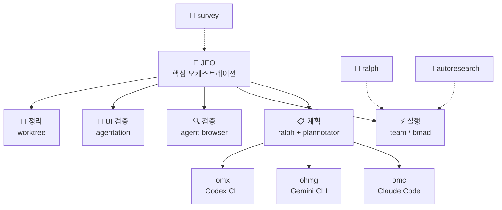

# Agent Skills

<div align="center">

[](https://github.com/akillness/oh-my-skills)
[](https://github.com/akillness/oh-my-skills)
[](LICENSE)
[](docs/bmad/README.md)
[](https://www.buymeacoffee.com/akillness3q)

**89개 AI 에이전트 스킬 · TOON 포맷 · 멀티플랫폼**

[빠른 시작](#-빠른-시작) · [스킬 목록](#-스킬-목록) · [설치](#-설치) · [English](README.md)

</div>

---

## 💡 Agent Skills란?

**89개 AI 에이전트 스킬 · TOON 포맷 · 멀티플랫폼**

Agent Skills는 LLM 기반 개발 워크플로우를 위한 89개 AI 에이전트 스킬 컬렉션입니다. `jeo` 오케스트레이션 프로토콜을 중심으로 구축되었으며 다음을 제공합니다:
- Claude Code, Gemini CLI, OpenAI Codex, OpenCode 전반에 걸친 통합 오케스트레이션
- 계획 → 실행 → 검증 → 정리 자동화 파이프라인
- 병렬 실행이 가능한 멀티 에이전트 팀 조율

---

## 🚀 빠른 시작

> **사전 준비**: `npx skills add` 명령을 실행하려면 먼저 `skills` CLI가 필요합니다.
>
> ```bash
> npm install -g skills
> ```

```bash
# LLM 에이전트에게 전달 — 읽고 자동으로 설치를 진행합니다
curl -s https://raw.githubusercontent.com/akillness/oh-my-skills/main/setup-all-skills-prompt.md
```

| 플랫폼 | 첫 번째 명령 |
|--------|------------|
| Claude Code | `jeo "작업 설명"` 또는 `/omc:team "작업"` |
| Gemini CLI | `/jeo "작업 설명"` |
| Codex CLI | `/jeo "작업 설명"` |
| OpenCode | `/jeo "작업 설명"` |

---

## 🏗 아키텍처



---

## 🆕 v2026-04-18 업데이트

| 변경 | 내용 |
|------|------|
| **task-planning: 구조 강화** | `task-planning`을 백로그 정리, 기능 분해, 스프린트 후보 준비, 릴리스 패킷, 마일스톤 계획을 담당하는 라우팅 우선 planning anchor로 다듬었습니다. 이제 developer workflow, web/fullstack, product/ops, marketing/GTM, game work 전반에서 하나의 planning mode를 고르고, discovery와 delivery를 분리하고, 가장 작은 packet shape를 선택하며, `task-estimation`, `vibe-kanban`, `plannotator`, `standup-meeting`, `sprint-retrospective`, `bmad`, `bmad-gds`로의 route-out을 명시합니다. 또한 `references/modes-and-handoffs.md`, `references/packet-shapes.md`, 갱신된 `evals/evals.json`, 동기화된 compact/manifest discovery wording을 추가했습니다. |

## 🆕 v2026-04-17 업데이트

| 변경 | 내용 |
|------|------|
| **steam-store-launch-ops: 병목 라우터 강화** | `steam-store-launch-ops`를 인디 게임용 Steam 출시/상점 진단 라우터로 더 날카롭게 다듬었습니다. 이제 `visibility-acquisition`, `promise-clarity`, `proof-demo-readiness`, `timing-hook-fit`, `launch-ops-readiness`를 분리하고, 현재 hook(coming-soon page, wishlist anomaly, demo decision, Next Fest, launch window)을 먼저 명시한 뒤, 일반적인 마케팅 장문 대신 **하나의 intervention**과 **하나의 next artifact**를 추천합니다. 또한 `references/diagnostic-model.md`, `references/event-hooks.md`, 갱신된 `evals/evals.json`, 동기화된 `SKILL.toon`을 추가했고, 중복 게임 마케팅 스킬은 만들지 않았습니다. |

## 🆕 v2026-04-15 업데이트

| 변경 | 내용 |
|------|------|
| **game-performance-profiler: quick-packet + device-review 강화** | `game-performance-profiler`를 실제 팀이 가지고 오는 성능 패킷 중심으로 강화했습니다. 이제 profiler/overlay 스크린샷, `stat unit` / `stat gpu` 출력, benchmark-route 불만, Steam Deck 또는 packaged-on-device 검토 메모에서 출발해 `quick-triage`, `bottleneck-classification`, `benchmark-route`, `device-review`, `escalation` 모드 중 하나를 선택합니다. 또한 `references/capture-packets-and-benchmark-routes.md`, `references/device-review-and-steam-deck.md`, `references/escalation-ladder.md`, 갱신된 `references/profiling-patterns.md`, `evals/evals.json`, `SKILL.toon`을 추가했고, 스킬 수 증가 없이 `game-demo-feedback-triage`, `game-build-log-triage`, `game-ci-cd-pipeline`, `performance-optimization`로의 route-out도 더 선명하게 만들었습니다. |
| **agent-browser: fresh-session verification 재작성** | `agent-browser`를 일반적인 브라우저 CLI 가이드에서 브라우저 검토 레인의 **fresh-session deterministic verification** 앵커로 재구성했습니다. 이제 먼저 clean browser 레인을 선택하고, observe → act → observe 루프를 기본 계약으로 삼으며, `playwriter`, `agentation`, `plannotator`로의 route-out을 명시합니다. 또한 `references/modes-and-routing.md`와 `evals/evals.json`을 추가했고, auth 재사용도 실행 중 브라우저 워크플로로 흐르지 않도록 bounded reuse로 제한합니다. |
| **agentation: UI 어노테이션 라우터 재작성** | `agentation`을 거대한 설치/설정 카탈로그에서 계획·검토 레인의 **정확한 렌더드 UI 피드백 라우터**로 재구성했습니다. 이제 copy-paste review, synced watch-loop, self-driving critique, platform-setup 모드 중 하나를 고르고, `agent-browser`, `playwriter`, `plannotator`로의 route-out을 명시합니다. 또한 `references/modes-and-routing.md`, `references/platform-setup-and-hooks.md`, `references/watch-loop-and-self-driving.md`, `evals/evals.json`을 추가했고, 저장소 상단 발견면도 **89개 스킬** 기준으로 맞췄습니다. |
| **git-submodule: 서브모듈 운영 앵커 재작성** | `git-submodule`을 오래된 명령 카탈로그에서 유틸리티 레인의 결정-우선 서브모듈 앵커로 재구성했습니다. 이제 먼저 submodule vs subtree/vendoring/package delivery를 판단하고, `boundary decision`, `add-and-pin`, `bootstrap-and-clone`, `sync-to-pinned-commit`, `advance-tracked-branch`, `edit-inside-submodule`, `remove-and-cleanup`, `ci-checkout` 중 하나의 워크플로 모드를 선택합니다. 또한 detached HEAD, 포인터 변경, CI/auth 결과를 명시하고, 일반 Git 히스토리 정리는 `git-workflow`, 패키지 전달 판단은 `npm-git-install`로 라우팅하며, 스킬 수 증가 없이 `references/decision-matrix.md`, `references/update-and-detached-head.md`, `references/ci-and-automation.md`, `evals/evals.json`을 제공합니다. |
| **bmad-idea: 사전 기획 컨셉 라우터 재작성** | `bmad-idea`를 기존 BMAD-CIS 명령/페르소나 카탈로그에서 저장소의 사전 기획 아이디어 라우터로 재구성했습니다. 이제 초기 제품/GTM/컨설팅/게임 입력을 정규화하고, `problem framing`, `audience and value framing`, `concept shaping`, `game concept framing`, `story packaging` 중 하나를 선택해 재사용 가능한 컨셉 산출물 하나를 만들며, 다음 단계는 `bmad`, `task-planning`, `marketing-automation`, `bmad-gds`로 명확히 넘깁니다. 또한 `references/operating-modes.md`, `references/handoff-boundaries.md`, `references/concept-packet-template.md`, `evals/evals.json`을 추가했고 스킬 수는 늘리지 않았습니다. |
| **genkit: 풀스택 AI 워크플로 앵커 재작성** | `genkit`을 긴 명령/예제 덤프에서 Firebase·풀스택 레인의 **백엔드 AI 워크플로 앵커**로 재구성했습니다. 이제 `flow-foundation`, `tool-and-agent`, `retrieval-and-prompt`, `evaluation-and-observability`, `deployment-runtime` 모드 중 하나를 선택하고, 직접 Firebase 앱/클라이언트 SDK 작업은 `firebase-ai-logic`으로 명확히 라우팅합니다. 또한 `references/modes-and-routing.md`, `references/deployment-and-runtime-boundaries.md`, `references/evals-and-observability.md`, `evals/evals.json`을 추가했고, 상단 발견면도 Genkit을 재사용 가능한 서버 소유 워크플로 레이어로 설명하도록 맞췄습니다. |
| **firebase-ai-logic: 클라이언트 통합 지원 강화** | `firebase-ai-logic`을 얇은 보조 노트에서 Firebase 레인의 **앱/클라이언트 통합 앵커**로 끌어올렸습니다. 이제 `direct feature fit`, `app wiring`, `production hardening`, `escalation boundary` 모드 중 하나를 선택하고, `references/modes-and-routing.md`, `references/production-controls.md`, `references/feature-packets.md`, `evals/evals.json`을 추가했습니다. 또한 백엔드 워크플로는 `genkit`, 운영자 작업은 `firebase-cli`로 명확히 route-out하며, 앱 SDK 작업과 백엔드 오케스트레이션을 흐리게 하던 오래된 설정/예제 안내도 제거했습니다. |

## 🆕 v2026-04-14 업데이트

| 변경 | 내용 |
|------|------|
| **npm-git-install: Git 의존성 의사결정 재작성** | `npm-git-install`을 오래된 npm 전용 명령 모음에서 의사결정 중심의 Node 패키지 전달 스킬로 재구성했습니다. 이제 직접 Git 설치, SHA 고정 브리지 설치, private Git 인증, tarball / `npm pack` 아티팩트, workspace / `file:` 링크, publish-first 레지스트리 경로 사이를 고를 수 있고, npm·pnpm·Yarn·Bun을 워크플로우 수준에서 다룹니다. 또한 인증/빌드/재현성 가드레일과 `git-workflow`, `github-repo-management`, `workflow-automation`, `system-environment-setup`로의 명시적 route-out을 추가했으며, 스킬 수 증가 없이 `references/delivery-decision-matrix.md`, `references/package-manager-behavior.md`, `references/private-auth-and-ci.md`, `evals/evals.json`을 제공합니다. |
| **web-design-guidelines: UI 감사 재작성** | `web-design-guidelines`를 얇은 Vercel 규칙 가져오기 스킬에서 프런트엔드 클러스터의 광범위한 인터페이스 감사 앵커로 재구성했습니다. 이제 launch-readiness, polish/consistency, flow-friction, heuristic, rule-overlay 리뷰를 다루고, hierarchy, clarity, states, responsiveness basics, accessibility basics, performance/trust signals로 결과를 분류합니다. 또한 `web-accessibility`, `responsive-design`, `ui-component-patterns`, `design-system`, `react-best-practices`로의 route-out을 추가했고, 스킬 수 증가 없이 `references/review-modes-and-categories.md`, `references/handoff-boundaries.md`, `references/ui-audit-packet-template.md`, `evals/evals.json`을 제공합니다. |
| **monitoring-observability: telemetry-review 재작성** | `monitoring-observability`를 일반적인 Prometheus/로깅 스니펫 모음에서 모드 선택형 observability 앵커로 재구성했습니다. 이제 service reliability, telemetry foundations, data/marketing pipeline health, game live-ops visibility, stack-review audits를 다루며, symptom-first alerting, explicit dashboard/ownership checks, 그리고 `log-analysis`, `debugging`, `performance-optimization`, `langsmith`, `deployment-automation`, `game-performance-profiler`로의 route-out을 적용합니다. 또한 `references/modes-and-boundaries.md`, `references/alert-dashboard-checklist.md`, `references/telemetry-rollout-matrix.md`, `evals/evals.json`을 추가했습니다. |
| **performance-optimization: 아티팩트 우선 강화** | `performance-optimization`을 팀이 실제로 들고 오는 성능 패킷 중심의 측정 우선 튜닝 앵커로 더 다듬었습니다. 이제 trace, Lighthouse/CWV 보고서, query plan, load-test diff, profiler 출력, stakeholder report 같은 현재 아티팩트에서 출발하고, `references/intake-packets-and-escalations.md`를 추가했으며, `monitoring-observability`, `debugging`, `code-refactoring`, `testing-strategies`, `game-performance-profiler`로의 route-out을 더 선명하게 했습니다. 또한 marketing/CWV·CI benchmark 케이스까지 eval 범위를 넓히고 compact/discovery 문구를 동기화해 예전의 generic optimization wording으로 되돌아가지 않게 했습니다. |
| **code-refactoring: 동작 보존 재작성** | `code-refactoring`을 긴 교과서식 패턴 덤프에서 코드 품질 클러스터의 구조 개선 앵커로 재구성했습니다. 이제 local safe refactors, behavior-freeze-first cleanup, repetitive migration / codemod work 사이에서 고르고, 테스트/검색/리뷰 가능한 슬라이스를 명시합니다. 또한 `debugging`, `code-review`, `testing-strategies`, `performance-optimization`, `codebase-search`로의 route-out과 `references/refactor-modes.md`, `references/handoff-boundaries.md`, `references/safe-refactor-checklist.md`, `evals/evals.json`을 추가했습니다. |
| **changelog-maintenance: 릴리스 기록 재작성** | `changelog-maintenance`를 일반적인 semver/example 덤프에서 문서화 클러스터의 release-history / release-notes 앵커로 재구성했습니다. 이제 changelog, release-notes, migration-update, game-patch-note 워크플로우를 고를 수 있고, `technical-writing`, `api-documentation`, `user-guide-writing`, `deployment-automation`, `marketing-automation`로의 route-out을 제공합니다. 또한 `references/automation-and-source-of-truth.md`, `references/modes-and-boundaries.md`, `references/release-note-quality-checklist.md`, `evals/evals.json`을 추가했습니다. |

## 🆕 v2026-04-13 업데이트

| 변경 | 내용 |
|------|------|
| **responsive-design: 레이아웃 적응 재작성** | `responsive-design`를 긴 CSS 예시 모음에서 프론트엔드 클러스터의 모바일 우선·컨테이너 기반 레이아웃 적응 스킬로 재정의했습니다. 이제 viewport-vs-container 실패를 분류하고, breakpoint 추가보다 intrinsic layout을 우선하며, `ui-component-patterns`, `web-accessibility`, `design-system`, `web-design-guidelines`로의 명시적 route-out을 제공합니다. `references/layout-decision-checklist.md`, `references/handoff-boundaries.md`, `evals/evals.json`도 함께 추가했고 전체 스킬 수는 그대로입니다. |

## 🆕 v2026-04-12 업데이트

| 변경 | 내용 |
|------|------|
| **bmad: 코어 BMAD 라우터 현대화** | `bmad`를 휴대형 BMAD/BMM 코어 라우터로 재구성했습니다. 이제 프로젝트 레벨을 고르고, 현재 단계를 식별하고, 다음 산출물 하나를 추천한 뒤, 런타임/전문화된 세부 작업은 `plannotator`, `task-planning`, `omc`, `omx`, `ohmg`, `bmad-gds`로 넘깁니다. 거대한 명령 모음 대신 `references/core-routing.md`, `references/status-and-review.md`, `references/runtime-and-module-boundaries.md`, `evals/evals.json`을 추가했고 기존 helper script는 유지했습니다. |
| **bmad-gds: 게임 프로듀서/오케스트레이션 재작성** | `bmad-gds`를 단순 단계 목록에서 실제 게임 제작 조정 스킬로 재정의했습니다. 이제 아이디어, GDD, 플레이테스트 메모, 버그/빌드 이슈, 출시 목표가 섞인 입력을 받아 하나의 운영 모드를 선택하고, 다음 마일스톤 중심 조정 브리프를 만든 뒤 필요하면 `game-demo-feedback-triage`, `game-build-log-triage`, `game-performance-profiler`, `steam-store-launch-ops`, `task-planning`, `bmad-idea`로 명시적으로 라우팅합니다. `references/operating-modes.md`, `references/scope-boundaries.md`, `evals/evals.json`도 추가했고 전체 스킬 수는 그대로입니다. |

## 🆕 v2026-04-08 업데이트

| 변경 | 내용 |
|------|------|
| **graphify: 저장소/코퍼스 지식 그래프 스킬** | 저장소나 혼합 코퍼스를 `GRAPH_REPORT.md`, `graph.json`, HTML 시각화로 변환하는 전용 `graphify` 스킬을 추가했습니다. 테스트된 Python API 기반 파이프라인, 그래프 질의, graph-backed architecture 탐색, assistant 설치 플로우를 다루며 `references/overview.md`와 `evals/evals.json`도 함께 포함합니다. 84 → **85개** |
| **llm-wiki: 영속적 LLM 관리형 마크다운 위키 스킬** | 원시 소스를 시간이 지날수록 축적되는 Obsidian 또는 git 기반 지식 베이스로 바꾸는 전용 `llm-wiki` 스킬을 추가했습니다. `raw/`, `wiki/`, `index.md`, `log.md`, `AGENTS.md` 로 vault를 부트스트랩하고, bootstrap, Scrapling 기반 URL ingest, query filing, lint용 헬퍼 스크립트를 포함합니다. 스키마, ingest, filing, scaling 규칙은 별도 reference 문서로 분리했고, `evals/`와 `skill-autoresearch-llm-wiki/` baseline, changelog, results, dashboard 산출물도 함께 포함합니다. 82 → **83개** |
| **rtk: Rust Token Killer 설치 및 운영 스킬** | Claude Code, Codex, Gemini CLI, Cursor, Copilot, Windsurf, Cline, OpenCode 전반에서 Rust Token Killer를 설치·검증·초기화하는 전용 `rtk` 스킬을 추가했습니다. `rtk gain` 검증을 시작점으로 두고, 잘못 설치된 동명 패키지 충돌을 복구하며, install/init/status 래퍼 스크립트와 플랫폼별 참고 문서로 흐름을 분리했습니다. `evals/`와 `skill-autoresearch-rtk/` baseline, changelog, results, dashboard 산출물도 함께 포함합니다. 81 → **82개** |

## 🆕 v2026-03-30 업데이트

| 변경 | 내용 |
|------|------|
| **harness: 에이전트 팀 & 스킬 아키텍트 메타스킬** | 도메인 전용 에이전트 팀을 설계하고 스킬을 생성하는 전용 `harness` 스킬을 추가했습니다. 도메인 분석, 아키텍처 패턴 선택(pipeline, fan-out/fan-in, expert pool, producer-reviewer, supervisor, hierarchical delegation), `.claude/agents/`·`.claude/skills/` 파일 생성, 오케스트레이션 워크플로우 정의, 트리거 eval·드라이런 검증을 포함합니다. `install.sh`, `validate-harness.sh` 스크립트와 참고 문서 5개도 포함됩니다. 80 → **81개** |

## 🆕 v2026-03-28 업데이트

| 변경 | 내용 |
|------|------|
| **obsidian-cli: Obsidian 터미널 자동화 스킬** | 공식 Obsidian CLI를 활성화하고 운영하기 위한 전용 `obsidian-cli` 스킬을 추가했습니다. 설치/등록 프리플라이트, TUI와 단일 명령 사용, `vault=` / `file=` / `path=` 타기팅, `--copy`, 일상 노트 워크플로우, 플러그인/테마 제어, `plugin:reload`·`dev:screenshot` 같은 개발자 명령, 그리고 플랫폼별 문제해결 참고 문서를 포함합니다. 79 → **80개** |
| **scrapling: 적응형 웹 스크래핑 스킬** | parser-first HTML 추출, `Fetcher` → `DynamicFetcher` → `StealthyFetcher` 선택, extras 기반 설치, adaptive selector 복구, CLI 추출, 그리고 2차 워크플로우인 MCP/spider 가이드를 포함하는 전용 `scrapling` 스킬을 추가했습니다. install/extract/MCP 래퍼 스크립트와 fetcher·parser·CLI/MCP·spider 참고 문서도 함께 포함합니다. 78 → **79개** |
| **strix: AI 기반 애플리케이션 보안 테스트 스킬** | Strix CLI를 실무적으로 운영하는 전용 `strix` 스킬 추가. 설치 및 Docker 프리플라이트, `STRIX_LLM` 공급자 설정, 로컬/GitHub/라이브 타깃 스캔, quick/standard/deep 모드 선택, 헤드리스 CI/CD 사용, 그리고 이 저장소의 스킬과 Strix 내부 보안 스킬의 차이까지 포함합니다. 77 → **78개** |

## 🆕 v2026-03-22 업데이트

| 변경 | 내용 |
|------|------|
| **bmad-orchestrator → bmad 리네임** | `bmad-orchestrator` 스킬 폴더가 `bmad`로 리네임되었습니다. 핵심 BMAD 워크플로우 오케스트레이션(분석 → 계획 → 솔루션 → 구현)으로 단순화. 키워드 `bmad`는 동일하게 사용 가능합니다. |
| **copilot-coding-agent 제거** | `copilot-coding-agent` 스킬 제거. 총 77개 스킬. |

## 🆕 v2026-03-19 업데이트

| 변경 | 내용 |
|------|------|
| **clawteam: 에이전트 스웜 협업 스킬** | `clawteam` 전용 스킬 추가. tmux 기반 워커 실행, git worktree 격리, 파일 기반 task/inbox 상태, 모니터링 명령, 그리고 full-stack / ML research / hedge-fund 스타일 템플릿까지 포함하는 범용 멀티에이전트 오케스트레이션을 제공합니다. |
| **obsidian-plugin: Obsidian 플러그인 개발 스킬** | Obsidian 플러그인 빌드, 검증, 커뮤니티 디렉토리 제출. `eslint-plugin-obsidianmd` 27개 규칙 전체 커버, 대화형 보일러플레이트 생성기(`create-plugin.js`), 메모리 관리, 타입 안전성, 접근성(MANDATORY), CSS 변수, Vault API, 제출 검증. 75 → **76개** |
| **jeo v1.6.0: `.jeo` 계획 ledger 플로우** | JEO가 이제 프로젝트 로컬 `.jeo/` 폴더를 만들고 장기계획(`long-term.md`), 단기계획(`short-term.md`), 예정 작업(`planned.md`), 진행상황(`progress.md`), 이력(`history.md`), queued/active 작업 파일을 함께 관리합니다. 완료된 작업 파일은 history에 요약한 뒤 제거하고, follow-up 작업은 workflow를 초기화하지 않고 계속 추가할 수 있습니다. |
| **skill-autoresearch: eval 기반 스킬 최적화** | 기존 `SKILL.md` 를 바이너리 eval, mutation loop, baseline scoring, dashboard/changelog 산출물로 반복 개선하는 신규 스킬. 기존 ML용 `autoresearch` 와는 별도 용도입니다. 76 → **77개** |
| **firebase-cli: Firebase 플랫폼 운영 앵커 강화** | `firebase-cli`를 install/auth, bootstrap/config, Emulator Suite, scoped deploy/release, admin/data 작업을 고르는 라우팅형 Firebase 운영 앵커로 재구성했습니다. 라우팅·부트스트랩·에뮬레이터/릴리스·관리 작업 참고 문서를 추가하고, eval/compact 문구를 갱신했으며, npm 설치 경로의 Node.js 기준도 현재 `firebase-tools` 요구사항에 맞게 바로잡았습니다. |
| **google-workspace, langsmith, react-grab 추가** | 3개 신규 스킬: Google Workspace REST API 자동화, LangSmith LLM 관측성/평가, react-grab React 엘리먼트 컨텍스트 캡처. 71 → **74개** |
| **research-paper-writing: ML/CV/NLP 논문 작성 스킬** | Abstract, Introduction, Method, Experiments뿐 아니라 figure/table 지원, reviewer response, camera-ready 수정까지 다루는 학술 논문·리버틀 워크플로우. 주장-증거 정합성, 섹션 계획, reviewer-risk 점검 중심. Prof. Peng Sida 노트 기반 + 저장소 지원 보강. 70 → **71개** |
| **ai-tool-compliance 및 llm-monitoring-dashboard 제거** | `ai-tool-compliance` (내부 컴플라이언스 자동화) 및 `llm-monitoring-dashboard` 제거. 72 → **70개** |
| **에이전트 개발 스킬 일부 제거** | `agent-configuration`, `agent-evaluation`, `agentic-development-principles`, `agentic-principles`, `agentic-workflow` 제거. 80 → **72개** |
| **이미지/미디어 스킬 일부 제거** | `image-generation`, `image-generation-mcp`, `pollinations-ai` 제거. 미디어는 `video-production`을 기본 프로그래머블 비디오 스킬로 사용하고, `remotion-video-production`은 명시적 Remotion 이름용 호환 별칭으로 유지 |
| **autoresearch: Karpathy 자율 ML 실험 스킬** | 사람이 `program.md`를 쓰고 에이전트가 `train.py`를 수정하며, 5분 GPU 실행과 `val_bpb` keep/revert ratcheting으로 실제 ML 탐색을 돌립니다. 프롬프트/앱 eval 작업은 `skill-autoresearch`나 별도 eval 플랫폼으로 라우팅하고, `scripts/`, `references/`, `evals/`를 포함합니다. |
| **jeo v1.2.3: plannotator-plan-loop.sh 전 플랫폼 강화** | 크로스 플랫폼 임시 디렉토리, 전용 포트 `PLANNOTATOR_PORT=47291`, `probe_plannotator_port()` + `wait_for_listen()`, 브라우저 강제종료 시 최대 3회 자동 재시작, 구조화 `jeo-blocked.json` 출력 |
| **survey: 라우팅 우선 문제공간 스캔 강화** | `survey`를 더 작은 아티팩트 계약 중심 조사 앵커로 다듬었습니다. 하나의 조사 모드를 먼저 분류하고, 4개 레인의 `.survey/{slug}/` 출력 계약을 유지하며, 플랫폼 비교는 `settings/rules/hooks`로 정규화하고, 검색 복구/이식성 세부사항은 별도 reference로 분리합니다. |
| **presentation-builder: 덱 아티팩트 워크플로우** | 투자/로드맵/런치/아키텍처 데모/워크숍/게임 피치 덱을 slides-grab으로 기획·브라우저 리뷰·PPTX/PDF 핸드오프까지 다루는 스킬. 중복 스킬 `pptx-presentation-builder` 제거 |

---

## 📦 설치

### 0단계: `skills` CLI 설치

```bash
npm install -g skills
skills --version
```

### LLM 에이전트용

```bash
curl -s https://raw.githubusercontent.com/akillness/oh-my-skills/main/setup-all-skills-prompt.md
```

### 플랫폼별 선택

#### Claude Code

```bash
npx skills add https://github.com/akillness/oh-my-skills \
  --skill jeo --skill omc --skill plannotator --skill agentation \
  --skill ralph --skill ralphmode --skill vibe-kanban
```

#### Gemini CLI

```bash
npx skills add https://github.com/akillness/oh-my-skills \
  --skill jeo --skill ohmg --skill ralph --skill ralphmode --skill vibe-kanban
gemini extensions install https://github.com/akillness/oh-my-skills
```

#### Codex CLI

```bash
npx skills add https://github.com/akillness/oh-my-skills \
  --skill jeo --skill omx --skill ralph --skill ralphmode
```

#### 플랫폼별 추가 설정

```bash
# Claude Code — jeo 훅 설정
bash ~/.agent-skills/jeo/scripts/setup-claude.sh

# Gemini CLI — jeo 훅 설정
bash ~/.agent-skills/jeo/scripts/setup-gemini.sh

# oh-my-claudecode
/plugin marketplace add https://github.com/Yeachan-Heo/oh-my-claudecode
/oh-my-claudecode:omc-setup
```

---

## 📚 스킬 목록

> 전체 매니페스트: `.agent-skills/skills.json` · 각 폴더의 `SKILL.md` · 89개 로컬 스킬 폴더 = 총 89개 설치 가능 스킬

### 🎯 핵심 오케스트레이션 (11개)

| 스킬 | 키워드 | 플랫폼 | 설명 |
|------|--------|--------|------|
| `jeo` | `jeo`, `annotate` | 전체 | `.jeo` ledger 기반 통합 오케스트레이션: 기획→개발→QA→정리 |
| `omc` | `omc`, `autopilot`, `ralph`, `ulw`, `ccg`, `deep interview`, `deslop`, `cancelomc` | Claude | 29+ 에이전트 오케스트레이션 레이어 (v4.9.3) — Teams/Autopilot/Ralph/Ultrawork/CCG 모드, 스마트 모델 라우팅, 스킬 레이어, 실시간 HUD |
| `harness` | `harness`, `build a harness` | 전체 | 메타스킬: 도메인 전용 에이전트 팀 설계, `.claude/agents/`·`.claude/skills/` 생성, harness 검증 |
| `omx` | `omx`, `$plan`, `$ralph`, `$team`, `$deep-interview`, `$ralplan` | Codex | Codex CLI용 멀티에이전트 워크플로우 레이어 (v0.11.10) — 30+ 에이전트, 35+ 스킬, tmux 팀 런타임, omx explore/sparkshell |
| `ohmg` | `ohmg`, `oh-my-agent`, `oma`, `.agents` | Gemini | 휴대형 `oh-my-agent` 하네스용 Gemini / Antigravity 진입 스킬 (`.agents` 소스 오브 트루스, Gemini 네이티브 투영, 크로스벤더 확장 가능) |
| `ralph` | `ralph`, `ooo` | 전체 | Ouroboros 스펙 우선 메서드 앵커 — 소크라테스식 명확화, 불변 seed/spec, 드리프트 인식 실행, 검증 통과까지 이어가는 완료 루프 |
| `ralphmode` | `ralphmode` | 전체 | 자동화 권한 프로파일 — 신뢰된 저장소용 로컬 설정, 경계 규칙, 훅 기반 체크포인트를 분리하고 샌드박스 전용 YOLO와 구분 |
| `bmad` | `bmad`, `workflow-init`, `workflow-status` | 전체 | 휴대형 BMAD/BMM 코어 라우터 — 프로젝트 레벨과 현재 단계를 정하고, 다음 산출물을 추천한 뒤 런타임별 세부 작업을 바깥으로 라우팅 |
| `bmad-gds` | `bmad-gds` | 전체 | 게임 제작 오케스트레이터 — 아이디어, GDD, 플레이테스트 메모, 버그, 출시 목표를 다음 마일스톤 산출물로 정리 |
| `bmad-idea` | `bmad-idea` | 전체 | 사전 기획 아이디어 라우터 — 거친 제품/GTM/컨설팅/게임 아이디어를 하나의 컨셉 산출물과 다음 핸드오프로 정리 |
| `survey` | `survey` | 전체 | 재사용 가능한 `.survey/{slug}/` 결과물을 남기는 bounded 사전 구현 문제공간 스캔 |

### 📋 계획 및 검토 (5개)

| 스킬 | 키워드 | 설명 |
|------|--------|------|
| `plannotator` | `plan` | 에이전트 계획/diff용 시각적 승인 게이트 — 주석, 승인, 수정 요청, 검토 결과 저장 |
| `agentation` | `annotate` | 정확한 렌더드 UI 피드백 라우터 — copy-paste review, watch-loop sync, self-driving critique, platform setup 선택 |
| `agent-browser` | `agent-browser` | fresh-session 브라우저 검증 앵커 — clean disposable browser, snapshot refs, 명시적 before/after evidence |
| `playwriter` | `playwriter` | 인증된 Chrome 세션과 MCP 재사용을 위한 실행 중 브라우저 자동화 |
| `vibe-kanban` | `kanbanview` | 병렬 에이전트·검토 큐·worktree 격리·PR 핸드오프를 다루는 코딩 작업 보드/워크스페이스 제어면 |

### 🤖 에이전트 개발 (2개)

| 스킬 | 설명 | 플랫폼 |
|------|------|--------|
| `prompt-repetition` | 비추론/경량 LLM에서 프롬프트 반복을 언제 써야 하는지 판단하는 스킬 — 긴 컨텍스트 검색, 선택지 우선 MCQ, 위치/인덱스 조회, 그리고 retrieval·강한 모델로의 route-out 포함 | 전체 |
| `skill-standardization` | SKILL.md 검증/재작성, 중복 canonical화, 그리고 repo-root 검증 흐름 + 파생 발견면(`skills.json`, README/setup, `SKILL.toon`) 동기화 | 전체 |

### ⚙️ 백엔드 (5개)

| 스킬 | 설명 | 플랫폼 |
|------|------|--------|
| `api-design` | 계약 중심 REST/GraphQL API 설계, 호환성 검토, 후속 핸드오프 | 전체 |
| `api-documentation` | 레퍼런스 포털·퀵스타트·SDK/웹훅 가이드·검증된 예시·인증/에러 안내를 다루는 개발자용 API 문서 앵커 | 전체 |
| `authentication-setup` | hosted/framework-native/platform-native 인증 선택, 세션/JWT 경계, 조직 데이터, 엔터프라이즈 SSO 핸드오프를 다루는 제품 인증 설정 라우터 | 전체 |
| `backend-testing` | API·통합·계약·fixture·로컬/CI 분리를 포함한 백엔드 테스트 커버리지 설계 | 전체 |
| `database-schema-design` | 관계형/문서형 스키마, 제약조건, 인덱스, 단계적 스키마 변경을 다루는 스토리지 모델 및 마이그레이션 안전성 설계 | 전체 |

### 🎨 프론트엔드 (10개)

| 스킬 | 설명 | 플랫폼 |
|------|------|--------|
| `design-system` | 디자인 토큰 거버넌스, 비주얼 언어 규칙, 프리미티브 네이밍, 교차 화면 시스템 방향을 맡는 기본 프론트엔드 UI 시스템 앵커이며, 컴포넌트 API·반응형 레이아웃·접근성 수정·광범위한 UI 평가는 인접 스킬로 route-out합니다 | 전체 |
| `frontend-design-system` | 레거시 툴링이나 정확한 이름 의존 워크플로를 위한 `design-system` 호환 별칭 | 전체 |
| `react-best-practices` | waterfall, 번들 크기, RSC/클라이언트 경계, hydration, rerender churn, 느린 라우트를 측정 기반으로 진단하는 React & Next.js 성능 스킬 | 전체 |
| `react-grab` | 브라우저 UI 엘리먼트에서 React 컴포넌트명·파일경로·HTML을 클립보드로 복사해 AI 에이전트에 전달 | 전체 |
| `vercel-react-best-practices` | 레거시 툴링이나 정확한 이름 의존 워크플로를 위한 `react-best-practices` 호환 별칭 | Claude · Gemini · Codex |
| `responsive-design` | 모바일 우선·컨테이너 기반 레이아웃 적응과 overflow/reflow 검증 가이드 | 전체 |
| `state-management` | Context·Zustand·Redux Toolkit·Jotai·TanStack Query를 나누는 React 상태 경계 결정 | 전체 |
| `ui-component-patterns` | 공유 프론트엔드 컴포넌트를 위한 재사용 primitive·variant·slot API 설계 | 전체 |
| `web-accessibility` | 접근성 감사·수정과 자동화 이후 수동 검증 가이드 | 전체 |
| `web-design-guidelines` | hierarchy, clarity, consistency, state, responsiveness/accessibility basics를 보는 broad 웹 UI 감사 | 전체 |

### 🔍 코드 품질 (5개)

| 스킬 | 설명 | 플랫폼 |
|------|------|--------|
| `code-refactoring` | 동작 보존 중심 구조 정리, 분해, 중복 제거, codemod 계획 | 전체 |
| `code-review` | 심각도·증거 공백 점검·route-out을 포함한 evidence-first diff / PR 리뷰 | 전체 |
| `debugging` | 구체적인 버그·회귀·flaky 실패·환경별 이상 동작을 위한 routing-first 진단 스킬; raw log는 `log-analysis`, 순수 성능 작업은 `performance-optimization`으로 라우팅 | 전체 |
| `performance-optimization` | trace·보고서·query plan 같은 현재 아티팩트에서 출발해 지연시간·처리량·메모리·번들·CWV·프레임 예산 병목을 측정 중심으로 분석하고 튜닝 | 전체 |
| `testing-strategies` | 리스크 기반 검증 정책, 머지/릴리즈 게이트, flaky 스위트 정책 | 전체 |

### 🏗 인프라 (13개)

| 스킬 | 설명 | 플랫폼 |
|------|------|--------|
| `deployment-automation` | 프리뷰 릴리즈, 스테이징/프로덕션 승격, 롤아웃 전략, 배포 후 검증, 롤백 대응, 릴리즈 하드닝을 다루는 릴리즈 실행 앵커이며, CI 작성은 `workflow-automation`, 머신 설정은 `system-environment-setup`, Vercel 전용 운영은 `vercel-deploy`로 라우팅 | 전체 |
| `environment-setup` | `.env` 구조, env 우선순위, 검증, 시크릿 전달을 다루는 앱 구성 호환 스킬이며, 더 넓은 실행 환경 설정은 `system-environment-setup`으로 라우팅 | 전체 |
| `firebase-ai-logic` | Firebase 앱/클라이언트 SDK에서 Gemini 기능, 스트리밍, 구조화 출력, App Check 연동을 다루는 직접 통합 레인이며, 백엔드 오케스트레이션은 `genkit`으로 라우팅 | Claude · Gemini |
| `firebase-cli` | install/auth, bootstrap/config, Emulator Suite, scoped deploy/release, App Hosting, admin/data 작업을 담당하는 Firebase 플랫폼 운영 앵커. 백엔드 AI 워크플로 오케스트레이션은 `genkit`, 앱 SDK 통합은 `firebase-ai-logic`으로 라우팅 | 전체 |
| `genkit` | 서버 소유 AI 플로우, tool calling, 프롬프트 파일, RAG, 평가, 관측성, Firebase / Cloud Run 배포를 다루는 풀스택 AI 워크플로 레인이며, 직접 앱 SDK 작업은 `firebase-ai-logic`으로 라우팅 | Claude · Gemini |
| `looker-studio-bigquery` | KPI 보드, PM/ops 리뷰, 마케팅/GTM 리포팅, 게임/비즈니스 텔레메트리를 위한 BigQuery 기반 이해관계자 대시보드/리포팅 레인이며, KPI 해석은 `data-analysis`로 라우팅 | 전체 |
| `monitoring-observability` | 서비스·파이프라인·alerts·dashboards·live-ops 가시성을 위한 텔레메트리 설계/리뷰 | 전체 |
| `scrapling` | parser-first `Selector`, HTTP/브라우저/stealth fetcher, CLI 추출, 선택적 MCP/spider 워크플로우를 포함한 적응형 웹 스크래핑 | 전체 |
| `rtk` | Rust Token Killer 설치 및 에이전트 설정 - `rtk gain` 검증, 동명 패키지 충돌 복구, 에이전트별 `rtk init`, 직접 호출용 압축 래퍼 명령 | 전체 |
| `security-best-practices` | 헤더·CSP·쿠키/CSRF·abuse control·시크릿·검증 handoff를 다루는 계층형 웹/API 보안 강화 | 전체 |
| `strix` | Strix CLI 기반 AI 애플리케이션 보안 테스트 - Docker 프리플라이트, LLM 공급자 설정, 로컬/GitHub/라이브 타깃 스캔, 모드 선택, CI/CD 사용 | 전체 |
| `system-environment-setup` | 실행 가능한 저장소, 툴체인, Docker/devcontainer, 로컬 서비스, 온보딩, 설정 드리프트 진단을 다루는 정식 환경 설정 스킬 | 전체 |
| `vercel-deploy` | 프리뷰/프로덕션 배포, 프리뷰 승격, alias/domain, 환경변수 동기화, 롤백 점검을 다루는 Vercel 전용 배포 운영 스킬 | 전체 |

### 📝 문서화 (5개)

| 스킬 | 설명 | 플랫폼 |
|------|------|--------|
| `changelog-maintenance` | 변경로그·릴리스 노트·마이그레이션 업데이트·패치 노트를 다루는 릴리스 히스토리 앵커 | 전체 |
| `presentation-builder` | 투자/로드맵/런치/아키텍처 데모/워크숍/게임 피치 덱용 slides-grab 리뷰 + PPTX/PDF 핸드오프 앵커 | 전체 |
| `research-paper-writing` | ML/CV/NLP 학술 논문 + 리버틀 워크플로우 — abstract/introduction/method/experiments, figure-table 지원, 주장-증거 정합성, reviewer response, camera-ready revision | 전체 |
| `technical-writing` | 스펙, 아키텍처 문서, ADR, 런북, 마이그레이션 가이드, 개발자용 구현 문서를 다루는 내부 기술 문서 앵커 | 전체 |
| `user-guide-writing` | 온보딩 가이드, 튜토리얼, 작업형 how-to, FAQ, 헬프센터 업데이트, 출시 후 도움말 refresh packet까지 고르는 mode-selecting 사용자 문서 앵커 | 전체 |

### 📊 프로젝트 관리 (4개)

| 스킬 | 설명 | 플랫폼 |
|------|------|--------|
| `sprint-retrospective` | 스프린트 회고, 마일스톤 포스트모템, 비동기/하이브리드 진행, 액션 후속관리 | 전체 |
| `standup-meeting` | 일일 스탠드업, 비동기 체크인, 보드 워크, 블로커 트리아지 진행 | 전체 |
| `task-estimation` | 스토리 포인트, T셔츠 사이징, 플래닝 포커 준비, 예측 안전형 사이징 | 전체 |
| `task-planning` | software, GTM, game work 전반에서 백로그 정리, 기능 분해, 릴리스 패킷, 마일스톤 준비를 담당하는 라우팅 우선 planning anchor | 전체 |

### 🔭 검색 및 분석 (7개)

| 스킬 | 설명 | 플랫폼 |
|------|------|--------|
| `autoresearch` | Karpathy 자율 ML 탐색 — 사람이 `program.md`를 쓰고 에이전트가 `train.py`를 수정, 300초 GPU 실행과 `val_bpb` ratchet로 keep/revert; 프롬프트/스킬 eval은 별도 라우팅 | 전체 |
| `skill-autoresearch` | eval을 고정하고 한 번에 한 가지씩만 바꾸며 점수로 keep/revert를 결정하는 repo-local 스킬 ratcheting 루프. 핵심 경계가 입증된 뒤에만 support surface를 동기화합니다 | 전체 |
| `codebase-search` | 증거 중심 리포 탐색, 호출 지점 추적, 영향 범위 분석 | 전체 |
| `data-analysis` | 내보내기 데이터, 실험, 텔레메트리, KPI 설명을 위한 의사결정 중심 데이터 분석 | 전체 |
| `langsmith` | LLM 트레이싱, 평가, 피드백/리뷰 큐, 프롬프트 레지스트리 결정, 멀티서비스 전파를 다루는 모드 선택형 LangSmith 스킬 | 전체 |
| `log-analysis` | 애플리케이션·인프라·브라우저·CI 로그의 근본 원인 트리아지 | 전체 |
| `pattern-detection` | 코드·로그·텔레메트리·지표 이상을 모드별로 탐지하는 패턴/룰 헌팅 | 전체 |

### 🎬 창의 미디어 (2개)

| 스킬 | 설명 | 플랫폼 |
|------|------|--------|
| `remotion-video-production` | 레거시 툴링이나 명시적 Remotion 이름이 남아 있을 때 `video-production`으로 연결하는 호환 별칭 | 전체 |
| `video-production` | Remotion, 템플릿 API, 콘텐츠 리퍼포징, QA 핸드오프를 묶는 기본 프로그래머블/자동화 비디오 스킬 | 전체 |

### 📢 마케팅 (2개)

| 스킬 | 설명 | 플랫폼 |
|------|------|--------|
| `marketing-automation` | 대표 일반 마케팅 라우터 — KPI 중심 브리프 + CRO/카피/SEO/애널리틱스/그로스 레인 선택 | 전체 |
| `marketing-skills-collection` | 레거시 프롬프트팩/카탈로그용 `marketing-automation` 호환 별칭 | 전체 |

### 🎮 게임 개발 (5개)

| 스킬 | 설명 | 플랫폼 |
|------|------|--------|
| `game-build-log-triage` | Unity/Unreal 빌드, cook, package, editor, signing, CI 로그에서 첫 번째 실행 가능한 실패를 분리하는 전문 triage | 전체 |
| `game-ci-cd-pipeline` | 게임 빌드/릴리즈 파이프라인 설계 및 강화 — matrix, artifact 흐름, cache 정책, packaging 단계, release gate | 전체 |
| `game-demo-feedback-triage` | 플레이테스트/데모/커뮤니티 피드백을 가중치 테마와 fix-first 우선순위로 정리 | 전체 |
| `game-performance-profiler` | Unity/Unreal 성능 트리아지 — quick evidence packet, benchmark route, packaged-on-device 검토, profiler escalation | 전체 |
| `steam-store-launch-ops` | Steam 출시/상점 병목 진단 — visibility, 페이지 promise, demo proof, event timing, launch-readiness ops | 전체 |

### 🔧 유틸리티 (11개)

| 스킬 | 설명 | 플랫폼 |
|------|------|--------|
| `fabric` | stdin/파일/트랜스크립트 기반 요약·추출·재작성·커스텀 패턴 팩·서버 워크플로를 위한 패턴-우선 CLI | 전체 |
| `file-organization` | 결정 우선 저장소 구조 가이드 — 프레임워크 기본 구조, feature 폴더, 모노레포 경계, 문서 분류, 게임 엔진형 레이아웃 중 무엇을 쓸지 결정 | 전체 |
| `git-submodule` | 결정-우선 Git 서브모듈 워크플로 — submodule vs subtree/vendor 선택, 재귀 부트스트랩, 안전한 포인터 업데이트, CI checkout/auth 구성 | 전체 |
| `git-workflow` | 라우팅 우선 로컬 Git 워크플로 — 브랜치 정리, 선택적 staging, 커밋 정리, merge-vs-rebase 선택, 충돌 해결, `--force-with-lease` 기반 안전 푸시, 복구 | 전체 |
| `google-workspace` | 결정-우선 Google Workspace 운영 스킬 — Apps Script vs REST API vs Admin SDK, 인증 방식, Docs/Sheets/Slides/Drive/Gmail/Calendar/Chat/Forms 교차 워크플로를 먼저 고릅니다 | 전체 |
| `llm-wiki` | Obsidian 또는 git 기반 vault를 위한 영속적 마크다운 위키 운영 — raw sources, source summary, query filing, lint, 선택적 Scrapling/qmd 연동 | 전체 |
| `npm-git-install` | npm / pnpm / Yarn / Bun용 결정-우선 Git 의존성 워크플로 — Git ref, tarball, workspace, publish-first 경로를 안전하게 선택 | 전체 |
| `obsidian-cli` | 공식 Obsidian CLI 운영 — 활성화, TUI, 노트/작업 자동화, vault·file 타기팅, plugin reload, 개발자 명령 | 전체 |
| `obsidian-plugin` | Obsidian 플러그인 개발 — 27개 ESLint 규칙, 보일러플레이트 생성기, 접근성, 커뮤니티 제출 검증 | 전체 |
| `opencontext` | OpenContext 기반 프로젝트/저장소 메모리 및 에이전트 핸드오프 — 검색 가능한 결정/교훈, manifest, stable link, load→search→store 워크플로 | 전체 |
| `workflow-automation` | 저장소 범위 반복 워크플로우 자동화 — task runner, bootstrap 진입점, 로컬 CI 패리티, hook, 유지보수 루틴 | 전체 |

---

## 🧬 TOON 포맷 주입

TOON(Token-Oriented Object Notation)은 스킬 카탈로그를 압축하여 모든 프롬프트에 자동 주입합니다. **JSON/Markdown 대비 40-50% 토큰 절감**.

| 플랫폼 | 파일 | 메커니즘 |
|--------|------|---------|
| Claude Code | `~/.claude/hooks/toon-inject.mjs` | `UserPromptSubmit` 훅 — 26-37ms |
| Gemini CLI | `~/.gemini/hooks/toon-skill-inject.sh` | `includeDirectories` 세션 로드 |
| Codex CLI | `~/.codex/skills-toon-catalog.toon` | 정적 카탈로그 |

- **Tier 1** (항상): 스킬 카탈로그 인덱스 (~875-3,500 토큰) — 이름 + 설명 + 태그
- **Tier 2** (온디맨드): 개별 SKILL.toon 전체 내용 (~292 토큰/스킬, 최대 3개)

---

## 🔮 주요 도구

### jeo — 통합 에이전트 오케스트레이션
> 키워드: `jeo` · `annotate` | 플랫폼: Claude · Codex · Gemini · OpenCode

계획(ralph+plannotator) → 실행(플랫폼 런타임 또는 bmad) → 브라우저 검증(agent-browser) → 선택적 submit-gated UI 피드백(agentation) → 정리로 이어지는 통합 delivery loop.

JEO는 이제 프로젝트 로컬 `.jeo/` ledger와 재개 가능한 `.omc/state/jeo-state.json`를 함께 유지하므로, 세션이 바뀌어도 장기 규칙, 단기 시스템/테스트 계획, 큐, 진행상황, append-only 이력을 계속 이어갈 수 있습니다.

| 단계 | 도구 | 설명 |
|------|------|------|
| 계획 / 기획 | ralph + plannotator + `.jeo/short-term.md` | 시각적 계획 검토 + 시스템/단위/플로우 테스트 계획 정리 |
| 실행 / 개발 | omc team / bmad + `.jeo/tasks/active/*.md` | 병렬 에이전트 실행과 활성 작업 추적 |
| 검증 / QA | agent-browser + agentation (`annotate`) | 브라우저 동작 검증, 어노테이션 수정, QA 근거 기록 |
| 정리 | worktree-cleanup.sh | 자동 worktree 정리 |

### plannotator — 시각적 계획 검토
> 키워드: `plan` | [문서](docs/plannotator/README.md) | [GitHub](https://github.com/backnotprop/plannotator)

AI 계획을 브라우저 UI에서 어노테이션. 클릭 한 번으로 승인 또는 구조화된 피드백 전송. Claude Code, OpenCode, Gemini CLI, Codex CLI 지원.

```bash
bash scripts/install.sh --all
```

### ralph — 스펙 우선 개발
> 키워드: `ralph`, `ooo` | [문서](docs/ralph/README.md) | [GitHub](https://github.com/Q00/ouroboros)

소크라테스식 인터뷰 → 불변 seed/spec 고정 → 그 계약을 기준으로 실행 → 완료 주장 전에 검증 → 실제로 검증될 때까지 반복합니다. 런타임별 훅 / 권한 / 하네스 세부사항은 `omc`, `omx`, `ohmg`, `jeo`, `ralphmode`가 담당합니다.

```bash
ooo interview "작업 관리 CLI를 만들고 싶어요"
ooo seed && ooo run && ooo evaluate <session_id>
ooo ralph "모든 실패 테스트 수정"
```

### vibe-kanban — AI 에이전트 칸반 보드
> 키워드: `kanbanview` | [문서](docs/vibe-kanban/README.md) | [GitHub](https://github.com/BloopAI/vibe-kanban)

바운드된 코딩 작업을 위한 보드/워크스페이스 제어면: 병렬 AI 에이전트를 격리된 worktree에서 실행하고, 사람 검토를 명시적으로 거쳐 PR로 넘기는 흐름을 관리합니다.

```bash
npx vibe-kanban
```

---

## 🌐 추천 Harness OSS

| 저장소 | 스타 | 설명 |
|-------|-----:|------|
| [AutoGPT](https://github.com/Significant-Gravitas/AutoGPT) | 182k | 지속적 에이전트를 위한 접근성 높은 AI 플랫폼 |
| [AutoGen](https://github.com/microsoft/autogen) | 55.4k | Microsoft 멀티에이전트 대화 프레임워크 |
| [CrewAI](https://github.com/crewAIInc/crewAI) | 45.7k | 역할 기반 자율 AI 에이전트 오케스트레이션 |
| [smolagents](https://github.com/huggingface/smolagents) | 25.9k | HuggingFace 코드 사고 경량 에이전트 라이브러리 |
| [agency-agents](https://github.com/msitarzewski/agency-agents) | 21.2k | 9개 부서의 61개 특화 AI 에이전트 |
| [revfactory/harness](https://github.com/revfactory/harness) | meta-skill | 에이전트 팀 · 스킬 하네스 설계 플러그인 |

> 설치 및 연동 가이드 → [docs/harness/README.ko.md](docs/harness/README.ko.md) · 패키징된 스킬 → [.agent-skills/harness/SKILL.md](.agent-skills/harness/SKILL.md)

---

## 📁 구조

```text
.
├── .agent-skills/          ← 90개 스킬 폴더 (각각 SKILL.md + SKILL.toon)
├── docs/                   ← 상세 가이드 (bmad, omc, plannotator, ralph, ...)
├── install.sh
├── setup-all-skills-prompt.md
├── README.md               ← English
└── README.ko.md            ← 한국어 (이 파일)
```

---

## 📖 관련 문서

| 도구 | 키워드 | 문서 |
|------|--------|------|
| `jeo` | `jeo`, `annotate` | [.agent-skills/jeo/SKILL.md](.agent-skills/jeo/SKILL.md) |
| `plannotator` | `plan` | [docs/plannotator/README.md](docs/plannotator/README.md) |
| `vibe-kanban` | `kanbanview` | [docs/vibe-kanban/README.md](docs/vibe-kanban/README.md) |
| `ralph` | `ralph` | [docs/ralph/README.md](docs/ralph/README.md) |
| `harness` | `harness` | [.agent-skills/harness/SKILL.md](.agent-skills/harness/SKILL.md) |
| `omc` | `omc` | [docs/omc/README.md](docs/omc/README.md) |
| `bmad` | `bmad` | [docs/bmad/README.md](docs/bmad/README.md) |
| Harness OSS | — | [docs/harness/README.ko.md](docs/harness/README.ko.md) |

---

## 📎 참고 자료

| 컴포넌트 | 출처 | 라이선스 |
|----------|------|---------|
| `jeo` | Internal | MIT |
| `omc` | [Yeachan-Heo/oh-my-claudecode](https://github.com/Yeachan-Heo/oh-my-claudecode) | MIT |
| `ralph` | [Q00/ouroboros](https://github.com/Q00/ouroboros) | MIT |
| `plannotator` | [plannotator.ai](https://plannotator.ai) | MIT |
| `bmad` | [bmad-dev/BMAD-METHOD](https://github.com/bmad-dev/BMAD-METHOD) | MIT |
| `agentation` | [benjitaylor/agentation](https://github.com/benjitaylor/agentation) | MIT |
| `fabric` | [danielmiessler/fabric](https://github.com/danielmiessler/fabric) | MIT |
| `harness` | [revfactory/harness](https://github.com/revfactory/harness) | Apache-2.0 |
| `obsidian-cli` | [Obsidian CLI Help](https://obsidian.md/help/cli) | Proprietary |
| `llm-wiki` | [karpathy/llm-wiki gist](https://gist.github.com/karpathy/442a6bf555914893e9891c11519de94f) | — |
| `graphify` | [safishamsi/graphify](https://github.com/safishamsi/graphify) | MIT |
| `scrapling` | [D4Vinci/Scrapling](https://github.com/D4Vinci/Scrapling) | BSD-3-Clause |
| `harness` | [revfactory/harness](https://github.com/revfactory/harness) | Apache-2.0 |
| `strix` | [usestrix/strix](https://github.com/usestrix/strix) | Apache-2.0 |
| `autoresearch` | Andrej Karpathy methodology | — |
| `research-paper-writing` | [Master-cai/Research-Paper-Writing-Skills](https://github.com/Master-cai/Research-Paper-Writing-Skills) | — |
| Agent Skills Spec | [agentskills.io](https://agentskills.io/specification) | — |

---

<div align="center">

[](https://www.buymeacoffee.com/akillness3q)

⭐ 도움이 됐다면 저장소에 스타를 눌러주세요!

```bash
gh api --silent --method PUT /user/starred/akillness/oh-my-skills >/dev/null 2>&1 || true
```

</div>
