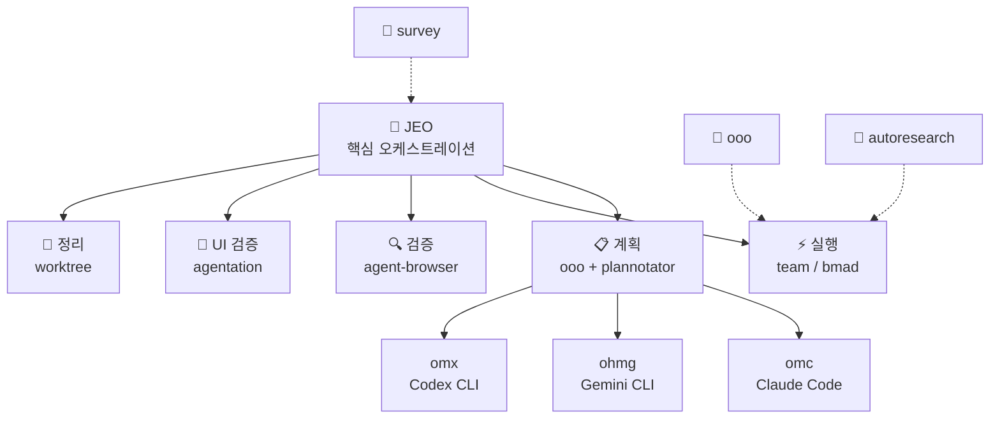

# Agent Skills

<div align="center">

[](https://github.com/akillness/oh-my-skills)
[](https://github.com/akillness/oh-my-skills)
[](LICENSE)
[](docs/bmad/README.md)
[](https://www.buymeacoffee.com/akillness3q)

**127개 로컬 스킬 폴더 · 설치 가능 스킬 127개 · TOON 포맷 · 멀티플랫폼**

[빠른 시작](#-빠른-시작) · [스킬 목록](#-스킬-목록) · [설치](#-설치) · [English](README.md)

</div>

---

## 💡 Agent Skills란?

**127개 로컬 스킬 폴더 · 설치 가능 스킬 127개 · TOON 포맷 · 멀티플랫폼**

Agent Skills는 LLM 기반 개발 워크플로우를 위한 컬렉션으로, 현재 127개 로컬 스킬 폴더와 127개 설치 가능 스킬을 제공합니다. `jeo` 오케스트레이션 프로토콜을 중심으로 구축되었으며 다음을 제공합니다:
- Claude Code, Gemini CLI, OpenAI Codex, OpenCode 전반에 걸친 통합 오케스트레이션
- 계획 → 실행 → 검증 → 정리 자동화 파이프라인
- 병렬 실행이 가능한 멀티 에이전트 팀 조율

---

## 🚀 빠른 시작

> **사전 준비**: `npx skills add` 명령을 실행하려면 먼저 `skills` CLI가 필요합니다.
>
> ```bash
> npm install -g skills
> ```

```bash
# LLM 에이전트에게 전달 — 읽고 자동으로 설치를 진행합니다
curl -s https://raw.githubusercontent.com/akillness/oh-my-skills/main/setup-all-skills-prompt.md
```

| 플랫폼 | 첫 번째 명령 |
|--------|------------|
| Claude Code | `jeo "작업 설명"` 또는 `/team "작업"` |
| Gemini CLI | `/jeo "작업 설명"` |
| Codex CLI | `/jeo "작업 설명"` |
| OpenCode | `/jeo "작업 설명"` |

---

## 🏗 아키텍처



---

## 🆕 v2026-05-04 업데이트 (mattpocock 스킬 통합)

| 변경 | 내용 |
|------|------|
| **mattpocock/skills에서 15개 신규 스킬 추가** | GitHub 스타 58k+의 Matt Pocock 엔지니어링 스킬 컬렉션을 통합했습니다. 신규 스킬: `diagnose`(체계적 6단계 디버깅), `tdd`(레드-그린-리팩터 수직 슬라이스), `grill-with-docs`(도메인 문서 연동 설계 리뷰), `triage`(이슈 상태 머신), `improve-codebase-architecture`(아키텍처 심화 기회 발굴), `to-issues`(플랜→티켓 변환), `to-prd`(PRD 생성), `zoom-out`(아키텍처 조망), `caveman`(토큰 75% 절감 압축 모드), `grill-me`(계획 스트레스 테스트), `write-a-skill`(스킬 생성 프레임워크), `git-guardrails-claude-code`(파괴적 git 명령 차단), `setup-pre-commit`(Husky/lint-staged 설정), `scaffold-exercises`(교육 구조 생성), `migrate-to-shoehorn`(타입 안전 테스트 어서션). 98 → **113개 스킬**. 출처: [mattpocock/skills](https://github.com/mattpocock/skills). |
| **obsidian: 통합 Obsidian 스킬 (v2.0)** | `obsidian-plugin`과 `obsidian-cli`를 단일 `obsidian` 스킬로 통합하고 [kepano/obsidian-skills](https://github.com/kepano/obsidian-skills) 콘텐츠를 반영했습니다. 플러그인 개발(27개 ESLint 규칙, 보일러플레이트, 접근성, 제출 검증), 데스크톱 CLI 자동화(명령, TUI, URI handoff, 개발자 모드), Obsidian 콘텐츠 패턴(markdown, Bases, JSON Canvas, Defuddle) 전부 포함. 플러그인 설치: `claude plugin marketplace add akillness/oh-my-skills`. 113 → **114개 스킬**. |

## 🆕 v2026-05-04 업데이트

| 변경 | 내용 |
|------|------|
| **agentic-skills: 프로덕션 엔지니어링 프레임워크** | Google 엔지니어링 실천법 기반의 프로덕션급 엔지니어링 스킬 `agentic-skills`를 추가했습니다. AI 코딩 에이전트를 위한 워크플로우와 품질 게이트를 체계화합니다. spec 주도 개발(`/spec`), 태스크 계획(`/plan`), 점진적 TDD(`/build`), 브라우저 검증(`/test`), 5개 축 코드 리뷰(`/review`), 동작 보존 단순화(`/code-simplify`), 체계적인 git/CI/CD 배포(`/ship`) 단계를 제공합니다. *Software Engineering at Google*(Hyrum's Law, Chesterton's Fence, Shift Left, 트렁크 기반 개발)에서 영감을 받았습니다. 플러그인 설치: `/plugin marketplace add addyosmani/agent-skills`. 95 → **96개 스킬**. |
| **open-design: 로컬 우선 디자인 아티팩트 생성** | `open-design`을 추가했습니다 — Anthropic의 Claude Design에 대한 오픈소스 대안으로, 로컬에 설치된 코딩 에이전트(Claude Code, Cursor, Gemini CLI 등)를 사용해 웹/모바일/데스크톱 프로토타입, 프레젠테이션 덱, 미디어 아티팩트를 생성합니다. 72개 내장 디자인 시스템(Linear, Stripe, Vercel, Notion, Apple 등), 5가지 비주얼 방향, 멀티 포맷 내보내기(HTML/PDF/PPTX/ZIP/Markdown), gpt-image-2·Seedance 2.0·HyperFrames를 통한 AI 미디어 생성을 지원합니다. 93개 프롬프트 템플릿 포함. 플러그인: `claude plugin marketplace add nexu-io/open-design`. 97 → **98개 스킬**. |
| **browser-harness: 자가 치유 LLM 브라우저 자동화** | `browser-harness`를 추가했습니다 — LLM 에이전트를 Chrome DevTools Protocol(CDP)로 Chrome에 직접 연결하는 자가 치유 프레임워크입니다. 에이전트가 실행 중에 `agent_helpers.py` 헬퍼 코드를 직접 작성·개선하며, 커뮤니티 도메인 스킬(사이트별 플레이북)을 활용합니다. Browser Use Cloud 연동으로 동시 브라우저 3개, 주거용 프록시, 캡차 해결을 지원합니다. 설치: Claude Code 프롬프트에 "Set up https://github.com/browser-use/browser-harness for me" 입력. 126 → **127개 스킬**. |

## 🆕 v2026-04-18 업데이트

| 변경 | 내용 |
|------|------|
| **plannotator: review-packet 구조 강화** | `plannotator`를 concrete plan·markdown spec·diff를 위한 routing-first 시각 승인 게이트로 다듬었습니다. 이제 `plan-review`, `diff-review`, `markdown-review`, `platform-setup`, `troubleshooting` 중 하나의 primary packet을 먼저 고르고, `references/intake-packets-and-route-outs.md`를 추가했으며, native-hook vs manual-review 현실을 기준으로 platform/troubleshooting 가이드를 다시 썼습니다. 또한 markdown-review와 Codex setup truthfulness 케이스를 `evals/evals.json`에 추가하고 compact/setup/manifest 문구를 함께 동기화해 discovery surface가 generic plan-only 또는 code-review 도구처럼 과장되지 않도록 맞췄습니다. |
| **skill-autoresearch: packet-first 구조 강화** | `skill-autoresearch`를 더 작은 repo-local ratcheting front door로 다듬었습니다. 이제 `ratchet-eligibility`, `benchmark-readiness`, `charter-freeze`, `baseline-score`, `one-change-mutation`, `support-sync`, `final-report`, `route-out` 중 하나의 packet을 먼저 고르고, mutation 전에 `no ratchet justified`를 허용하며, `references/run-packets-and-route-outs.md`와 확장된 `evals/evals.json`을 함께 유지합니다. 또한 repo가 `skill-autoresearch`를 generic eval platform이 아니라 markdown/git ratchet로 광고하도록 compact/manifest/setup wording도 함께 맞췄습니다. |
| **graphify: 라이브 스킬 승격 + 구조 강화** | 숨겨진 `utilities/graphify` 중첩 폴더에 있던 `graphify`를 실제 라이브 top-level 스킬 카탈로그로 승격하고, 라우팅-우선 graph front door로 다듬었습니다. `references/mode-packets-and-route-outs.md`와 `references/build-and-fallback-recipes.md`를 추가하고, `SKILL.toon`, `evals/evals.json`, README/setup/manifest surface까지 함께 동기화해 durable graph 레인이 실제로 설치·검색 가능하도록 맞췄습니다. |
| **looker-studio-bigquery: packet-first 구조 강화** | `looker-studio-bigquery`를 더 작은 리포팅 front door로 다듬었습니다. 이제 `dashboard-spec`, `slow-dashboard`, `refresh-shape`, `audience-split`, `exec-handoff` 중 하나의 packet에서 출발하고, `references/intake-packets-and-route-outs.md`를 추가했으며, Connected Sheets / exec-handoff 케이스까지 `evals/evals.json`을 넓혔습니다. 또한 BigQuery 리포팅 레인이 긴 BI 기능 투어처럼 보이지 않도록 `SKILL.toon` / `skills.toon` / `skills.json`과 README/setup 문구도 함께 동기화했습니다. |
| **web-accessibility: 라우팅 우선 구조 강화** | `web-accessibility`를 더 작은 routing-first 접근성 수정 앵커로 다듬었습니다. 이제 하나의 primary accessibility packet(`semantics-structure`, `keyboard-focus`, `labels-announcements`, `visual-perception-reflow`, `media-alternatives`, `routed-navigation-feedback`)에서 출발하고, `references/intake-packets-and-route-outs.md`를 추가했으며, routed-app / responsive-boundary 케이스까지 `evals/evals.json`을 넓혔습니다. 또한 discovery surface가 다시 generic WCAG/ARIA 튜토리얼로 흐르지 않도록 `SKILL.toon` / `skills.toon` / `skills.json`과 README/setup 문구도 함께 동기화했습니다. |
| **marketing-automation: operator-packet 강화** | `marketing-automation`를 broad marketing front door로 한 번 더 조였습니다. 이제 애매한 요청을 `launch-orchestration` / `conversion-surface` / `lifecycle-retention` / `acquisition-content` / `measurement-experiment` 중 하나의 operating mode, 하나의 primary lane, 그리고 owner·dependency/approval·proof를 담은 reusable operator packet 하나로 정리합니다. `references/operator-packet-and-proof-stack.md`를 추가하고, legal/analytics 의존성 케이스까지 `evals/evals.json`을 넓혔으며, `SKILL.toon` / manifest / README/setup discovery wording도 함께 동기화했습니다. |
| **sprint-retrospective: 구조 강화** | `sprint-retrospective`를 software, product/ops, marketing/GTM, game-delivery work 전반에서 쓰는 라우팅 우선 retrospective anchor로 다듬었습니다. 이제 하나의 retrospective mode를 고르고, 이전 액션을 새 액션보다 먼저 검토하고, action count를 작게 유지하며, planning/sizing/daily-sync 작업을 바깥으로 route-out합니다. 또한 `references/action-review-and-packet-shapes.md`, 갱신된 `evals/evals.json`, 동기화된 compact/manifest discovery wording을 추가했습니다. |
| **autoresearch: 라우팅형 구조 강화** | `autoresearch`를 더 작은 Karpathy ML 탐색 front door로 다듬었습니다. 이제 `setup readiness`, `program.md` 작성, bounded run loop, 결과 해석, constrained-hardware adaptation 중 하나의 mode를 먼저 고르고, 불변 `prepare.py` / 300초 / `val_bpb` 계약을 계속 드러내며, `references/operating-modes-and-route-outs.md`와 갱신된 `evals/evals.json`을 추가하고, 거대한 설명형 스킬이 되지 않도록 `skill-autoresearch` 및 앱 단위 eval / observability 도구로의 route-out도 더 선명하게 만들었습니다. |

## 🆕 v2026-04-20 업데이트

| 변경 | 내용 |
|------|------|
| **testing-strategies: gate-truth handoff 래칫** | `testing-strategies`를 레이어 이야기를 늘어놓기 전에 **지금 실제로 어떤 gate를 결정하는지** 먼저 밝히는 방향으로 더 다듬었습니다. 이제 `merge-gate-truth`, `release-gate-truth`, `scheduled-breadth-truth`를 먼저 이름 붙이고, `references/gate-truth-and-release-handovers.md`를 추가했으며, protected-branch / Steam 빌드 체크리스트 경계 케이스를 `evals/evals.json`에 더하고, `SKILL.toon` 및 README/setup/manifest 문구를 동기화해 PR blocker와 release-only / platform-launch proof를 다시 섞지 않게 했습니다. |
| **steam-store-launch-ops: packet-first 구조 강화** | `steam-store-launch-ops`를 더 작은 packet-first Steam launch router로 다듬었습니다. 이제 `page-promise-audit`, `wishlist-signal-check`, `demo-readiness-gate`, `event-timing-workback`, `launch-ops-runbook` 중 하나의 primary packet을 먼저 고르고, `references/intake-packets-and-route-outs.md`를 추가했으며, `evals/evals.json`에 route-out / broad-GTM 경계 케이스를 더하고, `SKILL.toon`과 README/setup/manifest 문구를 함께 동기화해 이 레인이 generic marketing이나 demo-feedback 쪽으로 흐르지 않도록 했습니다. |

## 🆕 v2026-04-17 업데이트

| 변경 | 내용 |
|------|------|
| **steam-store-launch-ops: 병목 라우터 강화** | `steam-store-launch-ops`를 인디 게임용 Steam 출시/상점 진단 라우터로 더 날카롭게 다듬었습니다. 이제 `visibility-acquisition`, `promise-clarity`, `proof-demo-readiness`, `timing-hook-fit`, `launch-ops-readiness`를 분리하고, 현재 hook(coming-soon page, wishlist anomaly, demo decision, Next Fest, launch window)을 먼저 명시한 뒤, 일반적인 마케팅 장문 대신 **하나의 intervention**과 **하나의 next artifact**를 추천합니다. 또한 `references/diagnostic-model.md`, `references/event-hooks.md`, 갱신된 `evals/evals.json`, 동기화된 `SKILL.toon`을 추가했고, 중복 게임 마케팅 스킬은 만들지 않았습니다. |

## 🆕 v2026-04-15 업데이트

| 변경 | 내용 |
|------|------|
| **game-performance-profiler: 라우팅 우선 구조 강화** | `game-performance-profiler`를 더 작은 bottleneck-first 프로파일링 프런트도어로 다듬었습니다. 새 `references/mode-selection-and-route-outs.md`와 기존 packet/device/escalation reference를 중심으로 하나의 출력 계약(`Game Performance Profiling Brief`)을 유지하고, 빌드 실패를 `game-build-log-triage`로 보내는 경계 eval도 추가했으며, quick packet·benchmark route·target-device review·의도적인 profiler escalation 중심으로 발견 문구를 다시 맞췄습니다. |
| **agent-browser: fresh-session verification 재작성** | `agent-browser`를 일반적인 브라우저 CLI 가이드에서 브라우저 검토 레인의 **fresh-session deterministic verification** 앵커로 재구성했습니다. 이제 먼저 clean browser 레인을 선택하고, observe → act → observe 루프를 기본 계약으로 삼으며, `playwriter`, `agentation`, `plannotator`로의 route-out을 명시합니다. 또한 `references/modes-and-routing.md`와 `evals/evals.json`을 추가했고, auth 재사용도 실행 중 브라우저 워크플로로 흐르지 않도록 bounded reuse로 제한합니다. |
| **agentation: UI 어노테이션 라우터 재작성** | `agentation`을 거대한 설치/설정 카탈로그에서 계획·검토 레인의 **정확한 렌더드 UI 피드백 라우터**로 재구성했습니다. 이제 copy-paste review, synced watch-loop, self-driving critique, platform-setup 모드 중 하나를 고르고, `agent-browser`, `playwriter`, `plannotator`로의 route-out을 명시합니다. 또한 `references/modes-and-routing.md`, `references/platform-setup-and-hooks.md`, `references/watch-loop-and-self-driving.md`, `evals/evals.json`을 추가했고, 저장소 상단 발견면도 **89개 스킬** 기준으로 맞췄습니다. |
| **git-submodule: 라우팅 우선 구조 강화** | `git-submodule`을 더 작은 운영 프런트도어로 다듬었습니다. 여전히 먼저 submodule vs subtree/vendoring/package delivery를 고르지만, 이제 모드별 명령 패킷은 `references/mode-packets-and-hosted-constraints.md`로 옮기고, GitHub Pages의 public-`https://` 서브모듈 제한을 다루는 hosted-platform 경계를 추가했으며, 그 경계를 검증하는 eval도 넣었습니다. 덕분에 recursive bootstrap, 포인터 업데이트, detached HEAD, CI auth, hosted checkout 제약을 계속 드러내면서도 스킬이 다시 거대한 명령 카탈로그로 불어나는 것을 막습니다. |
| **bmad-idea: 사전 기획 컨셉 라우터 재작성** | `bmad-idea`를 기존 BMAD-CIS 명령/페르소나 카탈로그에서 저장소의 사전 기획 아이디어 라우터로 재구성했습니다. 이제 초기 제품/GTM/컨설팅/게임 입력을 정규화하고, `problem framing`, `audience and value framing`, `concept shaping`, `game concept framing`, `story packaging` 중 하나를 선택해 재사용 가능한 컨셉 산출물 하나를 만들며, 다음 단계는 `bmad`, `task-planning`, `marketing-automation`, `bmad-gds`로 명확히 넘깁니다. 또한 `references/operating-modes.md`, `references/handoff-boundaries.md`, `references/concept-packet-template.md`, `evals/evals.json`을 추가했고 스킬 수는 늘리지 않았습니다. |
| **genkit: 패킷 우선 구조 강화** | `genkit`을 더 작은 routing-first 백엔드 AI 워크플로 앵커로 다듬었습니다. 이제 현재 packet(새 capability, 기존 route handler, deployed flow quality, runtime/deploy, comparison/fallback)에서 출발하고, `references/intake-packets-and-fallbacks.md`를 추가했으며, 모드 선택기에 `comparison-or-fallback`을 넣고, plain SDK / route-handler 및 durable-workflow fallback도 계속 보이게 했습니다. 또한 얇은 route 경계 케이스까지 eval 범위를 넓히고 `SKILL.toon` / `skills.toon` / `skills.json` 문구를 동기화해 discovery surface가 다시 generic full-stack AI framework 설명으로 흐르지 않게 했습니다. |
| **firebase-ai-logic: 클라이언트 통합 지원 강화** | `firebase-ai-logic`을 얇은 보조 노트에서 Firebase 레인의 **앱/클라이언트 통합 앵커**로 끌어올렸습니다. 이제 `direct feature fit`, `app wiring`, `production hardening`, `escalation boundary` 모드 중 하나를 선택하고, `references/modes-and-routing.md`, `references/production-controls.md`, `references/feature-packets.md`, `evals/evals.json`을 추가했습니다. 또한 백엔드 워크플로는 `genkit`, 운영자 작업은 `firebase-cli`로 명확히 route-out하며, 앱 SDK 작업과 백엔드 오케스트레이션을 흐리게 하던 오래된 설정/예제 안내도 제거했습니다. |

## 🆕 v2026-04-14 업데이트

| 변경 | 내용 |
|------|------|
| **npm-git-install: 패킷 우선 강화** | `npm-git-install`을 더 작은 routing-first 패키지 전달 앵커로 다듬었습니다. 이제 팀이 실제로 가진 패킷(temporary bridge, shared bridge, private-auth, artifact fallback, workspace inner loop, durable distribution)에서 출발하고, `references/intake-packets-and-route-outs.md`를 추가했으며, shared internal tooling 케이스까지 eval 범위를 넓혔습니다. 또한 `SKILL.toon` / `skills.toon` / `skills.json` 문구를 동기화해 compact discovery surface가 낡은 generic Git-install 설명으로 되돌아가지 않게 했습니다. |
| **web-design-guidelines: UI 감사 재작성** | `web-design-guidelines`를 얇은 Vercel 규칙 가져오기 스킬에서 프런트엔드 클러스터의 광범위한 인터페이스 감사 앵커로 재구성했습니다. 이제 launch-readiness, polish/consistency, flow-friction, heuristic, rule-overlay 리뷰를 다루고, hierarchy, clarity, states, responsiveness basics, accessibility basics, performance/trust signals로 결과를 분류합니다. 또한 `web-accessibility`, `responsive-design`, `ui-component-patterns`, `design-system`, `react-best-practices`로의 route-out을 추가했고, 스킬 수 증가 없이 `references/review-modes-and-categories.md`, `references/handoff-boundaries.md`, `references/ui-audit-packet-template.md`, `evals/evals.json`을 제공합니다. |
| **monitoring-observability: 패킷 우선 강화** | `monitoring-observability`를 더 작은 routing-first observability 앵커로 다듬었습니다. 이제 팀이 실제로 가진 packet(service-health, telemetry-foundation, dashboard/alert audit, data-pipeline trust, game live-ops visibility)에서 출발하고, `references/intake-packets-and-route-outs.md`를 추가했으며, review-audit 및 deployment-route-out 케이스까지 eval 범위를 넓혔습니다. 또한 `SKILL.toon` / `skills.toon` / `skills.json` 문구를 동기화해 compact discovery surface가 예전의 generic monitoring-setup 설명으로 되돌아가지 않게 했습니다. |
| **performance-optimization: 아티팩트 우선 강화** | `performance-optimization`을 팀이 실제로 들고 오는 성능 패킷 중심의 측정 우선 튜닝 앵커로 더 다듬었습니다. 이제 trace, Lighthouse/CWV 보고서, query plan, load-test diff, profiler 출력, stakeholder report 같은 현재 아티팩트에서 출발하고, `references/intake-packets-and-escalations.md`를 추가했으며, `monitoring-observability`, `debugging`, `code-refactoring`, `testing-strategies`, `game-performance-profiler`로의 route-out을 더 선명하게 했습니다. 또한 marketing/CWV·CI benchmark 케이스까지 eval 범위를 넓히고 compact/discovery 문구를 동기화해 예전의 generic optimization wording으로 되돌아가지 않게 했습니다. |
| **code-refactoring: 패킷 우선 구조 강화** | `code-refactoring`을 더 작은 routing-first cleanup 앵커로 다듬었습니다. 이제 팀이 실제로 가진 cleanup packet(local cleanup, fragile legacy area, repeated migration / codemod, cleanup-heavy diff shaping)에서 출발하고, `references/intake-packets-and-route-outs.md`를 추가했으며, search-first blast-radius route-out 케이스까지 eval 범위를 넓혔습니다. 또한 `SKILL.toon` / `skills.toon` / `skills.json`을 동기화해 compact discovery가 더 이상 낡은 DRY/SOLID design-pattern helper처럼 보이지 않게 했습니다. |
| **changelog-maintenance: 패킷 우선 강화** | `changelog-maintenance`를 더 작은 routing-first 릴리스 작성 앵커로 다듬었습니다. 이제 하나의 primary mode와 가장 작은 truthful output packet(`single-entry`, `summary-plus-links`, `migration-brief`, `patch-note-brief`, `sync-packet`)을 고르고, `references/output-packets-and-channel-handoffs.md`를 추가했으며, 릴리스 노트 + 마이그레이션 기한 + downstream sync follow-up 케이스까지 eval 범위를 넓혔습니다. 또한 compact/discovery 문구를 맞춰 스킬이 다시 generic changelog / semver 템플릿 덤프로 흐르지 않게 했습니다. |

## 🆕 v2026-04-20 업데이트

| 변경 | 내용 |
|------|------|
| **backend-testing: 패킷 우선 구조적 하드닝** | `backend-testing`를 패킷 우선 백엔드 테스트 라우터로 더 압축했습니다. 이제 `coverage-plan`, `fixture-and-reset-plan`, `contract-and-api-checks`, `flake-stabilization`, `execution-lane-split` 중 하나의 기본 패킷에서 출발하고, `references/intake-packets-and-route-outs.md`를 추가했으며, 계약 보호 케이스까지 eval 범위를 넓히고 `SKILL.toon` / README / setup / manifest 문구를 동기화해 스킬이 다시 막연한 “백엔드 테스트 좀 써줘” 만능 설명으로 흐르지 않게 했습니다. |

## 🆕 v2026-04-19 업데이트

| 변경 | 내용 |
|------|------|
| **omc: routing-first 구조적 하드닝** | `omc`를 더 작은 Claude-first 오케스트레이션 라우터로 압축했습니다. 이제 플러그인 slash skill (`/team`, `/autopilot`, `/ralph`, `/ultrawork`)과 셸 측 `omc` CLI (`omc setup`, `omc team`, `omc ask`)를 명확히 구분하고, `references/intake-packets-and-route-outs.md`를 추가했으며, plugin-vs-CLI / recovery 사례로 eval을 보강하고, `docs/omc/README.md`에서 더 이상 오래된 `/omc:*` 예시를 쓰지 않도록 갱신했습니다. 또한 README / setup / manifest discovery 문구를 새 경계에 맞춰 동기화해 OMC가 거대한 명령 카탈로그가 아니라 사실적인 런타임 라우터로 보이게 했습니다. |
| **ui-component-patterns: 구조적 하드닝** | `ui-component-patterns`를 routing-first 재사용 컴포넌트 아키텍처 스킬로 더 압축했습니다. 이제 props를 제안하기 전에 `primitive-boundary`, `slot-anatomy`, `controlled-ownership`, `alternate-root-composition`, `docs-verification` 중 하나의 기본 패킷을 선택하고, `references/intake-packets-and-route-outs.md`를 추가했으며, alternate-root 조합과 Storybook/docs 검증 경계 사례를 eval에 넣고, `SKILL.toon` / manifest / README discovery 문구를 새 트리거 표면에 맞춰 갱신했습니다. 또한 `design-system`, `web-accessibility`, `responsive-design`, `state-management`, `react-best-practices`로의 route-out을 명확히 유지해 다시 일반적인 컴포넌트 베스트 프랙티스 모음으로 흐르지 않도록 했습니다. |
| **responsive-design: 구조적 하드닝** | `responsive-design`를 CSS 예시 모음이 아니라 하나의 반응형 전략 패킷을 고르는 routing-first 스킬로 더 압축했습니다. 이제 CSS를 제안하기 전에 `page-layout`, `component-slot`, `dense-data`, `media-behavior`, `verification-reflow` 중 하나의 기본 패킷을 선택하고, 패킷 라우팅은 `references/intake-packets-and-route-outs.md`로 옮겼습니다. 또한 launch-readiness 경계 사례를 eval에 추가하고, `SKILL.toon`과 manifest/README discovery 문구를 새 트리거 표면에 맞춰 갱신했으며, `ui-component-patterns`, `web-accessibility`, `design-system`, `web-design-guidelines`로의 route-out을 명시적으로 유지해 프런트엔드 만능 스킬로 다시 비대해지지 않도록 했습니다. |
| **testing-strategies: 구조적 하드닝** | `testing-strategies`를 패킷 우선 validation-policy 라우터로 더 압축했습니다. 이제 `change-risk`, `gate-design`, `flake-cost`, `release-readiness`, `incident-ratchet` 중 하나의 정책 패킷에서 출발하고, `references/intake-packets-and-route-outs.md`를 추가했으며, release-readiness와 accessibility 경계 사례까지 eval 범위를 넓히고 `SKILL.toon` / manifest discovery 문구를 새 트리거 표면에 맞춰 갱신했습니다. 또한 `backend-testing`, `debugging`, `code-review`, `web-accessibility`, `performance-optimization`으로의 route-out을 명시적으로 유지해 다시 거대한 일반론적 테스트 매니페스토로 돌아가지 않게 했습니다. |

## 🆕 v2026-04-13 업데이트

| 변경 | 내용 |
|------|------|
| **responsive-design: 레이아웃 적응 재작성** | `responsive-design`를 긴 CSS 예시 모음에서 프론트엔드 클러스터의 모바일 우선·컨테이너 기반 레이아웃 적응 스킬로 재정의했습니다. 이제 viewport-vs-container 실패를 분류하고, breakpoint 추가보다 intrinsic layout을 우선하며, `ui-component-patterns`, `web-accessibility`, `design-system`, `web-design-guidelines`로의 명시적 route-out을 제공합니다. `references/layout-decision-checklist.md`, `references/handoff-boundaries.md`, `evals/evals.json`도 함께 추가했고 전체 스킬 수는 그대로입니다. |

## 🆕 v2026-04-12 업데이트

| 변경 | 내용 |
|------|------|
| **bmad: 패킷 우선 BMAD 라우터 보강** | `bmad`를 패킷 우선 BMAD/BMM 프런트도어로 더 좁혔습니다. 이제 아이디어 메모, PRD, 아키텍처 초안, 리뷰 피드백, 브라운필드 저장소 상태, 마일스톤 압박처럼 **이미 손에 있는 packet**에서 시작해 다음 산출물 또는 gate 하나를 고르고, review/runtime 경계를 더 일찍 드러내며, `references/intake-packets-and-route-outs.md`와 브라운필드 혼합 상태 eval 케이스를 추가해 generic phase catalog처럼 보이던 면을 줄였습니다. |
| **bmad-gds: 게임 프로듀서/오케스트레이션 재작성** | `bmad-gds`를 단순 단계 목록에서 실제 게임 제작 조정 스킬로 재정의했습니다. 이제 아이디어, GDD, 플레이테스트 메모, 버그/빌드 이슈, 출시 목표가 섞인 입력을 받아 하나의 운영 모드를 선택하고, 다음 마일스톤 중심 조정 브리프를 만든 뒤 필요하면 `game-demo-feedback-triage`, `game-build-log-triage`, `game-performance-profiler`, `steam-store-launch-ops`, `task-planning`, `bmad-idea`로 명시적으로 라우팅합니다. `references/operating-modes.md`, `references/scope-boundaries.md`, `evals/evals.json`도 추가했고 전체 스킬 수는 그대로입니다. |

## 🆕 v2026-04-08 업데이트

| 변경 | 내용 |
|------|------|
| **graphify: 저장소/코퍼스 지식 그래프 스킬** | 저장소나 혼합 코퍼스를 `GRAPH_REPORT.md`, `graph.json`, HTML 시각화로 변환하는 전용 `graphify` 스킬을 추가했습니다. 테스트된 Python API 기반 파이프라인, 그래프 질의, graph-backed architecture 탐색, assistant 설치 플로우를 다루며 `references/overview.md`와 `evals/evals.json`도 함께 포함합니다. 84 → **85개** |
| **llm-wiki: 영속적 LLM 관리형 마크다운 위키 스킬** | 원시 소스를 시간이 지날수록 축적되는 Obsidian 또는 git 기반 지식 베이스로 바꾸는 전용 `llm-wiki` 스킬을 추가했습니다. `raw/`, `wiki/`, `index.md`, `log.md`, `AGENTS.md` 로 vault를 부트스트랩하고, bootstrap, Scrapling 기반 URL ingest, query filing, lint용 헬퍼 스크립트를 포함합니다. 스키마, ingest, filing, scaling 규칙은 별도 reference 문서로 분리했고, `evals/`와 `skill-autoresearch-llm-wiki/` baseline, changelog, results, dashboard 산출물도 함께 포함합니다. 82 → **83개** |
| **rtk: Rust Token Killer 설치 및 운영 스킬** | Claude Code, Codex, Gemini CLI, Cursor, Copilot, Windsurf, Cline, OpenCode 전반에서 Rust Token Killer를 설치·검증·초기화하는 전용 `rtk` 스킬을 추가했습니다. `rtk gain` 검증을 시작점으로 두고, 잘못 설치된 동명 패키지 충돌을 복구하며, install/init/status 래퍼 스크립트와 플랫폼별 참고 문서로 흐름을 분리했습니다. `evals/`와 `skill-autoresearch-rtk/` baseline, changelog, results, dashboard 산출물도 함께 포함합니다. 81 → **82개** |

## 🆕 v2026-03-30 업데이트

| 변경 | 내용 |
|------|------|
| **harness: 에이전트 팀 & 스킬 아키텍트 메타스킬** | 도메인 전용 에이전트 팀을 설계하고 스킬을 생성하는 전용 `harness` 스킬을 추가했습니다. 도메인 분석, 아키텍처 패턴 선택(pipeline, fan-out/fan-in, expert pool, producer-reviewer, supervisor, hierarchical delegation), `.claude/agents/`·`.claude/skills/` 파일 생성, 오케스트레이션 워크플로우 정의, 트리거 eval·드라이런 검증을 포함합니다. `install.sh`, `validate-harness.sh` 스크립트와 참고 문서 5개도 포함됩니다. 80 → **81개** |

## 🆕 v2026-03-28 업데이트

| 변경 | 내용 |
|------|------|
| **obsidian-cli: 라우팅-우선 Obsidian 데스크톱 자동화** | `obsidian-cli`를 공식 Obsidian 데스크톱 자동화용 라우팅-우선 프런트도어로 하드닝했습니다. 먼저 CLI 단일 명령/TUI 모드, 개발자 명령 모드, 공식 `obsidian://` URI handoff를 구분하고, `vault=` + `path=` 중심의 결정적 타기팅을 권장하며, headless sync·단순 파일쓰기·더 풍부한 plugin/API 자동화는 억지로 CLI에 우겨넣지 않고 명시적으로 route-out 하도록 정리했습니다. 설치/문제해결 가이드와 intake/route-out 참고 문서도 함께 갱신했습니다. |
| **scrapling: 라우팅 우선 적응형 웹 스크래핑 스킬** | 전용 `scrapling` 스킬을 추가한 뒤, 가장 가벼운 모드부터 고르게 하도록 하드닝했습니다: parser-only HTML, HTTP fetch, JS 렌더 브라우저 fetch, 보호 대상용 stealth, CLI/MCP 운영 경로, 그리고 전체 crawl용 spiders. install/extract/MCP 래퍼 스크립트와 fetcher·parser·CLI/MCP·spider·intake packet route-out 참고 문서를 함께 제공합니다. 78 → **79개** |
| **strix: AI 기반 애플리케이션 보안 테스트 스킬** | Strix CLI를 실무적으로 운영하는 전용 `strix` 스킬 추가. 설치 및 Docker 프리플라이트, `STRIX_LLM` 공급자 설정, 로컬/GitHub/라이브 타깃 스캔, quick/standard/deep 모드 선택, 헤드리스 CI/CD 사용, 그리고 이 저장소의 스킬과 Strix 내부 보안 스킬의 차이까지 포함합니다. 77 → **78개** |

## 🆕 v2026-03-22 업데이트

| 변경 | 내용 |
|------|------|
| **bmad-orchestrator → bmad 리네임** | `bmad-orchestrator` 스킬 폴더가 `bmad`로 리네임되었습니다. 핵심 BMAD 워크플로우 오케스트레이션(분석 → 계획 → 솔루션 → 구현)으로 단순화. 키워드 `bmad`는 동일하게 사용 가능합니다. |
| **copilot-coding-agent 제거** | `copilot-coding-agent` 스킬 제거. 총 77개 스킬. |

## 🆕 v2026-03-19 업데이트

| 변경 | 내용 |
|------|------|
| **clawteam: ClawTeam 런타임 운영 라우터** | `clawteam`을 packet-first ClawTeam 런타임 스킬로 더 좁혔습니다. 명령을 늘어놓기 전에 `manual-team`, `template-launch`, `monitor-recover`, `profile-setup` 중 하나의 운영 패킷을 먼저 고르고, tmux/worktree 런타임 현실을 숨기지 않으며, 일반 오케스트레이션이나 보드 거버넌스 요청은 바깥으로 라우팅합니다. |
| **obsidian-plugin: Obsidian 플러그인 개발 스킬** | Obsidian 플러그인 빌드, 검증, 커뮤니티 디렉토리 제출. `eslint-plugin-obsidianmd` 27개 규칙 전체 커버, 대화형 보일러플레이트 생성기(`create-plugin.js`), 메모리 관리, 타입 안전성, 접근성(MANDATORY), CSS 변수, Vault API, 제출 검증. 75 → **76개** |
| **jeo v1.6.0: `.jeo` 계획 ledger 플로우** | JEO가 이제 프로젝트 로컬 `.jeo/` 폴더를 만들고 장기계획(`long-term.md`), 단기계획(`short-term.md`), 예정 작업(`planned.md`), 진행상황(`progress.md`), 이력(`history.md`), queued/active 작업 파일을 함께 관리합니다. 완료된 작업 파일은 history에 요약한 뒤 제거하고, follow-up 작업은 workflow를 초기화하지 않고 계속 추가할 수 있습니다. |
| **skill-autoresearch: eval 기반 스킬 최적화** | 기존 `SKILL.md` 를 바이너리 eval, mutation loop, baseline scoring, dashboard/changelog 산출물로 반복 개선하는 신규 스킬. 기존 ML용 `autoresearch` 와는 별도 용도입니다. 76 → **77개** |
| **firebase-cli: Firebase 플랫폼 운영 앵커 강화** | `firebase-cli`를 install/auth, bootstrap/config, Emulator Suite, scoped deploy/release, admin/data 작업을 고르는 라우팅형 Firebase 운영 앵커로 재구성했습니다. 라우팅·부트스트랩·에뮬레이터/릴리스·관리 작업 참고 문서를 추가하고, eval/compact 문구를 갱신했으며, npm 설치 경로의 Node.js 기준도 현재 `firebase-tools` 요구사항에 맞게 바로잡았습니다. |
| **google-workspace, langsmith, react-grab 추가** | 3개 신규 스킬: Google Workspace REST API 자동화, LangSmith LLM 관측성/평가, react-grab React 엘리먼트 컨텍스트 캡처. 71 → **74개** |
| **research-paper-writing: ML/CV/NLP 논문 작성 스킬** | Abstract, Introduction, Method, Experiments뿐 아니라 figure/table 지원, reviewer response, camera-ready 수정까지 다루는 학술 논문·리버틀 워크플로우. 주장-증거 정합성, 섹션 계획, reviewer-risk 점검 중심. Prof. Peng Sida 노트 기반 + 저장소 지원 보강. 70 → **71개** |
| **ai-tool-compliance 및 llm-monitoring-dashboard 제거** | `ai-tool-compliance` (내부 컴플라이언스 자동화) 및 `llm-monitoring-dashboard` 제거. 72 → **70개** |
| **에이전트 개발 스킬 일부 제거** | `agent-configuration`, `agent-evaluation`, `agentic-development-principles`, `agentic-principles`, `agentic-workflow` 제거. 80 → **72개** |
| **이미지/미디어 스킬 일부 제거** | `image-generation`, `image-generation-mcp`, `pollinations-ai` 제거. 미디어는 `video-production`을 기본 프로그래머블 비디오 스킬로 사용하고, `remotion-video-production`은 명시적 Remotion 이름용 호환 별칭으로 유지 |
| **autoresearch: Karpathy 자율 ML 실험 스킬** | 사람이 `program.md`를 쓰고 에이전트가 `train.py`를 수정하며, 5분 GPU 실행과 `val_bpb` keep/revert ratcheting으로 실제 ML 탐색을 돌립니다. 프롬프트/앱 eval 작업은 `skill-autoresearch`나 별도 eval 플랫폼으로 라우팅하고, `scripts/`, `references/`, `evals/`를 포함합니다. |
| **jeo v1.2.3: plannotator-plan-loop.sh 전 플랫폼 강화** | 크로스 플랫폼 임시 디렉토리, 전용 포트 `PLANNOTATOR_PORT=47291`, `probe_plannotator_port()` + `wait_for_listen()`, 브라우저 강제종료 시 최대 3회 자동 재시작, 구조화 `jeo-blocked.json` 출력 |
| **survey: 아티팩트 검증기 강화** | `survey`를 더 작은 아티팩트 계약 중심 조사 앵커로 다듬고, 장황한 출력 템플릿은 별도 reference로 옮겼으며, `scripts/validate_survey_artifacts.py`를 추가해 `.survey/{slug}/` 폴더를 계획/구현 전에 기계적으로 검증할 수 있게 했습니다. 플랫폼 비교는 계속 `settings/rules/hooks`로 정규화하고, hooks는 같은 이식형 검증기를 감싸는 선택적 래퍼로 취급합니다. |
| **presentation-builder: 패킷 우선 덱 핸드오프 강화** | `presentation-builder`를 더 작은 라우팅 우선 덱 아티팩트 앵커로 다듬었습니다. 이제 하나의 덱 모드, 하나의 최소 아티팩트 패킷(`outline-brief`, `storyboard`, `review-ready-html`, `export-handoff`, `sync-packet`), 그리고 하나의 정직한 마지막 전달 표면(HTML 뷰어, PPTX, PDF, Google Slides, Figma Slides)을 먼저 고르고, `references/artifact-packets-and-last-mile-handoffs.md`와 함께 실제 덱 제작 흐름에 맞게 동작합니다. |

---

## 📦 설치

### 0단계: `skills` CLI 설치

```bash
npm install -g skills
skills --version
```

### LLM 에이전트용

```bash
curl -s https://raw.githubusercontent.com/akillness/oh-my-skills/main/setup-all-skills-prompt.md
```

### 플랫폼별 선택

#### Claude Code

```bash
npx skills add https://github.com/akillness/oh-my-skills \
  --skill jeo --skill omc --skill plannotator --skill agentation \
  --skill ooo --skill vibe-kanban
```

#### Gemini CLI

```bash
npx skills add https://github.com/akillness/oh-my-skills \
  --skill jeo --skill ohmg --skill ooo --skill vibe-kanban
gemini extensions install https://github.com/akillness/oh-my-skills
```

#### Codex CLI

```bash
npx skills add https://github.com/akillness/oh-my-skills \
  --skill jeo --skill omx --skill ooo
```

#### 플랫폼별 추가 설정

```bash
# Claude Code — jeo 훅 설정
bash ~/.agent-skills/jeo/scripts/setup-claude.sh

# Gemini CLI — jeo 훅 설정
bash ~/.agent-skills/jeo/scripts/setup-gemini.sh

# oh-my-claudecode
/plugin marketplace add https://github.com/Yeachan-Heo/oh-my-claudecode
/plugin install oh-my-claudecode
setup omc
```

---

## 📚 스킬 목록

> 전체 매니페스트: `.agent-skills/skills.json` · 각 폴더의 `SKILL.md` · 107개 로컬 스킬 폴더 = 총 98개 설치 가능 스킬

### 🎯 핵심 오케스트레이션 (11개)

| 스킬 | 키워드 | 플랫폼 | 설명 |
|------|--------|--------|------|
| `jeo` | `jeo`, `annotate` | 전체 | `.jeo` ledger 기반 packet-first 오케스트레이션: 계획 게이트 → 런타임 handoff → 검증 → 정리 |
| `omc` | `omc`, `autopilot`, `ralph`, `ulw`, `ccg`, `/team`, `omc team`, `omc ask`, `cancelomc` | Claude | oh-my-claudecode용 Claude-first 오케스트레이션 라우터 — 먼저 marketplace plugin / 셸 CLI / 로컬 `--plugin-dir` 토폴로지를 식별하고, plugin slash skill과 `omc` 셸 CLI를 구분하며, 중복 설치·recovery·state 문제를 다루고, 인접 작업은 `jeo`, `ralphmode`, `omx`, `ohmg`, 브라우저 검토 스킬로 route-out합니다 |
| `harness` | `harness`, `build a harness` | 전체 | 메타스킬: 도메인 전용 에이전트 팀 설계, `.claude/agents/`·`.claude/skills/` 생성, harness 검증 |
| `omx` | `omx`, `$plan`, `$ralph`, `$team`, `$deep-interview`, `$ralplan` | Codex | Codex CLI용 멀티에이전트 워크플로우 레이어 (v0.11.10) — 30+ 에이전트, 35+ 스킬, tmux 팀 런타임, omx explore/sparkshell |
| `ohmg` | `ohmg`, `oh-my-agent`, `oma`, `.agents` | Gemini | 휴대형 `oh-my-agent` 하네스용 Gemini / Antigravity 진입 스킬 (`.agents` 소스 오브 트루스, Gemini 네이티브 투영, 크로스벤더 확장 가능) |
| `ooo` | `ooo`, `ouroboros`, `ooo ralph` | 전체 | Ouroboros 스펙 우선 개발 루프 — 소크라테스식 인터뷰, 불변 seed/spec, 드리프트 인식 실행, 검증 통과까지 이어가는 완료 루프. 플러그인: `claude plugin marketplace add Q00/ouroboros` |
| `bmad` | `bmad`, `workflow-init`, `workflow-status` | 전체 | 패킷 우선 BMAD/BMM 프런트도어 — 현재 packet을 분류하고 다음 산출물 또는 gate를 고른 뒤 review / runtime / 실행 세부 작업을 바깥으로 라우팅 |
| `bmad-gds` | `bmad-gds` | 전체 | 게임 제작 오케스트레이터 — 아이디어, GDD, 플레이테스트 메모, 버그, 출시 목표를 다음 마일스톤 산출물로 정리 |
| `bmad-idea` | `bmad-idea` | 전체 | 사전 기획 아이디어 라우터 — 거친 제품/GTM/컨설팅/게임 아이디어를 하나의 컨셉 산출물과 다음 핸드오프로 정리 |
| `survey` | `survey` | 전체 | 재사용 가능한 `.survey/{slug}/` 결과물과 검증기 기반 아티팩트 계약 체크를 남기는 bounded 사전 구현 문제공간 스캔 |

### 📋 계획 및 검토 (13개)

| 스킬 | 키워드 | 설명 |
|------|--------|------|
| `plannotator` | `plan` | 에이전트 계획/diff용 시각적 승인 게이트 — 주석, 승인, 수정 요청, 검토 결과 저장 |
| `agentation` | `annotate` | 정확한 렌더드 UI 피드백 라우터 — copy-paste review, watch-loop sync, self-driving critique, platform setup 선택 |
| `agent-browser` | `agent-browser` | fresh-session 브라우저 검증 앵커 — clean disposable browser, snapshot refs, 명시적 before/after evidence |
| `browser-harness` | `browser-harness` | 자가 치유 LLM 브라우저 자동화 — CDP로 Chrome 직접 연결, `agent_helpers.py` 에이전트 편집, 도메인 스킬, Browser Use Cloud 연동 |
| `playwriter` | `playwriter` | 인증된 Chrome 세션과 MCP 재사용을 위한 실행 중 브라우저 자동화 |
| `vibe-kanban` | `kanbanview` | 바운드된 코딩 카드, 트래커 연동 워크스페이스, 검토 큐, worktree 격리, PR 핸드오프를 다루는 코딩 보드 제어면 |
| `triage` | `triage` | 이슈 상태 머신: needs-triage → needs-info → ready-for-agent / ready-for-human / wontfix | All |
| `to-issues` | `to-issues` | 계획/스펙을 독립적으로 실행 가능한 수직 슬라이스 이슈로 변환 (HITL/AFK 분류) | All |
| `to-prd` | `to-prd` | 대화 컨텍스트로 구조화된 PRD 생성 — 문제 설명, 사용자 스토리, 모듈, 테스트 결정 | All |
| `grill-me` | `grill-me` | 체계적인 1문1답 질문으로 계획의 모든 결정 트리를 탐색하는 스트레스 테스트 | All |
| `grill-with-docs` | `grill-with-docs` | 도메인 모델 대비 계획 검증, 용어 정제, CONTEXT.md/ADR 인라인 업데이트 | All |
| `improve-codebase-architecture` | `improve-codebase-architecture` | 삭제 테스트·심(Seam)·지역성 어휘를 사용해 얕은 모듈을 깊은 모듈로 개선하는 기회 발굴 | All |
| `zoom-out` | `zoom-out` | 도메인 어휘로 관련 모듈, 호출자 관계, 의존성을 매핑하는 상위 아키텍처 관점 제공 | All |

### 🤖 에이전트 개발 (2개)

| 스킬 | 설명 | 플랫폼 |
|------|------|--------|
| `prompt-repetition` | 비추론/경량 LLM에서 프롬프트 반복을 언제 써야 하는지 판단하는 스킬 — 긴 컨텍스트 검색, 선택지 우선 MCQ, 위치/인덱스 조회, 그리고 retrieval·강한 모델로의 route-out 포함 | 전체 |
| `skill-standardization` | SKILL.md 검증/재작성, 중복 canonical화, 그리고 repo-root 검증 흐름 + 파생 발견면(`skills.json`, README/setup, `SKILL.toon`) 동기화 | 전체 |

### ⚙️ 백엔드 (5개)

| 스킬 | 설명 | 플랫폼 |
|------|------|--------|
| `api-design` | 계약 중심 REST/GraphQL API 설계, 호환성 검토, 후속 핸드오프 | 전체 |
| `api-documentation` | 레퍼런스 포털·퀵스타트·SDK/웹훅 가이드·검증된 예시·인증/에러 안내를 다루는 개발자용 API 문서 앵커 | 전체 |
| `authentication-setup` | hosted/framework-native/platform-native 인증 선택, 세션/JWT 경계, 조직 데이터, 엔터프라이즈 SSO 핸드오프를 다루는 제품 인증 설정 라우터 | 전체 |
| `backend-testing` | 커버리지 계획, fixture/reset 전략, 계약/API 보호, flaky-suite 안정화, 로컬-vs-CI lane 분리를 다루는 패킷 우선 백엔드 테스트 스킬 | 전체 |
| `database-schema-design` | 관계형·문서형·하이브리드 스키마, queryable-vs-flexible 필드 판단, 단계적 스키마 변경, 그리고 API/인증/테스트/리포팅 인접 스킬 route-out을 다루는 패킷형 스토리지 모델 설계 | 전체 |

### 🎨 프론트엔드 (12개)

| 스킬 | 설명 | 플랫폼 |
|------|------|--------|
| `design-system` | 디자인 토큰 거버넌스, 비주얼 언어 규칙, 프리미티브 네이밍, 교차 화면 시스템 방향을 맡는 기본 프론트엔드 UI 시스템 앵커이며, 컴포넌트 API·반응형 레이아웃·접근성 수정·광범위한 UI 평가는 인접 스킬로 route-out합니다 | 전체 |
| `frontend-design-system` | 레거시 툴링이나 정확한 이름 의존 워크플로를 위한 `design-system` 호환 별칭 | 전체 |
| `stitch-skills` | Stitch MCP 에이전트 스킬 — 고품질 UI 화면 생성, 멀티페이지 웹사이트, DESIGN.md 문서화, 프롬프트 향상, React/shadcn-ui 변환, Remotion 동영상 생성. 플러그인: `claude plugin marketplace add google-labs-code/stitch-skills` | 전체 |
| `compresso` | 무료 오프라인 데스크톱 동영상/이미지 압축 (Tauri+React) — 배치 압축, 동영상 트리밍/분할, 포맷 변환, 자막 삽입, 메타데이터 관리. FFmpeg/pngquant/jpegoptim/gifski 사용. 플러그인: `claude plugin marketplace add codeforreal1/compressO` | 전체 |
| `open-design` | 로컬 우선 오픈소스 디자인 도구 — 설치된 코딩 에이전트를 사용해 프로토타입·덱·미디어 아티팩트를 생성합니다. 72개 내장 디자인 시스템, 5가지 비주얼 방향, 멀티 포맷 내보내기(HTML/PDF/PPTX/ZIP). 플러그인: `claude plugin marketplace add nexu-io/open-design` | 전체 |
| `pretext` | DOM 리플로우 없는 빠르고 정확한 멀티라인 텍스트 측정/레이아웃 — `prepare`/`layout`(높이), `prepareWithSegments`/`layoutWithLines`(라인별), 이모지/CJK/RTL 지원, DOM·Canvas·SVG 출력. npm: `@chenglou/pretext` | 전체 |
| `react-best-practices` | waterfall, 번들 크기, RSC/클라이언트 경계, hydration, rerender churn, 느린 라우트를 측정 기반으로 진단하는 React & Next.js 성능 스킬 | 전체 |
| `react-grab` | 브라우저 UI 엘리먼트에서 React 컴포넌트명·파일경로·HTML을 클립보드로 복사해 AI 에이전트에 전달 | 전체 |
| `vercel-react-best-practices` | 레거시 툴링이나 정확한 이름 의존 워크플로를 위한 `react-best-practices` 호환 별칭 | Claude · Gemini · Codex |
| `responsive-design` | page-shell, component-slot, dense-data, media, reflow 검증 패킷을 위한 routing-first 반응형 레이아웃 전략 | 전체 |
| `state-management` | local·Context·URL/폼·클라이언트 스토어·서버 상태/라우터 데이터 계층을 가르는 React/fullstack 소유권 패킷 결정 | 전체 |
| `ui-component-patterns` | `primitive-boundary`, `slot-anatomy`, `controlled-ownership`, `alternate-root`, `docs-verification` 패킷을 고르는 routing-first 재사용 컴포넌트 아키텍처 | 전체 |
| `web-accessibility` | semantics, keyboard/focus, labels/announcements, reflow, media alternatives, routed-app feedback를 다루는 routing-first 접근성 수정·검증 스킬 | 전체 |
| `web-design-guidelines` | hierarchy, clarity, consistency, state, responsiveness/accessibility basics를 보는 broad 웹 UI 감사 | 전체 |

### 🔍 코드 품질 (9개)

| 스킬 | 설명 | 플랫폼 |
|------|------|--------|
| `agentic-skills` | Google 엔지니어링 실천법 기반 프로덕션 엔지니어링 프레임워크 — spec 주도 개발, 점진적 구현, TDD, 보안 강화, 성능 최적화, 체계적인 git/CI/CD 워크플로우를 `/spec` `/plan` `/build` `/test` `/review` `/code-simplify` `/ship` 단계로 제공. 플러그인: `/plugin marketplace add addyosmani/agent-skills` | 전체 |
| `code-refactoring` | 동작 보존 중심 구조 정리, 분해, 중복 제거, codemod 계획 | 전체 |
| `code-review` | 심각도·증거 공백 점검·route-out을 포함한 evidence-first diff / PR 리뷰 | 전체 |
| `debugging` | 구체적인 버그·회귀·flaky 실패·환경별 이상 동작을 위한 routing-first 진단 스킬; raw log는 `log-analysis`, 순수 성능 작업은 `performance-optimization`으로 라우팅 | 전체 |
| `performance-optimization` | trace·보고서·query plan 같은 현재 아티팩트에서 출발해 지연시간·처리량·메모리·번들·CWV·프레임 예산 병목을 측정 중심으로 분석하고 튜닝 | 전체 |
| `testing-strategies` | merge-gate truth, release-only proof, scheduled breadth, cross-domain handoff를 다루는 패킷 우선 검증 정책 | 전체 |
| `diagnose` | 체계적 6단계 디버깅: 피드백 루프 구축 → 재현 → 가설 → 계측 → 수정+테스트 → 정리. Phase 1(빠른 피드백 루프) 투자 우선 | All |
| `tdd` | 레드-그린-리팩터 TDD (수직 슬라이스) — 공개 인터페이스를 통한 행동 검증, 구현 세부사항 테스트 금지 | All |
| `migrate-to-shoehorn` | TypeScript 테스트의 `as` 어서션을 `fromPartial()`, `fromAny()`, `fromExact()`로 타입 안전하게 교체. 테스트 코드 전용. | All |

### 🏗 인프라 (14개)

| 스킬 | 설명 | 플랫폼 |
|------|------|--------|
| `deployment-automation` | 프리뷰 릴리즈, 스테이징/프로덕션 승격, 롤아웃 전략, 배포 후 검증, 롤백 대응, 릴리즈 하드닝을 다루는 릴리즈 실행 앵커이며, CI 작성은 `workflow-automation`, 머신 설정은 `system-environment-setup`, Vercel 전용 운영은 `vercel-deploy`로 라우팅 | 전체 |
| `environment-setup` | `.env` 구조, env 우선순위, 검증, 시크릿 전달을 다루는 앱 구성 호환 스킬이며, 더 넓은 실행 환경 설정은 `system-environment-setup`으로 라우팅 | 전체 |
| `firebase-ai-logic` | Firebase 앱/클라이언트 SDK에서 Gemini 기능, 스트리밍, 구조화 출력, App Check 연동을 다루는 직접 통합 레인이며, 백엔드 오케스트레이션은 `genkit`으로 라우팅 | Claude · Gemini |
| `firebase-cli` | install/auth, bootstrap/config, Emulator Suite, scoped deploy/release, App Hosting, admin/data 작업을 담당하는 Firebase 플랫폼 운영 앵커. 백엔드 AI 워크플로 오케스트레이션은 `genkit`, 앱 SDK 통합은 `firebase-ai-logic`으로 라우팅 | 전체 |
| `genkit` | 기능이 재사용 가능한 서버 소유 flow, Genkit eval/trace, 혹은 plain SDK route / `survey` fallback 중 무엇이 필요한지 결정하는 packet-first 백엔드 AI 워크플로 앵커이며, 직접 앱 SDK 작업은 `firebase-ai-logic`, Firebase 운영 작업은 `firebase-cli`로 라우팅 | Claude · Gemini |
| `looker-studio-bigquery` | `dashboard-spec`, `slow-dashboard`, `refresh-shape`, `audience-split`, `exec-handoff` 패킷으로 라우팅하는 BigQuery 기반 리포팅 레인이며, KPI 해석은 `data-analysis`로 라우팅 | 전체 |
| `monitoring-observability` | 서비스 헬스, 텔레메트리 롤아웃, alert/dashboard 감사, 파이프라인 신뢰, live-ops 가시성을 위한 packet-first 텔레메트리 설계/리뷰 | 전체 |
| `scrapling` | 한 개의 intake packet으로 parser-only, HTTP fetch, JS 브라우저, stealth escalation, MCP, spiders 중 가장 가벼운 경로를 고르는 라우팅 우선 적응형 웹 스크래핑 | 전체 |
| `rtk` | Rust Token Killer 설치 및 에이전트 설정 - `rtk gain` 검증, 동명 패키지 충돌 복구, 에이전트별 `rtk init`, 직접 호출용 압축 래퍼 명령 | 전체 |
| `security-best-practices` | 브라우저 정책·쿠키/CSRF·abuse control·검증·시크릿 중 빠진 보안 계층을 먼저 분류한 뒤 하나의 강화 brief로 정리하는 라우팅 중심 웹/앱/API 보안 강화 | 전체 |
| `strix` | Strix CLI 기반 AI 애플리케이션 보안 테스트 - Docker 프리플라이트, LLM 공급자 설정, 로컬/GitHub/라이브 타깃 스캔, 모드 선택, CI/CD 사용 | 전체 |
| `system-environment-setup` | 실행 가능한 저장소, 툴체인, Docker/devcontainer, 로컬 서비스, 온보딩, 설정 드리프트 진단을 다루는 정식 환경 설정 스킬 | 전체 |
| `vercel-deploy` | linked-project 기준 프리뷰/프로덕션 배포, staged promote 흐름, alias/domain, 환경변수 범위 수정, 롤백 대응을 다루는 Vercel 전용 운영 스킬 | 전체 |
| `zeude` | Claude Code 엔터프라이즈 AI 도입 플랫폼 — OpenTelemetry 측정, Zeude Shim을 통한 스킬/MCP/훅 중앙 동기화, 컨텍스트 인식 스킬 제안으로 3배 도입률 향상. Supabase + ClickHouse 필요 | Claude |

### 📝 문서화 (5개)

| 스킬 | 설명 | 플랫폼 |
|------|------|--------|
| `changelog-maintenance` | changelog·release notes·migration update·lightweight patch-note 패킷을 다루는 routing-first 릴리스 히스토리 앵커 | 전체 |
| `presentation-builder` | 투자/로드맵/런치/아키텍처 데모/워크숍/게임 피치 덱을 위한 패킷 우선 덱 아티팩트 앵커로, HTML 리뷰와 PPTX/PDF/Google Slides/Figma Slides 마지막 전달을 정직하게 다룸 | 전체 |
| `research-paper-writing` | ML/CV/NLP 학술 논문 + 리버틀 워크플로우 — abstract/introduction/method/experiments, figure-table 지원, 주장-증거 정합성, reviewer response, camera-ready revision | 전체 |
| `technical-writing` | 스펙, 아키텍처 문서, ADR, 런북, 마이그레이션 가이드, 개발자용 구현 문서를 다루는 내부 기술 문서 앵커 | 전체 |
| `user-guide-writing` | 온보딩 가이드, 튜토리얼, 작업형 how-to, FAQ, 헬프센터 업데이트, 출시 후 도움말 refresh packet까지 고르는 mode-selecting 사용자 문서 앵커 | 전체 |

### 📊 프로젝트 관리 (4개)

| 스킬 | 설명 | 플랫폼 |
|------|------|--------|
| `sprint-retrospective` | 스프린트 회고, 마일스톤 포스트모템, 원격/하이브리드 진행, 죽은 액션아이템 복구를 담당하는 라우팅 우선 회고 앵커 | 전체 |
| `standup-meeting` | 일일/비동기/하이브리드/더 가벼운 주기/반복 스탠드업 없음 중 무엇이 맞는지 먼저 판단한 뒤 스탠드업 모드를 고르는 라우팅 우선 조정-주기 앵커 | 전체 |
| `task-estimation` | software, GTM, game work 전반에서 스토리 포인트, T셔츠 사이징, split/spike 판단, 예측 안전형 불확실성 프레이밍을 담은 estimate packet anchor | 전체 |
| `task-planning` | software, GTM, game work 전반에서 backlog cleanup, feature slicing, sprint/milestone prep, release packet을 다루고 estimation/board/review/사전 프레이밍으로의 route-out을 명시하는 packet-first planning anchor | 전체 |

### 🔭 검색 및 분석 (7개)

| 스킬 | 설명 | 플랫폼 |
|------|------|--------|
| `autoresearch` | Karpathy 자율 ML 탐색 front door — setup / `program.md` / bounded loop / 결과 해석 / constrained-hardware mode 중 하나를 고르고, 불변 `prepare.py` + 300초 + `val_bpb` 계약을 지키며, 프롬프트/스킬 eval은 별도 라우팅 | 전체 |
| `skill-autoresearch` | 하나의 packet(ratchet-eligibility/ready/charter/baseline/mutation/support-sync/final report)을 먼저 고르고, `no ratchet justified`도 허용한 뒤 eval을 고정하고 점수로 keep/revert를 결정하며, hosted eval / ML autoresearch 작업은 바깥으로 라우팅하는 repo-local 스킬 ratcheting 루프 | 전체 |
| `codebase-search` | 디버깅/리팩터링으로 넘어가기 전에 정의/참조, config·콘텐츠 소유면, 엔트리포인트, 영향 범위를 찾도록 한 가지 검색 packet을 고르는 라우팅형 리포 탐색 | 전체 |
| `data-analysis` | 내보내기 데이터, 실험, 텔레메트리, KPI 설명을 위한 의사결정 중심 데이터 분석 | 전체 |
| `langsmith` | SDK 코드로 곧장 가지 않고 trace-debug, 평가, 리뷰 큐, 프롬프트 레지스트리, 멀티서비스 전파 중 한 packet을 먼저 고르는 라우팅형 LangSmith 스킬 | 전체 |
| `log-analysis` | 앱·컨테이너/파드·브라우저+API·CI cascade·JSON/event·security-signal 로그 중 한 가지 evidence packet을 먼저 고른 뒤 디버깅/옵저버빌리티 작업으로 넘기는 routing-first 로그 트리아지 | 전체 |
| `pattern-detection` | text-prefilter·structural-code-rule·log-event-pattern·metric-anomaly 중 한 packet을 먼저 고르는 라우팅형 패턴/이상 탐지 | 전체 |

### 🎬 창의 미디어 (4개)

| 스킬 | 설명 | 플랫폼 |
|------|------|--------|
| `remotion-video-production` | 레거시 툴링이나 명시적 Remotion 이름이 남아 있을 때 `video-production`으로 연결하는 호환 별칭 | 전체 |
| `video-production` | Remotion, 템플릿 API, 콘텐츠 리퍼포징, QA 핸드오프를 묶는 기본 프로그래머블/자동화 비디오 스킬 | 전체 |
| `god-tibo-imagen` | Codex ChatGPT 백엔드를 통한 AI 이미지 생성 — 의존성 없음, `~/.codex/auth.json` 재사용, CLI(`gti`), Node.js, Python SDK 지원 | 전체 |
| `notebooklm` | Claude Code에서 Google NotebookLM 노트북을 직접 조회 — Patchright 브라우저 자동화로 출처 기반 인용 답변, 영구 Google 인증, 노트북 라이브러리 관리 지원 | Claude Code |

### 📢 마케팅 (2개)

| 스킬 | 설명 | 플랫폼 |
|------|------|--------|
| `marketing-automation` | 대표 broad marketing front door — launch/conversion/lifecycle/acquisition-content/measurement 중 하나의 operating mode와 하나의 primary lane, owner·dependency/approval·proof를 담은 reusable operator packet 하나를 고르는 마케팅 라우터 | 전체 |
| `marketing-skills-collection` | 레거시 프롬프트팩/카탈로그용 `marketing-automation` 호환 별칭 | 전체 |

### 🎮 게임 개발 (5개)

| 스킬 | 설명 | 플랫폼 |
|------|------|--------|
| `game-build-log-triage` | Unity/Unreal 빌드, cook, package, editor, signing, CI 로그에서 첫 번째 실행 가능한 실패를 분리하는 전문 triage | 전체 |
| `game-ci-cd-pipeline` | 게임 파이프라인 packet 라우터 — 먼저 branch-gate / nightly-package-candidate / release-certification lane을 구분한 뒤 setup, stage split, cache 정책, preflight 점검, artifact/release hygiene, CI 신뢰도 강화를 고름 | 전체 |
| `game-demo-feedback-triage` | 플레이테스트/데모/커뮤니티 피드백을 가중치 테마와 fix-first 우선순위로 정리 | 전체 |
| `game-performance-profiler` | Unity/Unreal frame-time 트리아지 — bottleneck-first profiling brief, quick packet, benchmark route, target-device 검토, profiler escalation | 전체 |
| `steam-store-launch-ops` | Packet-first Steam launch router — page-promise audit, wishlist signal check, demo readiness, event timing workback, launch-ops runbook 중 하나를 고름 | 전체 |

### 🔧 유틸리티 (16개)

| 스킬 | 설명 | 플랫폼 |
|------|------|--------|
| `fabric` | AI 프롬프트 패턴 — YouTube 요약, 문서 분석 (200+ 패턴) | 전체 |
| `file-organization` | feature/shared/route/package 경계를 고르고 네이밍 규칙과 마이그레이션 단계를 정하는 결정-우선 저장소 구조 스킬 | 전체 |
| `git-submodule` | Git 서브모듈 관리 | 전체 |
| `git-workflow` | 로컬 Git 브랜치, 커밋, 리베이스, 충돌 해결, 안전한 푸시, 복구 워크플로우 | 전체 |
| `google-workspace` | Google Workspace REST API 자동화 — Docs, Sheets, Slides, Drive, Gmail, Calendar, Chat, Forms, Admin SDK, Apps Script | 전체 |
| `llm-wiki` | Obsidian 또는 git 기반 vault를 위한 영속적 마크다운 위키 운영 — raw sources, source summary, query filing, lint, 선택적 Scrapling/qmd 연동 | 전체 |
| `npm-git-install` | npm / pnpm / Yarn / Bun용 라우팅-우선 Node 패키지 전달 스킬 — temporary Git bridge, SHA pin, tarball, workspace, publish-first handoff를 안전하게 선택 | 전체 |
| `obsidian` | **통합 Obsidian 스킬 (v2.0)** — 플러그인 개발(27개 ESLint 규칙, 보일러플레이트, 제출) + CLI 자동화(명령, TUI, URI handoff, 개발자 모드) + 콘텐츠 패턴(markdown, Bases, JSON Canvas). 플러그인: `claude plugin marketplace add akillness/oh-my-skills` | 전체 |
| `obsidian-cli` | *(alias → `obsidian`)* Obsidian 데스크톱 자동화 — 공식 CLI, `obsidian://` handoff, 개발자 명령 | 전체 |
| `obsidian-plugin` | *(alias → `obsidian`)* Obsidian 플러그인 개발 — 27개 ESLint 규칙, 보일러플레이트 생성기, 제출 검증 | 전체 |
| `opencontext` | 라우팅-우선 프로젝트/저장소 메모리 스킬 — memory-layer choice, load-context, search-context, store-conclusions, setup-integration, repo-packer route-out 중 하나를 골라 manifest / stable link / 에이전트 핸드오프 패킷을 다루고, 메모가 겹칠 때는 최고 신뢰 소스와 freshness 경고를 고릅니다 | 전체 |
| `workflow-automation` | 라우팅-우선 저장소 워크플로우 자동화 — task-entrypoints, bootstrap/onboarding, 로컬 CI 패리티, hook 가드레일, 유지보수 봇, 워크플로우 정리 중 하나를 고르고 환경/배포 문제로 번지지 않게 유지 | 전체 |
| `caveman` | 토큰 75% 절감 압축 통신 모드. 활성화: "caveman mode", "less tokens". 비활성화: "stop caveman" | All |
| `write-a-skill` | 에이전트 스킬 생성 프레임워크: 요구사항 수집 → SKILL.md 초안 → 검토. description 필드가 활성화 핵심. | All |
| `git-guardrails-claude-code` | Claude Code PreToolUse 훅으로 파괴적 git 명령(force push, reset --hard 등) 차단 | Claude |
| `setup-pre-commit` | Husky + lint-staged + Prettier 커밋 전 품질 검사 자동화 설정 | All |
| `scaffold-exercises` | pnpm ai-hero-cli lint를 통과하는 교육용 연습문제 디렉터리 구조 생성 | All |

---

## 🧬 TOON 포맷 주입

TOON(Token-Oriented Object Notation)은 스킬 카탈로그를 압축하여 모든 프롬프트에 자동 주입합니다. **JSON/Markdown 대비 40-50% 토큰 절감**.

| 플랫폼 | 파일 | 메커니즘 |
|--------|------|---------|
| Claude Code | `~/.claude/hooks/toon-inject.mjs` | `UserPromptSubmit` 훅 — 26-37ms |
| Gemini CLI | `~/.gemini/hooks/toon-skill-inject.sh` | `includeDirectories` 세션 로드 |
| Codex CLI | `~/.codex/skills-toon-catalog.toon` | 정적 카탈로그 |

- **Tier 1** (항상): 스킬 카탈로그 인덱스 (~875-3,500 토큰) — 이름 + 설명 + 태그
- **Tier 2** (온디맨드): 개별 SKILL.toon 전체 내용 (~292 토큰/스킬, 최대 3개)

---

## 🔮 주요 도구

### jeo — 통합 에이전트 오케스트레이션
> 키워드: `jeo` · `annotate` | 플랫폼: Claude · Codex · Gemini · OpenCode

JEO는 packet-first 오케스트레이션 프런트도어입니다. 올바른 JEO packet을 고르고, `.jeo` ledger 진실을 유지하고, 런타임/검증 작업을 실제 소유 스킬로 넘기는 것이 핵심입니다.

JEO는 plan gate, runtime handoff, 검증 요구사항, submit-gated UI review, cleanup, 재개 가능한 `.jeo` / machine state라는 공통 계약을 유지하고, 전문 작업은 sibling skill로 route-out합니다.

| Packet / 단계 | 소유자 | 설명 |
|---------------|--------|------|
| Bootstrap / Resume | JEO scripts + `.jeo/` | durable ledger와 machine state를 초기화하거나 복구 |
| Plan / Planning | `ooo` + `plannotator` | 동일 plan을 불필요하게 다시 열지 않고 계획을 승인받기 |
| Runtime handoff / Execute | `omc` / `omx` / `ohmg` / 필요한 경우 `bmad` fallback | 런타임별 설정과 실행은 해당 runtime skill이 담당 |
| Verify / QA | `agent-browser` | 완료 주장 전에 브라우저 / QA 근거를 기록 |
| Verify UI / annotate | `agentation` | 명시적 submit 이후에만 UI 피드백 처리 |
| Cleanup | JEO scripts + `worktree-cleanup.sh` | 요약, follow-up queue, worktree 정리 |

### plannotator — 시각적 계획 검토
> 키워드: `plan` | [문서](docs/plannotator/README.md) | [GitHub](https://github.com/backnotprop/plannotator)

AI 계획을 브라우저 UI에서 어노테이션. 클릭 한 번으로 승인 또는 구조화된 피드백 전송. Claude Code, OpenCode, Gemini CLI, Codex CLI 지원.

```bash
bash scripts/install.sh --all
```

### ooo — Ouroboros 스펙 우선 개발
> 키워드: `ooo`, `ouroboros`, `ooo ralph` | [문서](docs/ooo/README.md) | [GitHub](https://github.com/Q00/ouroboros)

소크라테스식 인터뷰 → 불변 seed/spec 고정 → 그 계약을 기준으로 실행 → 완료 주장 전에 검증 → 실제로 검증될 때까지 반복합니다. Claude Code 플러그인 또는 pip으로 설치 가능합니다.

```bash
# 플러그인 설치 (Claude Code)
claude plugin marketplace add Q00/ouroboros

# pip 설치
pip install ouroboros-ai[all]

# 스킬 설치 (모든 플랫폼)
npx skills add https://github.com/akillness/oh-my-skills --skill ooo

# 사용법
ouroboros init start "작업 관리 CLI를 만들고 싶어요"
ouroboros run workflow seed.yaml
ouroboros run resume
ouroboros tui monitor
```

### god-tibo-imagen — Codex 백엔드를 활용한 AI 이미지 생성
> 키워드: `god-tibo-imagen`, `gti`, `image generation`, `codex image` | [문서](docs/god-tibo-imagen/README.md) | [GitHub](https://github.com/NomaDamas/god-tibo-imagen)

의존성 없는 AI 이미지 생성 도구. Codex ChatGPT 백엔드를 활용하며, 기존 `~/.codex/auth.json` 인증을 재사용합니다. CLI(`gti`), Node.js 라이브러리, Python SDK를 지원하며 참조 이미지 입력도 가능합니다.

```bash
# 플러그인 설치 (Claude Code)
claude plugin marketplace add NomaDamas/god-tibo-imagen

# npm 설치 (CLI)
npm install -g god-tibo-imagen

# Python SDK
pip install god-tibo-imagen

# 스킬 설치
npx skills add https://github.com/akillness/oh-my-skills --skill god-tibo-imagen

# 사용법
gti --prompt "파란색 사각형 아이콘" --output ./icon.png
gti --prompt "둥글게 만들어줘" --input ./ref.png --output ./out.png
```

### notebooklm — Claude Code용 Google NotebookLM 통합
> 키워드: `notebooklm`, `notebook query`, `google notebooklm` | [문서](docs/notebooklm/README.md) | [GitHub](https://github.com/PleasePrompto/notebooklm-skill)

Patchright 브라우저 자동화를 통해 Claude Code에서 직접 Google NotebookLM 노트북을 조회합니다. 에디터를 벗어나지 않고 업로드된 문서로부터 출처 기반, 인용 포함 답변을 받을 수 있습니다. **로컬 Claude Code 전용** (웹 UI 미지원).

```bash
# 플러그인 설치 (Claude Code)
claude plugin marketplace add PleasePrompto/notebooklm-skill

# 수동 클론
git clone https://github.com/PleasePrompto/notebooklm-skill.git ~/.claude/skills/notebooklm

# 스킬 설치
npx skills add https://github.com/akillness/oh-my-skills --skill notebooklm

# 최초 설정 (Google 로그인을 위해 Chrome 창이 열립니다)
python scripts/run.py auth_manager.py setup

# 노트북 추가 및 질문
python scripts/run.py notebook_manager.py add --url "https://notebooklm.google.com/notebook/ID" --name "my-research"
python scripts/run.py ask_question.py --question "주요 발견 사항은 무엇인가요?"
```

### pretext — 빠른 멀티라인 텍스트 측정 & 레이아웃
> 키워드: `pretext`, `text measurement`, `text layout`, `paragraph height` | [문서](docs/pretext/README.md) | [GitHub](https://github.com/chenglou/pretext)

DOM 리플로우 없는 순수 JS/TS 텍스트 측정 및 레이아웃 라이브러리. 문단 높이 계산, 라인별 레이아웃, 이모지·CJK·RTL 지원, DOM·Canvas·SVG 출력 — 캐시된 폰트 메트릭 기반 순수 연산.

```bash
# 플러그인 설치 (Claude Code)
claude plugin marketplace add chenglou/pretext

# npm 설치
npm install @chenglou/pretext

# oh-my-skills에서 설치
npx skills add https://github.com/akillness/oh-my-skills --skill pretext
```

### zeude — Claude Code 엔터프라이즈 AI 도입 플랫폼
> 키워드: `zeude`, `ai adoption`, `claude code adoption`, `enterprise claude` | [문서](docs/zeude/README.md) | [GitHub](https://github.com/zep-us/zeude)

Claude Code의 Intention-Action Gap을 해결하는 엔터프라이즈 플랫폼. OpenTelemetry 측정, Zeude Shim을 통한 스킬/MCP/훅 중앙 동기화, 프롬프트 시점 스킬 제안으로 3배 도입률 향상(6%→18%). Supabase + ClickHouse 필요.

```bash
# 플러그인 설치 (Claude Code)
claude plugin marketplace add zep-us/zeude

# 자체 호스팅 설치
git clone https://github.com/zep-us/zeude.git
cd zeude && cp .env.example .env
# Supabase, ClickHouse 환경변수 설정

# 스킬 설치
npx skills add https://github.com/akillness/oh-my-skills --skill zeude

# 개발자별 Shim 설치 (대시보드에서 agent key 발급 후)
curl -fsSL https://raw.githubusercontent.com/zep-us/zeude/main/install.sh | bash -s -- --key <AGENT_KEY>
```

### compresso — 오프라인 배치 동영상/이미지 압축
> 키워드: `compresso`, `compress video`, `batch compression` | [문서](docs/compresso/README.md) | [GitHub](https://github.com/codeforreal1/compressO)

무료 오픈소스 오프라인 데스크톱 압축 앱 (Tauri+React). 동영상/이미지 배치 압축, 트리밍/분할, 포맷 변환, 자막 삽입, 메타데이터 관리 — FFmpeg/pngquant/jpegoptim/gifski 기반, 네트워크 없이 완전 로컬 처리.

```bash
# 플러그인 설치 (Claude Code)
claude plugin marketplace add codeforreal1/compressO

# macOS Homebrew
brew install --cask codeforreal1/tap/compresso

# oh-my-skills에서 설치
npx skills add https://github.com/akillness/oh-my-skills --skill compresso
```

### stitch-skills — Stitch MCP 에이전트 스킬
> 키워드: `stitch`, `stitch-design`, `stitch-loop`, `enhance-prompt` | [문서](docs/stitch-skills/README.md) | [GitHub](https://github.com/google-labs-code/stitch-skills)

Stitch MCP 서버를 통한 AI 기반 UI 디자인 생성, 프롬프트 정제, 화면-코드 변환 워크플로우. 고품질 화면, 멀티페이지 웹사이트, DESIGN.md 문서, React/shadcn-ui 컴포넌트, Remotion 동영상 생성을 지원합니다.

```bash
# 플러그인 설치 (Claude Code)
claude plugin marketplace add google-labs-code/stitch-skills

# 스킬 설치 (모든 플랫폼)
npx skills add google-labs-code/stitch-skills --skill stitch-design --global
npx skills add google-labs-code/stitch-skills --skill enhance-prompt --global

# oh-my-skills에서 설치
npx skills add https://github.com/akillness/oh-my-skills --skill stitch-skills
```

### open-design — 로컬 우선 디자인 아티팩트 생성
> 키워드: `open-design`, `local design tool`, `prototype generation` | [GitHub](https://github.com/nexu-io/open-design)

Anthropic의 Claude Design에 대한 오픈소스 대안. 로컬에 설치된 코딩 에이전트를 사용해 웹/모바일/데스크톱 프로토타입, 프레젠테이션 덱, 미디어 아티팩트를 생성합니다. 72개 내장 디자인 시스템, 5가지 비주얼 방향, 93개 미디어 프롬프트 템플릿, 멀티 포맷 내보내기를 지원합니다.

```bash
# 플러그인 설치 (Claude Code)
claude plugin marketplace add nexu-io/open-design

# 로컬에서 직접 실행
git clone https://github.com/nexu-io/open-design.git
cd open-design && corepack enable && pnpm install
pnpm tools-dev run web

# oh-my-skills에서 설치
npx skills add https://github.com/akillness/oh-my-skills --skill open-design
```

### vibe-kanban — AI 에이전트 칸반 보드
> 키워드: `kanbanview` | [문서](docs/vibe-kanban/README.md) | [GitHub](https://github.com/BloopAI/vibe-kanban)

바운드된 코딩 카드를 위한 코딩 보드 제어면: 필요하면 GitHub Projects·Linear·Jira를 PM 원본으로 유지한 채, 실제 코딩 실행은 격리된 워크스페이스/worktree에서 돌리고, 사람 검토를 명시적으로 거쳐 PR로 넘기는 흐름을 관리합니다.

```bash
npx vibe-kanban
```

---

## 🌐 추천 Harness OSS

| 저장소 | 스타 | 설명 |
|-------|-----:|------|
| [AutoGPT](https://github.com/Significant-Gravitas/AutoGPT) | 182k | 지속적 에이전트를 위한 접근성 높은 AI 플랫폼 |
| [AutoGen](https://github.com/microsoft/autogen) | 55.4k | Microsoft 멀티에이전트 대화 프레임워크 |
| [CrewAI](https://github.com/crewAIInc/crewAI) | 45.7k | 역할 기반 자율 AI 에이전트 오케스트레이션 |
| [smolagents](https://github.com/huggingface/smolagents) | 25.9k | HuggingFace 코드 사고 경량 에이전트 라이브러리 |
| [agency-agents](https://github.com/msitarzewski/agency-agents) | 21.2k | 9개 부서의 61개 특화 AI 에이전트 |
| [revfactory/harness](https://github.com/revfactory/harness) | meta-skill | 에이전트 팀 · 스킬 하네스 설계 플러그인 |

> 설치 및 연동 가이드 → [docs/harness/README.ko.md](docs/harness/README.ko.md) · 패키징된 스킬 → [.agent-skills/harness/SKILL.md](.agent-skills/harness/SKILL.md)

---

## 📁 구조

```text
.
├── .agent-skills/          ← 107개 스킬 폴더 (각각 SKILL.md + SKILL.toon)
├── docs/                   ← 상세 가이드 (bmad, omc, plannotator, ooo, ...)
├── install.sh
├── setup-all-skills-prompt.md
├── README.md               ← English
└── README.ko.md            ← 한국어 (이 파일)
```

---

## 📖 관련 문서

| 도구 | 키워드 | 문서 |
|------|--------|------|
| `jeo` | `jeo`, `annotate` | [.agent-skills/jeo/SKILL.md](.agent-skills/jeo/SKILL.md) |
| `plannotator` | `plan` | [docs/plannotator/README.md](docs/plannotator/README.md) |
| `vibe-kanban` | `kanbanview` | [docs/vibe-kanban/README.md](docs/vibe-kanban/README.md) |
| `ooo` | `ooo`, `ouroboros` | [docs/ooo/README.md](docs/ooo/README.md) |
| `stitch-skills` | `stitch`, `stitch-design`, `enhance-prompt` | [docs/stitch-skills/README.md](docs/stitch-skills/README.md) |
| `compresso` | `compresso`, `compress video`, `batch compression` | [docs/compresso/README.md](docs/compresso/README.md) |
| `open-design` | `open-design`, `local design tool`, `prototype generation` | [.agent-skills/open-design/SKILL.md](.agent-skills/open-design/SKILL.md) |
| `pretext` | `pretext`, `text measurement`, `text layout` | [docs/pretext/README.md](docs/pretext/README.md) |
| `god-tibo-imagen` | `god-tibo-imagen`, `gti`, `image generation` | [docs/god-tibo-imagen/README.md](docs/god-tibo-imagen/README.md) |
| `notebooklm` | `notebooklm`, `notebook query`, `google notebooklm` | [docs/notebooklm/README.md](docs/notebooklm/README.md) |
| `zeude` | `zeude`, `ai adoption`, `enterprise claude` | [docs/zeude/README.md](docs/zeude/README.md) |
| `harness` | `harness` | [.agent-skills/harness/SKILL.md](.agent-skills/harness/SKILL.md) |
| `omc` | `omc` | [docs/omc/README.md](docs/omc/README.md) |
| `bmad` | `bmad` | [docs/bmad/README.md](docs/bmad/README.md) |
| Harness OSS | — | [docs/harness/README.ko.md](docs/harness/README.ko.md) |

---

## 📎 참고 자료

| 컴포넌트 | 출처 | 라이선스 |
|----------|------|---------|
| `jeo` | Internal | MIT |
| `omc` | [Yeachan-Heo/oh-my-claudecode](https://github.com/Yeachan-Heo/oh-my-claudecode) | MIT |
| `ooo` | [Q00/ouroboros v0.29.0](https://github.com/Q00/ouroboros/tree/v0.29.0) | MIT |
| `stitch-skills` | [google-labs-code/stitch-skills](https://github.com/google-labs-code/stitch-skills) | Apache-2.0 |
| `compresso` | [codeforreal1/compressO](https://github.com/codeforreal1/compressO) | AGPL-3.0 |
| `open-design` | [nexu-io/open-design](https://github.com/nexu-io/open-design) | MIT |
| `pretext` | [chenglou/pretext](https://github.com/chenglou/pretext) | MIT |
| `god-tibo-imagen` | [NomaDamas/god-tibo-imagen](https://github.com/NomaDamas/god-tibo-imagen) | MIT |
| `notebooklm` | [PleasePrompto/notebooklm-skill](https://github.com/PleasePrompto/notebooklm-skill) | MIT |
| `zeude` | [zep-us/zeude](https://github.com/zep-us/zeude) | Apache-2.0 |
| `plannotator` | [plannotator.ai](https://plannotator.ai) | MIT |
| `bmad` | [bmad-dev/BMAD-METHOD](https://github.com/bmad-dev/BMAD-METHOD) | MIT |
| `agentation` | [benjitaylor/agentation](https://github.com/benjitaylor/agentation) | MIT |
| `fabric` | [danielmiessler/fabric](https://github.com/danielmiessler/fabric) | MIT |
| `harness` | [revfactory/harness](https://github.com/revfactory/harness) | Apache-2.0 |
| `obsidian-cli` | [Obsidian CLI Help](https://obsidian.md/help/cli) | Proprietary |
| `llm-wiki` | [karpathy/llm-wiki gist](https://gist.github.com/karpathy/442a6bf555914893e9891c11519de94f) | — |
| `graphify` | [safishamsi/graphify](https://github.com/safishamsi/graphify) | MIT |
| `scrapling` | [D4Vinci/Scrapling](https://github.com/D4Vinci/Scrapling) | BSD-3-Clause |
| `harness` | [revfactory/harness](https://github.com/revfactory/harness) | Apache-2.0 |
| `strix` | [usestrix/strix](https://github.com/usestrix/strix) | Apache-2.0 |
| `autoresearch` | Andrej Karpathy methodology | — |
| `research-paper-writing` | [Master-cai/Research-Paper-Writing-Skills](https://github.com/Master-cai/Research-Paper-Writing-Skills) | — |
| Agent Skills Spec | [agentskills.io](https://agentskills.io/specification) | — |

---

<div align="center">

[](https://www.buymeacoffee.com/akillness3q)

⭐ 도움이 됐다면 저장소에 스타를 눌러주세요!

```bash
gh api --silent --method PUT /user/starred/akillness/oh-my-skills >/dev/null 2>&1 || true
```

</div>
