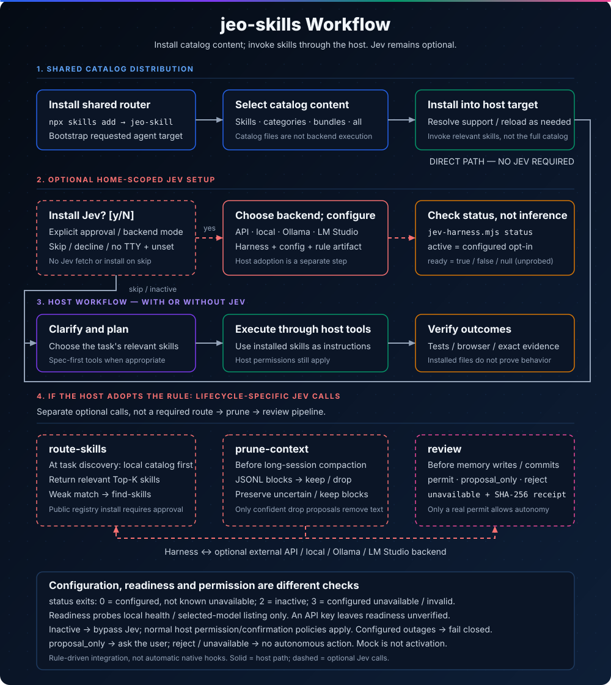
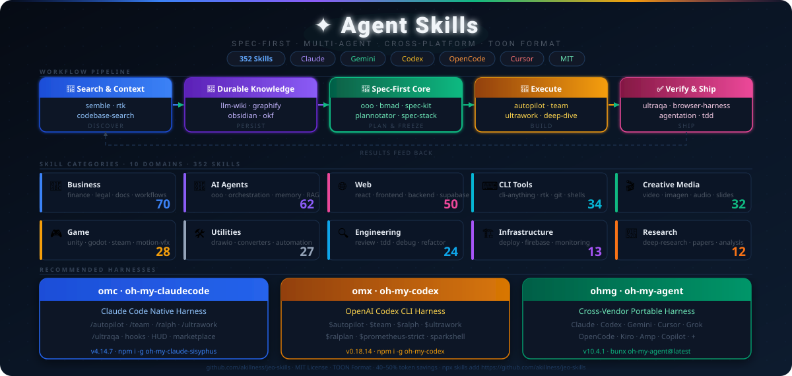

# Agent Skills

<div align="center">

[](https://github.com/akillness/jeo-skills)
[](https://github.com/akillness/jeo-skills)
[](LICENSE)
[](https://github.com/akillness/gajae-code)
[](https://github.com/akillness/jeo-code)
[](https://www.buymeacoffee.com/akillness3q)

**카테고리형 스킬 354개 · 경량 선택 설치 · 압축 TOON 카탈로그 · 멀티플랫폼**

스펙 우선 멀티 에이전트 LLM 워크플로우 컬렉션입니다. 프롬프트 하나로 전체 설정을
위임하거나, `jeo-skill` 라우터부터 설치해 필요한 웹, 인프라, 게임, 미디어, CLI,
유틸리티 스킬만 선택적으로 추가할 수 있습니다.

[빠른 시작](#-설치) · [스킬 목록](#-스킬-목록) · [English](README.md)

</div>

---

## 💡 Agent Skills란?

각 스킬은 `.agent-skills/<name>/SKILL.md` 경로로 그대로 검색됩니다. 카테고리,
하위 분류, 인터페이스, 번들, 연관 관계는 `.agent-skills/skills.json` 한 곳에서
관리하므로 중복 래퍼 폴더를 만들거나 런타임 경로를 옮기지 않아도 됩니다.
## 🎮 Jeo 에이전트와 전설의 장비 세트

`jeo-skills`는 `@../jeo-code` 스펙 우선 Socratic AI 코딩 에이전트인 **Jeo**(`jeo`)의 전설적인 장비 세트 역할을 합니다. 각 핵심 스킬은 복잡한 코드베이스를 안전하고 효율적으로 정복할 수 있도록 Jeo에게 강력한 도구를 장착해 줍니다.

| 장비명 | 아이콘 | 핵심 스킬 / 훅 | Jeo를 위한 역할 |
| :--- | :--- | :--- | :--- |
| **현자의 로브 (Robe of Clarity)** | <br>로브 | [`ooo`](.agent-skills/ooo/SKILL.md) / `jeo deep-interview` | **Socratic Ambiguity Gate**: Socratic 질문 루프를 통해 코딩 전에 요구사항을 완벽히 결정합니다. |
| **철벽의 갑옷 (Armor of Lock)** | <br>갑옷 | [`ooo`](.agent-skills/ooo/SKILL.md) / `MutationGuard` | **Secure Codebase Mutation Guard**: 인터뷰 진행 중에는 코드 수정을 철저히 차단하여 안전을 보장합니다. |
| **신속의 장화 (Boots of Swiftness)** | <br>신발 | [`cli-anything`](.agent-skills/cli-anything/SKILL.md) / `jeo team` | **Bounded Executor**: 에이전트 전용 CLI 하네스를 통해 실제 소프트웨어를 신속하고 정확하게 구동합니다. |
| **설계의 지팡이 (Staff of Planning)** | <br>지팡이 | [`spec-kit`](.agent-skills/spec-kit/SKILL.md) / `jeo ralplan` | **Critiqued Planning Blueprint**: 동결된 seed로부터 아키텍처 방향성과 세부 구현 계획을 수립합니다. |
| **검증의 양탄자 (Carpet of Verification)** | <br>양탄자 | [`ooo`](.agent-skills/ooo/SKILL.md) / `jeo ultragoal` | **Durable Checkpoint Verification**: 코드베이스 위를 날아다니며 `--json` 결과를 분석해 완벽한 구현을 검증합니다. |

*위 애니메이션 아이템들은 `god-tibo-imagen`(Codex ChatGPT 백엔드)을 이용해 이미지를 생성하고 `PIL`로 애니메이션을 합성하여 제작되었습니다.*

---

## 🏗 워크플로우 및 아키텍처




### Jev 컨트롤 플레인 (선택적 System One 통합)

Jev는 기본 카탈로그 설치에 포함되지 않는 별도의 홈 범위 선택 기능이며, 전체 설치에서도 동일합니다. 소스와 상세 안내는 [`jev/`](jev/README.md)에 있습니다. 표준 `jev/jev-setup.sh`가 선택한 백엔드, 하네스, 호스트 규칙을 구성합니다. 규칙 파일 배치는 네이티브 훅 설치나 런타임 강제 적용의 증거가 아닙니다. 호스트가 규칙을 로드하고 따라야 합니다.

| 단계 | 커맨드 | 역할 |
| :--- | :--- | :--- |
| 스킬 라우팅 | `route-skills "<task>"` | 백엔드가 카탈로그 분류를 선택하고 로컬 점수로 읽기 전용 `skills.json`의 Top-K 스킬 반환 |
| 컨텍스트 프루닝 | `prune-context` | JSONL `{id,text}` 블록 → keep/drop 판정 |
| 액션 게이트 | `review "<task>" '<proposal>'` | `permit` / `proposal_only` / `reject` / `unavailable` + SHA-256 영수증 |

발견은 **로컬 카탈로그**(`route-skills` / `jeo-skill`)에서 시작합니다. 로컬 매치가 약하면 `publicRegistryFallback`으로 `find-skills`의 **공개 skills.sh 레지스트리** 탐색을 안내합니다. 후보를 검토하고 명시적인 승인을 받은 뒤 설치하세요. 하네스 자체는 공개 스킬을 검색하거나 설치하지 않습니다.

자격 증명, 다운로드, 서버 실행에 동의한 경우에만 `api`, `local`, `ollama`, `lmstudio`를 선택하세요. `skip`은 기존 Jev 상태를 보존하며, TTY 없이 선택값이 없으면 설정 스크립트 다운로드 없이 건너뜁니다. 프로젝트 카탈로그 설치는 글로벌 Jev를 구성하지 않습니다. `status`는 설정된 선택 상태와 제한적인 백엔드 준비 상태를 구분합니다. API 키 존재만으로 호스팅 인증이나 정상 동작을 증명하지 않습니다. 설정된 백엔드 장애는 리뷰 우회가 아닌 fail-closed 처리 대상입니다. `--mock`은 오프라인 계약 검증용이며 실제 동작을 승인하지 않습니다. 설정, 종료 코드, 검증 범위는 [`jev/README.md`](jev/README.md)를 참조하세요.

### Jevgrep (선택적 원격 소스 탐색)

[Jevgrep](.agent-skills/jevgrep/SKILL.md)는 Jev 컨트롤 플레인 하네스와 별개인 `jg` CLI입니다. 기본 경로는 로컬 카탈로그 메타데이터, 네이티브 정확 검색/LSP, zvec-grep 워크스페이스 검색, 그래프 관계용 Graphify `query` / `path` / `explain`입니다. 명시적으로 선택한 스킬 문서, 위키 Markdown, 그래프 소스 문서를 텍스트로 검색할 수 있지만 그래프 바이너리를 탐색하거나 소스를 수정하거나 그래프를 재생성하지 않습니다.

범위를 좁힌 공개 문서 루트로 Jevgrep 호출 없이 실행 계획을 미리 확인합니다.

```bash
jeo-skill explore "Which document explains checkpoint ownership?" --root /path/to/jeo-skills/docs --dry-run
# 쿼리·소스 업로드·비용을 별도로 승인하고, jg와 저장된 자격 증명이 이미 구성된 경우에만:
jeo-skill explore "Which document explains checkpoint ownership?" --root /path/to/jeo-skills/docs --allow-remote
```

원격 실행은 쿼리와 검색 대상 소스 내용을 설정된 제공자에게 전송하며 비용이 발생할 수 있습니다. 저장된 자격 증명은 전송 동의가 아닙니다. 일괄 설정은 Jevgrep을 설치하거나 인증하지 않습니다. 고정 버전 설치와 제한은 [수동 선택 가이드](setup-all-skills-prompt.md#jevgrep-optional-remote-source-discovery)를 참조하세요. Dry-run은 실행하지 않는 계획이며 로컬 `jg files -- ROOT`는 파일명이나 개인정보 보호 인증이 아닌 개수만 반환합니다. 어느 쪽도 실제 제공자의 검색 품질을 증명하지 않으며, 여기서는 해당 검색을 실행하지 않았습니다.


---

## 📦 설치

### ✨ 권장: LLM 위임 설치(프롬프트 하나로 모든 플랫폼 지원)

설정 프롬프트를 코딩 에이전트(Claude Code, Codex, Gemini CLI 등)에게 전달하세요. 에이전트가 가이드를 읽고 OS를 감지한 뒤 `skills` CLI를 설치하고, 각 에이전트의 올바른 경로에 모든 스킬을 추가하며, 명시된 공유 MCP/셸 도구를 등록합니다. 선택적 Jev·Jevgrep 런타임 설정은 별도 승인이 필요합니다.

```bash
# 위임 가이드를 가져와 에이전트에게 전달
curl -s https://raw.githubusercontent.com/akillness/jeo-skills/main/setup-all-skills-prompt.md
```

또는 에이전트 채팅에 다음 문장을 그대로 붙여 넣으세요.

> Read https://raw.githubusercontent.com/akillness/jeo-skills/main/setup-all-skills-prompt.md in full and follow it to install the jeo-skills.

에이전트는 기본적으로 **전체 설치**를 실행합니다. 범위를 줄이려면 “core only” 또는 “minimal”이라고 요청하세요. 에이전트가 수행하는 작업은 다음과 같습니다.

- macOS / Linux / Windows를 감지하고 `brew` / `snap` / `winget`과 올바른 설치 경로를 선택합니다.
- `skills@1.7.0` CLI를 설치하고 universal 공유 루트(`~/.agents/skills`)에 스킬을 추가하며, jeopi, jeo-code, oh-my-pi, Claude Code, Codex, Gemini CLI, OpenCode가 자동으로 감지하고 로드합니다.
- **GJC는 native 투영이 필요**하므로 `~/.gjc/agent/skills`(글로벌) 또는 `.gjc/skills`(프로젝트)에 스킬을 추가하며, 설정 가이드가 자동으로 처리합니다.
- **Antigravity IDE와 CLI는 native 투영이 필요**합니다. `skills@1.7.0`이 `--agent` 플래그를 무시하고 공유 루트에 설치하므로, 설정 가이드 Step 4C를 참조하세요.
- MCP 도구(`ooo`, `semble`), 셸 도구(`rtk`), 플랫폼별 통합을 등록합니다.
- 기존 스킬을 보존하며 추가 또는 업데이트만 수행하고 삭제하지 않습니다.

모든 카탈로그 모드에서 Jev는 선택 사항입니다. 기본 설정은 Jev 모델을 다운로드하거나 Jev 규칙/훅을 설치하지 않습니다. 루트 설치 프로그램은 대화형 홈 범위 세션에서만 기본값이 ‘아니요’인 질문을 표시하며, 위임 가이드는 명시적으로 승인된 선택이 있을 때만 Jev 설정을 실행합니다.
> [!NOTE]
> 카탈로그 포함 항목: **`scrapingant-web-fetch`** 는 호스팅 MCP fetch 도구를 제공해
> Cloudflare/봇 차단과 JS 전용 페이지를 처리하고 LLM이 바로 쓸 수 있는 Markdown을
> 반환하며, 로컬 브라우저가 필요 없습니다. 사용자 본인의 API 키가 필요하므로 설정
> 가이드는 명시적으로 요청할 때만 구성합니다. 자세한 내용:
> [`.agent-skills/scrapingant-web-fetch/SKILL.md`](.agent-skills/scrapingant-web-fetch/SKILL.md).

### 경량 선택 설치(수동 / CI)

354개 스킬 폴더 전체가 아니라 **`jeo-skill` 라우터부터 설치**합니다. 카테고리,
하위 분류, 인터페이스, 번들, 연관 스킬을 탐색할 수 있으며 앱·모델·MCP 서버·런타임은
실제 선택된 작업에서만 온디맨드로 설치합니다.

```bash
# 공유 글로벌 경로에 가벼운 스킬 하나만 설치
npx --yes skills@1.7.0 add https://github.com/akillness/jeo-skills \

python3 "$HOME/.agents/skills/jeo-skill/scripts/jeo-skill.py" link
jeo-skill doctor
```

필요한 범위를 먼저 탐색하고 미리 확인합니다.

```bash
jeo-skill categories
jeo-skill list --category web --subcategory frontend
jeo-skill list --category game --subcategory motion-vfx
jeo-skill related code-review
jeo-skill install --bundle web-frontend --dry-run
```

검토한 스킬이나 번들만 설치합니다.

```bash
jeo-skill install responsive-design react-best-practices --global --yes
jeo-skill install --bundle game-web --global --yes
```

원라인 설치기도 같은 경량 기본값을 사용합니다.

```bash
curl -fsSL https://raw.githubusercontent.com/akillness/jeo-skills/main/install.sh | bash
```

`JEO_SKILLS_SELECTION=bundle`, `category`, `all`은 셸 설치기의 더 넓은 범위가 의도된
경우에만 지정합니다. LLM 위임 설치의 전체 기본 모드와 더 좁은 “core only”,
“minimal” 모드는 [setup-all-skills-prompt.md](setup-all-skills-prompt.md)를 참고하세요.

### 온디맨드 비디오 모션 프리비스

`video-motion-previs`는 CLI 우선 모션 워크플로우를 유지합니다. 데스크톱 앱과
모델/런타임 자산은 실제 모션 작업에서 필요할 때만 설치합니다.

```bash
jeo-skill install video-motion-previs --global --yes
video-motion-previs check
```
---

## 📚 스킬 목록

> 중앙 매니페스트: `.agent-skills/skills.json` · 354개 스킬 · 10개 기본 카테고리 · 하위 카테고리/인터페이스/관계 그룹 지원

### 🌐 웹 (50개)

하위 분류: `frontend` (7), `backend` (3), `design` (12), `api` (2), `auth` (1), `data` (4), `testing` (4), `accessibility` (1), `performance` (1), `graphics` (10), `capture` (5)

| Skill |
|---|
| `ax` |
| `react-best-practices` |
| `react-bits` |
| `state-management` |
| `amrouter` |
| `colibri` |
| `pydantic-ai` |
| `astryx` |
| `build-daily-inspiration-sites` |
| `daily-ui-inspiration-capture` |
| `design-first-ui-prompting` |
| `design-system` |
| `devup-ui` |
| `html-to-interaction-prompts` |
| `lazyweb` |
| `responsive-design` |
| `stitch-skills` |
| `web-design` |
| `api-design` |
| `api-documentation` |
| `authentication-setup` |
| `database-schema-design` |
| `payloadcms` |
| `supabase-agent-skills` |
| `typesense` |
| `backend-testing` |
| `browser-harness` |
| `playwriter` |
| `web-accessibility` |
| `optimize-web-animations` |
| `threejs-animation` |
| `threejs-fundamentals` |
| `threejs-geometry` |
| `threejs-interaction` |
| `threejs-lighting` |
| `threejs-loaders` |
| `threejs-materials` |
| `threejs-postprocessing` |
| `threejs-shaders` |
| `threejs-textures` |
| `agentation` |
| `react-grab` |
| `slides-grab` |
| `stitched-full-page-capture` |
| `chatbot-template` |
| `airship` |
| `moli` |
| `design-taste-frontend` |
| `higgsfield-websites` |
| `stagehand` |

### 🏗 인프라 (13개)

하위 분류: `deployment` (2), `environment` (2), `observability` (3), `security` (2), `cloud-data` (3), `automation` (0), `tooling` (1)

| Skill |
|---|
| `deployment-automation` |
| `vercel-deploy` |
| `environment-setup` |
| `system-environment-setup` |
| `log-analysis` |
| `monitoring-observability` |
| `openocta` |
| `security-best-practices` |
| `strix` |
| `firebase-cli` |
| `unity-cli` |
| `genkit` |
| `looker-studio-bigquery` |

### 🎮 게임 (28개)

하위 분류: `client` (3), `web` (2), `server` (1), `design-ui` (7), `audio` (1), `animation` (2), `motion-vfx` (2), `sprite-image` (1), `art-resources` (0), `storytelling` (0), `tooling` (3), `qa-performance` (4), `release` (2)

| Skill |
|---|
| `implement-fog-of-war` |
| `unity-gamedev-skill-pack` |
| `agentic-gamedev-skills` |
| `web-game-development` |
| `bmad-gds` |
| `open-design-game-ui-concept` |
| `open-design-game-ui-handoff` |
| `open-design-game-ui-takeover` |
| `rfxgen` |
| `animato` |
| `unirig` |
| `dalamud-vfx-editor` |
| `game-vfx` |
| `perfectpixel` |
| `game-studio-harness` |
| `underworld-overseer-save-mapper` |
| `godogen` |
| `game-build-log-triage` |
| `game-demo-feedback-triage` |
| `game-performance-profiler` |
| `wai-play` |
| `game-ci-cd-pipeline` |
| `steam-store-launch-ops` |
| `unity-technologies-skills` |
| `multiplayer-game-architecture` |
| `game-design-theory` |
| `game-feel` |
| `game-ui-ux` |

### 🎬 크리에이티브 미디어 (32개)

하위 분류: `image` (10), `video` (13), `motion` (1), `audio` (1), `presentation` (1), `diagram` (1), `design` (3), `capture` (0), `storytelling` (2)

| Skill |
|---|
| `aura-asset-images` |
| `generate-reference-inspired-brand-worlds` |
| `god-tibo-imagen` |
| `paperbanana` |
| `unsplash-asset-images` |
| `browser-video-recording` |
| `gbro-collage-broll` |
| `opencut` |
| `video-production` |
| `video-shotcraft` |
| `video-to-superprompt` |
| `vox-director` |
| `video-motion-previs` |
| `elevenlabs-tts` |
| `presentation-builder` |
| `drawio` |
| `open-design` |
| `blender-mcp` |
| `webtoon-harness` |
| `palmier-pro` |
| `openstory` |
| `drama-skills` |
| `openmontage` |
| `open-generative-ai` |
| `higgsfield-generate` |
| `higgsfield-marketplace-cards` |
| `higgsfield-product-photoshoot` |
| `higgsfield-soul-id` |
| `higgsfield-youtube-thumbnail` |
| `higgsfield-video-explainer` |
| `higgsfield-brandkit` |
| `shopping-shorts` |

### ⌨️ CLI 도구 (35개)

하위 분류: `developer-cli` (9), `ai-cli` (11), `media-cli` (1), `automation-cli` (6), `search-cli` (7), `benchmark-cli` (1)

| Skill |
|---|
| `soup` |
| `caveman` |
| `ccpi-marketplace` |
| `cli-anything` |
| `ghgrab` |
| `jeo-skill` |
| `pretext` |
| `aider-cli-workflow` |
| `claudekit` |
| `fabric` |
| `ooo` |
| `open-code-review` |
| `ponytail` |
| `zeude` |
| `compresso` |
| `codeflow` |
| `graphify` |
| `headroom` |
| `npm-git-install` |
| `okf` |
| `rtk` |
| `tokhub` |
| `scrapling` |
| `agent-reach` |
| `scrapingant-web-fetch` |
| `semble` |
| `zvec-grep` |
| `x-twitter-scraper` |
| `hyperfine-benchmarking` |
| `codeburn` |
| `mole` |
| `mcp-server-sv-number` |
| `zeroshot` |
| `k-skill-setup` |
| `jevgrep` |

### 🤖 AI 및 에이전트 (63개)

하위 분류: `orchestration` (13), `agent-frameworks` (17), `skill-authoring` (5), `evaluation` (7), `memory` (2), `planning-review` (13), `discovery` (3), `prompting` (3)

| Skill |
|---|
| `bmad` |
| `deep-dive` |
| `deepinit` |
| `spec-kit` |
| `ecc` |
| `microsoft-agent-framework` |
| `openai-agents-python` |
| `goalflow` |
| `openexecutive` |
| `article-prompts-to-skills` |
| `skill-standardization` |
| `upskill` |
| `write-a-skill` |
| `langsmith` |
| `opik` |
| `skill-autoresearch` |
| `kadath` |
| `mex` |
| `bmad-idea` |
| `grill-me` |
| `grill-with-docs` |
| `plannotator` |
| `survey` |
| `to-tickets` |
| `to-spec` |
| `triage` |
| `openspace` |
| `agentic-skills` |
| `agenticskills` |
| `prompts-chat` |
| `find-skills` |
| `mcp-builder` |
| `ask-matt` |
| `grilling` |
| `setup-matt-pocock-skills` |
| `to-questionnaire` |
| `wayfinder` |
| `writing-for-agents` |
| `agent-guardrails` |
| `agent-system-design` |
| `agent-tool-routing` |
| `reflexion-pattern` |
| `agent-manager` |
| `langchain-fundamentals` |
| `langchain-middleware` |
| `langchain-rag` |
| `langchain-dependencies` |
| `langgraph-fundamentals` |
| `langgraph-persistence` |
| `langgraph-human-in-the-loop` |
| `deep-agents-core` |
| `deep-agents-memory` |
| `deep-agents-orchestration` |
| `langchain-bmad` |
| `a2a-protocol` |
| `agent-benchmarking` |
| `agent-observability` |
| `multi-agent-eval-harness` |
| `agent-memory-architecture` |
| `agent-workflow` |
| `agent-principles` |
| `paperclip` |
| `jev-control-plane` |

### 🧰 엔지니어링 (24개)

하위 분류: `code-quality` (11), `testing` (4), `architecture` (6), `documentation` (2), `code-navigation` (1)

| Skill |
|---|
| `audit-reference-originality` |
| `audit-verify-explain-grade-5` |
| `code-refactoring` |
| `code-review` |
| `debugging` |
| `diagnosing-bugs` |
| `github-repo-candidate-quality-gate` |
| `migrate-to-shoehorn` |
| `performance-optimization` |
| `performance-profiling` |
| `harness` |
| `scaffold-exercises` |
| `tdd` |
| `testing-strategies` |
| `improve-codebase-architecture` |
| `zoom-out` |
| `nightrun` |
| `changelog-maintenance` |
| `technical-writing` |
| `codebase-search` |
| `codebase-design` |
| `domain-modeling` |
| `implement` |
| `prototype` |

### 🔭 연구 및 분석 (12개)

하위 분류: `academic` (3), `web-research` (3), `data-analysis` (2), `experimentation` (1), `benchmarking` (1), `intelligence` (2)

| Skill |
|---|
| `academic-research` |
| `research-paper-writing` |
| `scientific-agent-skills` |
| `deep-research` |
| `heretic` |
| `data-analysis` |
| `pattern-detection` |
| `autoresearch` |
| `scientific-llm-benchmarks` |
| `agent-pulse` |
| `research` |
| `korean-patent-search` |

### 📣 비즈니스 (70개)

하위 분류: `marketing` (4), `support` (2), `publishing` (1), `pm-toolkit` (5), `pm-discovery` (13), `pm-strategy` (12), `pm-execution` (12), `pm-market-research` (7), `pm-analytics` (3), `pm-go-to-market` (6), `pm-growth` (5)

| Skill |
|---|
| `marketing-automation` |
| `write-like-meng-on-x` |
| `x-bookmark-quote-posts` |
| `customer-email-draft-threads` |
| `customer-support-verification` |
| `yuwen-publish-precheck` |
| `youtube-growth-playbook-2026` |
| `pm-skills` |
| `draft-nda` |
| `grammar-check` |
| `privacy-policy` |
| `review-resume` |
| `analyze-feature-requests` |
| `brainstorm-experiments-existing` |
| `brainstorm-experiments-new` |
| `brainstorm-ideas-existing` |
| `brainstorm-ideas-new` |
| `identify-assumptions-existing` |
| `identify-assumptions-new` |
| `interview-script` |
| `metrics-dashboard` |
| `opportunity-solution-tree` |
| `prioritize-assumptions` |
| `prioritize-features` |
| `summarize-interview` |
| `ansoff-matrix` |
| `business-model` |
| `lean-canvas` |
| `monetization-strategy` |
| `pestle-analysis` |
| `porters-five-forces` |
| `pricing-strategy` |
| `product-strategy` |
| `product-vision` |
| `startup-canvas` |
| `swot-analysis` |
| `value-proposition` |
| `brainstorm-okrs` |
| `create-prd` |
| `dummy-dataset` |
| `job-stories` |
| `outcome-roadmap` |
| `pre-mortem` |
| `prioritization-frameworks` |
| `stakeholder-map` |
| `summarize-meeting` |
| `test-scenarios` |
| `user-stories` |
| `wwas` |
| `competitor-analysis` |
| `customer-journey-map` |
| `market-segments` |
| `market-sizing` |
| `sentiment-analysis` |
| `user-personas` |
| `user-segmentation` |
| `ab-test-analysis` |
| `cohort-analysis` |
| `sql-queries` |
| `beachhead-segment` |
| `competitive-battlecard` |
| `growth-loops` |
| `gtm-motions` |
| `gtm-strategy` |
| `ideal-customer-profile` |
| `marketing-ideas` |
| `north-star-metric` |
| `positioning-ideas` |
| `product-name` |
| `value-prop-statements` |

### 🔧 유틸리티 (27개)

하위 분류: `knowledge` (7), `files` (5), `git` (4), `workspace` (1), `project-management` (4), `productivity` (3), `general` (3)

| Skill |
|---|
| `lapian-notes` |
| `llm-wiki` |
| `notebooklm` |
| `obsidian-mind` |
| `obsidian-second-brain` |
| `opencontext` |
| `file-organization` |
| `git-guardrails-claude-code` |
| `git-submodule` |
| `git-workflow` |
| `game-sounds` |
| `sprint-retrospective` |
| `standup-meeting` |
| `task-estimation` |
| `task-planning` |
| `google-workspace` |
| `watermarks-remover` |
| `solo-skills` |
| `eli5` |
| `handoff` |
| `resolving-merge-conflicts` |
| `teach` |
| `wait-what` |
| `wizard` |
| `hwp` |
| `rhwp-advanced` |
| `rhwp-edit` |

---

## 🧬 TOON 포맷 주입

TOON(Token-Oriented Object Notation)은 스킬 카탈로그를 압축하여 모든 프롬프트에 자동 주입합니다. **JSON/Markdown 대비 40-50% 토큰 절감**.

| 플랫폼 | 파일 | 메커니즘 |
|--------|------|---------|
| Claude Code | `~/.claude/hooks/toon-inject.mjs` | `UserPromptSubmit` 훅 — 26-37ms |
| Antigravity CLI (`agy`) | `~/.gemini/antigravity-cli/hooks/toon-skill-inject.sh` | 라이프사이클 훅 (`agy inspect` 으로 확인) |
| Codex CLI | `~/.codex/skills-toon-catalog.toon` | 정적 카탈로그 |

- **Tier 1** (항상): 스킬 카탈로그 인덱스 (~875-3,500 토큰) — 이름 + 설명 + 태그
- **Tier 2** (온디맨드): 개별 SKILL.toon 전체 내용 (~292 토큰/스킬, 최대 3개)

---

## 🔮 주요 도구

### ooo — 스펙 우선 제어 루프
> 키워드: `ooo` · `ouroboros` · `ooo interview` | 플랫폼: Claude · Codex · Gemini · OpenCode

스펙 우선 개발 프런트도어입니다. **git 데이터에 근거한 인터뷰**로 모호한 요청을 명확히 하고, 계약을 동결하고, **spec-kit으로 실행 계획을 렌더링**한 뒤 **cli-anything harness로 실행**하고, 완료 전에 검증합니다. MCP 서버 설치: `claude mcp add ooo -s user -- ouroboros mcp`.

| Packet / 단계 | 소유자 | 설명 |
|---------------|--------|------|
| Clarify / Spec | `ooo interview` | 라이브 git 데이터(`.ouroboros/interview-context.md`: 커밋 · churn · 기여자, 인터뷰마다 재생성)에 근거해 질문하고, 실행 전 인수 기준 동결 |
| Plan | `spec-kit` (`/speckit.plan` → `/speckit.tasks`) | 동결된 seed에서 검토 가능한 실행 계획을 렌더링 (seed → plan 단방향; `OOO_SPEC_KIT=1` 기본 설치) |
| Plan / Review | `plannotator` + `bmad` | 이미 결정된 작업을 다시 열지 않고 계획 승인 |
| Execute | `cli-anything` (`cli-hub search` → `install` → `launch`) | 실제 소프트웨어를 agent-native CLI harness로 구동; `--json` 출력이 evaluate 단계의 증거 (`OOO_CLI_ANYTHING=1` 기본 설치) |
| Verify / QA | `browser-harness` | 완료 주장 전에 CDP 브라우저 / QA 근거를 기록 |
| Verify UI / annotate | `agentation` | 명시적 submit 이후에만 UI 피드백 처리 |
| Cleanup | repo cleanup scripts + `worktree-cleanup.sh` | 요약, follow-up queue, worktree 정리 |

### plannotator — 시각적 계획 검토
> 키워드: `plan` | [문서](docs/plannotator/README.md) | [GitHub](https://github.com/backnotprop/plannotator)

AI 계획을 브라우저 UI에서 어노테이션. 클릭 한 번으로 승인 또는 구조화된 피드백 전송. Claude Code, OpenCode, Gemini CLI, Codex CLI 지원.

```bash
bash scripts/install.sh --all
```

### ooo — Ouroboros 스펙 우선 개발
> 키워드: `ooo`, `ouroboros`, `ooo ralph` | [문서](docs/ooo/README.md) | [GitHub](https://github.com/Q00/ouroboros)

**업데이트되는 git 데이터에 근거한** 소크라테스식 인터뷰 → 불변 seed/spec 고정 → **spec-kit이 seed로부터 실행 계획을 렌더링** → **cli-anything harness로 실행**(`--json` 출력 = evaluate 증거) → 완료 주장 전에 검증 → 실제로 검증될 때까지 반복합니다. Claude Code 플러그인 또는 pip으로 설치 가능하며, 스킬 installer가 세 연동을 기본으로 배선합니다.

```bash
# 플러그인 설치 (Claude Code)
claude plugin marketplace add Q00/ouroboros

# pip 설치
pip install ouroboros-ai[all]

# 스킬 설치 (모든 플랫폼)
npx skills add https://github.com/akillness/jeo-skills --skill ooo

# 원샷 installer: 스킬 + ouroboros-ai + git 인터뷰 + spec-kit + cli-anything
bash .agent-skills/ooo/scripts/install.sh
# knob: OOO_GIT_INTERVIEW=0 · OOO_SPEC_KIT=0 · OOO_CLI_ANYTHING=0 · SPEC_KIT_REF=<ref>

# 사용법
bash .agent-skills/ooo/scripts/git-interview-context.sh   # 라이브 git 컨텍스트 갱신
ouroboros init start "작업 관리 CLI를 만들고 싶어요"
# seed 동결 후: /speckit.plan → /speckit.tasks (seed 기준)
cli-hub search <키워드> && cli-hub install <이름>        # execute harness 준비
ouroboros run workflow seed.yaml
ouroboros run resume
ouroboros tui monitor
```

### god-tibo-imagen — Codex 백엔드를 활용한 AI 이미지 생성
> 키워드: `god-tibo-imagen`, `gti`, `image generation`, `codex image` | [문서](docs/god-tibo-imagen/README.md) | [GitHub](https://github.com/NomaDamas/god-tibo-imagen)

의존성 없는 AI 이미지 생성 도구. Codex ChatGPT 백엔드를 활용하며, 기존 `~/.codex/auth.json` 인증을 재사용합니다. CLI(`gti`), Node.js 라이브러리, Python SDK를 지원하며 참조 이미지 입력도 가능합니다.

```bash
# 플러그인 설치 (Claude Code)
claude plugin marketplace add NomaDamas/god-tibo-imagen

# npm 설치 (CLI)
npm install -g god-tibo-imagen

# Python SDK
pip install god-tibo-imagen

# 스킬 설치
npx skills add https://github.com/akillness/jeo-skills --skill god-tibo-imagen

# 사용법
gti --prompt "파란색 사각형 아이콘" --output ./icon.png
gti --prompt "둥글게 만들어줘" --input ./ref.png --output ./out.png
```

### notebooklm — Claude Code용 Google NotebookLM 통합
> 키워드: `notebooklm`, `notebook query`, `google notebooklm` | [문서](docs/notebooklm/README.md) | [GitHub](https://github.com/PleasePrompto/notebooklm-skill)

Patchright 브라우저 자동화를 통해 Claude Code에서 직접 Google NotebookLM 노트북을 조회합니다. 에디터를 벗어나지 않고 업로드된 문서로부터 출처 기반, 인용 포함 답변을 받을 수 있습니다. **로컬 Claude Code 전용** (웹 UI 미지원).

```bash
# 플러그인 설치 (Claude Code)
claude plugin marketplace add PleasePrompto/notebooklm-skill

# 수동 클론
git clone https://github.com/PleasePrompto/notebooklm-skill.git ~/.claude/skills/notebooklm

# 스킬 설치
npx skills add https://github.com/akillness/jeo-skills --skill notebooklm

# 최초 설정 (Google 로그인을 위해 Chrome 창이 열립니다)
python scripts/run.py auth_manager.py setup

# 노트북 추가 및 질문
python scripts/run.py notebook_manager.py add --url "https://notebooklm.google.com/notebook/ID" --name "my-research"
python scripts/run.py ask_question.py --question "주요 발견 사항은 무엇인가요?"
```

### pretext — 빠른 멀티라인 텍스트 측정 & 레이아웃
> 키워드: `pretext`, `text measurement`, `text layout`, `paragraph height` | [문서](docs/pretext/README.md) | [GitHub](https://github.com/chenglou/pretext)

DOM 리플로우 없는 순수 JS/TS 텍스트 측정 및 레이아웃 라이브러리. 문단 높이 계산, 라인별 레이아웃, 이모지·CJK·RTL 지원, DOM·Canvas·SVG 출력 — 캐시된 폰트 메트릭 기반 순수 연산.

```bash
# 플러그인 설치 (Claude Code)
claude plugin marketplace add chenglou/pretext

# npm 설치
npm install @chenglou/pretext

# jeo-skills에서 설치
npx skills add https://github.com/akillness/jeo-skills --skill pretext
```

### zeude — Claude Code 엔터프라이즈 AI 도입 플랫폼
> 키워드: `zeude`, `ai adoption`, `claude code adoption`, `enterprise claude` | [문서](docs/zeude/README.md) | [GitHub](https://github.com/zep-us/zeude)

Claude Code의 Intention-Action Gap을 해결하는 엔터프라이즈 플랫폼. OpenTelemetry 측정, Zeude Shim을 통한 스킬/MCP/훅 중앙 동기화, 프롬프트 시점 스킬 제안으로 3배 도입률 향상(6%→18%). Supabase + ClickHouse 필요.

```bash
# 플러그인 설치 (Claude Code)
claude plugin marketplace add zep-us/zeude

# 자체 호스팅 설치
git clone https://github.com/zep-us/zeude.git
cd zeude && cp .env.example .env
# Supabase, ClickHouse 환경변수 설정

# 스킬 설치
npx skills add https://github.com/akillness/jeo-skills --skill zeude

# 개발자별 Shim 설치 (대시보드에서 agent key 발급 후)
curl -fsSL https://raw.githubusercontent.com/zep-us/zeude/main/install.sh | bash -s -- --key <AGENT_KEY>
```

### compresso — 오프라인 배치 동영상/이미지 압축
> 키워드: `compresso`, `compress video`, `batch compression` | [문서](docs/compresso/README.md) | [GitHub](https://github.com/codeforreal1/compressO)

무료 오픈소스 오프라인 데스크톱 압축 앱 (Tauri+React). 동영상/이미지 배치 압축, 트리밍/분할, 포맷 변환, 자막 삽입, 메타데이터 관리 — FFmpeg/pngquant/jpegoptim/gifski 기반, 네트워크 없이 완전 로컬 처리.

```bash
# 플러그인 설치 (Claude Code)
claude plugin marketplace add codeforreal1/compressO

# macOS Homebrew
brew install --cask codeforreal1/tap/compresso

# jeo-skills에서 설치
npx skills add https://github.com/akillness/jeo-skills --skill compresso
```

### stitch-skills — Stitch MCP 에이전트 스킬
> 키워드: `stitch`, `stitch-design`, `stitch-loop`, `enhance-prompt` | [문서](docs/stitch-skills/README.md) | [GitHub](https://github.com/google-labs-code/stitch-skills)

Stitch MCP 서버를 통한 AI 기반 UI 디자인 생성, 프롬프트 정제, 화면-코드 변환 워크플로우. 고품질 화면, 멀티페이지 웹사이트, DESIGN.md 문서, React/shadcn-ui 컴포넌트, Remotion 동영상 생성을 지원합니다.

```bash
# 플러그인 설치 (Claude Code)
claude plugin marketplace add google-labs-code/stitch-skills

# 스킬 설치 (모든 플랫폼)
npx skills add google-labs-code/stitch-skills --skill stitch-design --global
npx skills add google-labs-code/stitch-skills --skill enhance-prompt --global

# jeo-skills에서 설치
npx skills add https://github.com/akillness/jeo-skills --skill stitch-skills
```

### open-design — 로컬 우선 디자인 아티팩트 생성
> 키워드: `open-design`, `local design tool`, `prototype generation` | [GitHub](https://github.com/nexu-io/open-design)

Anthropic의 Claude Design에 대한 오픈소스 대안. 로컬에 설치된 코딩 에이전트를 사용해 웹/모바일/데스크톱 프로토타입, 프레젠테이션 덱, 미디어 아티팩트를 생성합니다. 72개 내장 디자인 시스템, 5가지 비주얼 방향, 93개 미디어 프롬프트 템플릿, 멀티 포맷 내보내기를 지원합니다.

```bash
# 플러그인 설치 (Claude Code)
claude plugin marketplace add nexu-io/open-design

# 로컬에서 직접 실행
git clone https://github.com/nexu-io/open-design.git
cd open-design && corepack enable && pnpm install
pnpm tools-dev run web

# jeo-skills에서 설치
npx skills add https://github.com/akillness/jeo-skills --skill open-design
```

### semble — 에이전트용 토큰 효율 코드 검색
> 키워드: `semble`, `code search`, `semble search`, `semantic code search` | [GitHub](https://github.com/MinishLab/semble)

grep+read 대비 토큰 사용량 ~98% 절감. 로컬/원격 리포지터리를 ~250ms(CPU만, GPU·API 키 불필요) 안에 인덱싱합니다. 자연어·심볼 쿼리, `find-related`를 통한 의미 기반 유사 코드 탐색, Claude Code·Codex·Cursor·OpenCode용 MCP 서버 통합을 지원합니다.

```bash
# MCP 설치 (Claude Code)
claude mcp add semble -s user -- uvx --from "semble[mcp]" semble

# CLI 설치
pip install semble          # pip
uv tool install semble      # uv

# jeo-skills에서 설치
npx skills add https://github.com/akillness/jeo-skills --skill semble
```

---

## 🌐 추천 Harness OSS

| 저장소 | 스타 | 설명 |
|-------|-----:|------|
| [AutoGPT](https://github.com/Significant-Gravitas/AutoGPT) | 182k | 지속적 에이전트를 위한 접근성 높은 AI 플랫폼 |
| [AutoGen](https://github.com/microsoft/autogen) | 55.4k | Microsoft 멀티에이전트 대화 프레임워크 |
| [CrewAI](https://github.com/crewAIInc/crewAI) | 45.7k | 역할 기반 자율 AI 에이전트 오케스트레이션 |
| [smolagents](https://github.com/huggingface/smolagents) | 25.9k | HuggingFace 코드 사고 경량 에이전트 라이브러리 |
| [agency-agents](https://github.com/msitarzewski/agency-agents) | 21.2k | 9개 부서의 61개 특화 AI 에이전트 |
| [revfactory/harness](https://github.com/revfactory/harness) | meta-skill | 에이전트 팀 · 스킬 하네스 설계 플러그인 |
| [revfactory/webtoon-harness](https://github.com/revfactory/webtoon-harness) | harness | 27개 에이전트 웹툰 제작 팀(트렌드 → 세로 스크롤 뷰어) 플러그인 |

> 설치 및 연동 가이드 → [docs/harness/README.ko.md](docs/harness/README.ko.md) · 패키징된 스킬 → [.agent-skills/harness/SKILL.md](.agent-skills/harness/SKILL.md)

---

## 📁 구조

```text
├── .agent-skills/          ← 354개 스킬 폴더 (SKILL.md + 선택적 지원 파일)
├── docs/                   ← 상세 가이드 (bmad, plannotator, ooo, ...)
├── install.sh
├── setup-all-skills-prompt.md
├── README.md               ← English
└── README.ko.md            ← 한국어 (이 파일)
```

---

## 📖 관련 문서

| 도구 | 키워드 | 문서 |
|------|--------|------|
| `ooo` | `ooo`, `ouroboros`, `ooo interview` | [.agent-skills/ooo/SKILL.md](.agent-skills/ooo/SKILL.md) |
| `plannotator` | `plan` | [docs/plannotator/README.md](docs/plannotator/README.md) |
| `ooo` | `ooo`, `ouroboros` | [docs/ooo/README.md](docs/ooo/README.md) |
| `stitch-skills` | `stitch`, `stitch-design`, `enhance-prompt` | [docs/stitch-skills/README.md](docs/stitch-skills/README.md) |
| `compresso` | `compresso`, `compress video`, `batch compression` | [docs/compresso/README.md](docs/compresso/README.md) |
| `open-design` | `open-design`, `local design tool`, `prototype generation` | [.agent-skills/open-design/SKILL.md](.agent-skills/open-design/SKILL.md) |
| `codeflow` | `codeflow`, `visualize codebase`, `dependency graph` | [.agent-skills/codeflow/SKILL.md](.agent-skills/codeflow/SKILL.md) |
| `slides-grab` | `slides-grab`, `slides grab`, `generate slides` | [.agent-skills/slides-grab/SKILL.md](.agent-skills/slides-grab/SKILL.md) |
| `pretext` | `pretext`, `text measurement`, `text layout` | [docs/pretext/README.md](docs/pretext/README.md) |
| `god-tibo-imagen` | `god-tibo-imagen`, `gti`, `image generation` | [docs/god-tibo-imagen/README.md](docs/god-tibo-imagen/README.md) |
| `notebooklm` | `notebooklm`, `notebook query`, `google notebooklm` | [docs/notebooklm/README.md](docs/notebooklm/README.md) |
| `zeude` | `zeude`, `ai adoption`, `enterprise claude` | [docs/zeude/README.md](docs/zeude/README.md) |
| `harness` | `harness` | [.agent-skills/harness/SKILL.md](.agent-skills/harness/SKILL.md) |
| `webtoon-harness` | `웹툰 만들어`, `웹툰 하네스` | [.agent-skills/webtoon-harness/SKILL.md](.agent-skills/webtoon-harness/SKILL.md) |
| `game-studio-harness` | `게임 제작 하네스`, `게임 제작 사이클`, `stage gate` | [.agent-skills/game-studio-harness/SKILL.md](.agent-skills/game-studio-harness/SKILL.md) |
| `heretic` | `heretic`, `어블리터레이션`, `모델 검열 제거` | [.agent-skills/heretic/SKILL.md](.agent-skills/heretic/SKILL.md) |
| `bmad` | `bmad` | [docs/bmad/README.md](docs/bmad/README.md) |
| Harness OSS | — | [docs/harness/README.ko.md](docs/harness/README.ko.md) |
| `scrapingant-web-fetch` | `scrapingant`, `mcp 웹 스크래핑`, `차단된 페이지 fetch` | [.agent-skills/scrapingant-web-fetch/SKILL.md](.agent-skills/scrapingant-web-fetch/SKILL.md) |

---

## 📎 참고 자료

| 컴포넌트 | 출처 | 라이선스 |
|----------|------|---------|
| `ooo` | [Q00/ouroboros v0.29.0](https://github.com/Q00/ouroboros/tree/v0.29.0) | MIT |
| `stitch-skills` | [google-labs-code/stitch-skills](https://github.com/google-labs-code/stitch-skills) | Apache-2.0 |
| `compresso` | [codeforreal1/compressO](https://github.com/codeforreal1/compressO) | AGPL-3.0 |
| `open-design` | [nexu-io/open-design](https://github.com/nexu-io/open-design) | MIT |
| `pretext` | [chenglou/pretext](https://github.com/chenglou/pretext) | MIT |
| `god-tibo-imagen` | [NomaDamas/god-tibo-imagen](https://github.com/NomaDamas/god-tibo-imagen) | MIT |
| `notebooklm` | [PleasePrompto/notebooklm-skill](https://github.com/PleasePrompto/notebooklm-skill) | MIT |
| `zeude` | [zep-us/zeude](https://github.com/zep-us/zeude) | Apache-2.0 |
| `plannotator` | [plannotator.ai](https://plannotator.ai) | MIT |
| `bmad` | [bmad-dev/BMAD-METHOD](https://github.com/bmad-dev/BMAD-METHOD) | MIT |
| `agentation` | [benjitaylor/agentation](https://github.com/benjitaylor/agentation) | MIT |
| `fabric` | [danielmiessler/fabric](https://github.com/danielmiessler/fabric) | MIT |
| `harness` | [revfactory/harness](https://github.com/revfactory/harness) | Apache-2.0 |
| `webtoon-harness` | [revfactory/webtoon-harness](https://github.com/revfactory/webtoon-harness) | MIT |
| `heretic` | [p-e-w/heretic](https://github.com/p-e-w/heretic) | AGPL-3.0-or-later |
| `llm-wiki` | [karpathy/llm-wiki gist](https://gist.github.com/karpathy/442a6bf555914893e9891c11519de94f) | — |
| `obsidian-second-brain` | [eugeniughelbur/obsidian-second-brain](https://github.com/eugeniughelbur/obsidian-second-brain) (포크: [akillness/obsidian-second-brain](https://github.com/akillness/obsidian-second-brain)) | MIT |
| `graphify` | [safishamsi/graphify](https://github.com/safishamsi/graphify) | MIT |
| `scrapling` | [D4Vinci/Scrapling](https://github.com/D4Vinci/Scrapling) | BSD-3-Clause |
| `agent-reach` | [Panniantong/Agent-Reach](https://github.com/Panniantong/Agent-Reach) | MIT |
| `semble` | [MinishLab/semble](https://github.com/MinishLab/semble) | MIT |
| `harness` | [revfactory/harness](https://github.com/revfactory/harness) | Apache-2.0 |
| `strix` | [usestrix/strix](https://github.com/usestrix/strix) | Apache-2.0 |
| `autoresearch` | Andrej Karpathy methodology | — |
| `nightrun` | [hardrave/NIGHTRUN](https://github.com/hardrave/NIGHTRUN) | MIT |
| `soup` | [MakazhanAlpamys/Soup](https://github.com/MakazhanAlpamys/Soup) | Apache-2.0 |
| `wai-play` | [waiterve/wai-play](https://github.com/waiterve/wai-play) | — |
| `goalflow` | [wanmol/goal-flow](https://github.com/wanmol/goal-flow) | MIT |

| `research-paper-writing` | [Master-cai/Research-Paper-Writing-Skills](https://github.com/Master-cai/Research-Paper-Writing-Skills) | — |
| `academic-research` | [Imbad0202/academic-research-skills](https://github.com/Imbad0202/academic-research-skills) | CC-BY-NC-4.0 |
| `scientific-agent-skills` | [K-Dense-AI/scientific-agent-skills](https://github.com/K-Dense-AI/scientific-agent-skills) | MIT 래퍼; 업스트림 스킬별 조건 상이 |
| `eli5` | [DreambigOu/ELI5](https://github.com/DreambigOu/ELI5) | MIT |
| `openocta` | [openocta/openocta](https://github.com/openocta/openocta) | Apache-2.0 래퍼 |
| `open-code-review` | [alibaba/open-code-review](https://github.com/alibaba/open-code-review) | Apache-2.0 |
| `pm-skills` + `pm-*` 스킬 62개 | [phuryn/pm-skills @ 8607e3b](https://github.com/phuryn/pm-skills) | MIT |
| `langchain-*`, `langgraph-*`, `deep-agents-*` (10개) | [langchain-ai/langchain-skills @ 88df7d9](https://github.com/langchain-ai/langchain-skills) | MIT |
| `higgsfield-*` (8개) | [higgsfield-ai/skills 0.12.0 @ d071406](https://github.com/higgsfield-ai/skills) | MIT |
| `hwp`, `rhwp-edit`, `rhwp-advanced`, `korean-patent-search`, `k-skill-setup` | [NomaDamas/k-skill @ 783d3c3](https://github.com/NomaDamas/k-skill) | MIT (프록시 디렉터리는 AGPL-3.0, 미포함) |
| `a2a-protocol`, `agent-*`, `multi-agent-eval-harness`, `reflexion-pattern`, `langchain-bmad` (+4개는 정본 스킬로 병합, `retired_skills` 참조) | [akillness/oh-my-gods @ 1b2779a](https://github.com/akillness/oh-my-gods) | MIT |
| `paperclip` (운영 안내; 업스트림 파일 미포함) | [paperclipai/paperclip @ 0f14d26](https://github.com/paperclipai/paperclip/tree/0f14d261233c545aa6a8a38ec253c498a5130fff) | MIT (upstream) |
| `stagehand` | [browserbase/stagehand](https://github.com/browserbase/stagehand) | MIT |
| Agent Skills Spec | [agentskills.io](https://agentskills.io/specification) | — |

---

<!-- WHATS-NEW:START -->

## 🆕 v2026-10-01 업데이트

| 변경 사항 | 상세 내용 |
|--------|---------|
| **Linux 파일 권한 보존 수정** | Agentation과 설정 회귀 테스트의 권한 조회를 OS별 BSD/GNU `stat` 선택 방식으로 수정했습니다. 첫 Ubuntu CI에서 파일시스템 출력이 권한 값에 섞이는 문제가 드러났으며, 기존 파일 권한의 정확한 보존을 확인하는 검증은 유지했습니다. |
| **구버전 업그레이드와 CI 검증 보강** | PATH의 구버전 라우터를 우회하는 이식 가능한 `install.sh` 미리보기·업그레이드 절차를 추가하고, 수동 복사 안내를 보호 검사가 있는 설치 명령으로 교체했습니다. 공유 CLI 링크 보존, 미리보기 무변경, GJC·AGY·IDE의 미리보기와 실제 설치가 minimal/core/full 선택을 유지하는지 확인하는 회귀 테스트를 추가했습니다. 로컬 설치 34개·로더 6개·설정 24개 테스트 통과. Linux/macOS CI는 PR뿐 아니라 main push와 수동 실행에서도 이 검증을 수행합니다. 실제 사용자 설치와 ECC 설정은 변경하지 않았습니다. |
| **설치 문서: 런타임 매핑 검증 완료** | `setup-all-skills-prompt.md`, `README.md`, `README.ko.md`, `README.es-ES.md`, `jeo-skill` SKILL.md를 업데이트해 정확한 런타임 지원 경로와 native 투영 요구사항을 명확히 했습니다. 설치 프로그램 12가지 케이스 + 7가지 연결된 선택적 설치 + 8가지 실제 세션 로더 모두 스모크 테스트 통과. |
| **Antigravity IDE/CLI 경로 수정** | Antigravity IDE native 루트를 `~/.gemini/config/skills`로 수정 (레거시 `~/.gemini/antigravity/skills` 경로 보존, 삭제 안 함). Antigravity CLI (`agy`)는 `~/.gemini/antigravity-cli/skills`로 유지. 두 모드 모두 native 투영 필요 (`skills@1.7.0`이 `--agent` 플래그 무시하고 공유 루트에 설치하므로); 설정 가이드 Step 4C가 자동으로 처리. |
| **OMP → oh-my-pi 명명 수정** | 모든 README 및 설치 가이드 섹션에서 OpenMP 참조를 oh-my-pi (실제 런타임 이름)로 수정. |
| **Native 투영 참조 표 추가** | `jeo-skill` 가이드에 런타임 별칭, 공유·전용 경로, 설치 범위, 선택한 스킬의 자동 배치와 Aside 계정 선택을 문서화했습니다. 전용 경로 배치는 수동 복사가 아닌 설치 프로그램이 처리합니다. |
| **공유 프로바이더 및 계정 안전성** | jeopi/jeo-code/oh-my-pi의 공유 `.agents/skills` 경로 로드를 확인했습니다. ECC 어댑터는 필요하지 않습니다. GJC는 전역 `~/.gjc/agent/skills` 또는 프로젝트 `.gjc/skills`를 사용합니다. Aside는 계정별 `~/.aside/u/<id>/skills/user/` 경로를 사용하며 자격증명을 계정 간 공유하지 않습니다. |
| **설치 필수 요소 검증** | 문서 명시: Bash 3+, Node.js >= 22.20, `skills@1.7.0` CLI 고정. 검증 범위는 정확함: 거짓 end-to-end 데스크톱 테스트 주장 없음; 모든 보장은 자동화된 설치 프로그램 회귀 테스트 스위트로 뒷받침. |

## 🆕 v2026-09-22 업데이트

| 변경 | 내용 |
|------|------|
| **Stagehand 브라우저 에이전트 스킬** | 고정한 `browserbase/stagehand` v4 SDK와 `browse` CLI를 위한 `stagehand`를 추가했습니다. 로컬·Browserbase·CDP 브라우저 선택, `act` / `observe` / `extract`, typed WebMCP, Search/Fetch, Playwright route-out, 읽기 전용 preflight, eval, 업스트림 근거 해시를 포함합니다. |
| **온디맨드 런타임 경계** | 설치 가이드가 SDK·CLI·Chromium·Browserbase MCP·자격증명·유료 클라우드 서비스를 일괄 설치하지 않도록 갱신됐습니다. 현재 트리와 매니페스트에 `agent-browser`가 없어서 삭제할 대상은 없었습니다. |

## 🆕 v2026-09-19 업데이트

| 변경 | 내용 |
|------|------|
| **중복 스킬 9쌍 병합 (359 → 350)** | 카탈로그 전수 중복 감사(명시적 별칭 표시, 설명·본문 TF-IDF, 트리거 겹침, 동일 JTBD 수동 검토)로 같은 일을 하는 9쌍을 찾아 삭제가 아니라 **병합**했습니다: 정본 스킬이 중복본의 고유 내용과 트리거 문구를 흡수하고, 폴더를 제거한 뒤, 옛 이름을 `skills.json` `retired_skills`에 등록해 `jeo-skill install <옛이름>`이 대체 스킬을 안내합니다. 순수 별칭: `agent-development-principles` → `agent-principles`, `remotion-video-production` → `video-production`(오래 비어 있던 `references/` 3개를 `108fbaa^`에서 복원하고 `remotion-route-outs.md` 추가), `higgsfield-game-generation` → `higgsfield-websites`(드리프트 감사기는 `references/game-alias/`). oh-my-gods 래퍼를 공식 스킬로: `deepagents` → `deep-agents-core`(`references/quickstart-and-backends.md`), `langgraph-workflow` → `langgraph-fundamentals`(`references/production-patterns.md`), `mcp-server-design` → `mcp-builder`(`references/server-card-and-registry.md`). pm-skills 템플릿을 라우팅형 정본으로: `retro` → `sprint-retrospective`(Sailboat 프롬프트, 스프린트 요약 템플릿), `release-notes` → `changelog-maintenance`(기술→사용자 문장 변환표), `sprint-plan` → `task-planning`(`references/sprint-planning-recipe.md`). 병합된 이름을 가리키던 다른 스킬의 라우팅도 모두 재연결했습니다. |
| **병합 대신 연관 그룹 3개** | 겹치지만 같은 일은 아닌 스킬은 중복 대신 관계로 선언했습니다: `llm-observability`(`agent-observability` 플랫폼 중립 계층 → `langsmith` / `opik` 운영 → `monitoring-observability`), `bug-diagnosis`(`log-analysis` → `debugging` → `diagnosing-bugs`, `debugging`이 어려운/불안정 버그의 HITL 추적을 `diagnosing-bugs`로 라우팅), `product-analytics`(`data-analysis` → `ab-test-analysis` / `cohort-analysis` → `looker-studio-bigquery`). 벤더링 패밀리 내부의 업스트림 분할(pm-skills, mattpocock, langchain-skills)과 공급자 선택(`aura-asset-images` / `unsplash-asset-images`)은 의도적으로 그대로 두었습니다. |

## 🆕 v2026-09-18 업데이트

| 변경 | 내용 |
|------|------|
| **카탈로그 359개 스킬 (+108)** | 글로벌에 설치된 스킬 세트와 카탈로그를 동기화했습니다. 다섯 개 업스트림 패밀리를 고정 커밋으로 벤더링: [phuryn/pm-skills](https://github.com/phuryn/pm-skills)의 PM 스킬 65개와 `pm-skills` 라우터(`8607e3b`, MIT — `business` 하위 분류 `pm-toolkit`, `pm-discovery`, `pm-strategy`, `pm-execution`, `pm-market-research`, `pm-analytics`, `pm-go-to-market`, `pm-growth` 신설); [langchain-ai/langchain-skills](https://github.com/langchain-ai/langchain-skills)의 LangChain / LangGraph / Deep Agents 스킬 10개(`88df7d9`, MIT); [higgsfield-ai/skills](https://github.com/higgsfield-ai/skills)의 `higgsfield-*` CLI 스킬 8개(0.12.0, `d071406`, MIT — `higgsfield-game-generation` 별칭이 드디어 카탈로그 내부 대상을 가리킴); [NomaDamas/k-skill](https://github.com/NomaDamas/k-skill)의 `hwp`, `rhwp-edit`, `rhwp-advanced`, `korean-patent-search`, `k-skill-setup`(`783d3c3`, MIT); [akillness/oh-my-gods](https://github.com/akillness/oh-my-gods)의 에이전트 엔지니어링 스킬 17개(`1b2779a`) — `agenticskills`는 번들 전체 설치기로 유지되고, 이 17개는 `jeo-skill install`로 단독 설치 가능. `youtube-growth-playbook-2026`은 로컬 작성 스킬. 글로벌에만 있던 근거 중심 세로형 커머스 영상 하네스 `shopping-shorts`도 79개 미디어 회귀 테스트 통과 후 카탈로그로 승격해 `media-video` 번들과 `video-production` 연관 그룹에 추가. 연관 그룹 5개(`pm-skills`, `langchain-skills`, `higgsfield-cli`, `k-skill`, `oh-my-gods-agent-engineering`)와 번들 2개(`product-management`, `langchain`) 추가. |
| **설치 가이드에 지식 파이프라인 훅 복원** | `setup-all-skills-prompt.md`의 경량화 개편 때 `llm-wiki` + graphify 훅 배선이 빠졌지만 `llm-wiki` 스킬은 여전히 있다고 안내하고 있었습니다. Step 5가 이제 레포별 볼트를 부트스트랩하고, `hooks/ingest-prompt.py`를 `~/.agents/hooks/`에 설치하며, 볼트 경로를 담지 않는 `llm-wiki-ingest.sh` 래퍼를 Claude Code(`UserPromptSubmit`/`Stop`), Codex(`UserPromptSubmit`/`Stop`), Gemini/Antigravity(`BeforeAgent`/`AfterAgent`)에 멱등하게 등록합니다 — 기존 훅과 무관한 설정 키는 그대로 보존됩니다. |
| **`scripts/generate-catalog-projections.py`** | 검증기의 역함수: `skills.json`에서 `skills.toon`과 README 3종의 스킬 목록 섹션(제목 카운트, 하위 분류 카운트, 표 행, 소개 카운트만)을 외과적으로 재생성하고 나머지는 바이트 단위로 보존합니다. `--check`는 재생성이 no-op임을 단언하므로 "프로젝션 대신 매니페스트를 고쳐라"에 이제 기계적 후속 수단이 생겼습니다. README에만 있던 8월 항목도 `changelog/`로 옮겨 `changelog.py check`가 다시 통과합니다. |
| **의도적으로 미포함** | pm-skills와 함께 글로벌에 설치돼 있던 출처 불명 단일 파일 스킬 6개(`blog-post`, `data-visualization`, `query-writing`, `schema-exploration`, `social-media`, `web-research`), 업스트림에서 사라진 `framework-selection` / `langgraph-docs`, 그리고 이 카탈로그에서 이전에 제거·은퇴한 모든 스킬(OMC/OMX/ooo 명령 shim, `jeo`, `ralph`, `agent-browser`, `obsidian` 등)은 그대로 제외했습니다. |

## 🆕 v2026-08-09 업데이트

| 변경 | 내용 |
|------|------|
| **goalflow LangGraph 프레임워크** | [wanmol/goal-flow](https://github.com/wanmol/goal-flow)를 위한 `goalflow`를 추가했습니다. 워크플로우 그래프와 에이전트 루프를 결합하고 Dify DSL 익스포트를 실행 가능한 LangGraph 파이썬 코드로 트랜스파일하는 Graph-Orchestrated Agent Loop 프레임워크입니다. 6개 모드(`orient`, `transpile`, `build`, `agent`, `serve`, `harden`)로 라우팅합니다. 읽기 전용 `goalflow.sh doctor`(패키지·프로젝트 임포트 확인, `.env`는 **키 이름만** 보고), 업스트림 배포 전 체크리스트를 그대로 구현한 stdlib 전용 `preflight_audit.py`(git 히스토리에 남은 `.env*` 블롭, RFC1918 내부 IP, 자격증명 허용 상태의 와일드카드 CORS, MD5 API 키 인증, `CodeNode`의 `exec`), 런타임 `SKILL.md` 프런트매터를 검증하고 프롬프트에 원문 그대로 주입되는 비용을 경고하는 `check_goalflow_skill.py`를 포함합니다. 레퍼런스는 트랜스파일러, `BaseNode` 계약, `agent_kit`, 스킬 엔진, 어댑터·스트리밍·HITL 계층, 보안 게이트를 다룹니다. |
| **WAI Play 웹게임 자동 플레이테스트** | [waiterve/wai-play](https://github.com/waiterve/wai-play)를 위한 `wai-play`를 추가했습니다. 실제 브라우저로 실행 중인 웹게임을 직접 플레이하고, 재현 가능한 문제 카드와 5개 차원 품질 점수를 돌려주는 에이전트입니다. 스킬은 6개 모드(`testability`, `integration`, `run`, `report`, `scenario-gap`, `ops`)로 라우팅하며, 어떤 실행보다 테스트 가능성 확인을 먼저 둡니다. 읽기 전용 `wai-play.sh doctor`(Python·Playwright Chromium 확인, `.env`는 **키 이름만** 보고), `GameFlowAgentAPI` 파일의 누락 메서드·미구현 throw 스텁·템플릿 자리표시자를 정적으로 점검하는 stdlib 전용 `check_integration.py`, 그리고 API 계약·5개 게임 타입 프로필과 핵심 노드·점수 가중치와 증거 규칙·설치와 대안 경로 레퍼런스를 포함합니다. 게임 품질 점수와 테스트 신뢰도 진단을 분리해 보고하고, 로컬 전용이라는 운영 경계를 배포 가능한 것처럼 포장하지 않고 그대로 밝힙니다. |

> 📜 이전 기록: [`changelog/ko/`](changelog/ko/) (월별 파일, 최신순).

<!-- WHATS-NEW:END -->

---

<div align="center">

[](https://www.buymeacoffee.com/akillness3q)

⭐ 도움이 됐다면 저장소에 스타를 눌러주세요!

```bash
gh api --silent --method PUT /user/starred/akillness/jeo-skills >/dev/null 2>&1 || true
```

</div>
