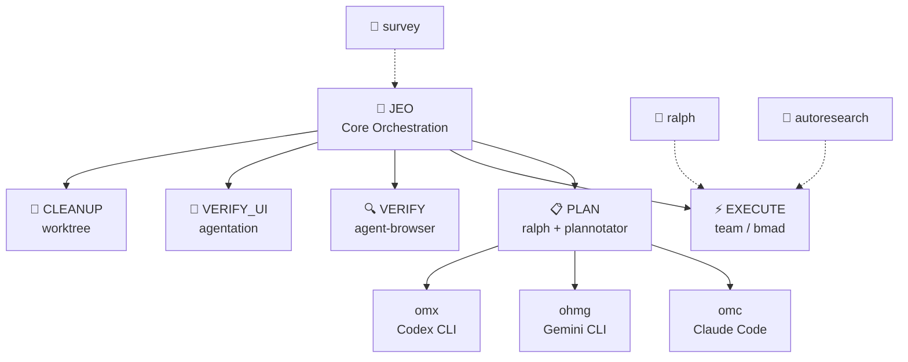

# Agent Skills

<div align="center">

[](https://github.com/akillness/oh-my-skills)
[](https://github.com/akillness/oh-my-skills)
[](LICENSE)
[](docs/bmad/README.md)
[](https://www.buymeacoffee.com/akillness3q)

**89 AI agent skills · TOON Format · Cross-platform**

[Quick Start](#-quick-start) · [Skills List](#-skills-list) · [Installation](#-installation) · [한국어](README.ko.md)

</div>

---

## 💡 What is Agent Skills?

**89 AI agent skills · TOON Format · Cross-platform**

Agent Skills is a curated collection of 89 AI agent skills for LLM-based development workflows. Built around the `jeo` orchestration protocol, it provides:
- Unified orchestration across Claude Code, Gemini CLI, OpenAI Codex, and OpenCode
- Plan → Execute → Verify → Cleanup automated pipelines
- Multi-agent team coordination with parallel execution

---

## 🚀 Quick Start

> **Prerequisite**: Install `skills` CLI before running `npx skills add`.
>
> ```bash
> npm install -g skills
> ```

```bash
# Send to your LLM agent — it will read and install automatically
curl -s https://raw.githubusercontent.com/akillness/oh-my-skills/main/setup-all-skills-prompt.md
```

| Platform | First Command |
|----------|--------------|
| Claude Code | `jeo "task description"` or `/omc:team "task"` |
| Gemini CLI | `/jeo "task description"` |
| Codex CLI | `/jeo "task description"` |
| OpenCode | `/jeo "task description"` |

---

## 🏗 Architecture



---

## 🆕 What's New in v2026-04-18

| Change | Details |
|--------|---------|
| **web-accessibility: routing-first structural hardening** | Tightened `web-accessibility` into a smaller routing-first remediation anchor. It now starts from one primary accessibility packet (`semantics-structure`, `keyboard-focus`, `labels-announcements`, `visual-perception-reflow`, `media-alternatives`, or `routed-navigation-feedback`), adds `references/intake-packets-and-route-outs.md`, expands `evals/evals.json` with routed-app and responsive-boundary cases, and syncs `SKILL.toon` / `skills.toon` / `skills.json` plus README/setup wording so discovery surfaces stop drifting back to a generic WCAG/ARIA tutorial. |
| **marketing-automation: structural hardening** | Tightened `marketing-automation` into a broader marketing front door that first chooses one operating mode (`launch-orchestration`, `conversion-surface`, `lifecycle-retention`, `acquisition-content`, or `measurement-experiment`), then one primary lane and one handoff packet instead of dumping channel soup. Added `references/operating-modes-and-route-outs.md`, refreshed `evals/evals.json`, synced `SKILL.toon` / manifest wording, and sharpened route-outs to `steam-store-launch-ops` and `task-planning`. |
| **sprint-retrospective: structural hardening** | Tightened `sprint-retrospective` into a routing-first PM anchor for sprint retros, milestone postmortems, remote/hybrid facilitation, and dead-action-item recovery across software, product/ops, marketing/GTM, and game-delivery work. The front door now picks one retrospective mode, reviews prior commitments before new actions, keeps action counts brutally small, routes planning/sizing/daily-sync work outward, and adds `references/action-review-and-packet-shapes.md`, refreshed `evals/evals.json`, and synced compact/manifest discovery wording. |
| **autoresearch: routing-first structural hardening** | Tightened `autoresearch` into a smaller Karpathy ML search front door. It now chooses one mode (`setup readiness`, `program.md` authoring, bounded run loop, results interpretation, or constrained-hardware adaptation), keeps the immutable `prepare.py` / 300-second / `val_bpb` contract explicit, adds `references/operating-modes-and-route-outs.md`, refreshes `evals/evals.json`, and sharpens route-outs to `skill-autoresearch` plus app-level eval / observability tools instead of acting like a giant end-to-end explainer. |

## 🆕 What's New in v2026-04-17

| Change | Details |
|--------|---------|
| **steam-store-launch-ops: bottleneck-router hardening** | Tightened `steam-store-launch-ops` into a diagnosis-first Steam launch/store router for indie games. It now separates `visibility-acquisition`, `promise-clarity`, `proof-demo-readiness`, `timing-hook-fit`, and `launch-ops-readiness`; makes the current hook explicit (coming-soon page, wishlist anomaly, demo decision, Next Fest, or launch window); recommends one intervention and one next artifact instead of a generic marketing dump; and adds `references/diagnostic-model.md`, `references/event-hooks.md`, refreshed `evals/evals.json`, and synced `SKILL.toon` without adding a duplicate game-marketing skill. |

## 🆕 What's New in v2026-04-15

| Change | Details |
|--------|---------|
| **game-performance-profiler: routing-first structural hardening** | Tightened `game-performance-profiler` into a smaller bottleneck-first profiling front door. It now leans on `references/mode-selection-and-route-outs.md` plus the existing packet/device/escalation references, keeps one output contract (`Game Performance Profiling Brief`), adds a build-failure route-out eval case, and sharpens discovery wording around quick packets, benchmark routes, target-device review, and deliberate profiler escalation instead of a giant optimization essay. |
| **agent-browser: fresh-session verification rewrite** | Reframed `agent-browser` from a generic browser CLI guide into the browser-review lane's **fresh-session deterministic verification** anchor. It now chooses the clean browser lane first, enforces an observe → act → observe loop, makes route-outs explicit to `playwriter`, `agentation`, and `plannotator`, adds `references/modes-and-routing.md` plus `evals/evals.json`, and keeps auth reuse bounded instead of silently sliding into a running-browser workflow. |
| **agentation: UI annotation router rewrite** | Reframed `agentation` from a monolithic install/config catalog into the planning-review lane's exact rendered-UI feedback router. It now chooses among copy-paste review, synced watch-loop, self-driving critique, and platform-setup modes; keeps route-outs explicit to `agent-browser`, `playwriter`, and `plannotator`; adds `references/modes-and-routing.md`, `references/platform-setup-and-hooks.md`, `references/watch-loop-and-self-driving.md`, and `evals/evals.json`; and fixes top-level discovery surfaces so the repo now consistently advertises **89 skills**. |
| **git-submodule: routing-first structural hardening** | Tightened `git-submodule` into a smaller operator front door. It still chooses submodule vs subtree/vendoring/package delivery first, but now pushes mode-specific packets into `references/mode-packets-and-hosted-constraints.md`, adds a hosted-platform boundary for GitHub Pages public-`https://` submodule limits, extends eval coverage with that hosted-constraint case, and refreshes discovery wording so recursive bootstrap, pointer updates, detached-HEAD handling, CI auth, and hosted checkout limits stay visible without turning the skill back into a giant command catalog. |
| **bmad-idea: pre-planning concept-router rewrite** | Reframed `bmad-idea` from a legacy BMAD-CIS command/persona catalog into the repository's pre-planning idea router. It now normalizes early-stage product, GTM, consulting, and game packets; chooses one framing mode (`problem framing`, `audience and value framing`, `concept shaping`, `game concept framing`, or `story packaging`); produces one reusable concept artifact; routes cleanly to `bmad`, `task-planning`, `marketing-automation`, or `bmad-gds`; and ships `references/operating-modes.md`, `references/handoff-boundaries.md`, `references/concept-packet-template.md`, and `evals/evals.json` without increasing the skill count. |
| **genkit: packet-first structural hardening** | Tightened `genkit` into a smaller routing-first backend AI workflow anchor. It now starts from the current packet (new capability, existing route handler, deployed flow quality, runtime/deploy, or comparison/fallback), adds `references/intake-packets-and-fallbacks.md`, expands the mode selector with `comparison-or-fallback`, keeps plain SDK / route-handler and durable-workflow fallbacks visible, extends eval coverage with a thin-route boundary case, and syncs `SKILL.toon` / `skills.toon` / `skills.json` wording so discovery surfaces stay aligned with the server-owned workflow contract instead of drifting back to a generic full-stack AI framework pitch. |
| **firebase-ai-logic: client-integration support hardening** | Upgraded `firebase-ai-logic` from a thin companion note into the Firebase lane's **app/client integration anchor**. It now chooses among direct feature fit, app wiring, production hardening, and escalation-boundary modes; adds `references/modes-and-routing.md`, `references/production-controls.md`, `references/feature-packets.md`, and `evals/evals.json`; makes route-outs explicit to `genkit` for backend workflows and `firebase-cli` for operator tasks; and removes stale setup guidance that previously blurred app SDK work with backend orchestration. |

## 🆕 What's New in v2026-04-14

| Change | Details |
|--------|---------|
| **npm-git-install: Git-dependency decision rewrite** | Reframed `npm-git-install` from a legacy npm-only command dump into a decision-first Node package delivery skill. It now chooses between direct Git install, SHA-pinned bridge installs, private Git auth, tarball / `npm pack` artifacts, workspace / `file:` links, and publish-first registry paths; covers npm, pnpm, Yarn, and Bun at the workflow level; adds explicit auth/build/reproducibility guardrails and route-outs to `git-workflow`, `github-repo-management`, `workflow-automation`, and `system-environment-setup`; and ships `references/delivery-decision-matrix.md`, `references/package-manager-behavior.md`, `references/private-auth-and-ci.md`, and `evals/evals.json` without increasing the skill count. |
| **web-design-guidelines: UI-audit rewrite** | Reframed `web-design-guidelines` from a thin Vercel-rules fetcher into the frontend cluster's broad interface audit anchor for launch-readiness, polish/consistency, flow-friction, heuristic, and rule-overlay reviews. It now classifies findings across hierarchy, clarity, states, responsiveness basics, accessibility basics, and performance/trust signals; adds explicit route-outs to `web-accessibility`, `responsive-design`, `ui-component-patterns`, `design-system`, and `react-best-practices`; and ships `references/review-modes-and-categories.md`, `references/handoff-boundaries.md`, `references/ui-audit-packet-template.md`, and `evals/evals.json` without increasing the skill count. |
| **monitoring-observability: packet-first hardening** | Tightened `monitoring-observability` into a smaller routing-first observability anchor. It now starts from the packet teams actually have (service-health, telemetry-foundation, dashboard/alert audit, data-pipeline trust, or game live-ops visibility), adds `references/intake-packets-and-route-outs.md`, expands eval coverage with review-audit and deployment-route-out cases, and syncs `SKILL.toon` / `skills.toon` / `skills.json` wording so compact discovery surfaces stop drifting back to the old generic monitoring-setup behavior. |
| **performance-optimization: artifact-first hardening** | Tightened `performance-optimization` into an artifact-first measurement-led tuning anchor. It now starts from the packet teams actually have (trace, Lighthouse/CWV report, query plan, load-test diff, profiler output, or stakeholder report), adds `references/intake-packets-and-escalations.md`, sharpens route-outs to `monitoring-observability`, `debugging`, `code-refactoring`, `testing-strategies`, and `game-performance-profiler`, expands eval coverage for marketing/CWV and CI benchmark cases, and syncs compact/discovery wording so the front door no longer drifts back to stale generic optimization language. |
| **code-refactoring: packet-first structural hardening** | Tightened `code-refactoring` into a smaller routing-first cleanup anchor. It now starts from the cleanup packet teams actually have (local cleanup, fragile legacy area, repeated migration / codemod, or cleanup-heavy diff shaping), adds `references/intake-packets-and-route-outs.md`, expands eval coverage with a search-first blast-radius route-out, and syncs `SKILL.toon` / `skills.toon` / `skills.json` so compact discovery no longer advertises a stale generic DRY/SOLID design-pattern helper. |
| **changelog-maintenance: packet-first hardening** | Tightened `changelog-maintenance` into a smaller routing-first release-writing anchor. It now chooses one primary mode plus the smallest truthful output packet (`single-entry`, `summary-plus-links`, `migration-brief`, `patch-note-brief`, or `sync-packet`), adds `references/output-packets-and-channel-handoffs.md`, expands eval coverage with a release-notes + migration-window + sync-followups case, and syncs compact/discovery wording so the skill no longer drifts back to a generic changelog / semver template dump. |

## 🆕 What's New in v2026-04-19

| Change | Details |
|--------|---------|
| **ui-component-patterns: structural hardening** | Tightened `ui-component-patterns` into a routing-first reusable-component architecture skill. It now classifies one primary packet (`primitive-boundary`, `slot-anatomy`, `controlled-ownership`, `alternate-root-composition`, or `docs-verification`) before suggesting props, adds `references/intake-packets-and-route-outs.md`, expands eval coverage with alternate-root and Storybook/docs-verification cases, refreshes `SKILL.toon` / manifest discovery wording, and keeps `design-system`, `web-accessibility`, `responsive-design`, `state-management`, and `react-best-practices` as explicit route-outs instead of drifting back to a generic component-best-practices catch-all. |
| **responsive-design: structural hardening** | Tightened `responsive-design` into a routing-first responsive strategy skill that chooses one primary packet (`page-layout`, `component-slot`, `dense-data`, `media-behavior`, or `verification-reflow`) before suggesting CSS. The skill now moves packet routing into `references/intake-packets-and-route-outs.md`, expands eval coverage with a launch-readiness boundary case, refreshes `SKILL.toon` / manifest discovery surfaces, and keeps `ui-component-patterns`, `web-accessibility`, `design-system`, and `web-design-guidelines` as explicit route-outs instead of letting responsive work sprawl into a generic frontend catch-all. |

## 🆕 What's New in v2026-04-13

| Change | Details |
|--------|---------|
| **responsive-design: layout-adaptation rewrite** | Reframed `responsive-design` from a long generic CSS example dump into the frontend cluster's mobile-first, container-aware layout adaptation skill. It now classifies viewport-vs-container failures, prioritizes intrinsic layout before breakpoint sprawl, adds explicit route-outs to `ui-component-patterns`, `web-accessibility`, `design-system`, and `web-design-guidelines`, and ships `references/layout-decision-checklist.md`, `references/handoff-boundaries.md`, and `evals/evals.json` without increasing the skill count. |

## 🆕 What's New in v2026-04-12

| Change | Details |
|--------|---------|
| **bmad: core BMAD router modernization** | Reframed `bmad` into the portable BMAD/BMM core router: it now chooses project level, identifies the current phase, recommends one next artifact, and routes runtime-specific or specialist depth to `plannotator`, `task-planning`, `omc`, `omx`, `ohmg`, or `bmad-gds` instead of acting like a giant command dump. Added `references/core-routing.md`, `references/status-and-review.md`, `references/runtime-and-module-boundaries.md`, and `evals/evals.json`, while keeping the existing helper scripts. |
| **bmad-gds: game producer/orchestration rewrite** | Reframed `bmad-gds` from a generic phase catalog into a practical game-production coordination skill. It now acts as the repo's game-cluster orchestrator: normalizes mixed packets (idea, GDD, playtest notes, bug/build issues, launch targets), chooses one operating mode, produces one milestone-aware coordination brief, and routes detailed work to `game-demo-feedback-triage`, `game-build-log-triage`, `game-performance-profiler`, `steam-store-launch-ops`, `task-planning`, or `bmad-idea` as needed. Added `references/operating-modes.md`, `references/scope-boundaries.md`, and `evals/evals.json` without increasing the skill count. |

## 🆕 What's New in v2026-04-08

| Change | Details |
|--------|---------|
| **graphify: repo and corpus knowledge-graph skill** | Added a dedicated `graphify` skill for turning repositories or mixed corpora into persistent knowledge-graph artifacts with `GRAPH_REPORT.md`, `graph.json`, and HTML visualization. Covers the tested Python API pipeline, graph queries, graph-backed architecture discovery, and assistant install flows; includes `references/overview.md` and `evals/evals.json`. 84 → **85 skills**. |
| **llm-wiki: persistent LLM-maintained markdown wiki skill** | Added a dedicated `llm-wiki` skill for turning raw sources into a compounding Obsidian or markdown knowledge base. It bootstraps a vault with `raw/`, `wiki/`, `index.md`, `log.md`, and `AGENTS.md`; ships helper scripts for bootstrap, Scrapling-powered URL ingest, query filing, and linting; and pushes schema, ingest, filing, and scaling detail into focused references. Includes `evals/` plus `skill-autoresearch-llm-wiki/` baseline, changelog, results, and dashboard artifacts. 82 → **83 skills**. |
| **rtk: Rust Token Killer setup and operations skill** | Added a dedicated `rtk` skill for installing, verifying, and initializing Rust Token Killer across Claude Code, Codex, Gemini CLI, Cursor, Copilot, Windsurf, Cline, and OpenCode. The skill starts with `rtk gain` verification, handles the common wrong-package collision, ships install/init/status wrapper scripts, and pushes deeper platform and troubleshooting details into focused reference docs. Includes `evals/` plus `skill-autoresearch-rtk/` baseline, changelog, results, and dashboard artifacts. 81 → **82 skills**. |

## 🆕 What's New in v2026-03-30

| Change | Details |
|--------|---------|
| **harness: agent team & skill architect meta-skill** | Added a dedicated `harness` skill for designing domain-specific agent teams and generating the skills they use. Covers domain analysis, architecture pattern selection (pipeline, fan-out/fan-in, expert pool, producer-reviewer, supervisor, hierarchical delegation), `.claude/agents/` and `.claude/skills/` file generation, orchestration workflow definition, and validation with trigger evals and dry-run testing. Includes `install.sh`, `validate-harness.sh` scripts, and 5 reference docs. 80 → **81 skills**. |

## 🆕 What's New in v2026-03-28

| Change | Details |
|--------|---------|
| **obsidian-cli: terminal automation for Obsidian** | Added a dedicated `obsidian-cli` skill for enabling and operating the official Obsidian CLI: installer and registration preflight, TUI vs one-shot usage, `vault=` / `file=` / `path=` targeting, `--copy`, everyday note workflows, plugin and theme control, developer commands like `plugin:reload` and `dev:screenshot`, plus platform troubleshooting references. 79 → **80 skills**. |
| **scrapling: adaptive web scraping skill** | Added a dedicated `scrapling` skill for parser-first HTML extraction, fetcher selection (`Fetcher` → `DynamicFetcher` → `StealthyFetcher`), extras-aware installation, adaptive selector recovery, CLI extraction, and second-tier MCP/spider guidance. The implementation includes install/extract/MCP wrapper scripts plus focused references for fetchers, parser behavior, CLI/MCP, and spiders. 78 → **79 skills**. |
| **strix: AI-driven application security testing skill** | Added a dedicated `strix` skill for operating the Strix CLI end-to-end: install and Docker preflight, `STRIX_LLM` provider setup, local/GitHub/live target scans, quick/standard/deep mode selection, headless CI/CD usage, and clear separation between this repo's skill and Strix internal security skills. 77 → **78 skills**. |

## 🆕 What's New in v2026-03-22

| Change | Details |
|--------|---------|
| **bmad-orchestrator renamed to bmad** | `bmad-orchestrator` skill folder renamed to `bmad`. Simplified to core BMAD workflow orchestration (Analysis → Planning → Solutioning → Implementation). Use keyword `bmad` as before. |
| **Removed copilot-coding-agent** | `copilot-coding-agent` skill removed. 77 skills total. |

## 🆕 What's New in v2026-03-19

| Change | Details |
|--------|---------|
| **clawteam: agent swarm coordination skill** | Added a dedicated `clawteam` skill for framework-agnostic multi-agent orchestration with tmux-backed workers, git worktree isolation, file-based task/inbox state, monitoring commands, and reusable templates for full-stack, ML research, and hedge-fund style teams. |
| **obsidian-plugin: Obsidian plugin development skill** | Build, validate, and publish Obsidian plugins. Covers all 27 `eslint-plugin-obsidianmd` rules, interactive boilerplate generator (`create-plugin.js`), memory management, type safety, accessibility (MANDATORY), CSS variables, vault API, and community submission validation. 75 → **76 skills**. |
| **jeo v1.6.0: `.jeo` planning ledger flow** | JEO now creates a project-local `.jeo/` folder and uses it as a durable planning/development/QA ledger: `long-term.md`, `short-term.md`, `planned.md`, `progress.md`, `history.md`, plus queued/active task files. Completed task files are summarized into history then removed; follow-up work can be queued without resetting the workflow. |
| **skill-autoresearch: eval-driven skill optimization** | New skill for improving an existing `SKILL.md` with binary evals, mutation loops, baseline scoring, and dashboard/changelog artifacts. Keeps the original `autoresearch` ML workflow separate. 76 → **77 skills**. |
| **firebase-cli: Firebase platform operator hardening** | Upgraded `firebase-cli` into a routing-first Firebase operator anchor for install/auth, bootstrap/config, Emulator Suite workflows, scoped deploy/release flows, and admin/data operations. Added focused references for routing, bootstrap/auth, emulators/release, and admin tasks; refreshed evals/compact wording; and corrected the npm-path Node.js baseline to current `firebase-tools` requirements. |
| **google-workspace, langsmith, react-grab added** | 3 new skills: Google Workspace REST API automation, LangSmith LLM observability/evaluation, react-grab React element context capture. 71 → **74 skills**. |
| **research-paper-writing: ML/CV/NLP paper writing skill** | Academic paper and rebuttal workflow for Abstract, Introduction, Method, Experiments, figures/tables, reviewer responses, and camera-ready revision. Claim-evidence alignment, section planning, and reviewer-risk checks. From Prof. Peng Sida's notes plus repo support hardening. 70 → **71 skills**. |
| **Removed ai-tool-compliance and llm-monitoring-dashboard** | Removed `ai-tool-compliance` (internal compliance automation) and `llm-monitoring-dashboard`. 72 → **70 skills**. |
| **Removed deprecated agent-development skills** | Removed `agent-configuration`, `agent-evaluation`, `agentic-development-principles`, `agentic-principles`, `agentic-workflow`. 80 → **72 skills**. |
| **Removed deprecated image/media skills** | Removed `image-generation`, `image-generation-mcp`, `pollinations-ai`. Use `video-production` as the canonical programmable-video skill; `remotion-video-production` remains as the compatibility alias for explicit Remotion naming. |
| **autoresearch: Karpathy autonomous ML experiment skill** | Human-written `program.md`, agent-edited `train.py`, fixed 5-minute GPU runs, and `val_bpb` keep/revert ratcheting for real ML search. Now explicitly routes prompt / app eval work away to `skill-autoresearch` or eval platforms, and includes `scripts/`, `references/`, and `evals/`. |
| **jeo v1.2.3: plannotator-plan-loop.sh all-platform hardening** | Cross-platform temp dir fallback, dedicated port `PLANNOTATOR_PORT=47291`, `probe_plannotator_port()` + `wait_for_listen()`, browser-crash retry up to 3 times, structured `jeo-blocked.json` output. |
| **survey: artifact-validator hardening** | Tightened `survey` into a smaller artifact-contract-first research anchor, moved verbose output templates into a dedicated reference, and added `scripts/validate_survey_artifacts.py` so `.survey/{slug}/` folders can be checked mechanically before planning or implementation. Platform topics still normalize as `settings/rules/hooks`, with hooks treated as optional wrappers around the same portable validator. |
| **presentation-builder: packet-first deck handoff hardening** | Tightened `presentation-builder` into a smaller routing-first deck artifact anchor. It now chooses one deck mode, one smallest useful artifact packet (`outline-brief`, `storyboard`, `review-ready-html`, `export-handoff`, or `sync-packet`), and one honest last-mile surface (HTML viewer, PPTX, PDF, Google Slides, or Figma Slides); adds `references/artifact-packets-and-last-mile-handoffs.md`; refreshes eval coverage; and syncs compact/discovery surfaces so the skill matches real deck workflows instead of acting like a giant slides essay. |

---

## 📦 Installation

### Step 0: Install `skills` CLI

```bash
npm install -g skills
skills --version
```

### For LLM Agents

```bash
curl -s https://raw.githubusercontent.com/akillness/oh-my-skills/main/setup-all-skills-prompt.md
```

### Choose by Platform

#### Claude Code

```bash
npx skills add https://github.com/akillness/oh-my-skills \
  --skill jeo --skill omc --skill plannotator --skill agentation \
  --skill ralph --skill ralphmode --skill vibe-kanban
```

#### Gemini CLI

```bash
npx skills add https://github.com/akillness/oh-my-skills \
  --skill jeo --skill ohmg --skill ralph --skill ralphmode --skill vibe-kanban
gemini extensions install https://github.com/akillness/oh-my-skills
```

#### Codex CLI

```bash
npx skills add https://github.com/akillness/oh-my-skills \
  --skill jeo --skill omx --skill ralph --skill ralphmode
```

#### Platform-Specific Setup

```bash
# Claude Code — jeo hook setup
bash ~/.agent-skills/jeo/scripts/setup-claude.sh

# Gemini CLI — jeo hook setup
bash ~/.agent-skills/jeo/scripts/setup-gemini.sh

# oh-my-claudecode
/plugin marketplace add https://github.com/Yeachan-Heo/oh-my-claudecode
/oh-my-claudecode:omc-setup
```

---

## 📚 Skills List

> Full manifest: `.agent-skills/skills.json` · each folder's `SKILL.md` · 89 local skill folders = 89 total installable skills

### 🎯 Core Orchestration (11)

| Skill | Keyword | Platform | Description |
|-------|---------|----------|-------------|
| `jeo` | `jeo`, `annotate` | All | Integrated orchestration with `.jeo` ledger: Planning→Development→QA→Cleanup |
| `omc` | `omc`, `autopilot`, `ralph`, `ulw`, `ccg`, `deep interview`, `deslop`, `cancelomc` | Claude | 29+ agent orchestration layer (v4.9.3) — Teams/Autopilot/Ralph/Ultrawork/CCG modes, smart model routing, skill layers, real-time HUD |
| `harness` | `harness`, `build a harness` | All | Meta-skill: design domain-specific agent teams, generate `.claude/agents/` + `.claude/skills/` files, validate harness |
| `omx` | `omx`, `$plan`, `$ralph`, `$team`, `$deep-interview`, `$ralplan` | Codex | Multi-agent workflow layer for Codex CLI (v0.11.10) — 30+ agents, 35+ skills, tmux team runtime, omx explore/sparkshell |
| `ohmg` | `ohmg`, `oh-my-agent`, `oma`, `.agents` | Gemini | Gemini / Antigravity entry for the portable `oh-my-agent` harness (`.agents` source of truth, native Gemini projection, cross-vendor-ready layout) |
| `ralph` | `ralph`, `ooo` | All | Ouroboros spec-first method anchor — Socratic clarification, immutable seed/spec, drift-aware execution, and persistent completion until verification passes |
| `ralphmode` | `ralphmode` | All | Automation permission profile — repo-local settings, boundary rules, and hook-backed checkpoints for trusted repos vs sandbox-only YOLO |
| `bmad` | `bmad`, `workflow-init`, `workflow-status` | All | Portable BMAD/BMM core router — choose project level, identify the current phase, recommend the next artifact, and route runtime-specific depth outward |
| `bmad-gds` | `bmad-gds` | All | Game-production orchestrator — turn ideas, GDDs, playtest notes, bugs, and launch beats into one milestone-aware next artifact |
| `bmad-idea` | `bmad-idea` | All | Pre-planning idea router — turn rough product, GTM, consulting, or game ideas into one concept artifact and the next handoff |
| `survey` | `survey` | All | Bounded pre-implementation landscape scan with reusable `.survey/{slug}/` artifacts plus validator-backed artifact-contract checks |

### 📋 Planning & Review (5)

| Skill | Keyword | Description |
|-------|---------|-------------|
| `plannotator` | `plan` | Visual approval gate for agent plans/diffs — annotate, approve, request changes, or save reviewed plans |
| `agentation` | `annotate` | Exact rendered-UI feedback router — choose copy-paste review, watch-loop sync, self-driving critique, or platform setup |
| `agent-browser` | `agent-browser` | Fresh-session browser verification anchor — clean disposable browser, snapshot refs, and explicit before/after evidence |
| `playwriter` | `playwriter` | Running-browser automation for authenticated Chrome sessions and MCP browser reuse |
| `vibe-kanban` | `kanbanview` | Coding-board control plane for bounded coding cards, tracker-linked workspaces, review queues, worktree isolation, and PR handoff |

### 🤖 Agent Development (2)

| Skill | Description | Platforms |
|-------|-------------|-----------|
| `prompt-repetition` | Decision-first prompt repetition skill for non-reasoning/lightweight LLMs — long-context retrieval, options-first MCQ, position-sensitive lookup, and explicit route-outs to retrieval or stronger models | All |
| `skill-standardization` | Validate/rewrite SKILL.md, canonicalize duplicates, and keep repo-root validator flows plus derived discovery surfaces (`skills.json`, README/setup, `SKILL.toon`) in sync | All |

### ⚙️ Backend (5)

| Skill | Description | Platforms |
|-------|-------------|-----------|
| `api-design` | Contract-first REST/GraphQL API design, compatibility review, and handoff | All |
| `api-documentation` | Developer-facing API docs anchor for reference portals, quickstarts, SDK/webhook guides, truthful examples, and auth/error guidance | All |
| `authentication-setup` | Product-auth setup routing across hosted/framework-native/platform-native auth, sessions/JWTs, org data, and enterprise SSO handoff | All |
| `backend-testing` | Backend coverage planning for API, integration, contract, fixture, and CI-vs-local test layers | All |
| `database-schema-design` | Packet-first storage-model and migration-safety design for relational/document/hybrid schemas, queryable-vs-flexible fields, and route-outs to API/auth/testing/reporting neighbors | All |

### 🎨 Frontend (10)

| Skill | Description | Platforms |
|-------|-------------|-----------|
| `design-system` | Canonical frontend UI-system anchor for token governance, visual-language rules, primitive naming, and cross-surface system direction; routes component API, responsive layout, accessibility remediation, and broad UI critique to adjacent skills | All |
| `frontend-design-system` | Compatibility alias for `design-system` when legacy tooling or exact-name workflows still expect the old name | All |
| `react-best-practices` | Measurement-led React & Next.js performance audits for waterfalls, bundle size, RSC/client boundaries, hydration, rerender churn, and slow routes | All |
| `react-grab` | Browser element context capture — point at UI element, copy React component name, file path, HTML to clipboard for AI agents | All |
| `vercel-react-best-practices` | Compatibility alias for `react-best-practices` when legacy tooling or exact-name workflows still expect the Vercel variant | Claude · Gemini · Codex |
| `responsive-design` | Routing-first responsive layout strategy for page-shell, component-slot, dense-data, media, and reflow-verification packets | All |
| `state-management` | React/fullstack ownership-packet decisions across local, Context, URL/form, client-store, and server-state/router data layers | All |
| `ui-component-patterns` | Routing-first reusable-component architecture for primitive-boundary, slot-anatomy, controlled-ownership, alternate-root, and docs-verification packets | All |
| `web-accessibility` | Routing-first accessibility remediation and verification for semantics, keyboard/focus, labels/announcements, reflow, media alternatives, and routed-app feedback | All |
| `web-design-guidelines` | Broad web UI audit for hierarchy, clarity, consistency, states, responsiveness basics, and accessibility basics | All |

### 🔍 Code Quality (5)

| Skill | Description | Platforms |
|-------|-------------|-----------|
| `code-refactoring` | Behavior-preserving structural cleanup, decomposition, duplication removal, and codemod planning | All |
| `code-review` | Evidence-first diff / PR review with severity, missing-proof checks, and route-outs | All |
| `debugging` | Routing-first diagnosis for concrete bugs, regressions, flaky failures, and env-specific behavior; routes raw logs to `log-analysis` and perf-only work to `performance-optimization` | All |
| `performance-optimization` | Artifact-first measurement-led bottleneck analysis and tuning across latency, throughput, memory, bundle, CWV, and frame-budget work | All |
| `testing-strategies` | Risk-based validation policy, merge/release gates, flaky-suite policy | All |

### 🏗 Infrastructure (13)

| Skill | Description | Platforms |
|-------|-------------|-----------|
| `deployment-automation` | Release-execution anchor for preview releases, staging/prod promotion, rollout strategy, post-deploy verification, rollback response, and release hardening; routes CI authoring to `workflow-automation`, machine setup to `system-environment-setup`, and Vercel-specific operations to `vercel-deploy` | All |
| `environment-setup` | App-config compatibility skill for `.env` layout, env precedence, validation, and secret handoff; routes broader runnable-machine setup to `system-environment-setup` | All |
| `firebase-ai-logic` | Direct Firebase app/client SDK lane for Gemini-powered features, streaming, structured output, and App Check-aware in-app integration; routes backend orchestration to `genkit` | Claude · Gemini |
| `firebase-cli` | Firebase platform/operator anchor for install/auth, bootstrap/config, Emulator Suite workflows, scoped deploy/release, App Hosting, and admin/data ops; routes backend AI workflow orchestration to `genkit` and direct app SDK integration to `firebase-ai-logic` | All |
| `genkit` | Packet-first backend AI workflow anchor for deciding whether a feature needs a reusable server-owned flow, Genkit eval/tracing, or a fallback to plain SDK routes / `survey`; routes direct app SDK work to `firebase-ai-logic` and Firebase operator tasks to `firebase-cli` | Claude · Gemini |
| `looker-studio-bigquery` | BigQuery-backed stakeholder dashboard/reporting layer for KPI boards, PM/ops reviews, marketing/GTM reporting, and game/business telemetry; routes KPI interpretation to `data-analysis` | All |
| `monitoring-observability` | Packet-first telemetry design/review for service health, telemetry rollout, alert/dashboard audits, pipeline trust, and live-ops visibility | All |
| `scrapling` | Adaptive web scraping with parser-first `Selector`, HTTP/browser/stealth fetchers, CLI extraction, and optional MCP/spider workflows | All |
| `rtk` | Rust Token Killer installation and agent setup - `rtk gain` verification, package-collision repair, agent-specific `rtk init`, and direct compact shell wrappers | All |
| `security-best-practices` | Routing-first web/application/API hardening that classifies the missing security layer (browser policy, cookies/CSRF, abuse, validation, secrets, verification) before recommending one bounded hardening brief | All |
| `strix` | Strix CLI for AI-driven application security testing - Docker preflight, LLM provider setup, local/GitHub/live target scans, scan modes, and CI/CD usage | All |
| `system-environment-setup` | Canonical broader environment-setup skill for runnable repos, toolchains, Docker/devcontainers, local services, onboarding, and setup drift diagnosis | All |
| `vercel-deploy` | Vercel-specific operator skill for linked-project preview/prod deploys, staged promote flows, aliases/domains, env-scope fixes, and rollback response | All |

### 📝 Documentation (5)

| Skill | Description | Platforms |
|-------|-------------|-----------|
| `changelog-maintenance` | Routing-first release-history anchor for changelogs, release notes, migration updates, and lightweight patch-note packets | All |
| `presentation-builder` | Packet-first deck artifact anchor for investor / roadmap / launch / architecture-demo / workshop / game-pitch decks, with honest last-mile handoff to HTML review, PPTX, PDF, Google Slides, or Figma Slides | All |
| `research-paper-writing` | ML/CV/NLP academic paper + rebuttal workflow — abstract/introduction/method/experiments, figure-table support, claim-evidence alignment, reviewer response, camera-ready revision | All |
| `technical-writing` | Internal technical docs anchor for specs, architecture docs, ADRs, runbooks, migration guides, and developer-facing implementation notes | All |
| `user-guide-writing` | Mode-selecting user-docs anchor for onboarding guides, tutorials, task how-to articles, FAQs, help-center updates, and release-facing help refresh packets | All |

### 📊 Project Management (4)

| Skill | Description | Platforms |
|-------|-------------|-----------|
| `sprint-retrospective` | Routing-first retrospective anchor for sprint retros, milestone postmortems, remote/hybrid facilitation, and dead-action-item recovery | All |
| `standup-meeting` | Daily standups, async check-ins, walk-the-board syncs, and blocker triage | All |
| `task-estimation` | Routing-first estimate packet anchor for story points, t-shirt sizing, split/spike guidance, and forecast-safe uncertainty framing across software, GTM, and game work | All |
| `task-planning` | Routing-first planning anchor for backlog cleanup, feature slicing, release packets, and milestone prep across software, GTM, and game work | All |

### 🔭 Search & Analysis (7)

| Skill | Description | Platforms |
|-------|-------------|-----------|
| `autoresearch` | Karpathy autonomous ML search front door — choose setup / `program.md` / bounded loop / results interpretation / constrained-hardware mode, preserve immutable `prepare.py` + 300s + `val_bpb`, route prompt/skill eval elsewhere | All |
| `skill-autoresearch` | Repo-local skill ratcheting loop: freeze evals, mutate one thing at a time, keep or revert by score, and sync support surfaces only after the core skill change is justified | All |
| `codebase-search` | Routing-first repo navigation: choose one search packet for definitions/references, config/content ownership, entry-point discovery, or impact mapping before debugging/refactoring | All |
| `data-analysis` | Decision-first dataset analysis for exports, experiments, telemetry, and KPI explanation | All |
| `langsmith` | Mode-selecting LangSmith skill for LLM tracing, evals, feedback/review queues, prompt-registry decisions, and multi-service propagation | All |
| `log-analysis` | Root-cause triage for application, infrastructure, browser, and CI logs | All |
| `pattern-detection` | Mode-selecting pattern/rule hunting for code, logs, telemetry, and metric anomalies | All |

### 🎬 Creative Media (2)

| Skill | Description | Platforms |
|-------|-------------|-----------|
| `remotion-video-production` | Compatibility alias for `video-production` when legacy tooling or explicit Remotion naming still expects the old skill | All |
| `video-production` | Canonical programmable-video / automated-video production skill for Remotion, template APIs, content repurposing, and QA handoffs | All |

### 📢 Marketing (2)

| Skill | Description | Platforms |
|-------|-------------|-----------|
| `marketing-automation` | Canonical broad marketing front door — choose one operating mode, one primary lane, and one handoff packet across launch, conversion, lifecycle, acquisition/content, and measurement work | All |
| `marketing-skills-collection` | Compatibility alias for `marketing-automation` in legacy prompt packs and catalogs | All |

### 🎮 Game Development (5)

| Skill | Description | Platforms |
|-------|-------------|-----------|
| `game-build-log-triage` | Unity/Unreal build, cook, package, editor, signing, and CI log triage — isolate the first actionable engine/build failure | All |
| `game-ci-cd-pipeline` | Game CI/CD design and hardening — build matrices, artifact flow, cache policy, packaging stages, and release gates | All |
| `game-demo-feedback-triage` | Turn playtest/demo/community feedback into weighted themes, fix-first priorities, and explicit handoffs | All |
| `game-performance-profiler` | Unity/Unreal frame-time triage — bottleneck-first profiling brief, quick packets, benchmark routes, target-device review, and deliberate profiler escalation | All |
| `steam-store-launch-ops` | Diagnose Steam launch/store bottlenecks — visibility, page promise, demo proof, event timing, and launch-readiness ops | All |

### 🔧 Utilities (11)

| Skill | Description | Platforms |
|-------|-------------|-----------|
| `fabric` | Routing-first Fabric operator skill for stdin/files/transcripts/logs → reusable patterns, custom pattern packs, shell pipelines, and `fabric --serve` workflows | All |
| `file-organization` | Decision-first repo structure guidance — choose framework defaults vs feature folders, monorepo boundaries, docs taxonomy, or engine-aware game layouts | All |
| `git-submodule` | Routing-first Git submodule workflow — choose submodule vs subtree/vendor/package delivery, bootstrap recursively, sync or advance pointers safely, avoid detached-HEAD traps, and handle CI / hosted-platform checkout limits | All |
| `git-workflow` | Routing-first local Git workflow — branch hygiene, selective staging, commit cleanup, merge-vs-rebase choice, conflict resolution, lease-safe pushes, and recovery | All |
| `google-workspace` | Decision-first Google Workspace operations — choose Apps Script vs REST API vs Admin SDK, auth model, and cross-service flows across Docs, Sheets, Slides, Drive, Gmail, Calendar, Chat, and Forms | All |
| `llm-wiki` | Persistent markdown wiki maintenance for Obsidian or git-tracked vaults — raw sources, source summaries, query filing, lint passes, and optional Scrapling/qmd helpers | All |
| `npm-git-install` | Decision-first Git dependency workflow for npm / pnpm / Yarn / Bun — choose Git ref, tarball, workspace, or publish-first path safely | All |
| `obsidian-cli` | Operate the official Obsidian CLI — enablement, TUI, note and task automation, vault and file targeting, plugin reload, developer commands | All |
| `obsidian-plugin` | Obsidian plugin development — 27 ESLint rules, boilerplate generator, accessibility, submission validation | All |
| `opencontext` | Project/repo memory and cross-agent handoff with OpenContext — searchable decisions, manifests, stable links, and load→search→store workflows | All |
| `workflow-automation` | Routing-first repo workflow automation — choose one mode for task-entrypoints, bootstrap/onboarding, local-CI parity, hook guardrails, maintenance bots, or workflow cleanup without drifting into environment/deploy work | All |

---

## 🧬 TOON Format Injection

TOON (Token-Oriented Object Notation) compresses the skill catalog and auto-injects it into every prompt. **40-50% token savings** vs JSON/Markdown.

| Platform | File | Mechanism |
|----------|------|-----------|
| Claude Code | `~/.claude/hooks/toon-inject.mjs` | `UserPromptSubmit` hook — 26-37ms |
| Gemini CLI | `~/.gemini/hooks/toon-skill-inject.sh` | `includeDirectories` session load |
| Codex CLI | `~/.codex/skills-toon-catalog.toon` | Static catalog |

- **Tier 1** (always): Skill catalog index (~875-3,500 tokens) — names + descriptions + tags
- **Tier 2** (on-demand): Individual SKILL.toon content (~292 tokens/skill, max 3)

---

## 🔮 Featured Tools

### jeo — Integrated Agent Orchestration
> Keyword: `jeo` · `annotate` | Platforms: Claude · Codex · Gemini · OpenCode

Complete integrated delivery loop: Plan (ralph+plannotator) → Execute (platform runtime or bmad) → Verify (agent-browser) → optional submit-gated UI Feedback (agentation) → Cleanup.

JEO also maintains a project-local `.jeo/` ledger plus resumable `.omc/state/jeo-state.json`, so the workflow keeps durable long-term rules, short-term system/test plans, queued work, live progress notes, and append-only history across sessions.

| Phase | Tool | Description |
|-------|------|-------------|
| Plan / Planning | ralph + plannotator + `.jeo/short-term.md` | Visual plan review plus system/unit/flow test planning |
| Execute / Development | omc team / bmad + `.jeo/tasks/active/*.md` | Parallel agent execution with active work-item tracking |
| Verify / QA | agent-browser + agentation (`annotate`) | Browser behavior verification, annotation fixes, QA evidence |
| Cleanup | worktree-cleanup.sh | Auto worktree cleanup |

### plannotator — Visual Plan Review
> Keyword: `plan` | [Docs](docs/plannotator/README.md) | [GitHub](https://github.com/backnotprop/plannotator)

Browser UI for annotating AI plans. Approve or send structured feedback in one click. Works with Claude Code, OpenCode, Gemini CLI, and Codex CLI.

```bash
bash scripts/install.sh --all
```

### ralph — Specification-First Development
> Keyword: `ralph`, `ooo` | [Docs](docs/ralph/README.md) | [GitHub](https://github.com/Q00/ouroboros)

Socratic interview → immutable seed/spec → execute against the contract → verify before done → keep looping until completion is actually verified. Runtime-specific hook / approval / harness details stay in `omc`, `omx`, `ohmg`, `jeo`, and `ralphmode`.

```bash
ooo interview "I want to build a task management CLI"
ooo seed && ooo run && ooo evaluate <session_id>
ooo ralph "fix all failing tests"
```

### vibe-kanban — AI Agent Kanban Board
> Keyword: `kanbanview` | [Docs](docs/vibe-kanban/README.md) | [GitHub](https://github.com/BloopAI/vibe-kanban)

Coding-board control plane for bounded coding cards: keep GitHub Projects / Linear / Jira as the PM source of truth when needed, run isolated workspaces or worktrees for actual coding execution, keep human review explicit, and hand off cleanly to PRs.

```bash
npx vibe-kanban
```

---

## 🌐 Recommended Harness OSS

| Repository | Stars | Description |
|-----------|------:|-------------|
| [AutoGPT](https://github.com/Significant-Gravitas/AutoGPT) | 182k | Accessible AI platform for continuous agents |
| [AutoGen](https://github.com/microsoft/autogen) | 55.4k | Microsoft multi-agent conversation framework |
| [CrewAI](https://github.com/crewAIInc/crewAI) | 45.7k | Role-playing autonomous AI agent orchestration |
| [smolagents](https://github.com/huggingface/smolagents) | 25.9k | HuggingFace code-thinking agent library |
| [agency-agents](https://github.com/msitarzewski/agency-agents) | 21.2k | 61 specialized AI agents across 9 divisions |
| [revfactory/harness](https://github.com/revfactory/harness) | meta-skill | Agent team & skill architect plugin / scaffold |

> Install & integration notes → [docs/harness/README.md](docs/harness/README.md) · packaged skill → [.agent-skills/harness/SKILL.md](.agent-skills/harness/SKILL.md)

---

## 📁 Structure

```text
.
├── .agent-skills/          ← 89 skill folders (each with SKILL.md + SKILL.toon)
├── docs/                   ← detailed guides (bmad, omc, plannotator, ralph, ...)
├── install.sh
├── setup-all-skills-prompt.md
├── README.md               ← English (this file)
└── README.ko.md            ← 한국어
```

---

## 📖 Related Docs

| Tool | Keyword | Doc |
|------|---------|-----|
| `jeo` | `jeo`, `annotate` | [.agent-skills/jeo/SKILL.md](.agent-skills/jeo/SKILL.md) |
| `plannotator` | `plan` | [docs/plannotator/README.md](docs/plannotator/README.md) |
| `vibe-kanban` | `kanbanview` | [docs/vibe-kanban/README.md](docs/vibe-kanban/README.md) |
| `ralph` | `ralph` | [docs/ralph/README.md](docs/ralph/README.md) |
| `harness` | `harness` | [.agent-skills/harness/SKILL.md](.agent-skills/harness/SKILL.md) |
| `omc` | `omc` | [docs/omc/README.md](docs/omc/README.md) |
| `bmad` | `bmad` | [docs/bmad/README.md](docs/bmad/README.md) |
| Harness OSS | — | [docs/harness/README.md](docs/harness/README.md) |

---

## 📎 References

| Component | Source | License |
|-----------|--------|---------|
| `jeo` | Internal | MIT |
| `omc` | [Yeachan-Heo/oh-my-claudecode](https://github.com/Yeachan-Heo/oh-my-claudecode) | MIT |
| `ralph` | [Q00/ouroboros](https://github.com/Q00/ouroboros) | MIT |
| `plannotator` | [plannotator.ai](https://plannotator.ai) | MIT |
| `bmad` | [bmad-dev/BMAD-METHOD](https://github.com/bmad-dev/BMAD-METHOD) | MIT |
| `agentation` | [benjitaylor/agentation](https://github.com/benjitaylor/agentation) | MIT |
| `fabric` | [danielmiessler/fabric](https://github.com/danielmiessler/fabric) | MIT |
| `harness` | [revfactory/harness](https://github.com/revfactory/harness) | Apache-2.0 |
| `obsidian-cli` | [Obsidian CLI Help](https://obsidian.md/help/cli) | Proprietary |
| `llm-wiki` | [karpathy/llm-wiki gist](https://gist.github.com/karpathy/442a6bf555914893e9891c11519de94f) | — |
| `graphify` | [safishamsi/graphify](https://github.com/safishamsi/graphify) | MIT |
| `scrapling` | [D4Vinci/Scrapling](https://github.com/D4Vinci/Scrapling) | BSD-3-Clause |
| `strix` | [usestrix/strix](https://github.com/usestrix/strix) | Apache-2.0 |
| `autoresearch` | Andrej Karpathy methodology | — |
| `research-paper-writing` | [Master-cai/Research-Paper-Writing-Skills](https://github.com/Master-cai/Research-Paper-Writing-Skills) | — |
| Agent Skills Spec | [agentskills.io](https://agentskills.io/specification) | — |

---

<div align="center">

[](https://www.buymeacoffee.com/akillness3q)

⭐ If this helps you, star the repository!

```bash
gh api --silent --method PUT /user/starred/akillness/oh-my-skills >/dev/null 2>&1 || true
```

</div>
