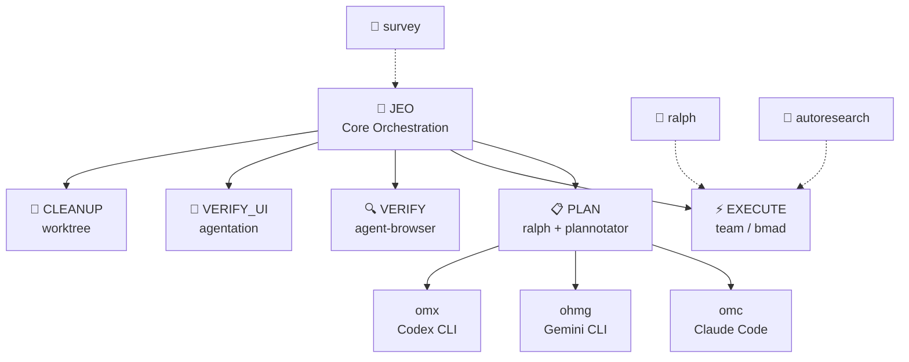

# Agent Skills

<div align="center">

[](https://github.com/akillness/oh-my-skills)
[](https://github.com/akillness/oh-my-skills)
[](LICENSE)
[](docs/bmad/README.md)
[](https://www.buymeacoffee.com/akillness3q)

**81 AI agent skills · TOON Format · Cross-platform**

[Quick Start](#-quick-start) · [Skills List](#-skills-list) · [Installation](#-installation) · [한국어](README.ko.md)

</div>

---

## 💡 What is Agent Skills?

**81 AI agent skills · TOON Format · Cross-platform**

Agent Skills is a curated collection of 81 AI agent skills for LLM-based development workflows. Built around the `jeo` orchestration protocol, it provides:
- Unified orchestration across Claude Code, Gemini CLI, OpenAI Codex, and OpenCode
- Plan → Execute → Verify → Cleanup automated pipelines
- Multi-agent team coordination with parallel execution

---

## 🚀 Quick Start

> **Prerequisite**: Install `skills` CLI before running `npx skills add`.
>
> ```bash
> npm install -g skills
> ```

```bash
# Send to your LLM agent — it will read and install automatically
curl -s https://raw.githubusercontent.com/akillness/oh-my-skills/main/setup-all-skills-prompt.md
```

| Platform | First Command |
|----------|--------------|
| Claude Code | `jeo "task description"` or `/omc:team "task"` |
| Gemini CLI | `/jeo "task description"` |
| Codex CLI | `/jeo "task description"` |
| OpenCode | `/jeo "task description"` |

---

## 🏗 Architecture



---

## 🆕 What's New in v2026-03-30

| Change | Details |
|--------|---------|
| **harness: agent team & skill architect meta-skill** | Added a dedicated `harness` skill for designing domain-specific agent teams and generating the skills they use. Covers domain analysis, architecture pattern selection (pipeline, fan-out/fan-in, expert pool, producer-reviewer, supervisor, hierarchical delegation), `.claude/agents/` and `.claude/skills/` file generation, orchestration workflow definition, and validation with trigger evals and dry-run testing. Includes `install.sh`, `validate-harness.sh` scripts, and 5 reference docs. 80 → **81 skills**. |

## 🆕 What's New in v2026-03-28

| Change | Details |
|--------|---------|
| **obsidian-cli: terminal automation for Obsidian** | Added a dedicated `obsidian-cli` skill for enabling and operating the official Obsidian CLI: installer and registration preflight, TUI vs one-shot usage, `vault=` / `file=` / `path=` targeting, `--copy`, everyday note workflows, plugin and theme control, developer commands like `plugin:reload` and `dev:screenshot`, plus platform troubleshooting references. 79 → **80 skills**. |
| **scrapling: adaptive web scraping skill** | Added a dedicated `scrapling` skill for parser-first HTML extraction, fetcher selection (`Fetcher` → `DynamicFetcher` → `StealthyFetcher`), extras-aware installation, adaptive selector recovery, CLI extraction, and second-tier MCP/spider guidance. The implementation includes install/extract/MCP wrapper scripts plus focused references for fetchers, parser behavior, CLI/MCP, and spiders. 78 → **79 skills**. |
| **strix: AI-driven application security testing skill** | Added a dedicated `strix` skill for operating the Strix CLI end-to-end: install and Docker preflight, `STRIX_LLM` provider setup, local/GitHub/live target scans, quick/standard/deep mode selection, headless CI/CD usage, and clear separation between this repo's skill and Strix internal security skills. 77 → **78 skills**. |

## 🆕 What's New in v2026-03-22

| Change | Details |
|--------|---------|
| **bmad-orchestrator renamed to bmad** | `bmad-orchestrator` skill folder renamed to `bmad`. Simplified to core BMAD workflow orchestration (Analysis → Planning → Solutioning → Implementation). Use keyword `bmad` as before. |
| **Removed copilot-coding-agent** | `copilot-coding-agent` skill removed. 77 skills total. |

## 🆕 What's New in v2026-03-19

| Change | Details |
|--------|---------|
| **clawteam: agent swarm coordination skill** | Added a dedicated `clawteam` skill for framework-agnostic multi-agent orchestration with tmux-backed workers, git worktree isolation, file-based task/inbox state, monitoring commands, and reusable templates for full-stack, ML research, and hedge-fund style teams. |
| **obsidian-plugin: Obsidian plugin development skill** | Build, validate, and publish Obsidian plugins. Covers all 27 `eslint-plugin-obsidianmd` rules, interactive boilerplate generator (`create-plugin.js`), memory management, type safety, accessibility (MANDATORY), CSS variables, vault API, and community submission validation. 75 → **76 skills**. |
| **jeo v1.6.0: `.jeo` planning ledger flow** | JEO now creates a project-local `.jeo/` folder and uses it as a durable planning/development/QA ledger: `long-term.md`, `short-term.md`, `planned.md`, `progress.md`, `history.md`, plus queued/active task files. Completed task files are summarized into history then removed; follow-up work can be queued without resetting the workflow. |
| **skill-autoresearch: eval-driven skill optimization** | New skill for improving an existing `SKILL.md` with binary evals, mutation loops, baseline scoring, and dashboard/changelog artifacts. Keeps the original `autoresearch` ML workflow separate. 76 → **77 skills**. |
| **firebase-cli: Firebase CLI skill** | Full Firebase CLI (firebase-tools) coverage — deploy, emulate, import/export, manage users, CI/CD. 74 → **75 skills**. |
| **google-workspace, langsmith, react-grab added** | 3 new skills: Google Workspace REST API automation, LangSmith LLM observability/evaluation, react-grab React element context capture. 71 → **74 skills**. |
| **research-paper-writing: ML/CV/NLP paper writing skill** | Academic paper composition for Abstract, Introduction, Method, Experiments, Conclusion. Paragraph flow, claim-evidence alignment, pre-submission review. From Prof. Peng Sida's notes. 70 → **71 skills**. |
| **Removed ai-tool-compliance and llm-monitoring-dashboard** | Removed `ai-tool-compliance` (internal compliance automation) and `llm-monitoring-dashboard`. 72 → **70 skills**. |
| **Removed deprecated agent-development skills** | Removed `agent-configuration`, `agent-evaluation`, `agentic-development-principles`, `agentic-principles`, `agentic-workflow`. 80 → **72 skills**. |
| **Removed deprecated image/media skills** | Removed `image-generation`, `image-generation-mcp`, `pollinations-ai`. Use `remotion-video-production` / `video-production` for media. |
| **autoresearch: Karpathy autonomous ML experiment skill** | AI agent modifies `train.py`, runs 5-min GPU experiments, evaluates with `val_bpb`, ratchets improvements via git. Includes `scripts/` and `references/`. |
| **jeo v1.2.3: plannotator-plan-loop.sh all-platform hardening** | Cross-platform temp dir fallback, dedicated port `PLANNOTATOR_PORT=47291`, `probe_plannotator_port()` + `wait_for_listen()`, browser-crash retry up to 3 times, structured `jeo-blocked.json` output. |
| **survey: cross-platform landscape scan** | 4-lane discovery flow, artifacts to `.survey/{slug}/`, Claude/Codex/Gemini abstraction as `settings/rules/hooks`. |
| **presentation-builder: slides-grab workflow** | HTML-first deck creation, visual editing, PPTX/PDF export. Removed duplicate `pptx-presentation-builder`. |

---

## 📦 Installation

### Step 0: Install `skills` CLI

```bash
npm install -g skills
skills --version
```

### For LLM Agents

```bash
curl -s https://raw.githubusercontent.com/akillness/oh-my-skills/main/setup-all-skills-prompt.md
```

### Choose by Platform

#### Claude Code

```bash
npx skills add https://github.com/akillness/oh-my-skills \
  --skill jeo --skill omc --skill plannotator --skill agentation \
  --skill ralph --skill ralphmode --skill vibe-kanban
```

#### Gemini CLI

```bash
npx skills add https://github.com/akillness/oh-my-skills \
  --skill jeo --skill ohmg --skill ralph --skill ralphmode --skill vibe-kanban
gemini extensions install https://github.com/akillness/oh-my-skills
```

#### Codex CLI

```bash
npx skills add https://github.com/akillness/oh-my-skills \
  --skill jeo --skill omx --skill ralph --skill ralphmode
```

#### Platform-Specific Setup

```bash
# Claude Code — jeo hook setup
bash ~/.agent-skills/jeo/scripts/setup-claude.sh

# Gemini CLI — jeo hook setup
bash ~/.agent-skills/jeo/scripts/setup-gemini.sh

# oh-my-claudecode
/plugin marketplace add https://github.com/Yeachan-Heo/oh-my-claudecode
/omc:omc-setup
```

---

## 📚 Skills List

> Full manifest: `.agent-skills/skills.json` · each folder's `SKILL.md` · 81 local skill folders = 81 total installable skills

### 🎯 Core Orchestration (11)

| Skill | Keyword | Platform | Description |
|-------|---------|----------|-------------|
| `jeo` | `jeo`, `annotate` | All | Integrated orchestration with `.jeo` ledger: Planning→Development→QA→Cleanup |
| `omc` | `omc`, `autopilot` | Claude | 32-agent orchestration layer with model routing |
| `harness` | `harness`, `build a harness` | All | Meta-skill: design domain-specific agent teams, generate `.claude/agents/` + `.claude/skills/` files, validate harness |
| `omx` | `omx` | Codex | Multi-agent orchestration for Codex CLI |
| `ohmg` | `ohmg` | Gemini | Antigravity multi-agent framework |
| `ralph` | `ralph`, `ooo` | All | Ouroboros specification-first + persistent completion loop |
| `ralphmode` | `ralphmode` | All | Automation permission profiles (sandbox-first, repo boundary) |
| `bmad` | `bmad` | Claude | Structured phase-based BMAD workflow orchestration (Analysis → Planning → Solutioning → Implementation) |
| `bmad-gds` | `bmad-gds` | All | BMAD Game Development Studio (Unity · Unreal · Godot) |
| `bmad-idea` | `bmad-idea` | All | Creative intelligence — 5 specialist ideation agents |
| `survey` | `survey` | All | Pre-implementation landscape scan |
| `harness` | `harness` | All | Agent team & skill architect — scaffold reusable harnesses across platforms |

### 📋 Planning & Review (5)

| Skill | Keyword | Description |
|-------|---------|-------------|
| `plannotator` | `plan` | Visual browser plan/diff review — approve or send feedback |
| `agentation` | `annotate` | UI annotation → targeted agent code fixes |
| `agent-browser` | `agent-browser` | Headless browser verification for AI agents |
| `playwriter` | `playwriter` | Playwright automation connecting to live browser |
| `vibe-kanban` | `kanbanview` | Visual Kanban board with git worktree isolation |

### 🤖 Agent Development (2)

| Skill | Description | Platforms |
|-------|-------------|-----------|
| `prompt-repetition` | LLM accuracy via prompt repetition technique | All |
| `skill-standardization` | SKILL.md validation against Agent Skills spec | All |

### ⚙️ Backend (5)

| Skill | Description | Platforms |
|-------|-------------|-----------|
| `api-design` | REST/GraphQL API design | All |
| `api-documentation` | OpenAPI/Swagger docs generation | All |
| `authentication-setup` | JWT, OAuth, session management | All |
| `backend-testing` | Unit/integration/API test strategies | All |
| `database-schema-design` | SQL/NoSQL schema design | All |

### 🎨 Frontend (10)

| Skill | Description | Platforms |
|-------|-------------|-----------|
| `design-system` | Design tokens, layout rules, motion, accessibility | All |
| `frontend-design-system` | Production-grade UI with design tokens and accessibility | All |
| `react-best-practices` | React & Next.js performance optimization | All |
| `react-grab` | Browser element context capture — point at UI element, copy React component name, file path, HTML to clipboard for AI agents | All |
| `vercel-react-best-practices` | Vercel Engineering React & Next.js guidelines | Claude · Gemini · Codex |
| `responsive-design` | Mobile-first layouts and breakpoints | All |
| `state-management` | Redux, Context, Zustand patterns | All |
| `ui-component-patterns` | Reusable component libraries | All |
| `web-accessibility` | WCAG 2.1 compliance | All |
| `web-design-guidelines` | Web Interface Guidelines compliance review | All |

### 🔍 Code Quality (5)

| Skill | Description | Platforms |
|-------|-------------|-----------|
| `code-refactoring` | Code simplification and refactoring | All |
| `code-review` | Comprehensive code review with API contracts | All |
| `debugging` | Root cause analysis, regression isolation | All |
| `performance-optimization` | Speed, efficiency, scalability optimization | All |
| `testing-strategies` | Test pyramid, coverage, flaky-test hardening | All |

### 🏗 Infrastructure (12)

| Skill | Description | Platforms |
|-------|-------------|-----------|
| `deployment-automation` | CI/CD, Docker/Kubernetes, cloud infrastructure | All |
| `environment-setup` | Dev/staging/production environment config | All |
| `firebase-ai-logic` | Firebase AI Logic (Gemini) integration | Claude · Gemini |
| `firebase-cli` | Firebase CLI (firebase-tools) — deploy Hosting, Functions, Firestore, Realtime DB, Storage, Extensions, Emulator Suite | All |
| `genkit` | Firebase Genkit AI flows and RAG pipelines | Claude · Gemini |
| `looker-studio-bigquery` | Looker Studio + BigQuery dashboards | All |
| `monitoring-observability` | Health checks, metrics, log aggregation | All |
| `scrapling` | Adaptive web scraping with parser-first `Selector`, HTTP/browser/stealth fetchers, CLI extraction, and optional MCP/spider workflows | All |
| `security-best-practices` | OWASP Top 10, RBAC, API security | All |
| `strix` | Strix CLI for AI-driven application security testing - Docker preflight, LLM provider setup, local/GitHub/live target scans, scan modes, and CI/CD usage | All |
| `system-environment-setup` | Reproducible environment configuration | All |
| `vercel-deploy` | Vercel deployment automation | All |

### 📝 Documentation (5)

| Skill | Description | Platforms |
|-------|-------------|-----------|
| `changelog-maintenance` | Changelog management and versioning | All |
| `presentation-builder` | HTML slides with slides-grab, PPTX/PDF export | All |
| `research-paper-writing` | ML/CV/NLP academic paper writing — Abstract, Introduction, Method, Experiments, Conclusion; claim-evidence alignment, pre-submission review | All |
| `technical-writing` | Technical documentation and specs | All |
| `user-guide-writing` | User guides and tutorials | All |

### 📊 Project Management (4)

| Skill | Description | Platforms |
|-------|-------------|-----------|
| `sprint-retrospective` | Sprint retrospective facilitation | All |
| `standup-meeting` | Daily standup management | All |
| `task-estimation` | Story points, t-shirt sizing, planning poker | All |
| `task-planning` | Task breakdown and user stories | All |

### 🔭 Search & Analysis (7)

| Skill | Description | Platforms |
|-------|-------------|-----------|
| `autoresearch` | Autonomous ML experiments (Karpathy) — AI agent runs overnight GPU experiments, ratchets improvements via git | All |
| `skill-autoresearch` | Eval-driven optimization loop for improving an existing SKILL.md without replacing the ML-focused `autoresearch` workflow | All |
| `codebase-search` | Codebase search & navigation | All |
| `data-analysis` | Dataset analysis, visualizations, statistics | All |
| `langsmith` | LLM observability, tracing, evaluation, and prompt management via LangSmith | All |
| `log-analysis` | Log analysis and incident debugging | All |
| `pattern-detection` | Pattern and anomaly detection | All |

### 🎬 Creative Media (2)

| Skill | Description | Platforms |
|-------|-------------|-----------|
| `remotion-video-production` | Programmable video production with Remotion | All |
| `video-production` | Produce programmable videos with Remotion — scene planning, asset orchestration | All |

### 📢 Marketing (2)

| Skill | Description | Platforms |
|-------|-------------|-----------|
| `marketing-automation` | 23 sub-skills: CRO, copywriting, SEO, analytics, growth | All |
| `marketing-skills-collection` | 23 sub-skills: CRO, copywriting, SEO, analytics, growth | All |

### 🔧 Utilities (10)

| Skill | Description | Platforms |
|-------|-------------|-----------|
| `fabric` | AI prompt patterns — YouTube summaries, document analysis via 200+ Patterns | All |
| `file-organization` | File and folder organization | All |
| `git-submodule` | Git submodule management | All |
| `git-workflow` | Commit, branch, merge, PR workflows | All |
| `google-workspace` | Google Workspace REST API automation — Docs, Sheets, Slides, Drive, Gmail, Calendar, Chat, Forms, Admin SDK, Apps Script | All |
| `npm-git-install` | Install npm packages from GitHub | All |
| `obsidian-cli` | Operate the official Obsidian CLI — enablement, TUI, note and task automation, vault and file targeting, plugin reload, developer commands | All |
| `obsidian-plugin` | Obsidian plugin development — 27 ESLint rules, boilerplate generator, accessibility, submission validation | All |
| `opencontext` | Persistent memory and context management for AI agents | All |
| `workflow-automation` | Automate repetitive development workflows | All |

---

## 🧬 TOON Format Injection

TOON (Token-Oriented Object Notation) compresses the skill catalog and auto-injects it into every prompt. **40-50% token savings** vs JSON/Markdown.

| Platform | File | Mechanism |
|----------|------|-----------|
| Claude Code | `~/.claude/hooks/toon-inject.mjs` | `UserPromptSubmit` hook — 26-37ms |
| Gemini CLI | `~/.gemini/hooks/toon-skill-inject.sh` | `includeDirectories` session load |
| Codex CLI | `~/.codex/skills-toon-catalog.toon` | Static catalog |

- **Tier 1** (always): Skill catalog index (~875-3,500 tokens) — names + descriptions + tags
- **Tier 2** (on-demand): Individual SKILL.toon content (~292 tokens/skill, max 3)

---

## 🔮 Featured Tools

### jeo — Integrated Agent Orchestration
> Keyword: `jeo` · `annotate` | Platforms: Claude · Codex · Gemini · OpenCode

Complete automated pipeline: Plan (ralph+plannotator) → Execute (team/bmad) → Verify (agent-browser) → UI Feedback (agentation) → Cleanup.

JEO now also maintains a project-local `.jeo/` ledger so the workflow has durable long-term rules, short-term system/test plans, queued work, live progress notes, and append-only history across sessions.

| Phase | Tool | Description |
|-------|------|-------------|
| Plan / Planning | ralph + plannotator + `.jeo/short-term.md` | Visual plan review plus system/unit/flow test planning |
| Execute / Development | omc team / bmad + `.jeo/tasks/active/*.md` | Parallel agent execution with active work-item tracking |
| Verify / QA | agent-browser + agentation (`annotate`) | Browser behavior verification, annotation fixes, QA evidence |
| Cleanup | worktree-cleanup.sh | Auto worktree cleanup |

### plannotator — Visual Plan Review
> Keyword: `plan` | [Docs](docs/plannotator/README.md) | [GitHub](https://github.com/backnotprop/plannotator)

Browser UI for annotating AI plans. Approve or send structured feedback in one click. Works with Claude Code, OpenCode, Gemini CLI, and Codex CLI.

```bash
bash scripts/install.sh --all
```

### ralph — Specification-First Development
> Keyword: `ralph`, `ooo` | [Docs](docs/ralph/README.md) | [GitHub](https://github.com/Q00/ouroboros)

Socratic interview → immutable spec → Double Diamond execution → 3-stage verification → loop until passed.

```bash
ooo interview "I want to build a task management CLI"
ooo seed && ooo run && ooo evaluate <session_id>
ooo ralph "fix all failing tests"
```

### vibe-kanban — AI Agent Kanban Board
> Keyword: `kanbanview` | [Docs](docs/vibe-kanban/README.md) | [GitHub](https://github.com/BloopAI/vibe-kanban)

Visual Kanban (To Do → In Progress → Review → Done) with parallel AI agents isolated via git worktrees.

```bash
npx vibe-kanban
```

---

## 🌐 Recommended Harness OSS

| Repository | Stars | Description |
|-----------|------:|-------------|
| [AutoGPT](https://github.com/Significant-Gravitas/AutoGPT) | 182k | Accessible AI platform for continuous agents |
| [AutoGen](https://github.com/microsoft/autogen) | 55.4k | Microsoft multi-agent conversation framework |
| [CrewAI](https://github.com/crewAIInc/crewAI) | 45.7k | Role-playing autonomous AI agent orchestration |
| [smolagents](https://github.com/huggingface/smolagents) | 25.9k | HuggingFace code-thinking agent library |
| [agency-agents](https://github.com/msitarzewski/agency-agents) | 21.2k | 61 specialized AI agents across 9 divisions |
| [revfactory/harness](https://github.com/revfactory/harness) | meta-skill | Agent team & skill architect plugin / scaffold |

> Install & integration notes → [docs/harness/README.md](docs/harness/README.md) · packaged skill → [.agent-skills/harness/SKILL.md](.agent-skills/harness/SKILL.md)

---

## 📁 Structure

```text
.
├── .agent-skills/          ← 81 skill folders (each with SKILL.md + SKILL.toon)
├── docs/                   ← detailed guides (bmad, omc, plannotator, ralph, ...)
├── install.sh
├── setup-all-skills-prompt.md
├── README.md               ← English (this file)
└── README.ko.md            ← 한국어
```

---

## 📖 Related Docs

| Tool | Keyword | Doc |
|------|---------|-----|
| `jeo` | `jeo`, `annotate` | [.agent-skills/jeo/SKILL.md](.agent-skills/jeo/SKILL.md) |
| `plannotator` | `plan` | [docs/plannotator/README.md](docs/plannotator/README.md) |
| `vibe-kanban` | `kanbanview` | [docs/vibe-kanban/README.md](docs/vibe-kanban/README.md) |
| `ralph` | `ralph` | [docs/ralph/README.md](docs/ralph/README.md) |
| `harness` | `harness` | [.agent-skills/harness/SKILL.md](.agent-skills/harness/SKILL.md) |
| `omc` | `omc` | [docs/omc/README.md](docs/omc/README.md) |
| `bmad` | `bmad` | [docs/bmad/README.md](docs/bmad/README.md) |
| Harness OSS | — | [docs/harness/README.md](docs/harness/README.md) |

---

## 📎 References

| Component | Source | License |
|-----------|--------|---------|
| `jeo` | Internal | MIT |
| `omc` | [Yeachan-Heo/oh-my-claudecode](https://github.com/Yeachan-Heo/oh-my-claudecode) | MIT |
| `ralph` | [Q00/ouroboros](https://github.com/Q00/ouroboros) | MIT |
| `plannotator` | [plannotator.ai](https://plannotator.ai) | MIT |
| `bmad` | [bmad-dev/BMAD-METHOD](https://github.com/bmad-dev/BMAD-METHOD) | MIT |
| `agentation` | [benjitaylor/agentation](https://github.com/benjitaylor/agentation) | MIT |
| `fabric` | [danielmiessler/fabric](https://github.com/danielmiessler/fabric) | MIT |
| `harness` | [revfactory/harness](https://github.com/revfactory/harness) | Apache-2.0 |
| `obsidian-cli` | [Obsidian CLI Help](https://obsidian.md/help/cli) | Proprietary |
| `scrapling` | [D4Vinci/Scrapling](https://github.com/D4Vinci/Scrapling) | BSD-3-Clause |
| `strix` | [usestrix/strix](https://github.com/usestrix/strix) | Apache-2.0 |
| `autoresearch` | Andrej Karpathy methodology | — |
| `research-paper-writing` | [Master-cai/Research-Paper-Writing-Skills](https://github.com/Master-cai/Research-Paper-Writing-Skills) | — |
| Agent Skills Spec | [agentskills.io](https://agentskills.io/specification) | — |

---

<div align="center">

[](https://www.buymeacoffee.com/akillness3q)

⭐ If this helps you, star the repository!

```bash
gh api --silent --method PUT /user/starred/akillness/oh-my-skills >/dev/null 2>&1 || true
```

</div>
