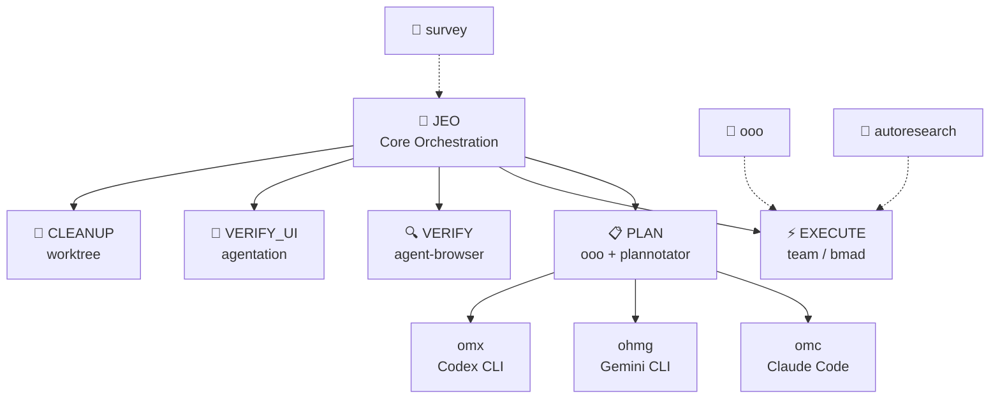

# Agent Skills

<div align="center">

[](https://github.com/akillness/oh-my-skills)
[](https://github.com/akillness/oh-my-skills)
[](LICENSE)
[](docs/bmad/README.md)
[](https://www.buymeacoffee.com/akillness3q)

**128 local skill folders · 128 installable skills · TOON Format · Cross-platform**

[Quick Start](#-quick-start) · [Skills List](#-skills-list) · [Installation](#-installation) · [한국어](README.ko.md)

</div>

---

## 💡 What is Agent Skills?

**128 local skill folders · 128 installable skills · TOON Format · Cross-platform**

Agent Skills is a curated collection with 128 local skill folders and 128 installable skills for LLM-based development workflows. Built around the `jeo` orchestration protocol, it provides:
- Unified orchestration across Claude Code, Gemini CLI, OpenAI Codex, and OpenCode
- Plan → Execute → Verify → Cleanup automated pipelines
- Multi-agent team coordination with parallel execution

---

## 🚀 Quick Start

> **Prerequisite**: Install `skills` CLI before running `npx skills add`.
>
> ```bash
> npm install -g skills
> ```

```bash
# Send to your LLM agent — it will read and install automatically
curl -s https://raw.githubusercontent.com/akillness/oh-my-skills/main/setup-all-skills-prompt.md
```

| Platform | First Command |
|----------|--------------|
| Claude Code | `jeo "task description"` or `/team "task"` |
| Gemini CLI | `/jeo "task description"` |
| Codex CLI | `/jeo "task description"` |
| OpenCode | `/jeo "task description"` |

---

## 🏗 Architecture



---

## 🆕 What's New in v2026-05-19

| Change | Details |
|--------|---------|
| **semble: token-efficient code search for agents** | Added `semble` — a fast, accurate code search library that returns only the relevant code snippets agents need, using ~98% fewer tokens than grep+read. Indexes any local or remote repository in ~250ms entirely on CPU (no GPU or API key needed). Supports natural-language and symbol queries, semantic similar-code discovery (`find-related`), and MCP server integration for Claude Code, Codex, Cursor, and OpenCode. Python library and CLI both available. Plugin: `claude mcp add semble -s user -- uvx --from "semble[mcp]" semble`. Source: [MinishLab/semble](https://github.com/MinishLab/semble). 127 → **128 skills**. |

## 🆕 What's New in v2026-05-04 (mattpocock skills integration)

| Change | Details |
|--------|---------|
| **15 new skills from mattpocock/skills** | Integrated Matt Pocock's engineering skills collection (58k+ GitHub stars). New skills: `diagnose` (systematic 6-phase debugging), `tdd` (red-green-refactor vertical slices), `grill-with-docs` (design review with domain docs), `triage` (issue state machine), `improve-codebase-architecture` (deepening opportunities), `to-issues` (plan→tickets), `to-prd` (PRD generation), `zoom-out` (architectural perspective), `caveman` (~75% token reduction mode), `grill-me` (plan stress-testing), `write-a-skill` (skill creation framework), `git-guardrails-claude-code` (destructive git prevention), `setup-pre-commit` (Husky/lint-staged), `scaffold-exercises` (educational structure), `migrate-to-shoehorn` (type-safe test assertions). 98 → **113 skills**. Source: [mattpocock/skills](https://github.com/mattpocock/skills). |
| **obsidian: unified Obsidian skill (v2.0)** | Merged `obsidian-plugin` and `obsidian-cli` into a single unified `obsidian` skill incorporating [kepano/obsidian-skills](https://github.com/kepano/obsidian-skills) content. Covers plugin development (27 ESLint rules, boilerplate, accessibility, submission), desktop CLI automation (commands, TUI, URI handoff, developer mode), and Obsidian content patterns (markdown, Bases, JSON Canvas, Defuddle). Plugin-installable: `claude plugin marketplace add akillness/oh-my-skills`. 113 → **114 skills**. |

## 🆕 What's New in v2026-05-04

| Change | Details |
|--------|---------|
| **agentic-skills: production engineering framework** | Added `agentic-skills` — a production-grade engineering skill that encodes Google-proven workflows and quality gates for AI coding agents. Covers spec-driven development (`/spec`), task planning (`/plan`), incremental TDD (`/build`), browser verification (`/test`), five-axis code review (`/review`), behavior-preserving simplification (`/code-simplify`), and disciplined git/CI/CD shipping (`/ship`). Draws from *Software Engineering at Google* (Hyrum's Law, Chesterton's Fence, Shift Left, trunk-based development). Plugin install: `/plugin marketplace add addyosmani/agent-skills`. 95 → **96 skills**. |
| **open-design: local-first design artifact generation** | Added `open-design` — an open-source alternative to Anthropic's Claude Design that generates web/mobile/desktop prototypes, presentation decks, and media artifacts using locally-installed coding agents. Features 72 built-in design systems (Linear, Stripe, Vercel, Notion, Apple, etc.), 5 visual directions, multi-format export (HTML/PDF/PPTX/ZIP/Markdown), and AI media generation via gpt-image-2, Seedance 2.0, and HyperFrames. Supports 93 prompt templates. Plugin: `claude plugin marketplace add nexu-io/open-design`. 97 → **98 skills**. |
| **browser-harness: self-healing LLM browser automation** | Added `browser-harness` — a self-healing framework that connects LLMs directly to Chrome via Chrome DevTools Protocol (CDP). The agent writes and improves `agent_helpers.py` helper code during execution, contributing to a community library of domain skills (site-specific playbooks). Optional Browser Use Cloud integration for concurrent browsers, residential proxies, and captcha solving. Setup via Claude Code prompt: "Set up https://github.com/browser-use/browser-harness for me". Source: [browser-use/browser-harness](https://github.com/browser-use/browser-harness). 126 → **127 skills**. |

## 🆕 What's New in v2026-04-18

| Change | Details |
|--------|---------|
| **plannotator: review-packet structural hardening** | Tightened `plannotator` into a routing-first visual approval gate for concrete plans, markdown specs, and diffs. It now chooses one primary packet (`plan-review`, `diff-review`, `markdown-review`, `platform-setup`, or `troubleshooting`), adds `references/intake-packets-and-route-outs.md`, updates platform/troubleshooting guidance around native-hook vs manual-review reality, expands `evals/evals.json` with markdown-review and Codex setup truthfulness cases, and syncs compact/setup/manifest wording so discovery surfaces stop overselling it as a generic plan-only or code-review tool. |
| **skill-autoresearch: packet-first structural hardening** | Tightened `skill-autoresearch` into a smaller repo-local ratcheting front door. It now chooses one packet (`ratchet-eligibility`, `benchmark-readiness`, `charter-freeze`, `baseline-score`, `one-change-mutation`, `support-sync`, `final-report`, or `route-out`), allows `no ratchet justified` before mutation churn, adds `references/run-packets-and-route-outs.md`, expands `evals/evals.json`, and syncs compact/manifest/setup wording so the repo advertises `skill-autoresearch` as the local benchmark-and-ratchet layer instead of a generic eval tool. |
| **graphify: live-skill promotion + structural hardening** | Promoted `graphify` from the hidden nested `utilities/graphify` folder into the live top-level skill catalog, tightened it into a routing-first graph front door, added `references/mode-packets-and-route-outs.md` plus `references/build-and-fallback-recipes.md`, added `SKILL.toon`, refreshed `evals/evals.json`, and synced README/setup/manifest surfaces so the durable graph lane is actually installable and discoverable. |
| **looker-studio-bigquery: packet-first structural hardening** | Tightened `looker-studio-bigquery` into a smaller reporting front door. It now starts from one packet (`dashboard-spec`, `slow-dashboard`, `refresh-shape`, `audience-split`, or `exec-handoff`), adds `references/intake-packets-and-route-outs.md`, expands `evals/evals.json` with a Connected Sheets / exec-handoff case, and syncs `SKILL.toon` / `skills.toon` / `skills.json` plus README/setup wording so the repo advertises the BigQuery reporting lane as packet-first instead of a long BI feature tour. |
| **web-accessibility: routing-first structural hardening** | Tightened `web-accessibility` into a smaller routing-first remediation anchor. It now starts from one primary accessibility packet (`semantics-structure`, `keyboard-focus`, `labels-announcements`, `visual-perception-reflow`, `media-alternatives`, or `routed-navigation-feedback`), adds `references/intake-packets-and-route-outs.md`, expands `evals/evals.json` with routed-app and responsive-boundary cases, and syncs `SKILL.toon` / `skills.toon` / `skills.json` plus README/setup wording so discovery surfaces stop drifting back to a generic WCAG/ARIA tutorial. |
| **marketing-automation: operator-packet ratchet** | Tightened `marketing-automation` so the broad marketing front door now resolves vague asks into one operating mode, one primary lane, and one reusable operator packet with owner, dependencies/approvals, and proof instead of just a tactic list. Added `references/operator-packet-and-proof-stack.md`, expanded `evals/evals.json` with a legal/analytics dependency case, and synced `SKILL.toon` / manifest wording plus README/setup discovery surfaces so the repo advertises the sharper packet contract truthfully. |
| **sprint-retrospective: structural hardening** | Tightened `sprint-retrospective` into a routing-first PM anchor for sprint retros, milestone postmortems, remote/hybrid facilitation, and dead-action-item recovery across software, product/ops, marketing/GTM, and game-delivery work. The front door now picks one retrospective mode, reviews prior commitments before new actions, keeps action counts brutally small, routes planning/sizing/daily-sync work outward, and adds `references/action-review-and-packet-shapes.md`, refreshed `evals/evals.json`, and synced compact/manifest discovery wording. |
| **autoresearch: routing-first structural hardening** | Tightened `autoresearch` into a smaller Karpathy ML search front door. It now chooses one mode (`setup readiness`, `program.md` authoring, bounded run loop, results interpretation, or constrained-hardware adaptation), keeps the immutable `prepare.py` / 300-second / `val_bpb` contract explicit, adds `references/operating-modes-and-route-outs.md`, refreshes `evals/evals.json`, and sharpens route-outs to `skill-autoresearch` plus app-level eval / observability tools instead of acting like a giant end-to-end explainer. |

## 🆕 What's New in v2026-04-20

| Change | Details |
|--------|---------|
| **testing-strategies: gate-truth handoff ratchet** | Tightened `testing-strategies` around **which gate is actually being decided** before expanding into layer talk. It now names `merge-gate-truth`, `release-gate-truth`, or `scheduled-breadth-truth`, adds `references/gate-truth-and-release-handovers.md`, expands `evals/evals.json` with protected-branch and Steam/build-checklist boundary cases, refreshes `SKILL.toon`, and syncs README/setup/manifest wording so the skill stops blurring PR blockers with release-only or platform-launch proof. |
| **steam-store-launch-ops: packet-first structural hardening** | Tightened `steam-store-launch-ops` into a smaller packet-first Steam launch router. It now chooses one primary packet (`page-promise-audit`, `wishlist-signal-check`, `demo-readiness-gate`, `event-timing-workback`, or `launch-ops-runbook`), adds `references/intake-packets-and-route-outs.md`, expands `evals/evals.json` with route-out and broad-GTM boundary cases, refreshes `SKILL.toon`, and syncs README/setup/manifest wording so the game lane stays Steam-specific instead of drifting into generic marketing or demo-feedback work. |

## 🆕 What's New in v2026-04-17

| Change | Details |
|--------|---------|
| **steam-store-launch-ops: bottleneck-router hardening** | Tightened `steam-store-launch-ops` into a diagnosis-first Steam launch/store router for indie games. It now separates `visibility-acquisition`, `promise-clarity`, `proof-demo-readiness`, `timing-hook-fit`, and `launch-ops-readiness`; makes the current hook explicit (coming-soon page, wishlist anomaly, demo decision, Next Fest, or launch window); recommends one intervention and one next artifact instead of a generic marketing dump; and adds `references/diagnostic-model.md`, `references/event-hooks.md`, refreshed `evals/evals.json`, and synced `SKILL.toon` without adding a duplicate game-marketing skill. |

## 🆕 What's New in v2026-04-15

| Change | Details |
|--------|---------|
| **game-performance-profiler: routing-first structural hardening** | Tightened `game-performance-profiler` into a smaller bottleneck-first profiling front door. It now leans on `references/mode-selection-and-route-outs.md` plus the existing packet/device/escalation references, keeps one output contract (`Game Performance Profiling Brief`), adds a build-failure route-out eval case, and sharpens discovery wording around quick packets, benchmark routes, target-device review, and deliberate profiler escalation instead of a giant optimization essay. |
| **agent-browser: fresh-session verification rewrite** | Reframed `agent-browser` from a generic browser CLI guide into the browser-review lane's **fresh-session deterministic verification** anchor. It now chooses the clean browser lane first, enforces an observe → act → observe loop, makes route-outs explicit to `playwriter`, `agentation`, and `plannotator`, adds `references/modes-and-routing.md` plus `evals/evals.json`, and keeps auth reuse bounded instead of silently sliding into a running-browser workflow. |
| **agentation: UI annotation router rewrite** | Reframed `agentation` from a monolithic install/config catalog into the planning-review lane's exact rendered-UI feedback router. It now chooses among copy-paste review, synced watch-loop, self-driving critique, and platform-setup modes; keeps route-outs explicit to `agent-browser`, `playwriter`, and `plannotator`; adds `references/modes-and-routing.md`, `references/platform-setup-and-hooks.md`, `references/watch-loop-and-self-driving.md`, and `evals/evals.json`; and fixes top-level discovery surfaces so the repo now consistently advertises **89 skills**. |
| **git-submodule: routing-first structural hardening** | Tightened `git-submodule` into a smaller operator front door. It still chooses submodule vs subtree/vendoring/package delivery first, but now pushes mode-specific packets into `references/mode-packets-and-hosted-constraints.md`, adds a hosted-platform boundary for GitHub Pages public-`https://` submodule limits, extends eval coverage with that hosted-constraint case, and refreshes discovery wording so recursive bootstrap, pointer updates, detached-HEAD handling, CI auth, and hosted checkout limits stay visible without turning the skill back into a giant command catalog. |
| **bmad-idea: pre-planning concept-router rewrite** | Reframed `bmad-idea` from a legacy BMAD-CIS command/persona catalog into the repository's pre-planning idea router. It now normalizes early-stage product, GTM, consulting, and game packets; chooses one framing mode (`problem framing`, `audience and value framing`, `concept shaping`, `game concept framing`, or `story packaging`); produces one reusable concept artifact; routes cleanly to `bmad`, `task-planning`, `marketing-automation`, or `bmad-gds`; and ships `references/operating-modes.md`, `references/handoff-boundaries.md`, `references/concept-packet-template.md`, and `evals/evals.json` without increasing the skill count. |
| **genkit: packet-first structural hardening** | Tightened `genkit` into a smaller routing-first backend AI workflow anchor. It now starts from the current packet (new capability, existing route handler, deployed flow quality, runtime/deploy, or comparison/fallback), adds `references/intake-packets-and-fallbacks.md`, expands the mode selector with `comparison-or-fallback`, keeps plain SDK / route-handler and durable-workflow fallbacks visible, extends eval coverage with a thin-route boundary case, and syncs `SKILL.toon` / `skills.toon` / `skills.json` wording so discovery surfaces stay aligned with the server-owned workflow contract instead of drifting back to a generic full-stack AI framework pitch. |
| **firebase-ai-logic: client-integration support hardening** | Upgraded `firebase-ai-logic` from a thin companion note into the Firebase lane's **app/client integration anchor**. It now chooses among direct feature fit, app wiring, production hardening, and escalation-boundary modes; adds `references/modes-and-routing.md`, `references/production-controls.md`, `references/feature-packets.md`, and `evals/evals.json`; makes route-outs explicit to `genkit` for backend workflows and `firebase-cli` for operator tasks; and removes stale setup guidance that previously blurred app SDK work with backend orchestration. |

## 🆕 What's New in v2026-04-14

| Change | Details |
|--------|---------|
| **npm-git-install: packet-first hardening** | Tightened `npm-git-install` into a smaller routing-first package-delivery anchor. It now starts from the packet teams actually have (temporary bridge, shared bridge, private-auth, artifact fallback, workspace inner loop, or durable distribution), adds `references/intake-packets-and-route-outs.md`, expands eval coverage with a shared internal tooling case, and syncs `SKILL.toon` / `skills.toon` / `skills.json` wording so compact discovery surfaces stop drifting back to stale generic Git-install language. |
| **web-design-guidelines: UI-audit rewrite** | Reframed `web-design-guidelines` from a thin Vercel-rules fetcher into the frontend cluster's broad interface audit anchor for launch-readiness, polish/consistency, flow-friction, heuristic, and rule-overlay reviews. It now classifies findings across hierarchy, clarity, states, responsiveness basics, accessibility basics, and performance/trust signals; adds explicit route-outs to `web-accessibility`, `responsive-design`, `ui-component-patterns`, `design-system`, and `react-best-practices`; and ships `references/review-modes-and-categories.md`, `references/handoff-boundaries.md`, `references/ui-audit-packet-template.md`, and `evals/evals.json` without increasing the skill count. |
| **monitoring-observability: packet-first hardening** | Tightened `monitoring-observability` into a smaller routing-first observability anchor. It now starts from the packet teams actually have (service-health, telemetry-foundation, dashboard/alert audit, data-pipeline trust, or game live-ops visibility), adds `references/intake-packets-and-route-outs.md`, expands eval coverage with review-audit and deployment-route-out cases, and syncs `SKILL.toon` / `skills.toon` / `skills.json` wording so compact discovery surfaces stop drifting back to the old generic monitoring-setup behavior. |
| **performance-optimization: artifact-first hardening** | Tightened `performance-optimization` into an artifact-first measurement-led tuning anchor. It now starts from the packet teams actually have (trace, Lighthouse/CWV report, query plan, load-test diff, profiler output, or stakeholder report), adds `references/intake-packets-and-escalations.md`, sharpens route-outs to `monitoring-observability`, `debugging`, `code-refactoring`, `testing-strategies`, and `game-performance-profiler`, expands eval coverage for marketing/CWV and CI benchmark cases, and syncs compact/discovery wording so the front door no longer drifts back to stale generic optimization language. |
| **code-refactoring: packet-first structural hardening** | Tightened `code-refactoring` into a smaller routing-first cleanup anchor. It now starts from the cleanup packet teams actually have (local cleanup, fragile legacy area, repeated migration / codemod, or cleanup-heavy diff shaping), adds `references/intake-packets-and-route-outs.md`, expands eval coverage with a search-first blast-radius route-out, and syncs `SKILL.toon` / `skills.toon` / `skills.json` so compact discovery no longer advertises a stale generic DRY/SOLID design-pattern helper. |
| **changelog-maintenance: packet-first hardening** | Tightened `changelog-maintenance` into a smaller routing-first release-writing anchor. It now chooses one primary mode plus the smallest truthful output packet (`single-entry`, `summary-plus-links`, `migration-brief`, `patch-note-brief`, or `sync-packet`), adds `references/output-packets-and-channel-handoffs.md`, expands eval coverage with a release-notes + migration-window + sync-followups case, and syncs compact/discovery wording so the skill no longer drifts back to a generic changelog / semver template dump. |

## 🆕 What's New in v2026-04-20

| Change | Details |
|--------|---------|
| **backend-testing: packet-first structural hardening** | Tightened `backend-testing` into a packet-first backend test router. It now starts by classifying one backend testing packet (`coverage-plan`, `fixture-and-reset-plan`, `contract-and-api-checks`, `flake-stabilization`, or `execution-lane-split`), adds `references/intake-packets-and-route-outs.md`, expands eval coverage with a contract-protection case, and syncs `SKILL.toon` / README / setup / manifest wording so the skill stops drifting back to a generic “write some backend tests” catch-all. |

## 🆕 What's New in v2026-04-19

| Change | Details |
|--------|---------|
| **omc: routing-first structural hardening** | Tightened `omc` into a smaller Claude-first orchestration router. It now distinguishes plugin slash skills (`/team`, `/autopilot`, `/ralph`, `/ultrawork`) from the shell-side `omc` CLI (`omc setup`, `omc team`, `omc ask`), adds `references/intake-packets-and-route-outs.md`, refreshes eval coverage for plugin-vs-CLI and recovery cases, updates the detailed `docs/omc/README.md` guide to stop using stale `/omc:*` examples, and syncs README/setup/manifest discovery wording so users see OMC as a truthful runtime router instead of a giant command catalog. |
| **ui-component-patterns: structural hardening** | Tightened `ui-component-patterns` into a routing-first reusable-component architecture skill. It now classifies one primary packet (`primitive-boundary`, `slot-anatomy`, `controlled-ownership`, `alternate-root-composition`, or `docs-verification`) before suggesting props, adds `references/intake-packets-and-route-outs.md`, expands eval coverage with alternate-root and Storybook/docs-verification cases, refreshes `SKILL.toon` / manifest discovery wording, and keeps `design-system`, `web-accessibility`, `responsive-design`, `state-management`, and `react-best-practices` as explicit route-outs instead of drifting back to a generic component-best-practices catch-all. |
| **responsive-design: structural hardening** | Tightened `responsive-design` into a routing-first responsive strategy skill that chooses one primary packet (`page-layout`, `component-slot`, `dense-data`, `media-behavior`, or `verification-reflow`) before suggesting CSS. The skill now moves packet routing into `references/intake-packets-and-route-outs.md`, expands eval coverage with a launch-readiness boundary case, refreshes `SKILL.toon` / manifest discovery surfaces, and keeps `ui-component-patterns`, `web-accessibility`, `design-system`, and `web-design-guidelines` as explicit route-outs instead of letting responsive work sprawl into a generic frontend catch-all. |
| **testing-strategies: structural hardening** | Tightened `testing-strategies` into a packet-first validation-policy router. It now starts from one policy packet (`change-risk`, `gate-design`, `flake-cost`, `release-readiness`, or `incident-ratchet`), adds `references/intake-packets-and-route-outs.md`, expands eval coverage with release-readiness and accessibility-boundary cases, refreshes `SKILL.toon` / manifest discovery wording, and keeps `backend-testing`, `debugging`, `code-review`, `web-accessibility`, and `performance-optimization` as explicit route-outs instead of drifting back into a giant generic testing manifesto. |

## 🆕 What's New in v2026-04-13

| Change | Details |
|--------|---------|
| **responsive-design: layout-adaptation rewrite** | Reframed `responsive-design` from a long generic CSS example dump into the frontend cluster's mobile-first, container-aware layout adaptation skill. It now classifies viewport-vs-container failures, prioritizes intrinsic layout before breakpoint sprawl, adds explicit route-outs to `ui-component-patterns`, `web-accessibility`, `design-system`, and `web-design-guidelines`, and ships `references/layout-decision-checklist.md`, `references/handoff-boundaries.md`, and `evals/evals.json` without increasing the skill count. |

## 🆕 What's New in v2026-04-12

| Change | Details |
|--------|---------|
| **bmad: packet-first BMAD router ratchet** | Tightened `bmad` into a packet-first BMAD/BMM front door. It now starts from the packet already in hand (idea notes, PRD, architecture draft, review feedback, brownfield repo state, or milestone pressure), chooses one next artifact or gate, keeps review/runtime boundaries explicit, adds `references/intake-packets-and-route-outs.md`, expands evals with a brownfield mixed-state case, and refreshes discovery wording so `bmad` stops reading like a generic phase catalog. |
| **bmad-gds: game producer/orchestration rewrite** | Reframed `bmad-gds` from a generic phase catalog into a practical game-production coordination skill. It now acts as the repo's game-cluster orchestrator: normalizes mixed packets (idea, GDD, playtest notes, bug/build issues, launch targets), chooses one operating mode, produces one milestone-aware coordination brief, and routes detailed work to `game-demo-feedback-triage`, `game-build-log-triage`, `game-performance-profiler`, `steam-store-launch-ops`, `task-planning`, or `bmad-idea` as needed. Added `references/operating-modes.md`, `references/scope-boundaries.md`, and `evals/evals.json` without increasing the skill count. |

## 🆕 What's New in v2026-04-08

| Change | Details |
|--------|---------|
| **graphify: repo and corpus knowledge-graph skill** | Added a dedicated `graphify` skill for turning repositories or mixed corpora into persistent knowledge-graph artifacts with `GRAPH_REPORT.md`, `graph.json`, and HTML visualization. Covers the tested Python API pipeline, graph queries, graph-backed architecture discovery, and assistant install flows; includes `references/overview.md` and `evals/evals.json`. 84 → **85 skills**. |
| **llm-wiki: persistent LLM-maintained markdown wiki skill** | Added a dedicated `llm-wiki` skill for turning raw sources into a compounding Obsidian or markdown knowledge base. It bootstraps a vault with `raw/`, `wiki/`, `index.md`, `log.md`, and `AGENTS.md`; ships helper scripts for bootstrap, Scrapling-powered URL ingest, query filing, and linting; and pushes schema, ingest, filing, and scaling detail into focused references. Includes `evals/` plus `skill-autoresearch-llm-wiki/` baseline, changelog, results, and dashboard artifacts. 82 → **83 skills**. |
| **rtk: Rust Token Killer setup and operations skill** | Added a dedicated `rtk` skill for installing, verifying, and initializing Rust Token Killer across Claude Code, Codex, Gemini CLI, Cursor, Copilot, Windsurf, Cline, and OpenCode. The skill starts with `rtk gain` verification, handles the common wrong-package collision, ships install/init/status wrapper scripts, and pushes deeper platform and troubleshooting details into focused reference docs. Includes `evals/` plus `skill-autoresearch-rtk/` baseline, changelog, results, and dashboard artifacts. 81 → **82 skills**. |

## 🆕 What's New in v2026-03-30

| Change | Details |
|--------|---------|
| **harness: agent team & skill architect meta-skill** | Added a dedicated `harness` skill for designing domain-specific agent teams and generating the skills they use. Covers domain analysis, architecture pattern selection (pipeline, fan-out/fan-in, expert pool, producer-reviewer, supervisor, hierarchical delegation), `.claude/agents/` and `.claude/skills/` file generation, orchestration workflow definition, and validation with trigger evals and dry-run testing. Includes `install.sh`, `validate-harness.sh` scripts, and 5 reference docs. 80 → **81 skills**. |

## 🆕 What's New in v2026-03-28

| Change | Details |
|--------|---------|
| **obsidian-cli: routing-first Obsidian desktop automation** | Hardened `obsidian-cli` into a routing-first front door for official Obsidian desktop automation: choose CLI command/TUI mode, developer-command mode, or official `obsidian://` URI handoff first; prefer deterministic `vault=` + `path=` targeting; and route headless sync, raw filesystem writes, or richer plugin/API automation away instead of overclaiming CLI coverage. Refreshed install/troubleshooting guidance plus new intake/route-out reference included. |
| **scrapling: routing-first adaptive web scraping skill** | Added and then hardened the dedicated `scrapling` skill so it now routes users into the lightest workable mode first: parser-only HTML, HTTP fetch, JS-rendered browser fetch, protected-target stealth, CLI/MCP operator flows, or full spiders. The implementation includes install/extract/MCP wrapper scripts plus focused references for fetchers, parser behavior, CLI/MCP, spiders, and intake-packet route-outs. 78 → **79 skills**. |
| **strix: AI-driven application security testing skill** | Added a dedicated `strix` skill for operating the Strix CLI end-to-end: install and Docker preflight, `STRIX_LLM` provider setup, local/GitHub/live target scans, quick/standard/deep mode selection, headless CI/CD usage, and clear separation between this repo's skill and Strix internal security skills. 77 → **78 skills**. |

## 🆕 What's New in v2026-03-22

| Change | Details |
|--------|---------|
| **bmad-orchestrator renamed to bmad** | `bmad-orchestrator` skill folder renamed to `bmad`. Simplified to core BMAD workflow orchestration (Analysis → Planning → Solutioning → Implementation). Use keyword `bmad` as before. |
| **Removed copilot-coding-agent** | `copilot-coding-agent` skill removed. 77 skills total. |

## 🆕 What's New in v2026-03-19

| Change | Details |
|--------|---------|
| **clawteam: ClawTeam runtime operator router** | Tightened `clawteam` into a packet-first ClawTeam runtime skill: choose one honest operator packet (`manual-team`, `template-launch`, `monitor-recover`, or `profile-setup`) before commands, keep tmux/worktree runtime reality explicit, and route generic orchestration or board-governance requests outward. |
| **obsidian-plugin: Obsidian plugin development skill** | Build, validate, and publish Obsidian plugins. Covers all 27 `eslint-plugin-obsidianmd` rules, interactive boilerplate generator (`create-plugin.js`), memory management, type safety, accessibility (MANDATORY), CSS variables, vault API, and community submission validation. 75 → **76 skills**. |
| **jeo v1.6.0: `.jeo` planning ledger flow** | JEO now creates a project-local `.jeo/` folder and uses it as a durable planning/development/QA ledger: `long-term.md`, `short-term.md`, `planned.md`, `progress.md`, `history.md`, plus queued/active task files. Completed task files are summarized into history then removed; follow-up work can be queued without resetting the workflow. |
| **skill-autoresearch: eval-driven skill optimization** | New skill for improving an existing `SKILL.md` with binary evals, mutation loops, baseline scoring, and dashboard/changelog artifacts. Keeps the original `autoresearch` ML workflow separate. 76 → **77 skills**. |
| **firebase-cli: Firebase platform operator hardening** | Upgraded `firebase-cli` into a routing-first Firebase operator anchor for install/auth, bootstrap/config, Emulator Suite workflows, scoped deploy/release flows, and admin/data operations. Added focused references for routing, bootstrap/auth, emulators/release, and admin tasks; refreshed evals/compact wording; and corrected the npm-path Node.js baseline to current `firebase-tools` requirements. |
| **google-workspace, langsmith, react-grab added** | 3 new skills: Google Workspace REST API automation, LangSmith LLM observability/evaluation, react-grab React element context capture. 71 → **74 skills**. |
| **research-paper-writing: ML/CV/NLP paper writing skill** | Academic paper and rebuttal workflow for Abstract, Introduction, Method, Experiments, figures/tables, reviewer responses, and camera-ready revision. Claim-evidence alignment, section planning, and reviewer-risk checks. From Prof. Peng Sida's notes plus repo support hardening. 70 → **71 skills**. |
| **Removed ai-tool-compliance and llm-monitoring-dashboard** | Removed `ai-tool-compliance` (internal compliance automation) and `llm-monitoring-dashboard`. 72 → **70 skills**. |
| **Removed deprecated agent-development skills** | Removed `agent-configuration`, `agent-evaluation`, `agentic-development-principles`, `agentic-principles`, `agentic-workflow`. 80 → **72 skills**. |
| **Removed deprecated image/media skills** | Removed `image-generation`, `image-generation-mcp`, `pollinations-ai`. Use `video-production` as the canonical programmable-video skill; `remotion-video-production` remains as the compatibility alias for explicit Remotion naming. |
| **autoresearch: Karpathy autonomous ML experiment skill** | Human-written `program.md`, agent-edited `train.py`, fixed 5-minute GPU runs, and `val_bpb` keep/revert ratcheting for real ML search. Now explicitly routes prompt / app eval work away to `skill-autoresearch` or eval platforms, and includes `scripts/`, `references/`, and `evals/`. |
| **jeo v1.2.3: plannotator-plan-loop.sh all-platform hardening** | Cross-platform temp dir fallback, dedicated port `PLANNOTATOR_PORT=47291`, `probe_plannotator_port()` + `wait_for_listen()`, browser-crash retry up to 3 times, structured `jeo-blocked.json` output. |
| **survey: artifact-validator hardening** | Tightened `survey` into a smaller artifact-contract-first research anchor, moved verbose output templates into a dedicated reference, and added `scripts/validate_survey_artifacts.py` so `.survey/{slug}/` folders can be checked mechanically before planning or implementation. Platform topics still normalize as `settings/rules/hooks`, with hooks treated as optional wrappers around the same portable validator. |
| **presentation-builder: packet-first deck handoff hardening** | Tightened `presentation-builder` into a smaller routing-first deck artifact anchor. It now chooses one deck mode, one smallest useful artifact packet (`outline-brief`, `storyboard`, `review-ready-html`, `export-handoff`, or `sync-packet`), and one honest last-mile surface (HTML viewer, PPTX, PDF, Google Slides, or Figma Slides); adds `references/artifact-packets-and-last-mile-handoffs.md`; refreshes eval coverage; and syncs compact/discovery surfaces so the skill matches real deck workflows instead of acting like a giant slides essay. |

---

## 📦 Installation

### Step 0: Install `skills` CLI

```bash
npm install -g skills
skills --version
```

### For LLM Agents

```bash
curl -s https://raw.githubusercontent.com/akillness/oh-my-skills/main/setup-all-skills-prompt.md
```

### Choose by Platform

#### Claude Code

```bash
npx skills add https://github.com/akillness/oh-my-skills \
  --skill jeo --skill omc --skill plannotator --skill agentation \
  --skill ooo --skill vibe-kanban
```

#### Gemini CLI

```bash
npx skills add https://github.com/akillness/oh-my-skills \
  --skill jeo --skill ohmg --skill ooo --skill vibe-kanban
gemini extensions install https://github.com/akillness/oh-my-skills
```

#### Codex CLI

```bash
npx skills add https://github.com/akillness/oh-my-skills \
  --skill jeo --skill omx --skill ooo
```

#### Platform-Specific Setup

```bash
# Claude Code — jeo hook setup
bash ~/.agent-skills/jeo/scripts/setup-claude.sh

# Gemini CLI — jeo hook setup
bash ~/.agent-skills/jeo/scripts/setup-gemini.sh

# oh-my-claudecode
/plugin marketplace add https://github.com/Yeachan-Heo/oh-my-claudecode
/plugin install oh-my-claudecode
setup omc
```

---

## 📚 Skills List

> Full manifest: `.agent-skills/skills.json` · each folder's `SKILL.md` · 128 local skill folders = 128 total installable skills

### 🎯 Core Orchestration (13)

| Skill | Keyword | Platform | Description |
|-------|---------|----------|-------------|
| `jeo` | `jeo`, `annotate` | All | Packet-first orchestration front door with `.jeo` ledger: plan gate → runtime handoff → verify → cleanup |
| `omc` | `omc`, `autopilot`, `ralph`, `ulw`, `ccg`, `/team`, `omc team`, `omc ask`, `cancelomc` | Claude | Claude-first orchestration router for oh-my-claudecode — identifies marketplace plugin vs shell CLI vs local `--plugin-dir` topology first, distinguishes plugin slash skills from the `omc` shell CLI, handles duplicate-install/recovery/state issues, and routes adjacent work to `jeo`, `ralphmode`, `omx`, `ohmg`, and browser-review skills |
| `harness` | `harness`, `build a harness` | All | Meta-skill: design domain-specific agent teams, generate `.claude/agents/` + `.claude/skills/` files, validate harness |
| `omx` | `omx`, `$plan`, `$ralph`, `$team`, `$deep-interview`, `$ralplan` | Codex | Multi-agent workflow layer for Codex CLI (v0.11.10) — 30+ agents, 35+ skills, tmux team runtime, omx explore/sparkshell |
| `ohmg` | `ohmg`, `oh-my-agent`, `oma`, `.agents` | Gemini | Gemini / Antigravity entry for the portable `oh-my-agent` harness (`.agents` source of truth, native Gemini projection, cross-vendor-ready layout) |
| `ooo` | `ooo`, `ouroboros`, `ooo ralph` | All | Ouroboros spec-first development loop — Socratic interview, immutable seed/spec, drift-aware execution, persistent completion until verification passes. Plugin: `claude plugin marketplace add Q00/ouroboros` |
| `bmad` | `bmad`, `workflow-init`, `workflow-status` | All | Packet-first BMAD/BMM front door — classify the current packet, choose the next artifact or gate, and route runtime / review / execution detail outward |
| `bmad-gds` | `bmad-gds` | All | Game-production orchestrator — turn ideas, GDDs, playtest notes, bugs, and launch beats into one milestone-aware next artifact |
| `bmad-idea` | `bmad-idea` | All | Pre-planning idea router — turn rough product, GTM, consulting, or game ideas into one concept artifact and the next handoff |
| `survey` | `survey` | All | Bounded pre-implementation landscape scan with reusable `.survey/{slug}/` artifacts plus validator-backed artifact-contract checks |
| `clawteam` | `clawteam`, `claw team`, `multi-agent team` | All | Route ClawTeam runtime requests — manual-team, template-team, worker-agent modes with one honest operator packet before touching commands |
| `ccpi-marketplace` | `ccpi`, `tons of skills`, `plugin marketplace` | All | Operate the Tons of Skills marketplace via the ccpi CLI and Claude plugin marketplace commands — search, install, update, list skills |

### 📋 Planning & Review (13)

| Skill | Keyword | Description |
|-------|---------|-------------|
| `plannotator` | `plan` | Visual approval gate for agent plans/diffs — annotate, approve, request changes, or save reviewed plans |
| `agentation` | `annotate` | Exact rendered-UI feedback router — choose copy-paste review, watch-loop sync, self-driving critique, or platform setup |
| `agent-browser` | `agent-browser` | Fresh-session browser verification anchor — clean disposable browser, snapshot refs, and explicit before/after evidence |
| `browser-harness` | `browser-harness` | Self-healing LLM browser automation via CDP — agent-editable `agent_helpers.py`, domain skills (site-specific playbooks), Browser Use Cloud integration |
| `playwriter` | `playwriter` | Running-browser automation for authenticated Chrome sessions and MCP browser reuse |
| `vibe-kanban` | `kanbanview` | Coding-board control plane for bounded coding cards, tracker-linked workspaces, review queues, worktree isolation, and PR handoff |
| `triage` | `triage` | Issue state machine: needs-triage → needs-info → ready-for-agent / ready-for-human / wontfix. All AI comments include AI disclaimer |
| `to-issues` | `to-issues` | Convert plans/specs into independently-grabbable vertical slice issues (HITL or AFK classification) |
| `to-prd` | `to-prd` | Generate structured PRDs from conversation context without interviewing — problem statement, user stories, modules, testing decisions |
| `grill-me` | `grill-me` | Systematic plan stress-testing through relentless one-question-at-a-time interviewing across the full decision tree |
| `grill-with-docs` | `grill-with-docs` | Design review that stress-tests plans against domain model, sharpens terminology, and updates CONTEXT.md / ADRs inline |
| `improve-codebase-architecture` | `improve-codebase-architecture` | Surface shallow modules and propose deepening opportunities for testability using deletion-test, seam, and locality vocabulary |
| `zoom-out` | `zoom-out` | Get higher-level architectural perspective: maps all relevant modules, caller relationships, dependencies using domain vocabulary |

### 🤖 Agent Development (5)

| Skill | Description | Platforms |
|-------|-------------|-----------|
| `prompt-repetition` | Decision-first prompt repetition skill for non-reasoning/lightweight LLMs — long-context retrieval, options-first MCQ, position-sensitive lookup, and explicit route-outs to retrieval or stronger models | All |
| `skill-standardization` | Validate/rewrite SKILL.md, canonicalize duplicates, and keep repo-root validator flows plus derived discovery surfaces (`skills.json`, README/setup, `SKILL.toon`) in sync | All |
| `microsoft-agent-framework` | Design enterprise-grade agent systems with Microsoft's agent framework — role separation, workflow control, policy enforcement, and multi-agent coordination patterns | All |
| `openai-agents-python` | Build and operate multi-agent workflows with OpenAI Agents SDK (Python) — define agents/tools/handoffs, add guardrails, trace with LangSmith, run async pipelines | All |
| `pydantic-ai` | Build typed LLM applications with PydanticAI — schema-constrained outputs, tool integration, validation, retries, and dependency injection for production AI apps | All |

### ⚙️ Backend (7)

| Skill | Description | Platforms |
|-------|-------------|-----------|
| `api-design` | Contract-first REST/GraphQL API design, compatibility review, and handoff | All |
| `api-documentation` | Developer-facing API docs anchor for reference portals, quickstarts, SDK/webhook guides, truthful examples, and auth/error guidance | All |
| `authentication-setup` | Product-auth setup routing across hosted/framework-native/platform-native auth, sessions/JWTs, org data, and enterprise SSO handoff | All |
| `backend-testing` | Packet-first backend testing for coverage plans, fixture/reset strategy, contract/API protection, flaky-suite stabilization, and local-vs-CI lane splits | All |
| `database-schema-design` | Packet-first storage-model and migration-safety design for relational/document/hybrid schemas, queryable-vs-flexible fields, and route-outs to API/auth/testing/reporting neighbors | All |
| `payloadcms` | Operate Payload CMS (Next.js-native headless CMS) — bootstrap app, configure collections/globals, manage auth/access control, migrations, REST/GraphQL/Local API, and plugin authoring | All |
| `supabase-agent-skills` | Install and use Supabase Agent Skills with AI coding agents — covers install modes, skill selection, Supabase CLI integration, and agent-assisted database/auth/storage workflows | All |

### 🎨 Frontend (14)

| Skill | Description | Platforms |
|-------|-------------|-----------|
| `design-system` | Canonical frontend UI-system anchor for token governance, visual-language rules, primitive naming, and cross-surface system direction; routes component API, responsive layout, accessibility remediation, and broad UI critique to adjacent skills | All |
| `frontend-design-system` | Compatibility alias for `design-system` when legacy tooling or exact-name workflows still expect the old name | All |
| `stitch-skills` | Agent Skills for Stitch MCP — generate high-fidelity UI screens, multi-page websites, DESIGN.md docs, enhance prompts, convert to React/shadcn-ui, Remotion walkthrough videos. Plugin: `claude plugin marketplace add google-labs-code/stitch-skills` | All |
| `compresso` | Free offline desktop video/image compression (Tauri+React) — batch compress, trim/split videos, convert formats, embed subtitles, manage metadata. Uses FFmpeg/pngquant/jpegoptim/gifski. Plugin: `claude plugin marketplace add codeforreal1/compressO` | All |
| `open-design` | Local-first open-source design tool — generate prototypes, decks, and media artifacts using installed coding agents. 72 built-in design systems, 5 visual directions, multi-format export (HTML/PDF/PPTX/ZIP). Plugin: `claude plugin marketplace add nexu-io/open-design` | All |
| `pretext` | Fast, accurate multiline text measurement & layout without DOM reflow — `prepare`/`layout` for height, `prepareWithSegments`/`layoutWithLines` for per-line access, emoji/CJK/RTL support, DOM/Canvas/SVG output. npm: `@chenglou/pretext` | All |
| `react-best-practices` | Measurement-led React & Next.js performance audits for waterfalls, bundle size, RSC/client boundaries, hydration, rerender churn, and slow routes | All |
| `react-grab` | Browser element context capture — point at UI element, copy React component name, file path, HTML to clipboard for AI agents | All |
| `vercel-react-best-practices` | Compatibility alias for `react-best-practices` when legacy tooling or exact-name workflows still expect the Vercel variant | Claude · Gemini · Codex |
| `responsive-design` | Routing-first responsive layout strategy for page-shell, component-slot, dense-data, media, and reflow-verification packets | All |
| `state-management` | React/fullstack ownership-packet decisions across local, Context, URL/form, client-store, and server-state/router data layers | All |
| `ui-component-patterns` | Routing-first reusable-component architecture for primitive-boundary, slot-anatomy, controlled-ownership, alternate-root, and docs-verification packets | All |
| `web-accessibility` | Routing-first accessibility remediation and verification for semantics, keyboard/focus, labels/announcements, reflow, media alternatives, and routed-app feedback | All |
| `web-design-guidelines` | Broad web UI audit for hierarchy, clarity, consistency, states, responsiveness basics, and accessibility basics | All |

### 🔍 Code Quality (10)

| Skill | Description | Platforms |
|-------|-------------|-----------|
| `agentic-skills` | Production-grade engineering framework (Google practices) — spec-driven development, incremental implementation, TDD, security hardening, performance optimization, and disciplined git/CI/CD workflows across `/spec` `/plan` `/build` `/test` `/review` `/code-simplify` `/ship` phases. Plugin: `/plugin marketplace add addyosmani/agent-skills` | All |
| `code-refactoring` | Behavior-preserving structural cleanup, decomposition, duplication removal, and codemod planning | All |
| `code-review` | Evidence-first diff / PR review with severity, missing-proof checks, and route-outs | All |
| `debugging` | Routing-first diagnosis for concrete bugs, regressions, flaky failures, and env-specific behavior; routes raw logs to `log-analysis` and perf-only work to `performance-optimization` | All |
| `performance-optimization` | Artifact-first measurement-led bottleneck analysis and tuning across latency, throughput, memory, bundle, CWV, and frame-budget work | All |
| `testing-strategies` | Packet-first validation policy for merge-gate truth, release-only proof, scheduled breadth, and cross-domain test-policy handoffs | All |
| `diagnose` | Systematic six-phase debugging: build feedback loop → reproduce → hypothesize → instrument → fix+test → cleanup. Invest in Phase 1 (fast feedback loop) first | All |
| `tdd` | Red-green-refactor TDD with vertical slices — tests verify behavior through public interfaces, not implementation details | All |
| `migrate-to-shoehorn` | Migrate TypeScript test `as` assertions to type-safe `fromPartial()`, `fromAny()`, `fromExact()` from @total-typescript/shoehorn. Test code only. | All |
| `aider-cli-workflow` | Run a safe, reviewable Aider CLI coding loop — model setup, edit scope control, test-first prompting, diff review, and commit hygiene for local repositories | All |

### 🏗 Infrastructure (16)

| Skill | Description | Platforms |
|-------|-------------|-----------|
| `deployment-automation` | Release-execution anchor for preview releases, staging/prod promotion, rollout strategy, post-deploy verification, rollback response, and release hardening; routes CI authoring to `workflow-automation`, machine setup to `system-environment-setup`, and Vercel-specific operations to `vercel-deploy` | All |
| `environment-setup` | App-config compatibility skill for `.env` layout, env precedence, validation, and secret handoff; routes broader runnable-machine setup to `system-environment-setup` | All |
| `firebase-ai-logic` | Direct Firebase app/client SDK lane for Gemini-powered features, streaming, structured output, and App Check-aware in-app integration; routes backend orchestration to `genkit` | Claude · Gemini |
| `firebase-cli` | Firebase platform/operator anchor for install/auth, bootstrap/config, Emulator Suite workflows, scoped deploy/release, App Hosting, and admin/data ops; routes backend AI workflow orchestration to `genkit` and direct app SDK integration to `firebase-ai-logic` | All |
| `genkit` | Packet-first backend AI workflow anchor for deciding whether a feature needs a reusable server-owned flow, Genkit eval/tracing, or a fallback to plain SDK routes / `survey`; routes direct app SDK work to `firebase-ai-logic` and Firebase operator tasks to `firebase-cli` | Claude · Gemini |
| `looker-studio-bigquery` | Packet-first BigQuery dashboard/reporting lane for `dashboard-spec`, `slow-dashboard`, `refresh-shape`, `audience-split`, and `exec-handoff`; routes KPI interpretation to `data-analysis` | All |
| `monitoring-observability` | Packet-first telemetry design/review for service health, telemetry rollout, alert/dashboard audits, pipeline trust, and live-ops visibility | All |
| `scrapling` | Routing-first adaptive web scraping: choose parser-only, HTTP fetch, JS browser, stealth escalation, MCP, or spiders from one intake packet | All |
| `rtk` | Rust Token Killer installation and agent setup - `rtk gain` verification, package-collision repair, agent-specific `rtk init`, and direct compact shell wrappers | All |
| `security-best-practices` | Routing-first web/application/API hardening that classifies the missing security layer (browser policy, cookies/CSRF, abuse, validation, secrets, verification) before recommending one bounded hardening brief | All |
| `strix` | Strix CLI for AI-driven application security testing - Docker preflight, LLM provider setup, local/GitHub/live target scans, scan modes, and CI/CD usage | All |
| `system-environment-setup` | Canonical broader environment-setup skill for runnable repos, toolchains, Docker/devcontainers, local services, onboarding, and setup drift diagnosis | All |
| `vercel-deploy` | Vercel-specific operator skill for linked-project preview/prod deploys, staged promote flows, aliases/domains, env-scope fixes, and rollback response | All |
| `zeude` | Enterprise AI adoption platform for Claude Code — 3× adoption improvement via OpenTelemetry measurement, centralized skill/MCP/hook sync (Zeude Shim), and context-aware skill suggestions. Requires Supabase + ClickHouse | Claude |
| `hyperfine-benchmarking` | Benchmark shell commands reliably with hyperfine — warmup runs, statistical summaries, parameter sweeps, export artifacts (JSON/CSV/Markdown), and regression detection | All |
| `lmstudio-cli` | Operate LM Studio's `lms` CLI and local/remote LM Studio servers — model discovery, server status, model loading, endpoint smoke tests, and OpenAI-compatible wiring | All |

### 📝 Documentation (5)

| Skill | Description | Platforms |
|-------|-------------|-----------|
| `changelog-maintenance` | Routing-first release-history anchor for changelogs, release notes, migration updates, and lightweight patch-note packets | All |
| `presentation-builder` | Packet-first deck artifact anchor for investor / roadmap / launch / architecture-demo / workshop / game-pitch decks, with honest last-mile handoff to HTML review, PPTX, PDF, Google Slides, or Figma Slides | All |
| `research-paper-writing` | ML/CV/NLP academic paper + rebuttal workflow — abstract/introduction/method/experiments, figure-table support, claim-evidence alignment, reviewer response, camera-ready revision | All |
| `technical-writing` | Internal technical docs anchor for specs, architecture docs, ADRs, runbooks, migration guides, and developer-facing implementation notes | All |
| `user-guide-writing` | Mode-selecting user-docs anchor for onboarding guides, tutorials, task how-to articles, FAQs, help-center updates, and release-facing help refresh packets | All |

### 📊 Project Management (4)

| Skill | Description | Platforms |
|-------|-------------|-----------|
| `sprint-retrospective` | Routing-first retrospective anchor for sprint retros, milestone postmortems, remote/hybrid facilitation, and dead-action-item recovery | All |
| `standup-meeting` | Routing-first coordination-cadence anchor for deciding whether daily, async, hybrid, lighter, or no recurring standup is justified before choosing a standup mode | All |
| `task-estimation` | Routing-first estimate packet anchor for story points, t-shirt sizing, split/spike guidance, and forecast-safe uncertainty framing across software, GTM, and game work | All |
| `task-planning` | Packet-first planning anchor for backlog cleanup, feature slicing, sprint/milestone prep, and release packets with explicit route-outs to estimation, boards, review, and pre-planning framing | All |

### 🔭 Search & Analysis (9)

| Skill | Description | Platforms |
|-------|-------------|-----------|
| `autoresearch` | Karpathy autonomous ML search front door — choose setup / `program.md` / bounded loop / results interpretation / constrained-hardware mode, preserve immutable `prepare.py` + 300s + `val_bpb`, route prompt/skill eval elsewhere | All |
| `skill-autoresearch` | Repo-local skill ratcheting loop: choose one packet (ratchet eligibility, readiness, charter, baseline, mutation, support-sync, final report), allow `no ratchet justified`, freeze evals, keep or revert by score, and route hosted eval / ML autoresearch work outward | All |
| `codebase-search` | Routing-first repo navigation: choose one search packet for definitions/references, config/content ownership, entry-point discovery, or impact mapping before debugging/refactoring | All |
| `data-analysis` | Decision-first dataset analysis for exports, experiments, telemetry, and KPI explanation | All |
| `langsmith` | Routing-first LangSmith skill: choose one packet for trace-debug, evals, review queues, prompt-registry decisions, or cross-service propagation before touching SDK code | All |
| `log-analysis` | Routing-first log triage: choose one evidence packet for app, container/pod, browser+API, CI cascade, JSON/event, or security-signal logs before debugging/observability work | All |
| `pattern-detection` | Routing-first pattern/anomaly hunting: choose text-prefilter, structural-code-rule, log-event-pattern, or metric-anomaly before deeper analysis | All |
| `github-repo-candidate-quality-gate` | Convert noisy GitHub search results into recommendation-grade candidate lists — metadata freshness, license shape, activity signals, and dependency risk scoring | All |
| `semble` | Token-efficient code search for agents — returns only relevant code chunks using ~98% fewer tokens than grep+read. Natural-language and symbol queries, semantic `find-related`, MCP for Claude Code/Codex/Cursor/OpenCode, Python library, CPU-only with no API key | All |

### 🎬 Creative Media (4)

| Skill | Description | Platforms |
|-------|-------------|-----------|
| `remotion-video-production` | Compatibility alias for `video-production` when legacy tooling or explicit Remotion naming still expects the old skill | All |
| `video-production` | Canonical programmable-video / automated-video production skill for Remotion, template APIs, content repurposing, and QA handoffs | All |
| `god-tibo-imagen` | Generate AI images via Codex ChatGPT backend — zero dependencies, reuses `~/.codex/auth.json`, CLI (`gti`), Node.js, and Python SDK | All |
| `notebooklm` | Query Google NotebookLM notebooks directly from Claude Code — source-grounded citation-backed answers via Patchright browser automation, persistent Google auth, and notebook library management | Claude Code |

### 📢 Marketing (2)

| Skill | Description | Platforms |
|-------|-------------|-----------|
| `marketing-automation` | Canonical broad marketing front door — choose one operating mode, one primary lane, and one reusable operator packet with owner, dependencies/approvals, and proof across launch, conversion, lifecycle, acquisition/content, and measurement work | All |
| `marketing-skills-collection` | Compatibility alias for `marketing-automation` in legacy prompt packs and catalogs | All |

### 🎮 Game Development (6)

| Skill | Description | Platforms |
|-------|-------------|-----------|
| `game-build-log-triage` | Unity/Unreal build, cook, package, editor, signing, and CI log triage — isolate the first actionable engine/build failure | All |
| `game-ci-cd-pipeline` | Game pipeline packet router — classify branch-gate vs nightly/package-candidate vs release/certification lane, then choose setup, stage split, cache policy, preflight, artifact/release hygiene, or CI-signal hardening | All |
| `game-demo-feedback-triage` | Turn playtest/demo/community feedback into weighted themes, fix-first priorities, and explicit handoffs | All |
| `game-performance-profiler` | Unity/Unreal frame-time triage — bottleneck-first profiling brief, quick packets, benchmark routes, target-device review, and deliberate profiler escalation | All |
| `steam-store-launch-ops` | Packet-first Steam launch router — choose page-promise audit, wishlist signal check, demo readiness, event timing workback, or launch-ops runbook | All |
| `unity-gamedev-skill-pack` | Evaluate and adopt Unity game-development skill packs from external repositories into a safe, reusable local package with validation and integration guidance | All |

### 🔧 Utilities (14)

| Skill | Description | Platforms |
|-------|-------------|-----------|
| `fabric` | AI prompt patterns — YouTube summaries, document analysis via 200+ Patterns | All |
| `file-organization` | Decision-first repo structure skill — choose feature/shared/route/package boundaries, naming rules, and migration steps | All |
| `git-submodule` | Git submodule management | All |
| `git-workflow` | Local Git branch, commit, rebase, conflict, push-safety, and recovery workflows | All |
| `google-workspace` | Google Workspace REST API automation — Docs, Sheets, Slides, Drive, Gmail, Calendar, Chat, Forms, Admin SDK, Apps Script | All |
| `llm-wiki` | Persistent markdown wiki maintenance for Obsidian or git-tracked vaults — raw sources, source summaries, query filing, lint passes, and optional Scrapling/qmd helpers | All |
| `npm-git-install` | Routing-first Node package delivery skill for npm / pnpm / Yarn / Bun — choose temporary Git bridge, SHA pin, tarball, workspace, or publish-first handoff safely | All |
| `obsidian` | **Unified Obsidian skill (v2.0)** — plugin development (27 ESLint rules, boilerplate, submission) + CLI automation (commands, TUI, URI handoff, developer mode) + content patterns (markdown, Bases, JSON Canvas). Plugin: `claude plugin marketplace add akillness/oh-my-skills` | All |
| `obsidian-cli` | *(alias → `obsidian`)* Route Obsidian desktop automation — official CLI, `obsidian://` handoff, developer commands | All |
| `obsidian-plugin` | *(alias → `obsidian`)* Obsidian plugin development — 27 ESLint rules, boilerplate generator, submission | All |
| `opencontext` | Routing-first active project/repo memory — choose memory-layer choice, load-context, search-context, store-conclusions, setup-integration, or repo-packer route-out for manifests, stable links, cross-agent handoff packets, and highest-confidence-source / freshness checks when notes overlap | All |
| `workflow-automation` | Routing-first repo workflow automation — choose one mode for task-entrypoints, bootstrap/onboarding, local-CI parity, hook guardrails, maintenance bots, or workflow cleanup without drifting into environment/deploy work | All |
| `claudekit` | Standardized Claude Code workflow toolkit — claudekit plugin installation, init, update, hook management, and workspace configuration for consistent Claude Code setups | All |
| `ghgrab` | Search and download specific files/folders from GitHub repositories directly from terminal using ghgrab, without full repo cloning | All |
| `obsidian-cli-uri-fallback` | Fallback handler for Obsidian URI automation in cron/headless environments — detects URI failure signatures and routes to filesystem or headless alternatives | All |

### 🛠 Utilities (Productivity) (5)

| Skill | Description | Platforms |
|-------|-------------|-----------|
| `caveman` | Ultra-compressed communication mode (~75% token reduction). Activate: "caveman mode", "less tokens". Deactivate: "stop caveman" | All |
| `write-a-skill` | Create structured agent skills: gather requirements → draft SKILL.md → review. Description field is critical for agent activation | All |
| `git-guardrails-claude-code` | Prevent destructive git operations (force push, reset --hard, clean, branch -D) via Claude Code PreToolUse hooks | Claude |
| `setup-pre-commit` | Configure Husky + lint-staged + Prettier pre-commit hooks with typecheck and test automation | All |
| `scaffold-exercises` | Create educational exercise directories (XX-section/XX.YY-exercise/problem\|solution\|explainer) that pass pnpm ai-hero-cli lint | All |

---

## 🧬 TOON Format Injection

TOON (Token-Oriented Object Notation) compresses the skill catalog and auto-injects it into every prompt. **40-50% token savings** vs JSON/Markdown.

| Platform | File | Mechanism |
|----------|------|-----------|
| Claude Code | `~/.claude/hooks/toon-inject.mjs` | `UserPromptSubmit` hook — 26-37ms |
| Gemini CLI | `~/.gemini/hooks/toon-skill-inject.sh` | `includeDirectories` session load |
| Codex CLI | `~/.codex/skills-toon-catalog.toon` | Static catalog |

- **Tier 1** (always): Skill catalog index (~875-3,500 tokens) — names + descriptions + tags
- **Tier 2** (on-demand): Individual SKILL.toon content (~292 tokens/skill, max 3)

---

## 🔮 Featured Tools

### jeo — Integrated Agent Orchestration
> Keyword: `jeo` · `annotate` | Platforms: Claude · Codex · Gemini · OpenCode

Packet-first orchestration front door: choose the right JEO packet, preserve `.jeo` ledger truth, and hand work to the correct owner instead of expanding every runtime inline.

JEO keeps the shared contract — plan gate, runtime handoff, verification requirements, submit-gated UI review, cleanup, and resumable `.jeo` / machine state — while routing specialist work to sibling skills.

| Packet / Phase | Owner | Description |
|----------------|-------|-------------|
| Bootstrap / Resume | JEO scripts + `.jeo/` | Initialize or recover durable ledger and machine state |
| Plan / Planning | `ooo` + `plannotator` | Shape the plan and get approval without reopening unchanged work |
| Runtime handoff / Execute | `omc` / `omx` / `ohmg` / truthful `bmad` fallback | Keep runtime-native config and execution in the runtime skill |
| Verify / QA | `agent-browser` | Record browser / QA evidence before claiming completion |
| Verify UI / annotate | `agentation` | Wait for explicit submit, then process UI feedback |
| Cleanup | JEO scripts + `worktree-cleanup.sh` | Summarize, queue follow-up work, and clean worktrees |

### plannotator — Visual Plan Review
> Keyword: `plan` | [Docs](docs/plannotator/README.md) | [GitHub](https://github.com/backnotprop/plannotator)

Browser UI for annotating AI plans. Approve or send structured feedback in one click. Works with Claude Code, OpenCode, Gemini CLI, and Codex CLI.

```bash
bash scripts/install.sh --all
```

### ooo — Ouroboros Specification-First Development
> Keyword: `ooo`, `ouroboros`, `ooo ralph` | [Docs](docs/ooo/README.md) | [GitHub](https://github.com/Q00/ouroboros)

Socratic interview → immutable seed/spec → execute against the contract → verify before done → keep looping until completion is actually verified. Installable as a Claude Code plugin or via pip.

```bash
# Plugin install (Claude Code)
claude plugin marketplace add Q00/ouroboros

# pip
pip install ouroboros-ai[all]

# Skill install (any platform)
npx skills add https://github.com/akillness/oh-my-skills --skill ooo

# Usage
ouroboros init start "I want to build a task management CLI"
ouroboros run workflow seed.yaml
ouroboros run resume
ouroboros tui monitor
```

### god-tibo-imagen — AI Image Generation via Codex Backend
> Keyword: `god-tibo-imagen`, `gti`, `image generation`, `codex image` | [Docs](docs/god-tibo-imagen/README.md) | [GitHub](https://github.com/NomaDamas/god-tibo-imagen)

Zero-dependency image generation using Codex's ChatGPT backend. Reuses existing `~/.codex/auth.json` — no separate API key needed. Supports CLI (`gti`), Node.js library, and Python SDK with optional reference image inputs.

```bash
# Plugin install (Claude Code)
claude plugin marketplace add NomaDamas/god-tibo-imagen

# npm install (CLI)
npm install -g god-tibo-imagen

# Python SDK
pip install god-tibo-imagen

# Install from oh-my-skills
npx skills add https://github.com/akillness/oh-my-skills --skill god-tibo-imagen

# Usage
 --output ./icon.png
gti --prompt "make it round" --input ./ref.png --output ./out.png
```

### notebooklm — Google NotebookLM Integration for Claude Code
> Keyword: `notebooklm`, `notebook query`, `google notebooklm` | [Docs](docs/notebooklm/README.md) | [GitHub](https://github.com/PleasePrompto/notebooklm-skill)

Query your Google NotebookLM notebooks directly from Claude Code via Patchright browser automation. Get source-grounded, citation-backed answers from your uploaded documents without leaving the terminal. Supports persistent Google authentication, notebook library management, and multi-notebook research workflows. **Local Claude Code only** (web UI not supported).

```bash
# Plugin install (Claude Code)
claude plugin marketplace add PleasePrompto/notebooklm-skill

# Manual clone
git clone https://github.com/PleasePrompto/notebooklm-skill.git ~/.claude/skills/notebooklm

# Install from oh-my-skills
npx skills add https://github.com/akillness/oh-my-skills --skill notebooklm

# First-time setup (opens Chrome for Google login)
python scripts/run.py auth_manager.py setup

# Add a notebook and ask a question
python scripts/run.py notebook_manager.py add --url "https://notebooklm.google.com/notebook/ID" --name "my-research"
python scripts/run.py ask_question.py --question "What are the key findings?"
```

### pretext — Fast Multiline Text Measurement & Layout
> Keyword: `pretext`, `text measurement`, `text layout`, `paragraph height` | [Docs](docs/pretext/README.md) | [GitHub](https://github.com/chenglou/pretext)

Pure JavaScript/TypeScript text measurement and layout without DOM reflow. Calculate paragraph heights, build manual line layouts, handle emoji/CJK/RTL, and render to DOM, Canvas, or SVG — all via pure arithmetic on cached font metrics.

```bash
# Plugin install (Claude Code)
claude plugin marketplace add chenglou/pretext

# npm install
npm install @chenglou/pretext

# Install from oh-my-skills
npx skills add https://github.com/akillness/oh-my-skills --skill pretext
```

### zeude — Enterprise AI Adoption Platform for Claude Code
> Keyword: `zeude`, `ai adoption`, `claude code adoption`, `enterprise claude` | [Docs](docs/zeude/README.md) | [GitHub](https://github.com/zep-us/zeude)

Enterprise platform that solves the Intention-Action Gap in Claude Code adoption. Delivers 3× adoption improvement via OpenTelemetry measurement, centralized skill/MCP/hook sync (Zeude Shim), and context-aware skill suggestions at prompt time. Requires Supabase + ClickHouse.

```bash
# Plugin install (Claude Code)
claude plugin marketplace add zep-us/zeude

# Self-hosted setup
git clone https://github.com/zep-us/zeude.git
cd zeude && cp .env.example .env
# Configure Supabase and ClickHouse credentials

# Install from oh-my-skills
npx skills add https://github.com/akillness/oh-my-skills --skill zeude

# Per-developer Shim install (using agent key from dashboard)
curl -fsSL https://raw.githubusercontent.com/zep-us/zeude/main/install.sh | bash -s -- --key <AGENT_KEY>
```

### compresso — Offline Batch Video & Image Compression
> Keyword: `compresso`, `compress video`, `compress image`, `batch compression` | [Docs](docs/compresso/README.md) | [GitHub](https://github.com/codeforreal1/compressO)

Free, open-source, fully offline desktop compression (Tauri + React). Batch compress videos and images, trim/split, convert formats, embed subtitles, and manage metadata — powered by FFmpeg, pngquant, jpegoptim, and gifski.

```bash
# Plugin install (Claude Code)
claude plugin marketplace add codeforreal1/compressO

# macOS Homebrew
brew install --cask codeforreal1/tap/compresso

# Install from oh-my-skills
npx skills add https://github.com/akillness/oh-my-skills --skill compresso
```

### stitch-skills — Agent Skills for Stitch MCP
> Keyword: `stitch`, `stitch-design`, `stitch-loop`, `enhance-prompt` | [Docs](docs/stitch-skills/README.md) | [GitHub](https://github.com/google-labs-code/stitch-skills)

AI-powered UI design generation, prompt refinement, and screen-to-code workflows via the Stitch MCP server. Generate high-fidelity screens, multi-page websites, DESIGN.md docs, React/shadcn-ui components, and Remotion walkthrough videos.

```bash
# Plugin install (Claude Code)
claude plugin marketplace add google-labs-code/stitch-skills

# Skill install (any platform)
npx skills add google-labs-code/stitch-skills --skill stitch-design --global
npx skills add google-labs-code/stitch-skills --skill enhance-prompt --global

# Install from oh-my-skills
npx skills add https://github.com/akillness/oh-my-skills --skill stitch-skills
```

### open-design — Local-First Design Artifact Generation
> Keyword: `open-design`, `local design tool`, `prototype generation` | [GitHub](https://github.com/nexu-io/open-design)

Open-source alternative to Anthropic's Claude Design. Generates web, mobile, and desktop prototypes, presentation decks, and media artifacts using locally-installed coding agents (Claude Code, Cursor, Gemini CLI, GitHub Copilot, etc.). Includes 72 built-in design systems, 5 visual directions, 93 media prompt templates, and multi-format export.

```bash
# Plugin install (Claude Code)
claude plugin marketplace add nexu-io/open-design

# Clone and run locally
git clone https://github.com/nexu-io/open-design.git
cd open-design && corepack enable && pnpm install
pnpm tools-dev run web

# Install from oh-my-skills
npx skills add https://github.com/akillness/oh-my-skills --skill open-design
```

### flutter-bloc-clean-architecture-skill — Flutter BLoC + Clean Architecture
> Keyword: `flutter bloc`, `clean architecture`, `flutter-bloc-development` | [Docs](docs/flutter-bloc-clean-architecture-skill/README.md) | [GitHub](https://github.com/AbdelhakRazi/flutter-bloc-clean-architecture-skill)

Agentic Flutter skill package that enforces strict clean-layer boundaries and BLoC state management patterns. Useful for teams who want architecture-constrained AI codegen and reusable examples.

```bash
# Direct source install
npx skills add https://github.com/abdelhakrazi/flutter-bloc-clean-architecture-skill --skill flutter-bloc-development

# Install from oh-my-skills
npx skills add https://github.com/akillness/oh-my-skills --skill flutter-bloc-clean-architecture-skill
```

### semble — Token-Efficient Code Search for Agents
> Keyword: `semble`, `code search`, `semble search`, `semantic code search` | [GitHub](https://github.com/MinishLab/semble)

Fast, accurate code search that returns only the relevant code snippets agents need — using ~98% fewer tokens than grep+read. Indexes any local or remote repo in ~250ms entirely on CPU (no GPU or API key). Supports natural-language and symbol queries, semantic similar-code discovery, and MCP integration for Claude Code, Codex, Cursor, and OpenCode.

```bash
# MCP install (Claude Code)
claude mcp add semble -s user -- uvx --from "semble[mcp]" semble

# CLI install
pip install semble          # pip
uv tool install semble      # uv

# Install from oh-my-skills
npx skills add https://github.com/akillness/oh-my-skills --skill semble
```

### vibe-kanban — AI Agent Kanban Board
> Keyword: `kanbanview` | [Docs](docs/vibe-kanban/README.md) | [GitHub](https://github.com/BloopAI/vibe-kanban)

Coding-board control plane for bounded coding cards: keep GitHub Projects / Linear / Jira as the PM source of truth when needed, run isolated workspaces or worktrees for actual coding execution, keep human review explicit, and hand off cleanly to PRs.

```bash
npx vibe-kanban
```

---

## 🌐 Recommended Harness OSS

| Repository | Stars | Description |
|-----------|------:|-------------|
| [AutoGPT](https://github.com/Significant-Gravitas/AutoGPT) | 182k | Accessible AI platform for continuous agents |
| [AutoGen](https://github.com/microsoft/autogen) | 55.4k | Microsoft multi-agent conversation framework |
| [CrewAI](https://github.com/crewAIInc/crewAI) | 45.7k | Role-playing autonomous AI agent orchestration |
| [smolagents](https://github.com/huggingface/smolagents) | 25.9k | HuggingFace code-thinking agent library |
| [agency-agents](https://github.com/msitarzewski/agency-agents) | 21.2k | 61 specialized AI agents across 9 divisions |
| [revfactory/harness](https://github.com/revfactory/harness) | meta-skill | Agent team & skill architect plugin / scaffold |

> Install & integration notes → [docs/harness/README.md](docs/harness/README.md) · packaged skill → [.agent-skills/harness/SKILL.md](.agent-skills/harness/SKILL.md)

---

## 📁 Structure

```text
.
├── .agent-skills/          ← 128 skill folders (each with SKILL.md + SKILL.toon)
├── docs/                   ← detailed guides (bmad, omc, plannotator, ooo, ...)
├── install.sh
├── setup-all-skills-prompt.md
├── README.md               ← English (this file)
└── README.ko.md            ← 한국어
```

---

## 📖 Related Docs

| Tool | Keyword | Doc |
|------|---------|-----|
| `jeo` | `jeo`, `annotate` | [.agent-skills/jeo/SKILL.md](.agent-skills/jeo/SKILL.md) |
| `plannotator` | `plan` | [docs/plannotator/README.md](docs/plannotator/README.md) |
| `vibe-kanban` | `kanbanview` | [docs/vibe-kanban/README.md](docs/vibe-kanban/README.md) |
| `flutter-bloc-clean-architecture-skill` | `flutter bloc`, `clean architecture` | [docs/flutter-bloc-clean-architecture-skill/README.md](docs/flutter-bloc-clean-architecture-skill/README.md) |
| `ooo` | `ooo`, `ouroboros` | [docs/ooo/README.md](docs/ooo/README.md) |
| `stitch-skills` | `stitch`, `stitch-design`, `enhance-prompt` | [docs/stitch-skills/README.md](docs/stitch-skills/README.md) |
| `compresso` | `compresso`, `compress video`, `batch compression` | [docs/compresso/README.md](docs/compresso/README.md) |
| `open-design` | `open-design`, `local design tool`, `prototype generation` | [.agent-skills/open-design/SKILL.md](.agent-skills/open-design/SKILL.md) |
| `browser-harness` | `browser-harness`, `self-healing browser`, `llm browser automation` | [.agent-skills/browser-harness/SKILL.md](.agent-skills/browser-harness/SKILL.md) |
| `pretext` | `pretext`, `text measurement`, `text layout` | [docs/pretext/README.md](docs/pretext/README.md) |
| `god-tibo-imagen` | `god-tibo-imagen`, `gti`, `image generation` | [docs/god-tibo-imagen/README.md](docs/god-tibo-imagen/README.md) |
| `notebooklm` | `notebooklm`, `notebook query`, `google notebooklm` | [docs/notebooklm/README.md](docs/notebooklm/README.md) |
| `zeude` | `zeude`, `ai adoption`, `enterprise claude` | [docs/zeude/README.md](docs/zeude/README.md) |
| `harness` | `harness` | [.agent-skills/harness/SKILL.md](.agent-skills/harness/SKILL.md) |
| `omc` | `omc` | [docs/omc/README.md](docs/omc/README.md) |
| `bmad` | `bmad` | [docs/bmad/README.md](docs/bmad/README.md) |
| Harness OSS | — | [docs/harness/README.md](docs/harness/README.md) |

---

## 📎 References

| Component | Source | License |
|-----------|--------|---------|
| `jeo` | Internal | MIT |
| `omc` | [Yeachan-Heo/oh-my-claudecode](https://github.com/Yeachan-Heo/oh-my-claudecode) | MIT |
| `ooo` | [Q00/ouroboros v0.29.0](https://github.com/Q00/ouroboros/tree/v0.29.0) | MIT |
| `stitch-skills` | [google-labs-code/stitch-skills](https://github.com/google-labs-code/stitch-skills) | Apache-2.0 |
| `compresso` | [codeforreal1/compressO](https://github.com/codeforreal1/compressO) | AGPL-3.0 |
| `open-design` | [nexu-io/open-design](https://github.com/nexu-io/open-design) | MIT |
| `pretext` | [chenglou/pretext](https://github.com/chenglou/pretext) | MIT |
| `god-tibo-imagen` | [NomaDamas/god-tibo-imagen](https://github.com/NomaDamas/god-tibo-imagen) | MIT |
| `notebooklm` | [PleasePrompto/notebooklm-skill](https://github.com/PleasePrompto/notebooklm-skill) | MIT |
| `zeude` | [zep-us/zeude](https://github.com/zep-us/zeude) | Apache-2.0 |
| `flutter-bloc-clean-architecture-skill` | [AbdelhakRazi/flutter-bloc-clean-architecture-skill](https://github.com/AbdelhakRazi/flutter-bloc-clean-architecture-skill) | Apache-2.0 |
| `plannotator` | [plannotator.ai](https://plannotator.ai) | MIT |
| `bmad` | [bmad-dev/BMAD-METHOD](https://github.com/bmad-dev/BMAD-METHOD) | MIT |
| `agentation` | [benjitaylor/agentation](https://github.com/benjitaylor/agentation) | MIT |
| `fabric` | [danielmiessler/fabric](https://github.com/danielmiessler/fabric) | MIT |
| `harness` | [revfactory/harness](https://github.com/revfactory/harness) | Apache-2.0 |
| `obsidian-cli` | [Obsidian CLI Help](https://obsidian.md/help/cli) | Proprietary |
| `llm-wiki` | [karpathy/llm-wiki gist](https://gist.github.com/karpathy/442a6bf555914893e9891c11519de94f) | — |
| `graphify` | [safishamsi/graphify](https://github.com/safishamsi/graphify) | MIT |
| `browser-harness` | [browser-use/browser-harness](https://github.com/browser-use/browser-harness) | MIT |
| `scrapling` | [D4Vinci/Scrapling](https://github.com/D4Vinci/Scrapling) | BSD-3-Clause |
| `semble` | [MinishLab/semble](https://github.com/MinishLab/semble) | MIT |
| `strix` | [usestrix/strix](https://github.com/usestrix/strix) | Apache-2.0 |
| `autoresearch` | Andrej Karpathy methodology | — |
| `research-paper-writing` | [Master-cai/Research-Paper-Writing-Skills](https://github.com/Master-cai/Research-Paper-Writing-Skills) | — |
| Agent Skills Spec | [agentskills.io](https://agentskills.io/specification) | — |

---

<div align="center">

[](https://www.buymeacoffee.com/akillness3q)

⭐ If this helps you, star the repository!

```bash
gh api --silent --method PUT /user/starred/akillness/oh-my-skills >/dev/null 2>&1 || true
```

</div>
