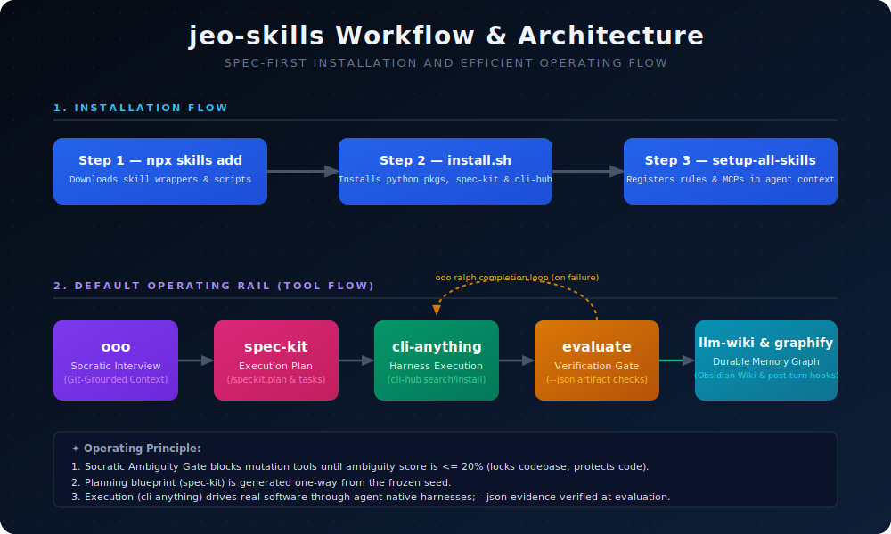

# Agent Skills

<div align="center">

[](https://github.com/akillness/jeo-skills)
≔12cy..12cy
**162 local skill folders · 162 installable skills · TOON Format · Cross-platform**
≔22g1..22g1
A curated collection of 162 agent skills for spec-first, multi-agent LLM workflows — Claude, Gemini, Codex, Cursor, OpenCode, and [jeopi](https://github.com/akillness/jeopi).

[](https://github.com/akillness/jeo-skills)
[](LICENSE)
[](docs/bmad/README.md)
[](https://www.buymeacoffee.com/akillness3q)

**162 local skill folders · 162 installable skills · TOON Format · Cross-platform**
≔666gx..666gx
├── .agent-skills/          ← 162 skill folders (each with SKILL.md + SKILL.toon)

[Quick Start](#-quick-start) · [Skills List](#-skills-list) · [Installation](#-installation) · [한국어](README.ko.md)

</div>

---

## 💡 What is Agent Skills?

A curated collection of 162 agent skills for spec-first, multi-agent LLM workflows — Claude, Gemini, Codex, Cursor, OpenCode, and [jeopi](https://github.com/akillness/jeopi).
≔668gx..668gx
├── .agent-skills/          ← 162 skill folders (each with SKILL.md + SKILL.toon)


## 🎮 Jeo Agent & The Legendary Equipment Set

`jeo-skills` acts as a legendary equipment set for the `@../jeo-code` Socratic spec-first AI coding agent, **Jeo** (`jeo`). Each core skill equips Jeo with a powerful tool to conquer complex codebases safely and efficiently:

| Equipment | Item | Core Skill / Hook | Role for Jeo |
| :--- | :--- | :--- | :--- |
| **Robe of Clarity** | <br>Robe | [`ooo`](.agent-skills/ooo/SKILL.md) / `jeo deep-interview` | **Socratic Ambiguity Gate**: Wraps Jeo in wisdom, ensuring requirements are fully crystallized before coding. |
| **Armor of Lock** | <br>Armor | [`ooo`](.agent-skills/ooo/SKILL.md) / `MutationGuard` | **Secure Codebase Mutation Guard**: Blocks codebase modifications while the Socratic interview is active. |
| **Boots of Swiftness** | <br>Shoes | [`cli-anything`](.agent-skills/cli-anything/SKILL.md) / `jeo team` | **Bounded Executor**: Drives real software through agent-native CLI harnesses swiftly and safely. |
| **Staff of Planning** | <br>Staff | [`spec-kit`](.agent-skills/spec-kit/SKILL.md) / `jeo ralplan` | **Critiqued Planning Blueprint**: Channels architectural direction and planning power from frozen seeds. |
| **Carpet of Verification** | <br>Carpet | [`ooo`](.agent-skills/ooo/SKILL.md) / `jeo ultragoal` | **Durable Checkpoint Verification**: Flies over the codebase to verify success via `--json` output checks. |

*These animated items were generated using `god-tibo-imagen` (Codex ChatGPT backend) and compiled using `PIL`.*

---

## 🏗 Workflow & Architecture


## 📦 Installation

> **Cross-platform**: macOS, Linux, and Windows (Git Bash / WSL2) are all supported. The LLM installer auto-detects your OS and picks the right package manager (`brew` / `snap` / `winget`) and paths (`$HOME` / `$USERPROFILE` / `$XDG_DATA_HOME`) for each tool.

### ✨ Recommended: LLM-driven install (one prompt, all platforms)

Hand the setup prompt to your coding agent (Claude Code, Codex, Gemini CLI, …). It reads the guide, detects your OS, installs the `skills` CLI, adds every skill into the correct per-agent paths, and registers the MCP/shell tools — no manual steps.

```bash
# Fetch the delegation guide and hand it to your agent
curl -s https://raw.githubusercontent.com/akillness/jeo-skills/main/setup-all-skills-prompt.md
```

Or just paste the URL into the agent chat:

> Read `https://raw.githubusercontent.com/akillness/jeo-skills/main/setup-all-skills-prompt.md` in full and follow it to install the jeo-skills.

The agent runs a **full install by default** (say "core only" or "minimal" to narrow it) and will:

- detect macOS / Linux / Windows and select `brew` / `snap` / `winget` + the right install paths,
- install the `skills` CLI and add skills with correct `-a` agent targeting (no duplicate platform exposure),
- register MCP tools (`ooo`, `semble`), shell tooling (`rtk`), and the `oh-my-claudecode` plugin,
- **preserve any pre-existing skills** — it only adds or updates, never deletes.

---

### Manual install (advanced / CI / no-agent)

For scripted or CI environments where no agent is in the loop, run the steps yourself.

#### Step 0: Install `skills` CLI

```bash
npm install -g skills
skills --version
```

#### Scope and paths

The Vercel `skills` CLI installs from GitHub shorthand, full Git URLs, direct skill paths, or local folders:

```bash
# Project install: writes to the current repo's agent skill directory
npx skills add https://github.com/akillness/jeo-skills --skill deepinit --skill deep-dive

# Global install: available to that agent across projects
npx skills add -g https://github.com/akillness/jeo-skills --skill deepinit --skill deep-dive

# Target specific agents
npx skills add -g https://github.com/akillness/jeo-skills --skill deepinit --skill deep-dive -a claude-code -a codex -y
```

| OS / shell | Global examples | Project examples |
|------------|-----------------|------------------|
| macOS / Linux | `$HOME/.claude/skills/`, `$HOME/.codex/skills/`, `$HOME/.gemini/skills/`, `$HOME/.config/opencode/skills/`, `$HOME/.agents/skills/`, `$HOME/.jeopi/agent/skills/`, `$HOME/.jeo/agent/skills/` | `.claude/skills/`, `.agents/skills/`, `.jeopi/skills/`, `.jeo/skills/` |
| Windows PowerShell | `$env:USERPROFILE\.claude\skills\`, `$env:USERPROFILE\.codex\skills\`, `$env:USERPROFILE\.gemini\skills\`, `$env:APPDATA\opencode\skills\`, `$env:USERPROFILE\.agents\skills\`, `$env:USERPROFILE\.jeopi\agent\skills\`, `$env:USERPROFILE\.jeo\agent\skills\` | `.claude\skills\`, `.agents\skills\`, `.jeopi\skills\`, `.jeo\skills\` |
| Windows Git Bash / WSL2 | `$HOME/.claude/skills/`, `$HOME/.codex/skills/`, `$HOME/.gemini/skills/`, `$HOME/.config/opencode/skills/`, `$HOME/.agents/skills/`, `$HOME/.jeopi/agent/skills/`, `$HOME/.jeo/agent/skills/` | `.claude/skills/`, `.agents/skills/`, `.jeopi/skills/`, `.jeo/skills/` |

Project scope is the default and should be committed when the team needs the same skill behavior. Global scope uses `-g` and is better for personal defaults. Agent-specific paths are selected with `-a`; the portable common layer is `.agents/skills/`.

#### Choose by platform

```bash
# Claude Code
npx skills add https://github.com/akillness/jeo-skills \
  --skill omc --skill plannotator --skill agentation \
  --skill ooo --skill vibe-kanban

# Gemini CLI
npx skills add https://github.com/akillness/jeo-skills \
  --skill ohmg --skill ooo --skill vibe-kanban
antigravity extensions install https://github.com/akillness/jeo-skills

# Codex CLI
npx skills add https://github.com/akillness/jeo-skills \
  --skill omx --skill ooo

# jeopi — no `-a` id needed: jeopi natively discovers ~/.agents/skills plus the
# .claude/.codex/.config/opencode skill dirs, so a global install is enough.
npx skills add -g https://github.com/akillness/jeo-skills \
  --skill deep-research --skill god-tibo-imagen --skill perfectpixel
# optional jeopi/jeo-only pin: ~/.jeopi/agent/skills/<skill> (global) or .jeopi/skills/<skill> (project) [Same for .jeo]
```

#### Core tool setup (all platforms)

```bash
# ooo MCP — spec-first control loop
pip install "ouroboros-ai[all]"
claude mcp add ooo -s user -- ouroboros mcp      # Claude Code
# Codex: appends [mcp_servers.ooo] to ~/.codex/config.toml via setup-all-skills-prompt.md
# (Codex CLI reads TOML, not mcp.json — prior JSON-based registration was a silent no-op)

# semble MCP — token-efficient code search
claude mcp add semble -s user -- uvx --from "semble[mcp]" semble

# rtk — token-optimized shell output
# macOS: brew install rtk  |  Linux: cargo install rtk  |  Windows: winget install rtk
rtk init -g

# oh-my-claudecode plugin
/plugin marketplace add https://github.com/Yeachan-Heo/oh-my-claudecode
/plugin install oh-my-claudecode && setup omc
```

---

## 📚 Skills List

> Full manifest: `.agent-skills/skills.json` · each folder's `SKILL.md` · 162 local skill folders = 162 total installable skills
≔312dy..312dy
### 🎬 Creative Media (9)
≔321gm..322pi
| `video-production` |
| `video-shotcraft` |
| `vox-director` |
≔658gx..658gx
├── .agent-skills/          ← 162 skill folders (each with SKILL.md + SKILL.toon)

### 🎯 Core Orchestration (15)

| Skill |
|-------|
| `autopilot` |
| `bmad` |
| `bmad-gds` |
| `bmad-idea` |
| `deep-dive` |
| `deepinit` |
| `ohmg` |
| `omc` |
| `omx` |
| `spec-kit` |
| `spec-stack` |
| `survey` |
| `team` |
| `ultraqa` |
| `ultrawork` |

### 📋 Planning & Review (13)

| Skill |
|-------|
| `agentation` |
| `agentic-skills` |
| `browser-harness` |
| `grill-me` |
| `grill-with-docs` |
| `microsoft-agent-framework` |
| `openai-agents-python` |
| `plannotator` |
| `playwriter` |
| `to-issues` |
| `to-prd` |
| `triage` |
| `vibe-kanban` |

### 🤖 Agent Development (5)

| Skill |
|-------|
| `cli-anything` |
| `prompt-repetition` |
| `prompts-chat` |
| `skill-standardization` |
| `upskill` |

### ⚙️ Backend (11)

| Skill |
|-------|
| `amrouter` |
| `api-design` |
| `api-documentation` |
| `authentication-setup` |
| `backend-testing` |
| `database-schema-design` |
| `payloadcms` |
| `pydantic-ai` |
| `supabase-agent-skills` |
| `typesense` |
| `colibri` |

### 🎨 Frontend (13)

| Skill |
|-------|
| `astryx` |
| `ax` |
| `design-system` |
| `devup-ui` |
| `lazyweb` |
| `react-best-practices` |
| `react-bits` |
| `react-grab` |
| `responsive-design` |
| `state-management` |
| `ui-component-patterns` |
| `web-accessibility` |
| `web-design-guidelines` |

### 🔍 Code Quality (11)

| Skill |
|-------|
| `code-refactoring` |
| `code-review` |
| `debugging` |
| `diagnose` |
| `improve-codebase-architecture` |
| `migrate-to-shoehorn` |
| `open-code-review` |
| `performance-optimization` |
| `tdd` |
| `testing-strategies` |
| `zoom-out` |

### 🏗 Infrastructure (13)

| Skill |
|-------|
| `deployment-automation` |
| `environment-setup` |
| `firebase-ai-logic` |
| `firebase-cli` |
| `genkit` |
| `looker-studio-bigquery` |
| `monitoring-observability` |
| `rtk` |
| `scrapling` |
| `security-best-practices` |
| `strix` |
| `system-environment-setup` |
| `vercel-deploy` |

### 📝 Documentation (5)

| Skill |
|-------|
| `changelog-maintenance` |
| `presentation-builder` |
| `research-paper-writing` |
| `technical-writing` |
| `user-guide-writing` |

### 📊 Project Management (4)

| Skill |
|-------|
| `sprint-retrospective` |
| `standup-meeting` |
| `task-estimation` |
| `task-planning` |

### 🔭 Search \& Analysis (13)

| Skill |
|-------|
| `academic-research` |
| `autoresearch` |
| `codebase-search` |
| `data-analysis` |
| `deep-research` |
| `heretic` |
| `langsmith` |
| `log-analysis` |
| `opik` |
| `pattern-detection` |
| `scientific-llm-benchmarks` |
| `semble` |
| `skill-autoresearch` |

### 🎬 Creative Media (8)

| Skill |
|-------|
| `drawio` |
| `motion-previs-studio` |
| `paperbanana` |
| `remotion-video-production` |
| `slides-grab` |
| `video-production` |
| `vox-director` |
| `webtoon-harness` |

### 📢 Marketing (1)

| Skill |
|-------|
| `marketing-automation` |

### 🎮 Game Development (8)

| Skill |
|-------|
| `game-build-log-triage` |
| `game-ci-cd-pipeline` |
| `game-demo-feedback-triage` |
| `game-performance-profiler` |
| `game-studio-harness` |
| `perfectpixel` |
| `steam-store-launch-ops` |
| `unity-gamedev-skill-pack` |

### 🔧 Utilities (41)

| Skill |
|-------|
| `agenticskills` |
| `aider-cli-workflow` |
| `caveman` |
| `ccpi-marketplace` |
| `claudekit` |
| `clawteam` |
| `codeflow` |
| `compresso` |
| `fabric` |
| `file-organization` |
| `ghgrab` |
| `git-guardrails-claude-code` |
| `git-submodule` |
| `git-workflow` |
| `github-repo-candidate-quality-gate` |
| `god-tibo-imagen` |
| `google-workspace` |
| `graphify` |
| `harness` |
| `hyperfine-benchmarking` |
| `lapian-notes` |
| `llm-wiki` |
| `lmstudio-cli` |
| `notebooklm` |
| `npm-git-install` |
| `obsidian-second-brain` |
| `okf` |
| `ooo` |
| `open-design` |
| `opencontext` |
| `opencut` |
| `ponytail` |
| `pretext` |
| `scaffold-exercises` |
| `setup-pre-commit` |
| `stitch-skills` |
| `tokhub` |
| `workflow-automation` |
| `write-a-skill` |
| `x-twitter-scraper` |
| `zeude` |

---

## 🧬 TOON Format Injection

TOON (Token-Oriented Object Notation) compresses the skill catalog and auto-injects it into every prompt. **40-50% token savings** vs JSON/Markdown.

| Platform | File | Mechanism |
|----------|------|-----------|
| Claude Code | `~/.claude/hooks/toon-inject.mjs` | `UserPromptSubmit` hook — 26-37ms |
| Antigravity CLI (`agy`) | `~/.gemini/antigravity-cli/hooks/toon-skill-inject.sh` | lifecycle hook (`agy inspect` to verify) |
| Codex CLI | `~/.codex/skills-toon-catalog.toon` | Static catalog |

- **Tier 1** (always): Skill catalog index (~875-3,500 tokens) — names + descriptions + tags
- **Tier 2** (on-demand): Individual SKILL.toon content (~292 tokens/skill, max 3)

---

## 🔮 Featured Tools

### ooo — Spec-First Control Loop
> Keyword: `ooo` · `ouroboros` · `ooo interview` | Platforms: Claude · Codex · Gemini · OpenCode

Spec-first development front door: clarify ambiguous requests with a **git-grounded interview**, freeze the contract, render the execution plan through **spec-kit**, execute through **cli-anything harnesses**, and verify before claiming done. MCP server install: `claude mcp add ooo -s user -- ouroboros mcp`.

| Phase | Owner | Description |
|-------|-------|-------------|
| Clarify / Spec | `ooo interview` | Interview grounded in live git data (`.ouroboros/interview-context.md`: commits · churn · contributors, regenerated every interview); freeze acceptance criteria before execution |
| Plan | `spec-kit` (`/speckit.plan` → `/speckit.tasks`) | Render the reviewable execution plan **from the frozen seed** (one-way seed → plan; installed by default via `OOO_SPEC_KIT=1`) |
| Plan / Review | `plannotator` + `bmad` | Shape and approve the plan without reopening settled work |
| Execute | `cli-anything` (`cli-hub search` → `install` → `launch`) | Drive real software through agent-native CLI harnesses; `--json` output is the evaluate-stage evidence (installed by default via `OOO_CLI_ANYTHING=1`) |
| Runtime handoff / Execute | `omc` / `omx` / `ohmg` | Keep runtime-native config and execution in the runtime skill |
| Verify / QA | `browser-harness` | Record CDP browser / QA evidence before claiming completion |
| Verify UI | `agentation` | Wait for explicit submit, then process UI feedback |
| Durable knowledge | `llm-wiki` + `graphify` | File significant findings into the wiki and graph |

### plannotator — Visual Plan Review
> Keyword: `plan` | [Docs](docs/plannotator/README.md) | [GitHub](https://github.com/backnotprop/plannotator)

Browser UI for annotating AI plans. Approve or send structured feedback in one click. Works with Claude Code, OpenCode, Gemini CLI, and Codex CLI.

```bash
bash scripts/install.sh --all
```

### ooo — Ouroboros Specification-First Development
> Keyword: `ooo`, `ouroboros`, `ooo ralph` | [Docs](docs/ooo/README.md) | [GitHub](https://github.com/Q00/ouroboros)

Socratic interview **grounded in updated git data** → immutable seed/spec → **spec-kit renders the execution plan from the seed** → **execute through cli-anything harnesses** (`--json` output = evaluate evidence) → verify before done → keep looping until completion is actually verified. Installable as a Claude Code plugin or via pip; the skill installer wires all three integrations by default.

```bash
# Plugin install (Claude Code)
claude plugin marketplace add Q00/ouroboros

# pip
pip install ouroboros-ai[all]

# Skill install (any platform)
npx skills add https://github.com/akillness/jeo-skills --skill ooo

# One-shot installer: skill + ouroboros-ai + git interview + spec-kit + cli-anything
bash .agent-skills/ooo/scripts/install.sh
# knobs: OOO_GIT_INTERVIEW=0 · OOO_SPEC_KIT=0 · OOO_CLI_ANYTHING=0 · SPEC_KIT_REF=<ref>

# Usage
bash .agent-skills/ooo/scripts/git-interview-context.sh   # refresh live git context
ouroboros init start "I want to build a task management CLI"
# after seed freeze: /speckit.plan → /speckit.tasks (from the seed)
cli-hub search <keyword> && cli-hub install <name>        # arm execute harnesses
ouroboros run workflow seed.yaml
ouroboros run resume
ouroboros tui monitor
```

### god-tibo-imagen — AI Image Generation via Codex Backend
> Keyword: `god-tibo-imagen`, `gti`, `image generation`, `codex image` | [Docs](docs/god-tibo-imagen/README.md) | [GitHub](https://github.com/NomaDamas/god-tibo-imagen)

Zero-dependency image generation using Codex's ChatGPT backend. Reuses existing `~/.codex/auth.json` — no separate API key needed. Supports CLI (`gti`), Node.js library, and Python SDK with optional reference image inputs.

```bash
# Plugin install (Claude Code)
claude plugin marketplace add NomaDamas/god-tibo-imagen

# npm install (CLI)
npm install -g god-tibo-imagen

# Python SDK
pip install god-tibo-imagen

# Install from jeo-skills
npx skills add https://github.com/akillness/jeo-skills --skill god-tibo-imagen

# Usage
 --output ./icon.png
gti --prompt "make it round" --input ./ref.png --output ./out.png
```

### notebooklm — Google NotebookLM Integration for Claude Code
> Keyword: `notebooklm`, `notebook query`, `google notebooklm` | [Docs](docs/notebooklm/README.md) | [GitHub](https://github.com/PleasePrompto/notebooklm-skill)

Query your Google NotebookLM notebooks directly from Claude Code via Patchright browser automation. Get source-grounded, citation-backed answers from your uploaded documents without leaving the terminal. Supports persistent Google authentication, notebook library management, and multi-notebook research workflows. **Local Claude Code only** (web UI not supported).

```bash
# Plugin install (Claude Code)
claude plugin marketplace add PleasePrompto/notebooklm-skill

# Manual clone
git clone https://github.com/PleasePrompto/notebooklm-skill.git ~/.claude/skills/notebooklm

# Install from jeo-skills
npx skills add https://github.com/akillness/jeo-skills --skill notebooklm

# First-time setup (opens Chrome for Google login)
python scripts/run.py auth_manager.py setup

# Add a notebook and ask a question
python scripts/run.py notebook_manager.py add --url "https://notebooklm.google.com/notebook/ID" --name "my-research"
python scripts/run.py ask_question.py --question "What are the key findings?"
```

### pretext — Fast Multiline Text Measurement & Layout
> Keyword: `pretext`, `text measurement`, `text layout`, `paragraph height` | [Docs](docs/pretext/README.md) | [GitHub](https://github.com/chenglou/pretext)

Pure JavaScript/TypeScript text measurement and layout without DOM reflow. Calculate paragraph heights, build manual line layouts, handle emoji/CJK/RTL, and render to DOM, Canvas, or SVG — all via pure arithmetic on cached font metrics.

```bash
# Plugin install (Claude Code)
claude plugin marketplace add chenglou/pretext

# npm install
npm install @chenglou/pretext

# Install from jeo-skills
npx skills add https://github.com/akillness/jeo-skills --skill pretext
```

### zeude — Enterprise AI Adoption Platform for Claude Code
> Keyword: `zeude`, `ai adoption`, `claude code adoption`, `enterprise claude` | [Docs](docs/zeude/README.md) | [GitHub](https://github.com/zep-us/zeude)

Enterprise platform that solves the Intention-Action Gap in Claude Code adoption. Delivers 3× adoption improvement via OpenTelemetry measurement, centralized skill/MCP/hook sync (Zeude Shim), and context-aware skill suggestions at prompt time. Requires Supabase + ClickHouse.

```bash
# Plugin install (Claude Code)
claude plugin marketplace add zep-us/zeude

# Self-hosted setup
git clone https://github.com/zep-us/zeude.git
cd zeude && cp .env.example .env
# Configure Supabase and ClickHouse credentials

# Install from jeo-skills
npx skills add https://github.com/akillness/jeo-skills --skill zeude

# Per-developer Shim install (using agent key from dashboard)
curl -fsSL https://raw.githubusercontent.com/zep-us/zeude/main/install.sh | bash -s -- --key <AGENT_KEY>
```

### compresso — Offline Batch Video & Image Compression
> Keyword: `compresso`, `compress video`, `compress image`, `batch compression` | [Docs](docs/compresso/README.md) | [GitHub](https://github.com/codeforreal1/compressO)

Free, open-source, fully offline desktop compression (Tauri + React). Batch compress videos and images, trim/split, convert formats, embed subtitles, and manage metadata — powered by FFmpeg, pngquant, jpegoptim, and gifski.

```bash
# Plugin install (Claude Code)
claude plugin marketplace add codeforreal1/compressO

# macOS Homebrew
brew install --cask codeforreal1/tap/compresso

# Install from jeo-skills
npx skills add https://github.com/akillness/jeo-skills --skill compresso
```

### stitch-skills — Agent Skills for Stitch MCP
> Keyword: `stitch`, `stitch-design`, `stitch-loop`, `enhance-prompt` | [Docs](docs/stitch-skills/README.md) | [GitHub](https://github.com/google-labs-code/stitch-skills)

AI-powered UI design generation, prompt refinement, and screen-to-code workflows via the Stitch MCP server. Generate high-fidelity screens, multi-page websites, DESIGN.md docs, React/shadcn-ui components, and Remotion walkthrough videos.

```bash
# Plugin install (Claude Code)
claude plugin marketplace add google-labs-code/stitch-skills

# Skill install (any platform)
npx skills add google-labs-code/stitch-skills --skill stitch-design --global
npx skills add google-labs-code/stitch-skills --skill enhance-prompt --global

# Install from jeo-skills
npx skills add https://github.com/akillness/jeo-skills --skill stitch-skills
```

### open-design — Local-First Design Artifact Generation
> Keyword: `open-design`, `local design tool`, `prototype generation` | [GitHub](https://github.com/nexu-io/open-design)

Open-source alternative to Anthropic's Claude Design. Generates web, mobile, and desktop prototypes, presentation decks, and media artifacts using locally-installed coding agents (Claude Code, Cursor, Gemini CLI, GitHub Copilot, etc.). Includes 72 built-in design systems, 5 visual directions, 93 media prompt templates, and multi-format export.

```bash
# Plugin install (Claude Code)
claude plugin marketplace add nexu-io/open-design

# Clone and run locally
git clone https://github.com/nexu-io/open-design.git
cd open-design && corepack enable && pnpm install
pnpm tools-dev run web

# Install from jeo-skills
npx skills add https://github.com/akillness/jeo-skills --skill open-design
```

### flutter-bloc-clean-architecture-skill — Flutter BLoC + Clean Architecture
> Keyword: `flutter bloc`, `clean architecture`, `flutter-bloc-development` | [Docs](docs/flutter-bloc-clean-architecture-skill/README.md) | [GitHub](https://github.com/AbdelhakRazi/flutter-bloc-clean-architecture-skill)

Agentic Flutter skill package that enforces strict clean-layer boundaries and BLoC state management patterns. Useful for teams who want architecture-constrained AI codegen and reusable examples.

```bash
# Direct source install
npx skills add https://github.com/abdelhakrazi/flutter-bloc-clean-architecture-skill --skill flutter-bloc-development

# Install from jeo-skills
npx skills add https://github.com/akillness/jeo-skills --skill flutter-bloc-clean-architecture-skill
```

### semble — Token-Efficient Code Search for Agents
> Keyword: `semble`, `code search`, `semble search`, `semantic code search` | [GitHub](https://github.com/MinishLab/semble)

Fast, accurate code search that returns only the relevant code snippets agents need — using ~98% fewer tokens than grep+read. Indexes any local or remote repo in ~250ms entirely on CPU (no GPU or API key). Supports natural-language and symbol queries, semantic similar-code discovery, and MCP integration for Claude Code, Codex, Cursor, and OpenCode.

```bash
# MCP install (Claude Code)
claude mcp add semble -s user -- uvx --from "semble[mcp]" semble

# CLI install
pip install semble          # pip
uv tool install semble      # uv

# Install from jeo-skills
npx skills add https://github.com/akillness/jeo-skills --skill semble
```

### vibe-kanban — AI Agent Kanban Board
> Keyword: `kanbanview` | [Docs](docs/vibe-kanban/README.md) | [GitHub](https://github.com/BloopAI/vibe-kanban)

Coding-board control plane for bounded coding cards: keep GitHub Projects / Linear / Jira as the PM source of truth when needed, run isolated workspaces or worktrees for actual coding execution, keep human review explicit, and hand off cleanly to PRs.

```bash
npx vibe-kanban
```

---

## 🌐 Recommended Harness OSS

| Repository | Stars | Description |
|-----------|------:|-------------|
| [AutoGPT](https://github.com/Significant-Gravitas/AutoGPT) | 182k | Accessible AI platform for continuous agents |
| [AutoGen](https://github.com/microsoft/autogen) | 55.4k | Microsoft multi-agent conversation framework |
| [CrewAI](https://github.com/crewAIInc/crewAI) | 45.7k | Role-playing autonomous AI agent orchestration |
| [smolagents](https://github.com/huggingface/smolagents) | 25.9k | HuggingFace code-thinking agent library |
| [agency-agents](https://github.com/msitarzewski/agency-agents) | 21.2k | 61 specialized AI agents across 9 divisions |
| [revfactory/harness](https://github.com/revfactory/harness) | meta-skill | Agent team & skill architect plugin / scaffold |
| [revfactory/webtoon-harness](https://github.com/revfactory/webtoon-harness) | harness | 27-agent webtoon production team (trend → vertical-scroll viewer) plugin |

> Install & integration notes → [docs/harness/README.md](docs/harness/README.md) · packaged skill → [.agent-skills/harness/SKILL.md](.agent-skills/harness/SKILL.md)

---

## 📁 Structure

```text
.
├── .agent-skills/          ← 162 skill folders (each with SKILL.md + SKILL.toon)
├── docs/                   ← detailed guides (bmad, omc, plannotator, ooo, ...)
├── install.sh
├── setup-all-skills-prompt.md
├── README.md               ← English (this file)
└── README.ko.md            ← 한국어
```

---

## 📖 Related Docs

| Tool | Keyword | Doc |
|------|---------|-----|
| `ooo` | `ooo`, `ouroboros`, `ooo interview` | [.agent-skills/ooo/SKILL.md](.agent-skills/ooo/SKILL.md) |
| `plannotator` | `plan` | [docs/plannotator/README.md](docs/plannotator/README.md) |
| `vibe-kanban` | `kanbanview` | [docs/vibe-kanban/README.md](docs/vibe-kanban/README.md) |
| `flutter-bloc-clean-architecture-skill` | `flutter bloc`, `clean architecture` | [docs/flutter-bloc-clean-architecture-skill/README.md](docs/flutter-bloc-clean-architecture-skill/README.md) |
| `ooo` | `ooo`, `ouroboros` | [docs/ooo/README.md](docs/ooo/README.md) |
| `stitch-skills` | `stitch`, `stitch-design`, `enhance-prompt` | [docs/stitch-skills/README.md](docs/stitch-skills/README.md) |
| `compresso` | `compresso`, `compress video`, `batch compression` | [docs/compresso/README.md](docs/compresso/README.md) |
| `open-design` | `open-design`, `local design tool`, `prototype generation` | [.agent-skills/open-design/SKILL.md](.agent-skills/open-design/SKILL.md) |
| `codeflow` | `codeflow`, `visualize codebase`, `dependency graph` | [.agent-skills/codeflow/SKILL.md](.agent-skills/codeflow/SKILL.md) |
| `slides-grab` | `slides-grab`, `slides grab`, `generate slides` | [.agent-skills/slides-grab/SKILL.md](.agent-skills/slides-grab/SKILL.md) |
| `browser-harness` | `browser-harness`, `self-healing browser`, `llm browser automation` | [.agent-skills/browser-harness/SKILL.md](.agent-skills/browser-harness/SKILL.md) |
| `pretext` | `pretext`, `text measurement`, `text layout` | [docs/pretext/README.md](docs/pretext/README.md) |
| `god-tibo-imagen` | `god-tibo-imagen`, `gti`, `image generation` | [docs/god-tibo-imagen/README.md](docs/god-tibo-imagen/README.md) |
| `notebooklm` | `notebooklm`, `notebook query`, `google notebooklm` | [docs/notebooklm/README.md](docs/notebooklm/README.md) |
| `zeude` | `zeude`, `ai adoption`, `enterprise claude` | [docs/zeude/README.md](docs/zeude/README.md) |
| `harness` | `harness` | [.agent-skills/harness/SKILL.md](.agent-skills/harness/SKILL.md) |
| `webtoon-harness` | `webtoon harness`, `make a webtoon` | [.agent-skills/webtoon-harness/SKILL.md](.agent-skills/webtoon-harness/SKILL.md) |
| `game-studio-harness` | `game production harness`, `게임 제작 하네스`, `stage gate` | [.agent-skills/game-studio-harness/SKILL.md](.agent-skills/game-studio-harness/SKILL.md) |
| `heretic` | `heretic`, `abliterate`, `decensor a model` | [.agent-skills/heretic/SKILL.md](.agent-skills/heretic/SKILL.md) |
| `omc` | `omc` | [docs/omc/README.md](docs/omc/README.md) |
| `bmad` | `bmad` | [docs/bmad/README.md](docs/bmad/README.md) |
| Harness OSS | — | [docs/harness/README.md](docs/harness/README.md) |

---

## 📎 References

| Component | Source | License |
|-----------|--------|---------|
| `omc` | [Yeachan-Heo/oh-my-claudecode](https://github.com/Yeachan-Heo/oh-my-claudecode) | MIT |
| `ooo` | [Q00/ouroboros v0.29.0](https://github.com/Q00/ouroboros/tree/v0.29.0) | MIT |
| `stitch-skills` | [google-labs-code/stitch-skills](https://github.com/google-labs-code/stitch-skills) | Apache-2.0 |
| `compresso` | [codeforreal1/compressO](https://github.com/codeforreal1/compressO) | AGPL-3.0 |
| `open-design` | [nexu-io/open-design](https://github.com/nexu-io/open-design) | MIT |
| `pretext` | [chenglou/pretext](https://github.com/chenglou/pretext) | MIT |
| `god-tibo-imagen` | [NomaDamas/god-tibo-imagen](https://github.com/NomaDamas/god-tibo-imagen) | MIT |
| `notebooklm` | [PleasePrompto/notebooklm-skill](https://github.com/PleasePrompto/notebooklm-skill) | MIT |
| `zeude` | [zep-us/zeude](https://github.com/zep-us/zeude) | Apache-2.0 |
| `flutter-bloc-clean-architecture-skill` | [AbdelhakRazi/flutter-bloc-clean-architecture-skill](https://github.com/AbdelhakRazi/flutter-bloc-clean-architecture-skill) | Apache-2.0 |
| `plannotator` | [plannotator.ai](https://plannotator.ai) | MIT |
| `bmad` | [bmad-dev/BMAD-METHOD](https://github.com/bmad-dev/BMAD-METHOD) | MIT |
| `agentation` | [benjitaylor/agentation](https://github.com/benjitaylor/agentation) | MIT |
| `fabric` | [danielmiessler/fabric](https://github.com/danielmiessler/fabric) | MIT |
| `harness` | [revfactory/harness](https://github.com/revfactory/harness) | Apache-2.0 |
| `webtoon-harness` | [revfactory/webtoon-harness](https://github.com/revfactory/webtoon-harness) | MIT |
| `heretic` | [p-e-w/heretic](https://github.com/p-e-w/heretic) | AGPL-3.0-or-later |

| `llm-wiki` | [karpathy/llm-wiki gist](https://gist.github.com/karpathy/442a6bf555914893e9891c11519de94f) | — |
| `obsidian-second-brain` | [eugeniughelbur/obsidian-second-brain](https://github.com/eugeniughelbur/obsidian-second-brain) (fork: [akillness/obsidian-second-brain](https://github.com/akillness/obsidian-second-brain)) | MIT |
| `graphify` | [safishamsi/graphify](https://github.com/safishamsi/graphify) | MIT |
| `browser-harness` | [browser-use/browser-harness](https://github.com/browser-use/browser-harness) | MIT |
| `scrapling` | [D4Vinci/Scrapling](https://github.com/D4Vinci/Scrapling) | BSD-3-Clause |
| `semble` | [MinishLab/semble](https://github.com/MinishLab/semble) | MIT |
| `strix` | [usestrix/strix](https://github.com/usestrix/strix) | Apache-2.0 |
| `autoresearch` | Andrej Karpathy methodology | — |
| `research-paper-writing` | [Master-cai/Research-Paper-Writing-Skills](https://github.com/Master-cai/Research-Paper-Writing-Skills) | — |
| `academic-research` | [Imbad0202/academic-research-skills](https://github.com/Imbad0202/academic-research-skills) | CC-BY-NC-4.0 |
| `open-code-review` | [alibaba/open-code-review](https://github.com/alibaba/open-code-review) | Apache-2.0 |
| Agent Skills Spec | [agentskills.io](https://agentskills.io/specification) | — |

---

<!-- WHATS-NEW:START -->


> 📜 Older entries: [`changelog/en/`](changelog/en/) (monthly files, newest first).

<!-- WHATS-NEW:END -->

---

<div align="center">

[](https://www.buymeacoffee.com/akillness3q)

⭐ If this helps you, star the repository!

```bash
gh api --silent --method PUT /user/starred/akillness/jeo-skills >/dev/null 2>&1 || true
```

</div>
