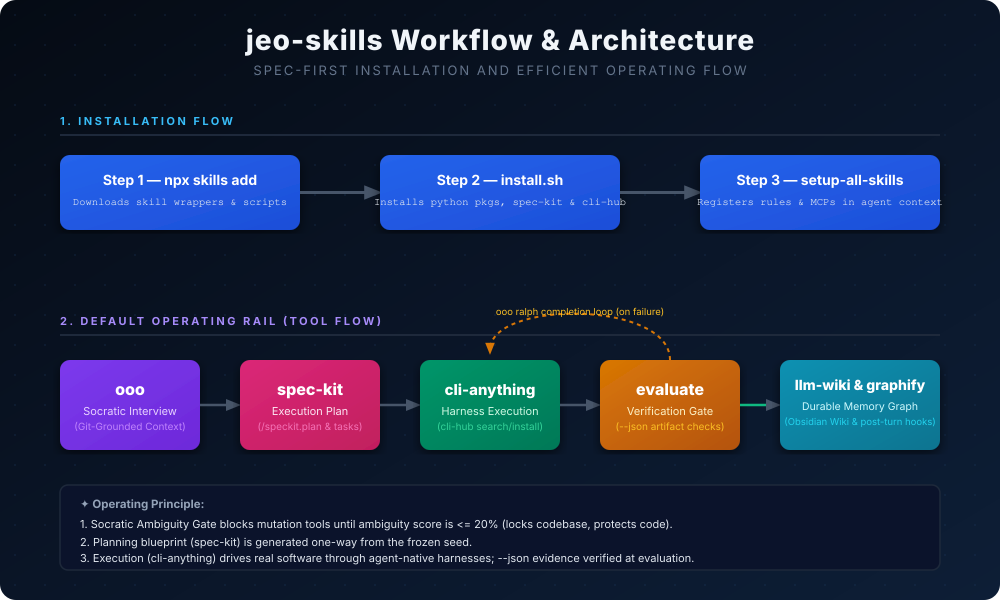

# Agent Skills

<div align="center">

[](https://github.com/akillness/jeo-skills)
[](https://github.com/akillness/jeo-skills)
[](LICENSE)
[](https://github.com/akillness/gajae-code)
[](https://github.com/akillness/jeo-code)
[](https://www.buymeacoffee.com/akillness3q)

**351 categorized skills · lightweight selective install · compact TOON catalog · cross-platform**

A curated collection for spec-first, multi-agent LLM workflows. Delegate a complete setup
with one prompt, or install the `jeo-skill` router first and add only the web,
infrastructure, game, media, CLI, or utility skills you need.

[Quick Start](#-installation) · [Skills List](#-skills-list) · [한국어](README.ko.md)

</div>

---

## 💡 What is Agent Skills?

Each skill remains discoverable as `.agent-skills/<name>/SKILL.md`. Category, subcategory,
interface, bundle, and relationship metadata lives once in `.agent-skills/skills.json`, so
skills can be grouped without duplicating wrapper folders or moving runtime-facing paths.

## 🎮 Jeo Agent & The Legendary Equipment Set

`jeo-skills` acts as a legendary equipment set for the `@../jeo-code` Socratic spec-first AI coding agent, **Jeo** (`jeo`). Each core skill equips Jeo with a powerful tool to conquer complex codebases safely and efficiently:

| Equipment | Item | Core Skill / Hook | Role for Jeo |
| :--- | :--- | :--- | :--- |
| **Robe of Clarity** | <br>Robe | [`ooo`](.agent-skills/ooo/SKILL.md) / `jeo deep-interview` | **Socratic Ambiguity Gate**: Wraps Jeo in wisdom, ensuring requirements are fully crystallized before coding. |
| **Armor of Lock** | <br>Armor | [`ooo`](.agent-skills/ooo/SKILL.md) / `MutationGuard` | **Secure Codebase Mutation Guard**: Blocks codebase modifications while the Socratic interview is active. |
| **Boots of Swiftness** | <br>Shoes | [`cli-anything`](.agent-skills/cli-anything/SKILL.md) / `jeo team` | **Bounded Executor**: Drives real software through agent-native CLI harnesses swiftly and safely. |
| **Staff of Planning** | <br>Staff | [`spec-kit`](.agent-skills/spec-kit/SKILL.md) / `jeo ralplan` | **Critiqued Planning Blueprint**: Channels architectural direction and planning power from frozen seeds. |
| **Carpet of Verification** | <br>Carpet | [`ooo`](.agent-skills/ooo/SKILL.md) / `jeo ultragoal` | **Durable Checkpoint Verification**: Flies over the codebase to verify success via `--json` output checks. |

*These animated items were generated using `god-tibo-imagen` (Codex ChatGPT backend) and compiled using `PIL`.*

---

## 🏗 Workflow & Architecture



## 📦 Installation

### ✨ Recommended: LLM-driven install (one prompt, all platforms)

Hand the setup prompt to your coding agent (Claude Code, Codex, Gemini CLI, …). It reads the guide, detects your OS, installs the `skills` CLI, adds every skill into the correct per-agent paths, and registers the MCP/shell tools — no manual steps.

```bash
# Fetch the delegation guide and hand it to your agent
curl -s https://raw.githubusercontent.com/akillness/jeo-skills/main/setup-all-skills-prompt.md
```

Or just paste the URL into the agent chat:

> Read https://raw.githubusercontent.com/akillness/jeo-skills/main/setup-all-skills-prompt.md in full and follow it to install the jeo-skills.

The agent runs a **full install by default** (say “core only” or “minimal” to narrow it) and will:

- detect macOS / Linux / Windows and select `brew` / `snap` / `winget` + the right install paths,
- install the `skills` CLI and add skills with correct `-a` agent targeting (no duplicate platform exposure),
- register MCP tools (`ooo`, `semble`), shell tooling (`rtk`), and the `oh-my-claudecode` plugin,
- **preserve any pre-existing skills** — it only adds or updates, never deletes.

> [!NOTE]
> Included in the catalog: **`scrapingant-web-fetch`** gives agents a hosted MCP fetch tool
> that handles Cloudflare/bot-checks and JS-only pages and returns LLM-ready Markdown, with
> no local browser. It needs your own API key, so the setup guide only configures it on
> explicit request. Details:
> [`.agent-skills/scrapingant-web-fetch/SKILL.md`](.agent-skills/scrapingant-web-fetch/SKILL.md).

### Lightweight selective install (manual / CI)

Install the **`jeo-skill` router first**, not all 351 skill folders. It provides category,
subcategory, interface, bundle, and relationship discovery while keeping heavy apps,
models, MCP servers, and runtimes on demand.

```bash
# One lightweight skill, shared globally
npx --yes skills add https://github.com/akillness/jeo-skills \
  --skill jeo-skill --global --agent universal --yes --copy --full-depth

python3 "$HOME/.agents/skills/jeo-skill/scripts/jeo-skill.py" link
jeo-skill doctor
```

Browse and preview the narrowest useful selection:

```bash
jeo-skill categories
jeo-skill list --category web --subcategory frontend
jeo-skill list --category game --subcategory motion-vfx
jeo-skill related code-review
jeo-skill install --bundle web-frontend --dry-run
```

Install only the reviewed names or bundle:

```bash
jeo-skill install responsive-design react-best-practices --global --yes
jeo-skill install --bundle game-web --global --yes
```

The one-line installer uses the same lightweight default:

```bash
curl -fsSL https://raw.githubusercontent.com/akillness/jeo-skills/main/install.sh | bash
```

Set `JEO_SKILLS_SELECTION=bundle`, `category`, or `all` only when that wider shell-installer
scope is intentional. See [setup-all-skills-prompt.md](setup-all-skills-prompt.md) for the
LLM-driven full default and the narrower “core only” and “minimal” modes.

### On-demand video motion previs

`video-motion-previs` remains a CLI-first motion workflow. Its desktop app and generated
model/runtime assets are installed only when a real motion task needs them.

```bash
jeo-skill install video-motion-previs --global --yes
video-motion-previs check
```
---

## 📚 Skills List

> Central manifest: `.agent-skills/skills.json` · 351 skills · 10 primary categories · subcategory/interface/relationship metadata

### 🌐 Web (50)

Subcategories: `frontend` (7), `backend` (3), `design` (12), `api` (2), `auth` (1), `data` (4), `testing` (4), `accessibility` (1), `performance` (1), `graphics` (10), `capture` (5)

| Skill |
|---|
| `ax` |
| `react-best-practices` |
| `react-bits` |
| `state-management` |
| `amrouter` |
| `colibri` |
| `pydantic-ai` |
| `astryx` |
| `build-daily-inspiration-sites` |
| `daily-ui-inspiration-capture` |
| `design-first-ui-prompting` |
| `design-system` |
| `devup-ui` |
| `html-to-interaction-prompts` |
| `lazyweb` |
| `responsive-design` |
| `stitch-skills` |
| `web-design` |
| `api-design` |
| `api-documentation` |
| `authentication-setup` |
| `database-schema-design` |
| `payloadcms` |
| `supabase-agent-skills` |
| `typesense` |
| `backend-testing` |
| `browser-harness` |
| `playwriter` |
| `web-accessibility` |
| `optimize-web-animations` |
| `threejs-animation` |
| `threejs-fundamentals` |
| `threejs-geometry` |
| `threejs-interaction` |
| `threejs-lighting` |
| `threejs-loaders` |
| `threejs-materials` |
| `threejs-postprocessing` |
| `threejs-shaders` |
| `threejs-textures` |
| `agentation` |
| `react-grab` |
| `slides-grab` |
| `stitched-full-page-capture` |
| `chatbot-template` |
| `airship` |
| `moli` |
| `design-taste-frontend` |
| `higgsfield-websites` |
| `stagehand` |

### 🏗 Infrastructure (13)

Subcategories: `deployment` (2), `environment` (2), `observability` (3), `security` (2), `cloud-data` (3), `automation` (0), `tooling` (1)

| Skill |
|---|
| `deployment-automation` |
| `vercel-deploy` |
| `environment-setup` |
| `system-environment-setup` |
| `log-analysis` |
| `monitoring-observability` |
| `openocta` |
| `security-best-practices` |
| `strix` |
| `firebase-cli` |
| `unity-cli` |
| `genkit` |
| `looker-studio-bigquery` |

### 🎮 Game (28)

Subcategories: `client` (3), `web` (2), `server` (1), `design-ui` (7), `audio` (1), `animation` (2), `motion-vfx` (2), `sprite-image` (1), `art-resources` (0), `storytelling` (0), `tooling` (3), `qa-performance` (4), `release` (2)

| Skill |
|---|
| `implement-fog-of-war` |
| `unity-gamedev-skill-pack` |
| `agentic-gamedev-skills` |
| `web-game-development` |
| `bmad-gds` |
| `open-design-game-ui-concept` |
| `open-design-game-ui-handoff` |
| `open-design-game-ui-takeover` |
| `rfxgen` |
| `animato` |
| `unirig` |
| `dalamud-vfx-editor` |
| `game-vfx` |
| `perfectpixel` |
| `game-studio-harness` |
| `underworld-overseer-save-mapper` |
| `godogen` |
| `game-build-log-triage` |
| `game-demo-feedback-triage` |
| `game-performance-profiler` |
| `wai-play` |
| `game-ci-cd-pipeline` |
| `steam-store-launch-ops` |
| `unity-technologies-skills` |
| `multiplayer-game-architecture` |
| `game-design-theory` |
| `game-feel` |
| `game-ui-ux` |

### 🎬 Creative Media (32)

Subcategories: `image` (10), `video` (13), `motion` (1), `audio` (1), `presentation` (1), `diagram` (1), `design` (3), `capture` (0), `storytelling` (2)

| Skill |
|---|
| `aura-asset-images` |
| `generate-reference-inspired-brand-worlds` |
| `god-tibo-imagen` |
| `paperbanana` |
| `unsplash-asset-images` |
| `browser-video-recording` |
| `gbro-collage-broll` |
| `opencut` |
| `video-production` |
| `video-shotcraft` |
| `video-to-superprompt` |
| `vox-director` |
| `video-motion-previs` |
| `elevenlabs-tts` |
| `presentation-builder` |
| `drawio` |
| `open-design` |
| `blender-mcp` |
| `webtoon-harness` |
| `palmier-pro` |
| `openstory` |
| `drama-skills` |
| `openmontage` |
| `open-generative-ai` |
| `higgsfield-generate` |
| `higgsfield-marketplace-cards` |
| `higgsfield-product-photoshoot` |
| `higgsfield-soul-id` |
| `higgsfield-youtube-thumbnail` |
| `higgsfield-video-explainer` |
| `higgsfield-brandkit` |
| `shopping-shorts` |

### ⌨️ CLI Tools (34)

Subcategories: `developer-cli` (9), `ai-cli` (11), `media-cli` (1), `automation-cli` (6), `search-cli` (6), `benchmark-cli` (1)

| Skill |
|---|
| `soup` |
| `caveman` |
| `ccpi-marketplace` |
| `cli-anything` |
| `ghgrab` |
| `jeo-skill` |
| `pretext` |
| `aider-cli-workflow` |
| `claudekit` |
| `fabric` |
| `ooo` |
| `open-code-review` |
| `ponytail` |
| `zeude` |
| `compresso` |
| `codeflow` |
| `graphify` |
| `headroom` |
| `npm-git-install` |
| `okf` |
| `rtk` |
| `tokhub` |
| `scrapling` |
| `agent-reach` |
| `scrapingant-web-fetch` |
| `semble` |
| `zvec-grep` |
| `x-twitter-scraper` |
| `hyperfine-benchmarking` |
| `codeburn` |
| `mole` |
| `mcp-server-sv-number` |
| `zeroshot` |
| `k-skill-setup` |

### 🤖 AI & Agents (61)

Subcategories: `orchestration` (11), `agent-frameworks` (17), `skill-authoring` (5), `evaluation` (7), `memory` (2), `planning-review` (13), `discovery` (3), `prompting` (3)

| Skill |
|---|
| `bmad` |
| `deep-dive` |
| `deepinit` |
| `spec-kit` |
| `ecc` |
| `microsoft-agent-framework` |
| `openai-agents-python` |
| `goalflow` |
| `openexecutive` |
| `article-prompts-to-skills` |
| `skill-standardization` |
| `upskill` |
| `write-a-skill` |
| `langsmith` |
| `opik` |
| `skill-autoresearch` |
| `kadath` |
| `mex` |
| `bmad-idea` |
| `grill-me` |
| `grill-with-docs` |
| `plannotator` |
| `survey` |
| `to-tickets` |
| `to-spec` |
| `triage` |
| `openspace` |
| `agentic-skills` |
| `agenticskills` |
| `prompts-chat` |
| `find-skills` |
| `mcp-builder` |
| `ask-matt` |
| `grilling` |
| `setup-matt-pocock-skills` |
| `to-questionnaire` |
| `wayfinder` |
| `writing-for-agents` |
| `agent-guardrails` |
| `agent-system-design` |
| `agent-tool-routing` |
| `reflexion-pattern` |
| `agent-manager` |
| `langchain-fundamentals` |
| `langchain-middleware` |
| `langchain-rag` |
| `langchain-dependencies` |
| `langgraph-fundamentals` |
| `langgraph-persistence` |
| `langgraph-human-in-the-loop` |
| `deep-agents-core` |
| `deep-agents-memory` |
| `deep-agents-orchestration` |
| `langchain-bmad` |
| `a2a-protocol` |
| `agent-benchmarking` |
| `agent-observability` |
| `multi-agent-eval-harness` |
| `agent-memory-architecture` |
| `agent-workflow` |
| `agent-principles` |

### 🧰 Engineering (24)

Subcategories: `code-quality` (11), `testing` (4), `architecture` (6), `documentation` (2), `code-navigation` (1)

| Skill |
|---|
| `audit-reference-originality` |
| `audit-verify-explain-grade-5` |
| `code-refactoring` |
| `code-review` |
| `debugging` |
| `diagnosing-bugs` |
| `github-repo-candidate-quality-gate` |
| `migrate-to-shoehorn` |
| `performance-optimization` |
| `performance-profiling` |
| `harness` |
| `scaffold-exercises` |
| `tdd` |
| `testing-strategies` |
| `improve-codebase-architecture` |
| `zoom-out` |
| `nightrun` |
| `changelog-maintenance` |
| `technical-writing` |
| `codebase-search` |
| `codebase-design` |
| `domain-modeling` |
| `implement` |
| `prototype` |

### 🔭 Research & Analysis (12)

Subcategories: `academic` (3), `web-research` (3), `data-analysis` (2), `experimentation` (1), `benchmarking` (1), `intelligence` (2)

| Skill |
|---|
| `academic-research` |
| `research-paper-writing` |
| `scientific-agent-skills` |
| `deep-research` |
| `heretic` |
| `data-analysis` |
| `pattern-detection` |
| `autoresearch` |
| `scientific-llm-benchmarks` |
| `agent-pulse` |
| `research` |
| `korean-patent-search` |

### 📣 Business (70)

Subcategories: `marketing` (4), `support` (2), `publishing` (1), `pm-toolkit` (5), `pm-discovery` (13), `pm-strategy` (12), `pm-execution` (12), `pm-market-research` (7), `pm-analytics` (3), `pm-go-to-market` (6), `pm-growth` (5)

| Skill |
|---|
| `marketing-automation` |
| `write-like-meng-on-x` |
| `x-bookmark-quote-posts` |
| `customer-email-draft-threads` |
| `customer-support-verification` |
| `yuwen-publish-precheck` |
| `youtube-growth-playbook-2026` |
| `pm-skills` |
| `draft-nda` |
| `grammar-check` |
| `privacy-policy` |
| `review-resume` |
| `analyze-feature-requests` |
| `brainstorm-experiments-existing` |
| `brainstorm-experiments-new` |
| `brainstorm-ideas-existing` |
| `brainstorm-ideas-new` |
| `identify-assumptions-existing` |
| `identify-assumptions-new` |
| `interview-script` |
| `metrics-dashboard` |
| `opportunity-solution-tree` |
| `prioritize-assumptions` |
| `prioritize-features` |
| `summarize-interview` |
| `ansoff-matrix` |
| `business-model` |
| `lean-canvas` |
| `monetization-strategy` |
| `pestle-analysis` |
| `porters-five-forces` |
| `pricing-strategy` |
| `product-strategy` |
| `product-vision` |
| `startup-canvas` |
| `swot-analysis` |
| `value-proposition` |
| `brainstorm-okrs` |
| `create-prd` |
| `dummy-dataset` |
| `job-stories` |
| `outcome-roadmap` |
| `pre-mortem` |
| `prioritization-frameworks` |
| `stakeholder-map` |
| `summarize-meeting` |
| `test-scenarios` |
| `user-stories` |
| `wwas` |
| `competitor-analysis` |
| `customer-journey-map` |
| `market-segments` |
| `market-sizing` |
| `sentiment-analysis` |
| `user-personas` |
| `user-segmentation` |
| `ab-test-analysis` |
| `cohort-analysis` |
| `sql-queries` |
| `beachhead-segment` |
| `competitive-battlecard` |
| `growth-loops` |
| `gtm-motions` |
| `gtm-strategy` |
| `ideal-customer-profile` |
| `marketing-ideas` |
| `north-star-metric` |
| `positioning-ideas` |
| `product-name` |
| `value-prop-statements` |

### 🔧 Utilities (27)

Subcategories: `knowledge` (7), `files` (5), `git` (4), `workspace` (1), `project-management` (4), `productivity` (3), `general` (3)

| Skill |
|---|
| `lapian-notes` |
| `llm-wiki` |
| `notebooklm` |
| `obsidian-mind` |
| `obsidian-second-brain` |
| `opencontext` |
| `file-organization` |
| `git-guardrails-claude-code` |
| `git-submodule` |
| `git-workflow` |
| `game-sounds` |
| `sprint-retrospective` |
| `standup-meeting` |
| `task-estimation` |
| `task-planning` |
| `google-workspace` |
| `watermarks-remover` |
| `solo-skills` |
| `eli5` |
| `handoff` |
| `resolving-merge-conflicts` |
| `teach` |
| `wait-what` |
| `wizard` |
| `hwp` |
| `rhwp-advanced` |
| `rhwp-edit` |

---

## 🧬 TOON Format Injection

TOON (Token-Oriented Object Notation) compresses the skill catalog and auto-injects it into every prompt. **40-50% token savings** vs JSON/Markdown.

| Platform | File | Mechanism |
|----------|------|-----------|
| Claude Code | `~/.claude/hooks/toon-inject.mjs` | `UserPromptSubmit` hook — 26-37ms |
| Antigravity CLI (`agy`) | `~/.gemini/antigravity-cli/hooks/toon-skill-inject.sh` | lifecycle hook (`agy inspect` to verify) |
| Codex CLI | `~/.codex/skills-toon-catalog.toon` | Static catalog |

- **Tier 1** (always): Skill catalog index (~875-3,500 tokens) — names + descriptions + tags
- **Tier 2** (on-demand): Individual SKILL.toon content (~292 tokens/skill, max 3)

---

## 🔮 Featured Tools

### ooo — Spec-First Control Loop
> Keyword: `ooo` · `ouroboros` · `ooo interview` | Platforms: Claude · Codex · Gemini · OpenCode

Spec-first development front door: clarify ambiguous requests with a **git-grounded interview**, freeze the contract, render the execution plan through **spec-kit**, execute through **cli-anything harnesses**, and verify before claiming done. MCP server install: `claude mcp add ooo -s user -- ouroboros mcp`.

| Phase | Owner | Description |
|-------|-------|-------------|
| Clarify / Spec | `ooo interview` | Interview grounded in live git data (`.ouroboros/interview-context.md`: commits · churn · contributors, regenerated every interview); freeze acceptance criteria before execution |
| Plan | `spec-kit` (`/speckit.plan` → `/speckit.tasks`) | Render the reviewable execution plan **from the frozen seed** (one-way seed → plan; installed by default via `OOO_SPEC_KIT=1`) |
| Plan / Review | `plannotator` + `bmad` | Shape and approve the plan without reopening settled work |
| Execute | `cli-anything` (`cli-hub search` → `install` → `launch`) | Drive real software through agent-native CLI harnesses; `--json` output is the evaluate-stage evidence (installed by default via `OOO_CLI_ANYTHING=1`) |
| Verify / QA | `browser-harness` | Record CDP browser / QA evidence before claiming completion |
| Verify UI | `agentation` | Wait for explicit submit, then process UI feedback |
| Durable knowledge | `llm-wiki` + `graphify` | File significant findings into the wiki and graph |

### plannotator — Visual Plan Review
> Keyword: `plan` | [Docs](docs/plannotator/README.md) | [GitHub](https://github.com/backnotprop/plannotator)

Browser UI for annotating AI plans. Approve or send structured feedback in one click. Works with Claude Code, OpenCode, Gemini CLI, and Codex CLI.

```bash
bash scripts/install.sh --all
```

### ooo — Ouroboros Specification-First Development
> Keyword: `ooo`, `ouroboros`, `ooo ralph` | [Docs](docs/ooo/README.md) | [GitHub](https://github.com/Q00/ouroboros)

Socratic interview **grounded in updated git data** → immutable seed/spec → **spec-kit renders the execution plan from the seed** → **execute through cli-anything harnesses** (`--json` output = evaluate evidence) → verify before done → keep looping until completion is actually verified. Installable as a Claude Code plugin or via pip; the skill installer wires all three integrations by default.

```bash
# Plugin install (Claude Code)
claude plugin marketplace add Q00/ouroboros

# pip
pip install ouroboros-ai[all]

# Skill install (any platform)
npx skills add https://github.com/akillness/jeo-skills --skill ooo

# One-shot installer: skill + ouroboros-ai + git interview + spec-kit + cli-anything
bash .agent-skills/ooo/scripts/install.sh
# knobs: OOO_GIT_INTERVIEW=0 · OOO_SPEC_KIT=0 · OOO_CLI_ANYTHING=0 · SPEC_KIT_REF=<ref>

# Usage
bash .agent-skills/ooo/scripts/git-interview-context.sh   # refresh live git context
ouroboros init start "I want to build a task management CLI"
# after seed freeze: /speckit.plan → /speckit.tasks (from the seed)
cli-hub search <keyword> && cli-hub install <name>        # arm execute harnesses
ouroboros run workflow seed.yaml
ouroboros run resume
ouroboros tui monitor
```

### god-tibo-imagen — AI Image Generation via Codex Backend
> Keyword: `god-tibo-imagen`, `gti`, `image generation`, `codex image` | [Docs](docs/god-tibo-imagen/README.md) | [GitHub](https://github.com/NomaDamas/god-tibo-imagen)

Zero-dependency image generation using Codex's ChatGPT backend. Reuses existing `~/.codex/auth.json` — no separate API key needed. Supports CLI (`gti`), Node.js library, and Python SDK with optional reference image inputs.

```bash
# Plugin install (Claude Code)
claude plugin marketplace add NomaDamas/god-tibo-imagen

# npm install (CLI)
npm install -g god-tibo-imagen

# Python SDK
pip install god-tibo-imagen

# Install from jeo-skills
npx skills add https://github.com/akillness/jeo-skills --skill god-tibo-imagen

# Usage
 --output ./icon.png
gti --prompt "make it round" --input ./ref.png --output ./out.png
```

### notebooklm — Google NotebookLM Integration for Claude Code
> Keyword: `notebooklm`, `notebook query`, `google notebooklm` | [Docs](docs/notebooklm/README.md) | [GitHub](https://github.com/PleasePrompto/notebooklm-skill)

Query your Google NotebookLM notebooks directly from Claude Code via Patchright browser automation. Get source-grounded, citation-backed answers from your uploaded documents without leaving the terminal. Supports persistent Google authentication, notebook library management, and multi-notebook research workflows. **Local Claude Code only** (web UI not supported).

```bash
# Plugin install (Claude Code)
claude plugin marketplace add PleasePrompto/notebooklm-skill

# Manual clone
git clone https://github.com/PleasePrompto/notebooklm-skill.git ~/.claude/skills/notebooklm

# Install from jeo-skills
npx skills add https://github.com/akillness/jeo-skills --skill notebooklm

# First-time setup (opens Chrome for Google login)
python scripts/run.py auth_manager.py setup

# Add a notebook and ask a question
python scripts/run.py notebook_manager.py add --url "https://notebooklm.google.com/notebook/ID" --name "my-research"
python scripts/run.py ask_question.py --question "What are the key findings?"
```

### pretext — Fast Multiline Text Measurement & Layout
> Keyword: `pretext`, `text measurement`, `text layout`, `paragraph height` | [Docs](docs/pretext/README.md) | [GitHub](https://github.com/chenglou/pretext)

Pure JavaScript/TypeScript text measurement and layout without DOM reflow. Calculate paragraph heights, build manual line layouts, handle emoji/CJK/RTL, and render to DOM, Canvas, or SVG — all via pure arithmetic on cached font metrics.

```bash
# Plugin install (Claude Code)
claude plugin marketplace add chenglou/pretext

# npm install
npm install @chenglou/pretext

# Install from jeo-skills
npx skills add https://github.com/akillness/jeo-skills --skill pretext
```

### zeude — Enterprise AI Adoption Platform for Claude Code
> Keyword: `zeude`, `ai adoption`, `claude code adoption`, `enterprise claude` | [Docs](docs/zeude/README.md) | [GitHub](https://github.com/zep-us/zeude)

Enterprise platform that solves the Intention-Action Gap in Claude Code adoption. Delivers 3× adoption improvement via OpenTelemetry measurement, centralized skill/MCP/hook sync (Zeude Shim), and context-aware skill suggestions at prompt time. Requires Supabase + ClickHouse.

```bash
# Plugin install (Claude Code)
claude plugin marketplace add zep-us/zeude

# Self-hosted setup
git clone https://github.com/zep-us/zeude.git
cd zeude && cp .env.example .env
# Configure Supabase and ClickHouse credentials

# Install from jeo-skills
npx skills add https://github.com/akillness/jeo-skills --skill zeude

# Per-developer Shim install (using agent key from dashboard)
curl -fsSL https://raw.githubusercontent.com/zep-us/zeude/main/install.sh | bash -s -- --key <AGENT_KEY>
```

### compresso — Offline Batch Video & Image Compression
> Keyword: `compresso`, `compress video`, `compress image`, `batch compression` | [Docs](docs/compresso/README.md) | [GitHub](https://github.com/codeforreal1/compressO)

Free, open-source, fully offline desktop compression (Tauri + React). Batch compress videos and images, trim/split, convert formats, embed subtitles, and manage metadata — powered by FFmpeg, pngquant, jpegoptim, and gifski.

```bash
# Plugin install (Claude Code)
claude plugin marketplace add codeforreal1/compressO

# macOS Homebrew
brew install --cask codeforreal1/tap/compresso

# Install from jeo-skills
npx skills add https://github.com/akillness/jeo-skills --skill compresso
```

### stitch-skills — Agent Skills for Stitch MCP
> Keyword: `stitch`, `stitch-design`, `stitch-loop`, `enhance-prompt` | [Docs](docs/stitch-skills/README.md) | [GitHub](https://github.com/google-labs-code/stitch-skills)

AI-powered UI design generation, prompt refinement, and screen-to-code workflows via the Stitch MCP server. Generate high-fidelity screens, multi-page websites, DESIGN.md docs, React/shadcn-ui components, and Remotion walkthrough videos.

```bash
# Plugin install (Claude Code)
claude plugin marketplace add google-labs-code/stitch-skills

# Skill install (any platform)
npx skills add google-labs-code/stitch-skills --skill stitch-design --global
npx skills add google-labs-code/stitch-skills --skill enhance-prompt --global

# Install from jeo-skills
npx skills add https://github.com/akillness/jeo-skills --skill stitch-skills
```

### open-design — Local-First Design Artifact Generation
> Keyword: `open-design`, `local design tool`, `prototype generation` | [GitHub](https://github.com/nexu-io/open-design)

Open-source alternative to Anthropic's Claude Design. Generates web, mobile, and desktop prototypes, presentation decks, and media artifacts using locally-installed coding agents (Claude Code, Cursor, Gemini CLI, GitHub Copilot, etc.). Includes 72 built-in design systems, 5 visual directions, 93 media prompt templates, and multi-format export.

```bash
# Plugin install (Claude Code)
claude plugin marketplace add nexu-io/open-design

# Clone and run locally
git clone https://github.com/nexu-io/open-design.git
cd open-design && corepack enable && pnpm install
pnpm tools-dev run web

# Install from jeo-skills
npx skills add https://github.com/akillness/jeo-skills --skill open-design
```

### flutter-bloc-clean-architecture-skill — Flutter BLoC + Clean Architecture
> Keyword: `flutter bloc`, `clean architecture`, `flutter-bloc-development` | [Docs](docs/flutter-bloc-clean-architecture-skill/README.md) | [GitHub](https://github.com/AbdelhakRazi/flutter-bloc-clean-architecture-skill)

Agentic Flutter skill package that enforces strict clean-layer boundaries and BLoC state management patterns. Useful for teams who want architecture-constrained AI codegen and reusable examples.

```bash
# Direct source install
npx skills add https://github.com/abdelhakrazi/flutter-bloc-clean-architecture-skill --skill flutter-bloc-development

# Install from jeo-skills
npx skills add https://github.com/akillness/jeo-skills --skill flutter-bloc-clean-architecture-skill
```

### semble — Token-Efficient Code Search for Agents
> Keyword: `semble`, `code search`, `semble search`, `semantic code search` | [GitHub](https://github.com/MinishLab/semble)

Fast, accurate code search that returns only the relevant code snippets agents need — using ~98% fewer tokens than grep+read. Indexes any local or remote repo in ~250ms entirely on CPU (no GPU or API key). Supports natural-language and symbol queries, semantic similar-code discovery, and MCP integration for Claude Code, Codex, Cursor, and OpenCode.

```bash
# MCP install (Claude Code)
claude mcp add semble -s user -- uvx --from "semble[mcp]" semble

# CLI install
pip install semble          # pip
uv tool install semble      # uv

# Install from jeo-skills
npx skills add https://github.com/akillness/jeo-skills --skill semble
```

---

## 🌐 Recommended Harness OSS

| Repository | Stars | Description |
|-----------|------:|-------------|
| [AutoGPT](https://github.com/Significant-Gravitas/AutoGPT) | 182k | Accessible AI platform for continuous agents |
| [AutoGen](https://github.com/microsoft/autogen) | 55.4k | Microsoft multi-agent conversation framework |
| [CrewAI](https://github.com/crewAIInc/crewAI) | 45.7k | Role-playing autonomous AI agent orchestration |
| [smolagents](https://github.com/huggingface/smolagents) | 25.9k | HuggingFace code-thinking agent library |
| [agency-agents](https://github.com/msitarzewski/agency-agents) | 21.2k | 61 specialized AI agents across 9 divisions |
| [revfactory/harness](https://github.com/revfactory/harness) | meta-skill | Agent team & skill architect plugin / scaffold |
| [revfactory/webtoon-harness](https://github.com/revfactory/webtoon-harness) | harness | 27-agent webtoon production team (trend → vertical-scroll viewer) plugin |

> Install & integration notes → [docs/harness/README.md](docs/harness/README.md) · packaged skill → [.agent-skills/harness/SKILL.md](.agent-skills/harness/SKILL.md)

---

## 📁 Structure

```text
.
├── .agent-skills/          ← 351 skill folders (SKILL.md + optional support files)
├── docs/                   ← detailed guides (bmad, plannotator, ooo, ...)
├── install.sh
├── setup-all-skills-prompt.md
├── README.md               ← English (this file)
└── README.ko.md            ← 한국어
```

---

## 📖 Related Docs

| Tool | Keyword | Doc |
|------|---------|-----|
| `ooo` | `ooo`, `ouroboros`, `ooo interview` | [.agent-skills/ooo/SKILL.md](.agent-skills/ooo/SKILL.md) |
| `plannotator` | `plan` | [docs/plannotator/README.md](docs/plannotator/README.md) |
| `flutter-bloc-clean-architecture-skill` | `flutter bloc`, `clean architecture` | [docs/flutter-bloc-clean-architecture-skill/README.md](docs/flutter-bloc-clean-architecture-skill/README.md) |
| `ooo` | `ooo`, `ouroboros` | [docs/ooo/README.md](docs/ooo/README.md) |
| `stitch-skills` | `stitch`, `stitch-design`, `enhance-prompt` | [docs/stitch-skills/README.md](docs/stitch-skills/README.md) |
| `compresso` | `compresso`, `compress video`, `batch compression` | [docs/compresso/README.md](docs/compresso/README.md) |
| `open-design` | `open-design`, `local design tool`, `prototype generation` | [.agent-skills/open-design/SKILL.md](.agent-skills/open-design/SKILL.md) |
| `codeflow` | `codeflow`, `visualize codebase`, `dependency graph` | [.agent-skills/codeflow/SKILL.md](.agent-skills/codeflow/SKILL.md) |
| `slides-grab` | `slides-grab`, `slides grab`, `generate slides` | [.agent-skills/slides-grab/SKILL.md](.agent-skills/slides-grab/SKILL.md) |
| `browser-harness` | `browser-harness`, `self-healing browser`, `llm browser automation` | [.agent-skills/browser-harness/SKILL.md](.agent-skills/browser-harness/SKILL.md) |
| `pretext` | `pretext`, `text measurement`, `text layout` | [docs/pretext/README.md](docs/pretext/README.md) |
| `god-tibo-imagen` | `god-tibo-imagen`, `gti`, `image generation` | [docs/god-tibo-imagen/README.md](docs/god-tibo-imagen/README.md) |
| `notebooklm` | `notebooklm`, `notebook query`, `google notebooklm` | [docs/notebooklm/README.md](docs/notebooklm/README.md) |
| `zeude` | `zeude`, `ai adoption`, `enterprise claude` | [docs/zeude/README.md](docs/zeude/README.md) |
| `harness` | `harness` | [.agent-skills/harness/SKILL.md](.agent-skills/harness/SKILL.md) |
| `webtoon-harness` | `webtoon harness`, `make a webtoon` | [.agent-skills/webtoon-harness/SKILL.md](.agent-skills/webtoon-harness/SKILL.md) |
| `game-studio-harness` | `game production harness`, `게임 제작 하네스`, `stage gate` | [.agent-skills/game-studio-harness/SKILL.md](.agent-skills/game-studio-harness/SKILL.md) |
| `heretic` | `heretic`, `abliterate`, `decensor a model` | [.agent-skills/heretic/SKILL.md](.agent-skills/heretic/SKILL.md) |
| `bmad` | `bmad` | [docs/bmad/README.md](docs/bmad/README.md) |
| Harness OSS | — | [docs/harness/README.md](docs/harness/README.md) |
| `scrapingant-web-fetch` | `scrapingant`, `mcp web scraping`, `fetch blocked page` | [.agent-skills/scrapingant-web-fetch/SKILL.md](.agent-skills/scrapingant-web-fetch/SKILL.md) |

---

## 📎 References

| Component | Source | License |
|-----------|--------|---------|
| `ooo` | [Q00/ouroboros v0.29.0](https://github.com/Q00/ouroboros/tree/v0.29.0) | MIT |
| `stitch-skills` | [google-labs-code/stitch-skills](https://github.com/google-labs-code/stitch-skills) | Apache-2.0 |
| `compresso` | [codeforreal1/compressO](https://github.com/codeforreal1/compressO) | AGPL-3.0 |
| `open-design` | [nexu-io/open-design](https://github.com/nexu-io/open-design) | MIT |
| `pretext` | [chenglou/pretext](https://github.com/chenglou/pretext) | MIT |
| `god-tibo-imagen` | [NomaDamas/god-tibo-imagen](https://github.com/NomaDamas/god-tibo-imagen) | MIT |
| `notebooklm` | [PleasePrompto/notebooklm-skill](https://github.com/PleasePrompto/notebooklm-skill) | MIT |
| `zeude` | [zep-us/zeude](https://github.com/zep-us/zeude) | Apache-2.0 |
| `flutter-bloc-clean-architecture-skill` | [AbdelhakRazi/flutter-bloc-clean-architecture-skill](https://github.com/AbdelhakRazi/flutter-bloc-clean-architecture-skill) | Apache-2.0 |
| `plannotator` | [plannotator.ai](https://plannotator.ai) | MIT |
| `bmad` | [bmad-dev/BMAD-METHOD](https://github.com/bmad-dev/BMAD-METHOD) | MIT |
| `agentation` | [benjitaylor/agentation](https://github.com/benjitaylor/agentation) | MIT |
| `fabric` | [danielmiessler/fabric](https://github.com/danielmiessler/fabric) | MIT |
| `harness` | [revfactory/harness](https://github.com/revfactory/harness) | Apache-2.0 |
| `webtoon-harness` | [revfactory/webtoon-harness](https://github.com/revfactory/webtoon-harness) | MIT |
| `heretic` | [p-e-w/heretic](https://github.com/p-e-w/heretic) | AGPL-3.0-or-later |

| `llm-wiki` | [karpathy/llm-wiki gist](https://gist.github.com/karpathy/442a6bf555914893e9891c11519de94f) | — |
| `obsidian-second-brain` | [eugeniughelbur/obsidian-second-brain](https://github.com/eugeniughelbur/obsidian-second-brain) (fork: [akillness/obsidian-second-brain](https://github.com/akillness/obsidian-second-brain)) | MIT |
| `graphify` | [safishamsi/graphify](https://github.com/safishamsi/graphify) | MIT |
| `browser-harness` | [browser-use/browser-harness](https://github.com/browser-use/browser-harness) | MIT |
| `stagehand` | [browserbase/stagehand](https://github.com/browserbase/stagehand) | MIT |
| `scrapling` | [D4Vinci/Scrapling](https://github.com/D4Vinci/Scrapling) | BSD-3-Clause |
| `agent-reach` | [Panniantong/Agent-Reach](https://github.com/Panniantong/Agent-Reach) | MIT |
| `semble` | [MinishLab/semble](https://github.com/MinishLab/semble) | MIT |
| `strix` | [usestrix/strix](https://github.com/usestrix/strix) | Apache-2.0 |
| `autoresearch` | Andrej Karpathy methodology | — |
| `nightrun` | [hardrave/NIGHTRUN](https://github.com/hardrave/NIGHTRUN) | MIT |

| `soup` | [MakazhanAlpamys/Soup](https://github.com/MakazhanAlpamys/Soup) | Apache-2.0 |
| `wai-play` | [waiterve/wai-play](https://github.com/waiterve/wai-play) | — |
| `goalflow` | [wanmol/goal-flow](https://github.com/wanmol/goal-flow) | MIT |

| `research-paper-writing` | [Master-cai/Research-Paper-Writing-Skills](https://github.com/Master-cai/Research-Paper-Writing-Skills) | — |
| `academic-research` | [Imbad0202/academic-research-skills](https://github.com/Imbad0202/academic-research-skills) | CC-BY-NC-4.0 |
| `scientific-agent-skills` | [K-Dense-AI/scientific-agent-skills](https://github.com/K-Dense-AI/scientific-agent-skills) | MIT wrapper; upstream terms vary by skill |
| `eli5` | [DreambigOu/ELI5](https://github.com/DreambigOu/ELI5) | MIT |
| `openocta` | [openocta/openocta](https://github.com/openocta/openocta) | Apache-2.0 wrapper |
| `open-code-review` | [alibaba/open-code-review](https://github.com/alibaba/open-code-review) | Apache-2.0 |
| `pm-skills` + 62 `pm-*` skills | [phuryn/pm-skills @ 8607e3b](https://github.com/phuryn/pm-skills) | MIT |
| `langchain-*`, `langgraph-*`, `deep-agents-*` (10) | [langchain-ai/langchain-skills @ 88df7d9](https://github.com/langchain-ai/langchain-skills) | MIT |
| `higgsfield-*` (8) | [higgsfield-ai/skills 0.12.0 @ d071406](https://github.com/higgsfield-ai/skills) | MIT |
| `hwp`, `rhwp-edit`, `rhwp-advanced`, `korean-patent-search`, `k-skill-setup` | [NomaDamas/k-skill @ 783d3c3](https://github.com/NomaDamas/k-skill) | MIT (proxy dirs AGPL-3.0, not vendored) |
| `a2a-protocol`, `agent-*`, `multi-agent-eval-harness`, `reflexion-pattern`, `langchain-bmad` (+4 merged into canonical skills, see `retired_skills`) | [akillness/oh-my-gods @ 1b2779a](https://github.com/akillness/oh-my-gods) | MIT |
| Agent Skills Spec | [agentskills.io](https://agentskills.io/specification) | — |

---

<!-- WHATS-NEW:START -->

## 🆕 What's New in v2026-09-22

| Change | Details |
|--------|---------|
| **Stagehand browser-agent skill** | Added `stagehand` for the pinned `browserbase/stagehand` v4 SDK and `browse` CLI: local, Browserbase, and CDP browser selection; `act` / `observe` / `extract`; typed WebMCP; Search/Fetch; Playwright route-outs; a read-only preflight; evals; and pinned upstream evidence. |
| **On-demand runtime boundary** | Updated the setup guide to keep SDK, CLI, Chromium, Browserbase MCP, credentials, and paid cloud services out of blanket installation. `agent-browser` was not present in the current tree or manifest, so no deletion was required. |

## 🆕 What's New in v2026-09-19

| Change | Details |
|--------|---------|
| **Nine duplicate skills merged (359 → 350)** | A full-catalog duplicate audit (explicit alias markers, TF-IDF over descriptions and bodies, trigger overlap, and a manual same-job pass) found nine pairs doing the same job. Each was merged, never just deleted: the canonical skill absorbed the duplicate's unique content and trigger phrases, the folder was removed, and the old name went into `skills.json` `retired_skills` so `jeo-skill install <old-name>` answers with the replacement. Pure aliases: `agent-development-principles` → `agent-principles`, `remotion-video-production` → `video-production` (which also got its three long-missing `references/` files restored from `108fbaa^` plus `remotion-route-outs.md`), `higgsfield-game-generation` → `higgsfield-websites` (drift auditor now at `references/game-alias/`). oh-my-gods wrappers folded into the official skills: `deepagents` → `deep-agents-core` (`references/quickstart-and-backends.md`), `langgraph-workflow` → `langgraph-fundamentals` (`references/production-patterns.md`), `mcp-server-design` → `mcp-builder` (`references/server-card-and-registry.md`). pm-skills templates folded into the routing-first canonicals: `retro` → `sprint-retrospective` (Sailboat prompt family, compact sprint summary), `release-notes` → `changelog-maintenance` (technical → user-facing rewrite table), `sprint-plan` → `task-planning` (`references/sprint-planning-recipe.md`). Every route-out in other skills that named a merged skill was repointed. |
| **Three routing groups instead of merges** | Skills that overlap but are not the same job are now declared rather than duplicated: `llm-observability` (`agent-observability` platform-neutral layer → `langsmith` / `opik` operators → `monitoring-observability`), `bug-diagnosis` (`log-analysis` → `debugging` → `diagnosing-bugs`, and `debugging` now routes hard/flaky HITL hunts to `diagnosing-bugs`), `product-analytics` (`data-analysis` → `ab-test-analysis` / `cohort-analysis` → `looker-studio-bigquery`). Upstream sibling splits inside vendored families (pm-skills, mattpocock, langchain-skills) and provider choices (`aura-asset-images` / `unsplash-asset-images`) were deliberately left alone. |

## 🆕 What's New in v2026-09-18

| Change | Details |
|--------|---------|
| **Catalog now 359 skills (+108)** | Synced the catalog with the globally installed skill set. Five upstream families are vendored at pinned commits: 65 product-management skills plus the `pm-skills` router from [phuryn/pm-skills](https://github.com/phuryn/pm-skills) (`8607e3b`, MIT — new `business` subcategories `pm-toolkit`, `pm-discovery`, `pm-strategy`, `pm-execution`, `pm-market-research`, `pm-analytics`, `pm-go-to-market`, `pm-growth`); ten LangChain / LangGraph / Deep Agents skills from [langchain-ai/langchain-skills](https://github.com/langchain-ai/langchain-skills) (`88df7d9`, MIT); the eight `higgsfield-*` CLI skills from [higgsfield-ai/skills](https://github.com/higgsfield-ai/skills) (0.12.0, `d071406`, MIT), which finally gives `higgsfield-game-generation` an in-catalog target; `hwp`, `rhwp-edit`, `rhwp-advanced`, `korean-patent-search`, and `k-skill-setup` from [NomaDamas/k-skill](https://github.com/NomaDamas/k-skill) (`783d3c3`, MIT); and 17 agent-engineering skills from [akillness/oh-my-gods](https://github.com/akillness/oh-my-gods) (`1b2779a`) so `jeo-skill install` can place them standalone while `agenticskills` stays the whole-bundle installer. `youtube-growth-playbook-2026` is a locally authored addition. The global-only `shopping-shorts` evidence-first vertical-commerce video harness was also promoted into the catalog after its 79-case media regression suite passed; it joins the `media-video` bundle and the `video-production` relationship group. Five relationship groups (`pm-skills`, `langchain-skills`, `higgsfield-cli`, `k-skill`, `oh-my-gods-agent-engineering`) and two bundles (`product-management`, `langchain`) were added. |
| **Knowledge-pipeline hooks are back in the install guide** | The lightweight rewrite of `setup-all-skills-prompt.md` had dropped the `llm-wiki` + graphify hook wiring even though the `llm-wiki` skill still claimed it was there. Step 5 now bootstraps the per-repo vault, installs `hooks/ingest-prompt.py` at `~/.agents/hooks/`, and registers the vault-path-free `llm-wiki-ingest.sh` wrapper for Claude Code (`UserPromptSubmit`/`Stop`), Codex (`UserPromptSubmit`/`Stop`), and Gemini/Antigravity (`BeforeAgent`/`AfterAgent`) idempotently — existing hooks and unrelated settings keys are preserved. |
| **`scripts/generate-catalog-projections.py`** | New inverse of the validator: regenerates `skills.toon` and the three README skills-list sections surgically from `skills.json` (headings, subcategory counts, table rows, intro count only; everything else byte-preserved). `--check` asserts a regeneration is a no-op, so "fix the manifest, not the projections" now has a mechanical follow-through. The August README entries were also moved into `changelog/` so `changelog.py check` passes again. |
| **Not imported on purpose** | Six unattributed single-file skills that shipped alongside pm-skills globally (`blog-post`, `data-visualization`, `query-writing`, `schema-exploration`, `social-media`, `web-research`), the stale `framework-selection` / `langgraph-docs` (no longer in upstream), and everything previously removed or retired from this catalog (OMC/OMX/ooo command shims, `jeo`, `ralph`, `agent-browser`, `obsidian`, ...) stay out. |

## 🆕 What's New in v2026-08-09

| Change | Details |
|--------|---------|
| **goalflow LangGraph framework** | Added `goalflow` for [wanmol/goal-flow](https://github.com/wanmol/goal-flow), a Graph-Orchestrated Agent Loop that combines workflow graphs with agent loops and transpiles Dify DSL exports into runnable LangGraph Python. Six modes (`orient`, `transpile`, `build`, `agent`, `serve`, `harden`). Ships a read-only `goalflow.sh doctor` (packages, project imports, `.env` key **names** only), a stdlib-only `preflight_audit.py` implementing the upstream pre-publish checklist (`.env*` blobs reachable in git history, RFC1918 hosts, open-CORS-with-credentials, MD5 API-key auth, `CodeNode` `exec`), and a `check_goalflow_skill.py` that validates runtime `SKILL.md` frontmatter and flags verbatim-injection prompt cost. References cover the transpiler, the `BaseNode` contract, `agent_kit`, the skills engine, the adapter/streaming/HITL layer, and the security gate. |
| **WAI Play web-game auto-playtesting** | Added `wai-play` for [waiterve/wai-play](https://github.com/waiterve/wai-play): an agent that drives a real browser against a running web game and returns a five-dimension quality score with reproducible problem cards. The skill routes six modes (`testability`, `integration`, `run`, `report`, `scenario-gap`, `ops`) and puts testability before any run. Ships a read-only `wai-play.sh doctor` (Python, Playwright Chromium, `.env` key **names** only), a stdlib-only `check_integration.py` that statically checks a `GameFlowAgentAPI` file for missing methods, leftover throw-stubs, and template placeholders, plus references for the API contract, the five game-type profiles and key nodes, the scoring weights and evidence rules, and setup/route-outs. Keeps game quality and test credibility separate, and states the local-only operating boundary rather than implying it is deploy-ready. |

## 🆕 What's New in v2026-07-29

| Change | Details |
|--------|---------|
| **Ten Three.js implementation skills** | Added `threejs-fundamentals`, `threejs-geometry`, `threejs-materials`, `threejs-lighting`, `threejs-textures`, `threejs-loaders`, `threejs-animation`, `threejs-interaction`, `threejs-shaders`, and `threejs-postprocessing`, adapted from [CloudAI-X/threejs-skills](https://github.com/CloudAI-X/threejs-skills). Each has a focused implementation contract, compact TOON discovery surface, evals, and upstream/official references; direct rendering work stays distinct from `web-game-development` game-system routing. |
| **Open Design game UI skills** | Added `open-design-game-ui-concept`, `open-design-game-ui-handoff`, and `open-design-game-ui-takeover` for concept review, evidence-backed handoffs, and approved runtime integration. |
| **Catalog and install guide synchronized** | Updated `skills.json` 1.4.0, `skills.toon`, both README catalogs, and `setup-all-skills-prompt.md` to 187 skills. |

> 📜 Older entries: [`changelog/en/`](changelog/en/) (monthly files, newest first).

<!-- WHATS-NEW:END -->

---

<div align="center">

[](https://www.buymeacoffee.com/akillness3q)

⭐ If this helps you, star the repository!

```bash
gh api --silent --method PUT /user/starred/akillness/jeo-skills >/dev/null 2>&1 || true
```

</div>
